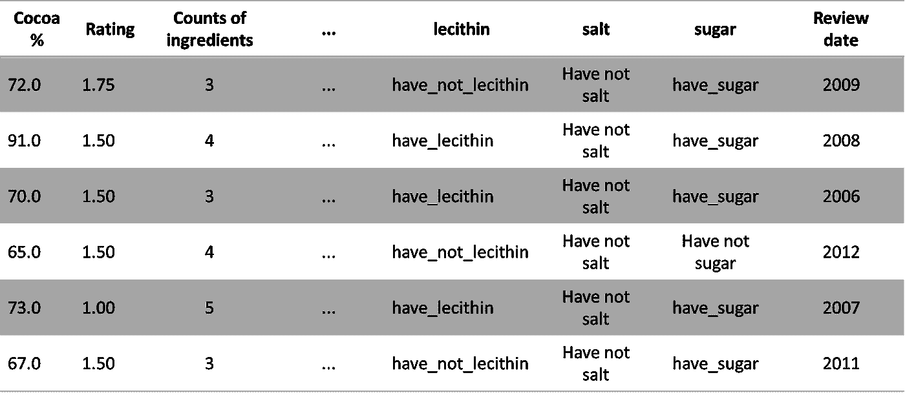
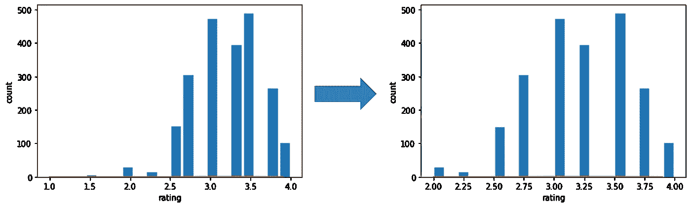
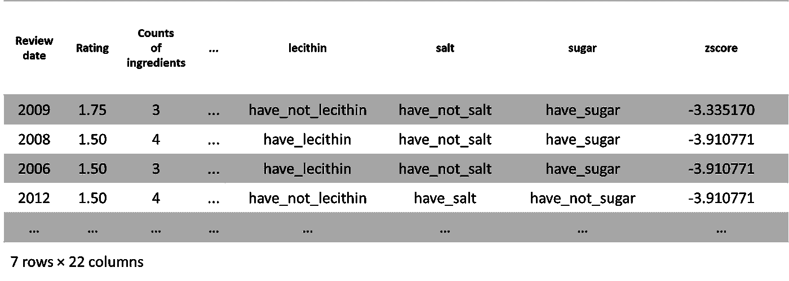
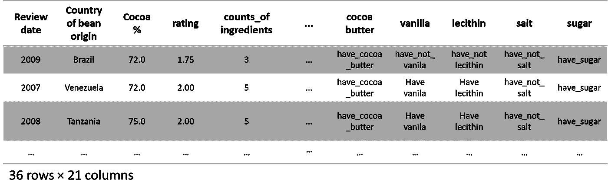
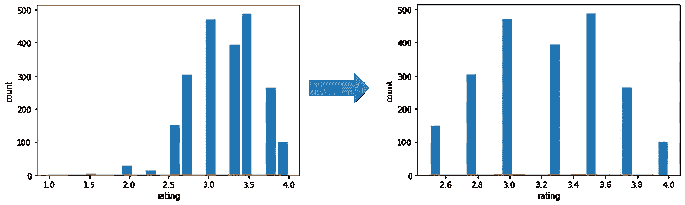
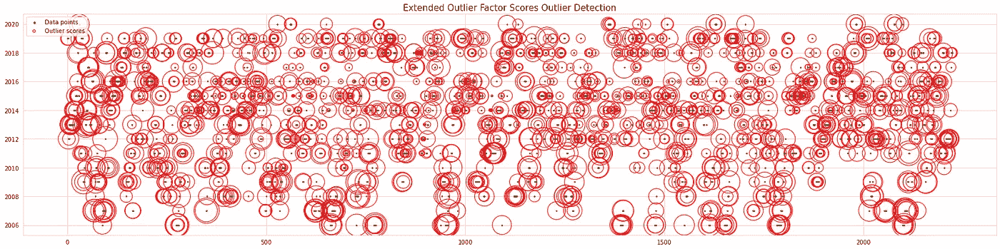
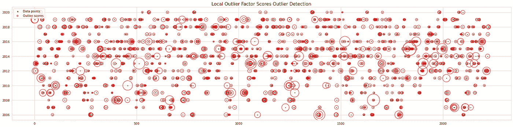

# 关于异常值检测，你一直想知道但又不敢问的是什么

> 原文：<https://towardsdatascience.com/what-you-always-wanted-to-know-about-outliers-detection-but-never-dared-to-ask-f040d9ca64d9?source=collection_archive---------53----------------------->

## 保证结果的 pythonic 离群点检测独家指南


山下孝文在 [Unsplash](https://unsplash.com/s/photos/confectionery-rainbow-neon?utm_source=unsplash&utm_medium=referral&utm_content=creditCopyText) 上的照片

离群点检测是探索性数据分析中的一个自然的初步步骤，目的是在大多数数据科学项目中获得最具影响力的结果。该过程包括消除异常超限值，以获得最佳预测。易于使用的离群点检测方法一般包括:最小最大分析、Z 得分极值分析、四分位数间距、扩展隔离森林、局部离群点方法。要成为独角兽数据科学家，掌握最有效的异常值检测方法是一项必备技能。在本文中，我们将回顾 Kaggle winners 的异常值检测方法，这些方法可以用简短的 python 代码实现。

我们将分析我们的甜巧克力棒评分数据集，您可以在这里找到。


照片由 [Massimo Adami](https://unsplash.com/@massimo_adami?utm_source=unsplash&utm_medium=referral&utm_content=creditCopyText) 在 [Unsplash](https://unsplash.com/s/photos/chocolate-box?utm_source=unsplash&utm_medium=referral&utm_content=creditCopyText) 上拍摄

一个具有挑战性的数据集，在分类编码后包含超过 2800 个特征。

1.  **最小-最大值分析**

面临的挑战是找到最有效地提取异常值的最佳方法，最终创建一个适合数据点的模型，减少模型预测的总体误差。这是一个对巧克力评分数据集(一个复杂的多维数据集)进行最小-最大分析的示例。

```
import pandas as pdimport matplotlib.pyplot as pltimport seaborn as snsfrom scipy .stats import norm df = pd.read_csv('../input/preprocess-choc/dfn.csv')#so my upper limit will be my mean value plus 3 sigmaupper_limit=df.rating.mean()+3*df.rating.std()#my lowar limit will be my mean - 3 sigmalowar_limit=df.rating.mean()-3*df.rating.std()
```

现在让我们检查我们的异常值:

```
df[(df.rating>upper_limit)|(df.rating<lowar_limit)]#now we will visualise the data without outliersnew_data=df[(df.rating<upper_limit)& (df.rating>lowar_limit)]#shape of our outlier’sdf.shape[0]-new_data.shape[0]
```

**输出**



使用最小-最大方法检测异常值**(作者提供**图片)

该方法实现了 6 个异常值的检测。让我们画出来:



数据异常值处理前后的数据分布 **(** 图片由作者提供)


在 [Unsplash](https://unsplash.com/s/photos/confectionery-charly-neon?utm_source=unsplash&utm_medium=referral&utm_content=creditCopyText) 上由 [Maciej Gerszewski](https://unsplash.com/@shakalmag?utm_source=unsplash&utm_medium=referral&utm_content=creditCopyText) 拍摄的照片

2.**使用 Z 分数的极值分析**

Z 得分表示一个数据点距离标准偏差有多少，在我们的例子中，平均值为 3.198，标准偏差为 0.434，因此数据点 4.5 的 Z 得分为:

**4.5–3.198(平均值)/0.434(标准值)= 1.847**

现在，我们将计算数据点的 z 分数，并显示它们:

```
df['zscore']=(df.rating-df.rating.mean())/df.rating.std()df#displaying the outlier’s with respect to the zscoresdf[(df.zscore<-3)|(df.zscore>3)]
```



**(** 图片作者)

该方法实现了 7 个异常值的检测。


[尤利娅·希诺娃](https://unsplash.com/@yulcha_ro?utm_source=unsplash&utm_medium=referral&utm_content=creditCopyText)在 [Unsplash](https://unsplash.com/s/photos/japanese-sweet?utm_source=unsplash&utm_medium=referral&utm_content=creditCopyText) 上的照片

3.**四分位数间距(IQR)**

**四分位数间距** IQR(或 50%中点)是一种衡量上四分位数(Q1:第 25 位)和下四分位数(Q3:第 75 位)之间差异的方法 IQR =*Q*3*Q*1。使用超出范围的数据点(最小-最大)可以定义边界，并且可以确定异常值。

我们来编码一下:

```
Q1=df.rating.quantile(0.25)Q3=df.rating.quantile(0.75)Q1,Q3
```

**输出**

3.0 , 3.5

```
#Now we will calculate the IQR :IQR=Q3-Q1IQR
```

**输出**

0.5

Q1 对应于巧克力等级分布的 25%低于 3.0，而 Q3 对应于巧克力等级分布的 75%低于 3.5。

现在，我们将定义巧克力评分分布的上限和下限:

```
LOWAR_LIMIT=Q1-1.5*IQRUPPER_LIMIT=Q3+1.5*IQRLOWAR_LIMIT,UPPER_LIMIT
```

**输出**

2.25, 4.25

现在，我们将在数据框中显示异常值评级:

```
df[(df.rating<LOWAR_LIMIT)|(df.rating>UPPER_LIMIT)]
```



**(** 图片作者)

该算法发现了 36 个异常值。让我们画出结果:



数据异常值处理前后的数据分布 **(** 图片由作者提供)


照片由[海伦娜·扬科夫斯卡](https://unsplash.com/@helenayankovska?utm_source=unsplash&utm_medium=referral&utm_content=creditCopyText)在 [Unsplash](https://unsplash.com/s/photos/chocolate-quality?utm_source=unsplash&utm_medium=referral&utm_content=creditCopyText) 上拍摄

4.**扩展隔离林方法**

扩展隔离森林这是一种垂直或水平决策边界线性回归算法，从训练数据中选择随机斜率和偏差。唯一的方法缺点是不能正确检测分支切割数据点。

我们来编码一下:

```
**# Import the libraries** from scipy import statsfrom sklearn.ensemble import IsolationForestfrom sklearn.neighbors import LocalOutlierFactorimport matplotlib.dates as mdfrom scipy.stats import norm%matplotlib inlineimport seaborn as snsfrom sklearn.model_selection import train_test_splitsns.set_style("whitegrid") #possible choices: white, dark, whitegrid, darkgrid, ticksimport eif as isoimport matplotlib.pyplot as pltimport plotly.express as pximport plotly.graph_objs as goimport plotly.figure_factory as fffrom plotly import toolsfrom plotly.offline import download_plotlyjs, init_notebook_mode, plot, iplotpd.set_option('float_format', '{:f}'.format)pd.set_option('max_columns',250)pd.set_option('max_rows',150)**#Define X_train, y_train**a = df_enc.loc[:,~df_enc.columns.duplicated()]b = a.drop('rating', axis = 1)X = b.iloc[:,0:11]y = a.iloc[:,2]X_train,y_train, X_test,y_test = train_test_split(X, y, test_size=0.3)**#Define Extend isolation forest** clf = IsolationForest(max_samples='auto', random_state = 1, contamination= 0.02)**# Transform data** preds = clf.fit_predict(X)**# Define outliers bondaries structure** df['isoletionForest_outlier’s'] = predsdf['isoletionForest_outlier’s'] = df['isoletionForest_outlier’s'].astype(str)df['isoletionForest_scores'] = clf.decision_function(X)**# Counts the chocolate rating outliers :**print(df['isoletionForest_outlier’s'].value_counts())
```

**输出**

```
**1     2179****-1      45****Name: isoletionForest_outlier’s, dtype: int64**
```

该算法发现了 45 个异常值。让我们画出结果:

```
fig, ax = plt.subplots(figsize=(30, 7))ax.set_title('Extended Outlier Factor Scores Outlier Detection', fontsize = 15, loc='center')plt.scatter(X.iloc[:, 0], X.iloc[:, 1], color='g', s=3., label='Data points')radius = (df['isoletionForest_scores'].max() - df['isoletionForest_scores']) / (df['isoletionForest_scores'].max() - df['isoletionForest_scores'].min())plt.scatter(X.iloc[:, 0], X.iloc[:, 1], s=2000 * radius, edgecolors='r', facecolors='none', label='Outlier scores')plt.axis('tight')legend = plt.legend(loc='upper left')legend.legendHandles[0]._sizes = [10]legend.legendHandles[1]._sizes = [20]plt.show()
```



使用扩展离群因子分数的参数圆离群点检测

**该图通过使用圆的大小来描述异常值，较大的圆被检测为异常值。**

****

**照片由[克里斯蒂安娜·皮恩](https://unsplash.com/@kristianapinne?utm_source=unsplash&utm_medium=referral&utm_content=creditCopyText)在 [Unsplash](https://unsplash.com/s/photos/chocolate?utm_source=unsplash&utm_medium=referral&utm_content=creditCopyText) 拍摄**

**5.**局部异常值方法****

**局部异常值因子是比较数据点密度的唯一方法。如果密度点小于其他邻近密度点，异常值因子将为负(- 1)，因此，该点可视为异常值。**

```
**# Import the libraries**from scipy import statsfrom sklearn.neighbors import LocalOutlierFactorimport matplotlib.dates as mdfrom scipy.stats import norm%matplotlib inlineimport seaborn as snsfrom sklearn.model_selection import train_test_splitsns.set_style("whitegrid") #possible choices: white, dark, whitegrid, darkgrid, ticksimport eif as isoimport matplotlib.pyplot as pltimport plotly.express as pximport plotly.graph_objs as goimport plotly.figure_factory as fffrom plotly import toolsfrom plotly.offline import download_plotlyjs, init_notebook_mode, plot, iplotpd.set_option('float_format', '{:f}'.format)pd.set_option('max_columns',250)pd.set_option('max_rows',150) **#Define X_train, y_train**a = df_enc.loc[:,~df_enc.columns.duplicated()]b = a.drop('rating', axis = 1)X = b.iloc[:,0:11]y = a.iloc[:,2]X_train,y_train, X_test,y_test = train_test_split(X, y, test_size=0.3)**#Define Extend isolation forest** clf = LocalOutlierFactor(n_neighbors=11)**# Transform data :**y_pred = clf.fit_predict(X)**# Define outliers bondaries structure** df['localOutlierFactor_outlier’s'] = y_pred.astype(str)
df['localOutlierFactor_scores'] = clf.negative_outlier_factor_**# Counts the chocolate rating outliers** print(df['localOutlierFactor_outlier’s'].value_counts())
```

****输出****

```
**1     2161****-1      63****Name: localOutlierFactor_outlier’s, dtype: int64**
```

**该算法发现了 63 个异常值。让我们画出结果:**

```
fig, ax = plt.subplots(figsize=(30, 7))ax.set_title('Local Outlier Factor Scores Outlier Detection', fontsize = 15, loc='center')plt.scatter(X.iloc[:, 0], X.iloc[:, 1], color='g', s=3., label='Data points')radius = (df['localOutlierFactor_scores'].max() - df['localOutlierFactor_scores']) / (df['localOutlierFactor_scores'].max() - df['localOutlierFactor_scores'].min())plt.scatter(X.iloc[:, 0], X.iloc[:, 1], s=2000 * radius, edgecolors='r', facecolors='none', label='Outlier scores')plt.axis('tight')legend = plt.legend(loc='upper left')legend.legendHandles[0]._sizes = [10]legend.legendHandles[1]._sizes = [20]plt.show()
```

****

**使用局部离群因子分数的参数圆离群点检测**(作者的**图片)**

**该图通过使用圆的大小来描述异常值，较大的圆被检测为异常值。**

****

**安东尼奥·卡斯特利亚诺在 [Unsplash](https://unsplash.com/s/photos/confectionery?utm_source=unsplash&utm_medium=referral&utm_content=creditCopyText) 上的照片**

**如果你有空闲时间，我建议你看看这个:**

**[https://towards data science . com/5-ways-to-detect-outliers-the-every-data scientist-should-know-python-code-70a 54335 a623](/5-ways-to-detect-outliers-that-every-data-scientist-should-know-python-code-70a54335a623)**

****总结一下****

**请参考此链接:**

**[https://jovian . ml/yeonathan/5-best-outliers-detection-methods-2020](https://jovian.ml/yeonathan/5-best-outliers-detection-methods-2020)**

**使用这些方法完成巧克力棒数据集的离群点检测。**

**使用几种异常值检测方法在数据科学中是至关重要的，这一简要概述提醒了使用多重异常值消除方法的重要性。因此，提取最佳数据值，以及共享有用的文档。**

**希望你喜欢，继续探索！**

****

**阿瑟尼·波苏邦科在 [Unsplash](https://unsplash.com/s/photos/exploration-neon?utm_source=unsplash&utm_medium=referral&utm_content=creditCopyText) 上的照片**