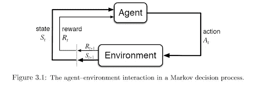
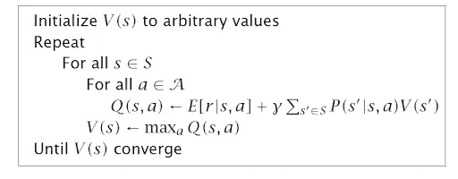
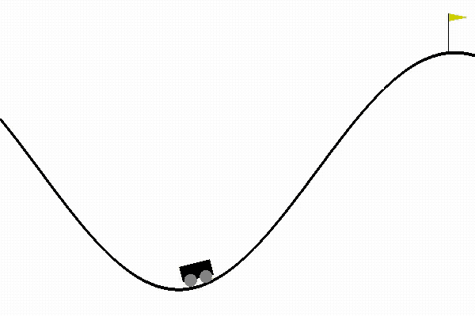
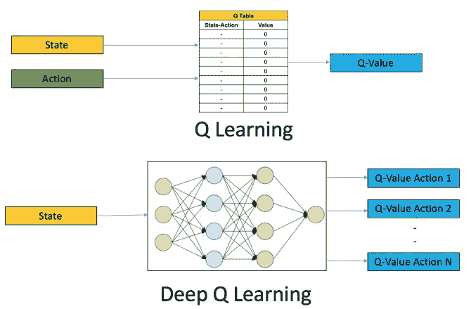
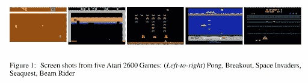
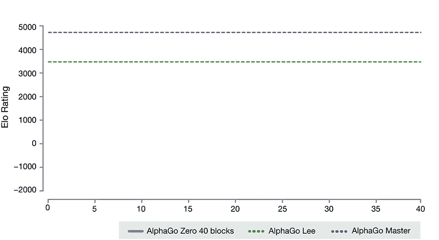

# 关于深度强化学习，你需要知道什么

> 原文：<https://towardsdatascience.com/what-you-need-to-know-about-deep-reinforcement-learning-3571ec8368f4?source=collection_archive---------32----------------------->

人工智能算法正越来越多地为我们的现代社会提供动力，并在从金融到医疗保健再到交通运输的各个领域留下印记。如果说 20 世纪下半叶是计算和连接(互联网基础设施)的全面进步，那么 21 世纪将被智能计算和智能机器竞赛所主导。

[资料来源:Unsplash](https://unsplash.com/)

然而，大多数关于这些新颖计算范例的讨论和认识都围绕着所谓的“监督学习”，其中[**D**eep**L**earning](https://blog.exxactcorp.com/category/deep-learning/)(DL)占据了中心位置。最近的进步和惊人的成功——从疾病分类到图像分割到语音识别——使得 DNNs 在高科技系统的各个方面都得到了极大的发展和应用。

然而，DNN 系统需要大量的训练数据(已经知道答案的标记样本)才能正常工作，它们并不完全模仿人类学习和应用智能的方式。几乎所有的人工智能专家都同意，简单地扩大基于 DNN 的系统的规模和速度，永远不会产生真正的“类人”人工智能系统，甚至不会产生任何与之接近的东西。

因此，有很多研究和兴趣探索超越监督学习领域的 ML/AI 范例和算法，并试图遵循人类学习过程的曲线。收入是其中研究最广泛、最令人兴奋的。

在这篇文章中，我们简要地讨论了现代的 DL 和 RL 如何在一个叫做**D**eep**R**e enforcement**L**earning(DRL)的领域中融合在一起，从而产生强大的人工智能系统。

# 什么是深度强化学习？

人类擅长解决各种各样的挑战性问题，从低级别的运动控制(如走路、跑步、打网球)到高级别的认知任务(如做数学、写诗、交谈)。

强化学习旨在使软件/硬件代理能够通过定义明确、设计良好的计算算法来模仿人类行为。这种学习范例的目标不是以简单的输入/输出功能方式(像一个独立的 DL 系统)映射标记的例子，而是建立一个策略，帮助智能代理按顺序采取行动，以实现某个最终目标。

图来源:“[机器学习的类型有哪些](/what-are-the-types-of-machine-learning-e2b9e5d1756f)”

更正式地说，RL 指的是面向目标的算法，它学习如何实现一个复杂的目标或如何在许多步骤中沿着一个特定的维度最大化。以下示例说明了它们的用法:

*   一种最大限度提高获胜概率的棋类游戏
*   使交易收益最大化的金融模拟
*   在复杂环境中移动的机器人，使其运动中的误差最小化

其思想是，代理通过传感器数据接收来自环境的输入，使用 RL 算法对其进行处理，然后采取行动以满足预定目标。这与我们人类在日常生活中的行为非常相似。

[来源:强化学习:导论(书)](http://incompleteideas.net/book/bookdraft2017nov5.pdf)

深度强化学习中的一些基本定义

对于接下来的讨论，更好地理解 RL 中使用的一些关键术语是有用的。

***Agent*** :一种软件/硬件机制，根据其与周围环境的交互而采取一定的动作；例如，无人机送货，或超级马里奥导航视频游戏。算法就是代理。

***动作*** :动作是代理可以做出的所有可能动作中的一个。一个动作几乎是不言自明的，但是应该注意，代理通常从一系列离散的、可能的动作中进行选择。

***环境*** :智能体活动的世界，对智能体做出反应的世界。环境将代理的当前状态和动作作为输入，并将代理的奖励及其下一个状态作为输出返回。

***状态*** :状态是代理人发现自己的一种具体的、即时的情况；即一个特定的地点和时刻，一个将主体与其他重要事物联系起来的瞬时配置。一个例子是棋盘的特殊结构。

***奖励*** :奖励是我们在给定状态下衡量一个代理人行动成败的反馈。比如在一局棋中，消灭对手的主教等重要动作可以带来一定的奖励，而赢下一局可能会带来很大的奖励。负面奖励也有类似的定义，例如游戏中的失败。

***折扣系数*** :折扣系数是一个乘数。代理人发现的未来奖励会乘以这个系数，以抑制这些奖励对代理人当前行动选择的累积效应。这是 RL 的核心，即逐渐降低未来奖励的价值，以便给予最近的行动更多的权重。这对于基于“延迟行动”原则的范例来说是至关重要的。

***策略*** :策略是 agent 根据当前状态决定下一步动作所采用的策略。它将状态映射到行动，即承诺最高回报的行动。

***价值*** :折现后的预期长期回报，与短期回报相对。该值被定义为特定政策下当前状态的预期长期回报。

***Q-value 或 action-value*** : Q-value 类似于 value，只是多了一个参数，即当前动作。它是指在特定策略下采取特定行动的行动从当前状态的长期回报。

# 常见的数学和算法框架

解决 RL 问题的一些常见数学框架如下:

***马尔可夫决策过程(MDP)*** :几乎所有的 RL 问题都可以被框定为 MDP。MDP 的所有州都具有“马尔可夫”特性，指的是未来只取决于当前的州，而不是各州的历史。

***贝尔曼方程*** :贝尔曼方程是指将价值函数分解为眼前报酬加上未来贴现值的一组方程。

***动态规划*** :当系统(agent + environment)的模型完全已知时，遵循贝尔曼方程，我们可以使用动态规划(DP)迭代地评估价值函数并改进策略。

[资料来源:Exxact](https://blog.exxactcorp.com/)

***值迭代*** :是**通过迭代改进**值的估计来计算最优状态值函数的算法。该算法将值函数初始化为任意随机值，然后重复更新 Q 值和值函数值，直到它们收敛。

[来源:Exxact](https://blog.exxactcorp.com/)

***策略迭代*** :由于智能体只关心寻找最优策略，有时最优策略会先于价值函数收敛。因此，策略迭代，而不是反复改进价值函数估计，**在每一步重新定义策略，并根据这个新策略计算价值，直到策略收敛**。

***Q-learning*** :这是一个**无模型学习**算法的例子。它不假设代理人知道任何关于状态转换和奖励模型的事情。然而，**代理会通过试错**来发现什么是好的和坏的行为。Q-Learning 的基本思想是从我们在主体与环境的交互过程中观察到的 Q 值函数样本中逼近状态-动作对 Q 函数。这种方法被称为**时差学习**。

[资料来源:Exxact](https://blog.exxactcorp.com/)

**图**:Q-learning(试错观察法)解决的一个[示例 RL 问题](https://gym.openai.com/envs/MountainCar-v0)。环境的动力学和模型，即运动的整个物理学是未知的。

# 无模型强化学习的挑战

Q-learning 是一种简单而强大的解决 RL 问题的方法，并且在理论上，可以在不引入额外数学复杂性的情况下扩大到大型问题。基本的 Q 学习可以在递归方程的帮助下完成，

这里，

*Q(s，a)* : Q 值函数，

*s* :状态

s '，s ' ':未来状态

*答*:动作

*γ* :折扣系数

对于小问题，可以从任意假设所有 Q 值开始。通过试错法，Q 表得到更新，政策朝着收敛的方向发展。更新和选择操作是随机进行的，因此，最优策略可能不代表全局最优，但它适用于所有实际目的。

然而，随着问题规模的增长，为一个大问题构建和存储一组 Q 表很快成为一个计算挑战。例如，在像国际象棋或围棋这样的游戏中，可能状态的数量(移动的顺序)随着你想要提前计算的步数呈指数增长。因此，

*   保存和更新该表所需的内存量将随着状态数量的增加而增加
*   探索每个状态以创建所需的 Q 表所需的时间是不现实的

深度 Q 学习等技术试图使用 ML 来应对这一挑战。

# 深度 Q 学习

顾名思义，**深度 Q-learning 不是维护一个很大的 Q 值表，而是利用一个神经网络从给定的动作和状态输入**中逼近 Q 值函数。在一些公式中，状态作为输入给出，所有可能动作的 Q 值作为输出产生。神经网络叫做**D**eep-**Q**–**N**network(DQN)。基本思想如下所示，

图来源: [***一个用 Python 语言***](https://www.analyticsvidhya.com/blog/2019/04/introduction-deep-q-learning-python/) 使用 OpenAI Gym 进行深度 Q 学习的动手介绍

但是和 DQN 一起工作是很有挑战性的。在传统的 DL 算法中，我们对输入样本进行随机化，因此输入类在各种训练批次中相当平衡和稳定。在 RL 中，随着探索阶段的进展，搜索变得更好。这不断地改变输入和动作空间。另外，随着关于环境的知识变得更好，Q 的目标值自动更新。简而言之，对于一个简单的 DQN 系统来说，输入和输出都是频繁变化的。

为了解决这个问题，DQN 引入了**经验回放**和**目标网络**的概念来减缓变化，以便能够以受控/稳定的方式逐渐学习 Q 表。

体验重放在专门的缓冲器中存储一定量的状态-动作-奖励值(例如最后一百万)。使用来自该缓冲区的小批量随机样本来完成 Q 函数的训练。因此，训练样本是随机化的，并且表现得更接近于传统 DL 中监督学习的典型情况。**这类似于拥有高效的短期记忆，在探索未知环境时可以依靠这种记忆**。

此外，DQN 通常采用两个网络来存储 q 值。一个网络不断更新，而第二个网络，即目标网络，以规则的间隔与第一个网络同步。目标网络用于检索 Q 值，使得目标值的变化不太易变。

# 深度强化学习的例子(DRL)

# 玩雅达利游戏(DeepMind)

[DeepMind](https://deepmind.com/) ，一家总部位于伦敦的初创公司(成立于 2010 年)，于 2014 年被谷歌/Alphabet 收购，为 DRL 领域做出了开创性的贡献，当时**成功地使用卷积神经网络(CNN)和 Q-learning 的组合，训练一个代理人仅从原始像素输入**(作为感官信号)玩雅达利游戏。详情可以在这里找到。

[**玩雅达利用深度强化学习**](https://deepmind.com/research/publications/playing-atari-deep-reinforcement-learning)

图来源: [DeepMind 关于 arXiV 的雅达利论文(2013)](https://arxiv.org/pdf/1312.5602v1.pdf) 。

# 阿尔法围棋和阿尔法围棋零(DeepMind)

围棋起源于 3000 多年前的中国，由于其复杂性，它被称为对人工智能最具挑战性的经典游戏。标准的人工智能方法使用搜索树测试所有可能的移动和位置，无法处理可能的围棋移动的绝对数量或评估每个可能的棋盘位置的强度。

利用 DRL 技术和一种新颖的搜索算法，DeepMind 开发了 AlphaGo，这是第一个击败职业人类围棋选手的计算机程序，第一个击败围棋世界冠军，可以说是历史上最强的围棋选手。

图来源:[https://medium . com/point-nine-news/what-does-alpha go-vs-8 dadec 65 AAF](https://medium.com/point-nine-news/what-does-alphago-vs-8dadec65aaf)

这种 Alpha Go 的一个更好的版本叫做 Alpha Go Zero。在这里，该系统由一个神经网络启动，该网络对围棋游戏或规则一无所知。然后，它通过将这种神经网络与强大的搜索算法相结合，与自己进行博弈。在重复的游戏过程中，神经网络被调整和更新，以预测移动，以及游戏的最终赢家。这个更新的神经网络然后与搜索算法重新组合，创建一个新的、更强的 AlphaGo Zero 版本，这个过程再次开始。在每一次迭代中，系统的性能都有少量的提高，并且自玩游戏的质量也提高了。

图来源: [AlphaGo Zero:从零开始](https://deepmind.com/blog/article/alphago-zero-starting-scratch)

# 在石油和天然气行业的应用

荷兰皇家壳牌公司一直在勘探和钻井工作中部署强化学习，以降低天然气开采的高成本，并改善整个供应链中的多个步骤。根据历史钻井数据训练的 DL 算法，以及基于物理学的高级模拟，用于在气体钻井穿过地下时对其进行导向。DRL 技术还利用来自钻头的机械数据——压力和钻头温度——以及地下相关的地震勘测数据。点击此处阅读更多内容:

[**令人难以置信的方式壳牌利用人工智能帮助石油天然气巨头**](https://www.forbes.com/sites/bernardmarr/2019/01/18/the-incredible-ways-shell-uses-artificial-intelligence-to-help-transform-the-oil-and-gas-giant/#187951c42701) 转型。

# 自动驾驶

虽然还不是主流，但 DRL 在应用于自动驾驶汽车的各种具有挑战性的问题领域方面存在巨大的潜力。

*   车辆控制
*   匝道合并
*   个人驾驶风格感知
*   安全超车的多目标 RL

本文将概念解释清楚: [**探索深度强化学习在现实世界自动驾驶系统中的应用。**](https://arxiv.org/pdf/1901.01536.pdf)

# 关于深度强化学习，您需要了解的主要内容

强化学习是真正可扩展的、人类兼容的人工智能系统的最有希望的候选者，也是朝着人工智能(AGI)的最终进步的最有希望的候选者。然而，对于几乎所有的实际问题，由于爆炸式的计算复杂性，传统的 RL 算法极难扩展和应用。

深度学习近年来改变了人工智能领域，可以以系统有效的方式应用于 RL 领域，以部分解决这一挑战。这种方法产生了像 AlphaGo 这样的智能代理，它们可以完全从零开始学习游戏规则(因此，通过推广，学习关于外部世界的规则)，而无需明确的训练和基于规则的编程。

因此，DRL 的未来和希望是光明的。在这篇文章中，我们谈到了 RL 和 DRL 的基础知识，让读者对这个强大的人工智能子领域有所了解。