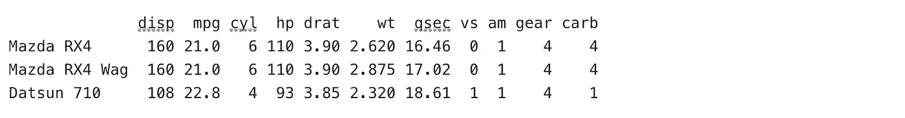
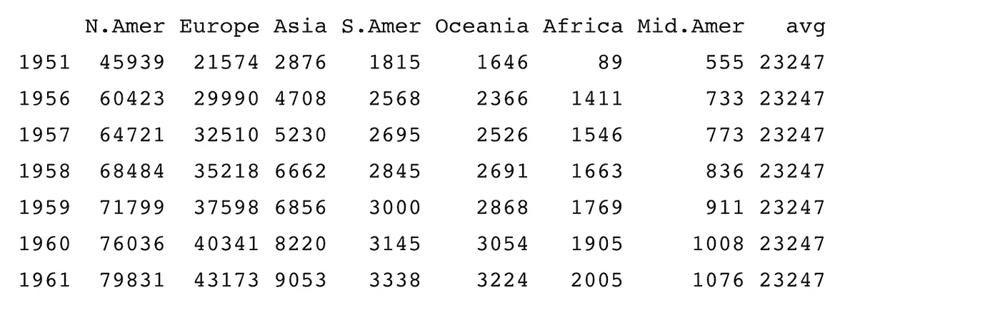
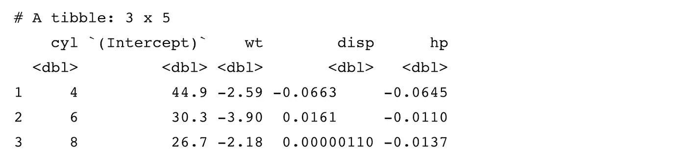

# 关于 dplyr 1.0.0，您需要了解的七件重要事情

> 原文：<https://towardsdatascience.com/what-you-need-to-know-about-the-new-dplyr-1-0-0-7eaaaf6d78ac?source=collection_archive---------9----------------------->

## 这次更新有很多你应该知道的非常强大的新特性

用 R 编码的都知道`dplyr`。它实际上是 R 的定义包，旨在让那些相信“整洁数据”原则的人(我怀疑是大多数数据科学家)对数据帧的操作更加直观。事实上，很多人用`dplyr`编码比用 R base 编码更好。这就是为什么`dplyr`在 R 生态系统中变得如此重要，连同其他目前组成`tidyverse`的包。

所以新版本的发布对于大多数 R 用户来说是令人兴奋的。事实上，它的版本 1.0.0 意味着它是一个真实的事件。Hadley Wickham 和 T4 背后的开源开发者团队不会轻易给出这个版本号。通过使其更强大，通过将许多以前不同的功能统一在一个更抽象的保护伞下，最重要的是试图为用户提供更多日常解决他们最常见的数据框架争论问题的解决方案，大量的努力被投入到超能力`dplyr`的功能中。

`dplyr 1.0.0`现在可以使用`install.packages("dplyr")`进行安装。您可能需要更新您的 R 版本，以确保安装此更新。我无论如何都推荐升级到 R 4.0.0。

在这篇文章中，我将按照我所认为的复杂性递增的顺序来介绍主要的新特性。我将使用内置的数据集——主要是`mtcars`——来演示我的意思。

## 1.内置于 tidyselect

您现在可以在某些`dplyr`动词中使用`tidyselect`辅助函数。例如:

```
library(dplyr)mtcars %>% 
  select(starts_with("c")) %>% 
  head(3)
```


```
mtcars %>% 
  select(any_of(c("mpg", "cyl", "trash"))) %>% 
  head(3)
```


`tidyselect`像这样的帮助函数可以在任何选择函数中工作，包括一些我们稍后会看到的新函数。你可以在这里找到`tidyselect`功能[的全部内容](https://tidyselect.r-lib.org/reference/select_helpers.html)。

## 2.简单但非常有用 relocate()函数

人们通常希望数据帧中的列有一个特定的顺序，而以前唯一的方法是在一个`select()`动词中对列进行排序，如果涉及到很多列，这就很繁琐了。

默认情况下，relocate 会将您的一列或多列移动到数据框的左侧。如果你想把它们移动到一个特定的地方，你可以使用`.before`或者`.after`参数。例如:

```
mtcars %>% 
  dplyr::relocate(disp) %>% 
  head(3)
```



```
mtcars %>% 
  relocate(starts_with("c"), .after = disp)  %>% 
  head(3)
```


## 3.summarise()函数极其强大的扩展

总结——`dplyr`的原始工具——在这个新版本中变得更加灵活。首先，它现在可以返回向量以在输出中形成多行。其次，它可以返回数据帧以在输出中形成多行和多列。对于一些人来说，这可能有点令人费解，所以我将在这里花一点时间来说明这是如何工作的。

如果你想总结出一个能产生矢量输出的函数，这很容易。例如，你可以简单概括一个系列:

```
mtcars %>% 
  group_by(cyl) %>% 
  summarise(range = range(mpg))
```


如果您愿意，您可以与`tidyr::pivot_wider()`结合:

```
library(tidyr)mtcars %>% 
  group_by(cyl) %>% 
  summarise(range = range(mpg)) %>% 
  mutate(name = rep(c("min", "max"), length(unique(cyl)))) %>% 
  pivot_wider(names_from = name, values_from = range)
```


这相当于:

```
mtcars %>% 
  group_by(cyl) %>% 
  summarise(min = min(mpg), max = max(mpg))
```


在这种情况下，第二个选项要简单得多，但是这在输出较长的情况下会很有用。这里有一个计算十分位数的简单方法:

```
decile <- seq(0, 1, 0.1)mtcars %>% 
  group_by(cyl) %>% 
  summarise(deciles = quantile(mpg, decile)) %>% 
  mutate(name = rep(paste0("dec_", decile), length(unique(cyl)))) %>% 
  pivot_wider(names_from = name, values_from = deciles)
```


现在你总结输出可以是一个数据框架。让我们看一个简单的例子。最近我写了一个函数，可以识别一个向量中所有唯一的无序元素对。现在我想应用它来绘制出*朋友*的角色之间的联系网络，基于出现在同一个场景中。

这是我可能正在使用的数据框架的一个简单版本:

```
friends_episode <- data.frame(
  scene = c(1, 1, 1, 2, 2, 2),
  character = c("Joey", "Phoebe", "Chandler", "Joey", "Chandler", "Janice")
)friends_episode
```


现在，我将编写我的函数，该函数接受一个矢量并产生一个两列数据帧，并按场景应用它:

```
unique_pairs <- function(char_vector = NULL) { vector <- as.character(unique(char_vector)) df <- data.frame(from = character(), to = character(), stringsAsFactors = FALSE) if (length(vector) > 1) {
    for (i in 1:(length(vector) - 1)) {
      from <- rep(vector[i], length(vector) - i) 
      to <- vector[(i + 1): length(vector)] df <- df %>% 
        dplyr::bind_rows(
          data.frame(from = from, to = to, stringsAsFactors = FALSE) 
        )
    }
  } df} friends_episode %>% 
  group_by(scene) %>% 
  summarise(unique_pairs(character))
```


正如您可能看到的，dataframe 是我的`summarise()`函数的输出，它已经被解包并在最终输出中形成了两列。如果我们命名我们的`summarise()`函数的输出会发生什么？

```
friends_pairs <- friends_episode %>% 
  group_by(scene) %>% 
  summarise(pairs = unique_pairs(character))friends_pairs
```


所以这是一个重要的警戒。如果您希望您的`summarise()`输出解包，不要命名它。

## 4.与 cross 的更强大的 colwise 争论()

有了这些更强大的汇总功能，再加上内置的`tidyselect`工具包，我们就有了更强大、更抽象的功能来处理我们的数据列，并形成更广泛的任务。新副词`across()`的引入实现了这一点。

简而言之，新函数`across()`在现有的`dplyr`动词(如`summarise()`或`mutate()`)中跨多个列和多个函数进行操作。这使得*极其*强大且省时。现在不再需要作用域变量，如`summarise_at()`、`mutate_if()`等。

首先，您可以通过手动定义一组列来复制`summarise_at()`,使用列名的字符向量进行总结，或者使用列号:

```
library(dplyr)mtcars %>% 
  group_by(cyl) %>% 
  summarise(across(c("mpg", "hp"), mean))
```


`across()`是一个选择函数，因此您可以在其中使用`tidyselect`语法。您可以通过使用一个函数选择您的列来复制`mutate_if()`。这里我们将`dplyr::storms`数据集中的`name`和`status`列从字符转换为因子。

```
storms %>% 
  dplyr::mutate(across(is.character, as.factor)) %>% 
  dplyr::select(name, status)
```


还可以通过使用列表将多个命名函数应用于多个列。默认情况下,`across()`函数会用下划线将函数名和列名粘在一起:

```
mtcars %>% 
  group_by(cyl) %>% 
  summarise(across(c("mpg", "hp"), list(mean = mean, median = median, sd = sd)))
```


如果您想使用不同的粘合公式，可以使用粘合语法:

```
mtcars %>% 
  group_by(cyl) %>% 
  summarise(across(starts_with("d"), 
                   list(mean = mean, sd = sd), 
                   .names = "{col}_{fn}_summ"))
```


如果需要在函数中添加可选参数，可以使用公式:

```
mtcars %>% 
  group_by(cyl) %>% 
  summarise(across(c("mpg", "hp"), 
                   list(mean = ~mean(.x, na.rm = T), 
                        median = ~median(.x, na.rm = T), 
                        sd = ~sd(.x, na.rm = T)), 
                   .names = "{col}_{fn}_summ"))
```


同样，您可以使用公式来组合函数，以避免不必要的额外变异:

```
mtcars %>% 
  group_by(cyl) %>% 
  summarise(across(mpg, 
                   list(minus_sd = ~(mean(.x) - sd(.x)), 
                        mean = mean, 
                        plus_sd = ~(mean(.x) + sd(.x)))
                   ))
```


## 5.rowwise()在新的 dplyr 中变得生动起来

`dplyr`以前对跨行工作的友好程度有限。以前，当您想要对同一行中的值求和或求平均值时，它的行为有些违背直觉。这里有一个例子，你们中的一些人可能会认为这是以前头痛的根源:

```
WorldPhones_df <- WorldPhones %>% 
  as.data.frame() # mutate an average columnWorldPhones_df %>% 
  dplyr::mutate(avg = mean(N.Amer:Mid.Amer))
```



这返回了数据帧中每一列的平均值，这当然不是我们想要的。

以前，解决这个问题的唯一方法是使用手动计算，并避免以这种方式使用函数，所以你会写`(N.Amer + Europe + Asia + S.Amer + Oceania + Africa + Mid.Amer)/7`，这是相当乏味的。

`rowwise()`创建了一个名为`rowwise_df`的不同结构，它准备你的数据来执行跨行操作——它基本上按行对你的数据进行分组。

新的`c_across()`副词赋予了`rowwise()`强大的功能，允许您以类似于使用`across()`副词的方式工作。现在你可以写:

```
WorldPhones_df %>% 
  rowwise() %>% 
  dplyr::mutate(avg = mean(c_across(N.Amer:Mid.Amer)))
```


## 6.在数据框架中运行不同的模型

新的`rowwise_df`对象设计用于列表列，它允许在数据帧的列中存储任何类型的数据。我发现这个特别有价值的地方是，你想根据某些变量的值对你的数据子集运行不同的模型。这里有一个例子，说明如何将不同的`mtcars`子集存储在一个行方式的数据帧中，然后在它们上面运行一个模型。

```
model_coefs <- function(formula, data) {
  coefs <- lm(formula, data)$coefficients
  data.frame(coef = names(coefs), value = coefs)
}mtcars %>% 
  dplyr::group_by(cyl) %>% 
  tidyr::nest() %>% 
  dplyr::rowwise() %>% 
  dplyr::summarise(model_coefs(mpg ~ wt + disp + hp, data = data)) %>% 
  tidyr::pivot_wider(names_from = coef, values_from = value)
```


## 7.`nest_by()`功能

当然，`dplyr 1.0.0`背后的开发人员注意到了这种行方式建模能力的强大，因此创建了`nest_by()`函数作为上面代码的快捷方式。`nest_by(x)`相当于:

```
dplyr::group_by(x) %>% 
  tidyr::nest() %>% 
  dplyr::rowwise()
```

因此，现在您可以使用以下方法进行上述建模:

```
mtcars %>% 
  nest_by(cyl) %>% 
  dplyr::summarise(model_coefs(mpg ~ wt + disp + hp, data = data)) %>% 
  tidyr::pivot_wider(names_from = coef, values_from = value)
```



最初我是一名纯粹的数学家，后来我成为了一名心理计量学家和数据科学家。我热衷于将所有这些学科的严谨性应用到复杂的人的问题上。我也是一个编码极客和日本 RPG 的超级粉丝。在 [*LinkedIn*](https://www.linkedin.com/in/keith-mcnulty/) *或*[*Twitter*](https://twitter.com/dr_keithmcnulty)*上找我。也可以看看我在*[*drkeithmcnulty.com*](http://drkeithmcnulty.com/)*的博客。*

