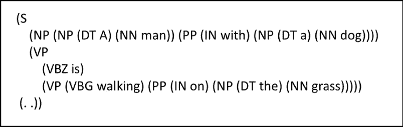

# 所见即所得！

> 原文：<https://towardsdatascience.com/what-you-see-is-what-you-get-973a933d60ff?source=collection_archive---------69----------------------->

图一，[来源](https://arxiv.org/pdf/1909.00421.pdf)

在计算语言学和自然语言处理中，将代词解析到给定句子中的特定主语/宾语一直是一个开放式的研究课题。它需要从各种信息源和上下文知识中进行复杂的推理。

为了解决这个问题，本文——“[**所见即所得:对话中的视觉代词指代消解**](https://arxiv.org/pdf/1909.00421.pdf)**“**定义了对话中视觉感知代词指代消解(PCR)的任务。它描绘了' **VisCoref** '和' **VisPro** '(分别是模型和数据集)，以研究如何利用视觉信息使用深度学习来解析代词。

本文解决了代词指代的问题，特别是在对话中。先前的工作已经在正式的书面文本上取得了相当高的准确率，但是在对话上却没有。原因是，与正式的文本相比，对话中需要更多关于环境和语境的信息。例如，如果两个人正在交谈，他们可能会简单地用代词“它”来指代他们眼前的一个物体，或者简单地指向这个物体。因此，本文提出了这种类型的第一个模型，以及一个数据集，使用图像和文本对话来共同引用代词。

# VisPro 数据集

**VisPro** 数据集可以被认为是 **VisDial** 数据集的升级版，其中每张图片都附有一段讨论该图片的对话记录。然而， **VisPro** 通过为每张图片增加一个“标题”来改进这个数据集，标题可以被认为是一个图片元数据。

图 2:句子“一个带着狗的人在草地上行走”的语法解析来源:[https://arxiv.org/pdf/1909.00421.pdf](https://arxiv.org/pdf/1909.00421.pdf)

该数据集还经过预处理，以避免候选名词短语的重叠。它只选择解析树中高度为两个 T21 的名词短语。举个例子，考虑下面这句话“一个打着伞的女孩走在路上。”数据集将选择“一个女孩”、“一把伞”和“道路”作为候选；而不是“打伞的女孩”和“马路”。因此，在语法(解析)树中有一个有限的高度 2 有助于**减少选项**的混乱。

执行的另一个重要的预处理任务是只保留那些具有 4 到 10 个代词的对话。这有助于解决代词爆炸的问题(导致代词重复)和代词太少的问题(这对任务没有什么用处)。

# VisCoref 模型

图 3:模型流程图，来源:[https://arxiv.org/pdf/1909.00421.pdf](https://arxiv.org/pdf/1909.00421.pdf)

模型评分函数 F(n，p)分为两部分，如下所示:

在上面的等式中，***Fc****和***Fp****分别是上下文评分函数和视觉评分函数，控制视觉信息的重要性。为了在视觉和上下文信息之间取得良好的平衡，***λvis****被设置为 **0.4** 。***

***现在，让我们试着理解什么是情境评分和视觉评分，以及它是如何执行的。***

# ***上下文评分***

***该模型首先通过“提及表示模块”将所有上下文信息编码到所有候选代词和目标代词中，该模块在图 3 中由虚线框表示。双向 LSTM 用于执行这种编码并创建加权嵌入。***

***图 3 所示的嵌入' ***en*** '和' ***ep*** '通过双向 LSTM 和区间内注意机制来计算。一旦这些单独的单词嵌入被连接，然后计算上下文评分函数'***Fc****'*。***

# **视觉评分**

**对象检测模块用于从图像中识别对象标签，例如“人”、“猫”或“窗户”使用在上下文嵌入模块中执行的相同编码过程，将这些识别的标签转换成矢量表示。**

**对照候选文本短语检查这些对象标签，无论文本短语是否引用它们。这是通过计算对应于图像中每个检测到的对象的短语的可能性来完成的。通过将分数传递给 **softmax** 函数，这种可能性被转换为概率。然后，具有最高 softmax 分数**的标签被分配给相应的文本短语。****

**现在，让我们说两个短语 ***p1*** 和 ***p2*** 指的是同一个被检测对象。那么， ***p1*** 和 ***p2*** 对应的 softmax 分值应该是一样大的。**

**因此，所有相应的标签被分配一个单独的分数，该分数然后被组合以创建整体视觉评分函数'**'*。***

**然后通过计算' ***Fc*** *'* 和'***Fv****'*的加权平均值来计算总分。**

# **实施细节**

**对于初始单词表示，作者使用了 300 维手套嵌入(Pennington 等人，2014 年)和 ELMo (Peters 等人，2018 年)嵌入的串联。用零向量初始化词汇表外的单词。来自 TensorFlow 的“SSD RESNET 50 fpn coco”模型已经用于对象检测。用于上下文评分和视觉评分的前馈网络分别具有两个 150 维的隐藏层和一个 100 维的隐藏层。对于模型训练，**交叉熵损失**函数和**亚当**(金玛和巴，2015)优化器已用于实现更快的收敛。**

**在进行训练时，作者将数据集分为两类——讨论过的**和未讨论过的**。它们之间的区别在于，前一种情况下，代词的正确先行词出现在对话文本中；而在后者，他们没有。**

# **模型评估:**

**本文将 VisCoref 的性能与其他五种基准模型进行了比较:**

**1.确定性模型(Raghunathan 等人，2010 年)**

**2.统计模型(克拉克和曼宁，2015 年)**

**3.Deep-RL 模型(克拉克和曼宁，2016 年)**

**4.端到端模型(Lee 等人，2018 年)**

**5.端到端+可视化(何等，2016)**

**VisCoref 以显著优势胜过所有这些模型，表明视觉信息确实非常有利。**

****

**图 4:模型评估度量以及与其他基线模型的比较。来源:[https://arxiv.org/pdf/1909.00421.pdf](https://arxiv.org/pdf/1909.00421.pdf)**

**从结果表中可以明显看出，VisCoref 模型的 F1 得分高于所有之前发布的基线模型。**

# **案例研究**

****

**图 5:来自 VisPro 数据集的随机示例。来源:[https://arxiv.org/pdf/1909.00421.pdf](https://arxiv.org/pdf/1909.00421.pdf)**

**这是一项在 VisPro 数据集的样本上，与端到端模型(Lee 等人，2018 年)相比，VisCoref 模型表现如何的研究。**

**问:“在*和*上有任何文字或数字吗？”**

**给定代词' **it** '，端到端模型(Lee et al .，2018)从对话中挑选**'任何文字'**，而 VisCoref 模型从候选短语中选择**'一辆蓝、白、红相间的火车'**。没有图像，即使是人也无法区分这两个候选短语。然而，当考虑图像时，我们立即观察图像中的火车，并因此报告“蓝色、白色和红色火车”为正确的候选短语。**

**因此，这项研究重申了视觉信息在对话中对人类和机器的重要性！**

# **相关著作**

**[**用于共指消解的多遍筛选(Raghunathan 等人，2010)**](https://www.aclweb.org/anthology/D10-1048.pdf)**

**许多现有的共指消解模型使用对一组特征的单个函数来确定两个提及是否是共指的，这导致了不正确的决策，因为较低精度的特征支配了较少数量的高精度特征。本文提出了一个基于筛子的简单共指架构，该架构从最高精度到最低精度一次应用一层确定性共指模型，即一个基于规则的系统，该系统聚合了多个函数，用于基于手工特征确定两个提及是否是共指的。然而，这种技术并未应用于调查报告中，因为较低的相互参照精度已被视觉信息(即图像)所抵消。**

**[**【以实体为中心的共指消解与模型堆叠(Clark and Manning，2015)**](https://nlp.stanford.edu/pubs/clark-manning-acl15-entity.pdf)**

**本文使用实体级信息来训练一个以实体为中心的共指系统，用于学习建立共指链的策略。它使用凝聚聚类，即每个提及对从它自己的聚类开始，然后这些聚类可能会被合并。因此，该模型在提及聚类之间学习人类设计的实体级特征，以产生准确的共指链。同样，本文不使用图像来指代代词，它仅依赖于书面正式文本。**

**[**提及排序共指模型的深度强化学习(Clark and Manning，2016)**](https://cs.stanford.edu/people/kevclark/resources/clark-manning-emnlp2016-deep.pdf)**

**在这篇论文中，作者应用强化学习来优化一个用于相互参照的神经提及排序模型。这个提及排名模型为给定的对产生一个指示兼容性的分数。对于每一次提及，该模型提取各种单词，如前一个单词，或其句子中的所有单词，并创建嵌入；其然后被馈送到具有几个隐藏层的 ReLU 单元的前馈神经网络，这些隐藏层与前面的层完全连接。本文尝试的共指方法是通过超参数调整这个神经网络。为了调整超参数，它使用强化学习来确定输入到模型的最佳参数选择。与基于图像的相互参照相比，这是一种完全不同风格的相互参照方法。**

**[**由粗到精推理的高阶共指消解(Lee et al .，2018)**](https://arxiv.org/pdf/1804.05392.pdf)**

**本文介绍了一种用于共指消解的高阶推理的完全可微近似。它使用来自跨度等级架构的先行分布作为注意机制来迭代地改进跨度表示。先前的论文对共指链接做出独立的决定，因此，容易预测局部一致但全局不一致的聚类。这是一种最先进的共指解决方法。它通过一个端到端的神经网络预测共指聚类，该网络利用预先训练的单词嵌入和上下文信息。在调查论文模型的上下文评分部分创建嵌入时，使用了类似的概念。**

**[**使用神经模块网络的视觉对话中的视觉共指消解(Kottur et al .，2018)**](https://arxiv.org/pdf/1809.01816.pdf)**

**本文主要研究视觉共指消解，包括确定哪些词，通常是名词短语和代词，共指图像中的同一个实体/对象实例。作者通过引入两个新的模块——引用和排除——提出了一种用于视觉对话的神经模块网络架构，这两个模块在更精细的单词级别上执行显式的共指消解。“参考”有助于从图像中检索对象标签,“排除”可删除那些不参考图像中任何对象的候选标签。这是唯一一篇将图像数据和文本结合在一起的论文。因此，该模型与调查文件中的模型非常相似。除了创建编码和单词嵌入之外，本文中的内部模型体系结构与本文中的不同。**

****感谢您的阅读！我希望听到您的反馈！****

****注:**这是对以下出版物的论文综述——《[**所见即所得:对话中的视觉代词指代消解**](https://arxiv.org/pdf/1909.00421.pdf) 》，作者为、、宋、严松、张长水，在 EMNLP 2019 上发表了一篇长论文。本博客改编自论文，所有研究工作的所有权属于上述作者。**