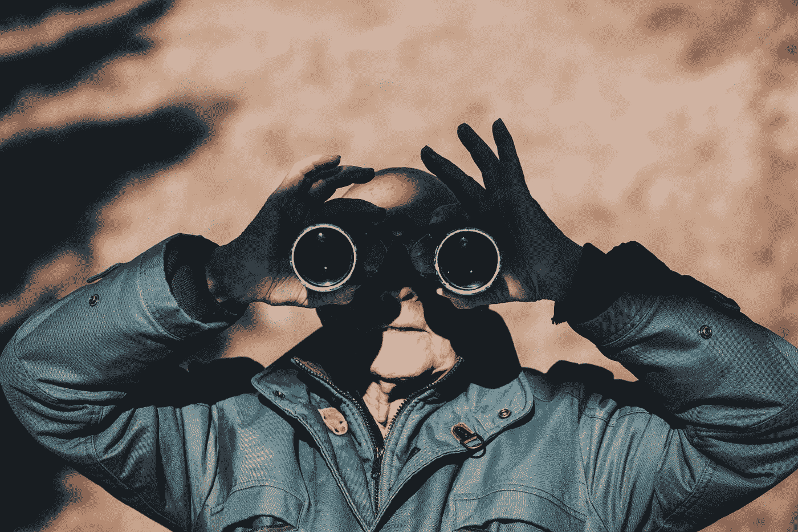
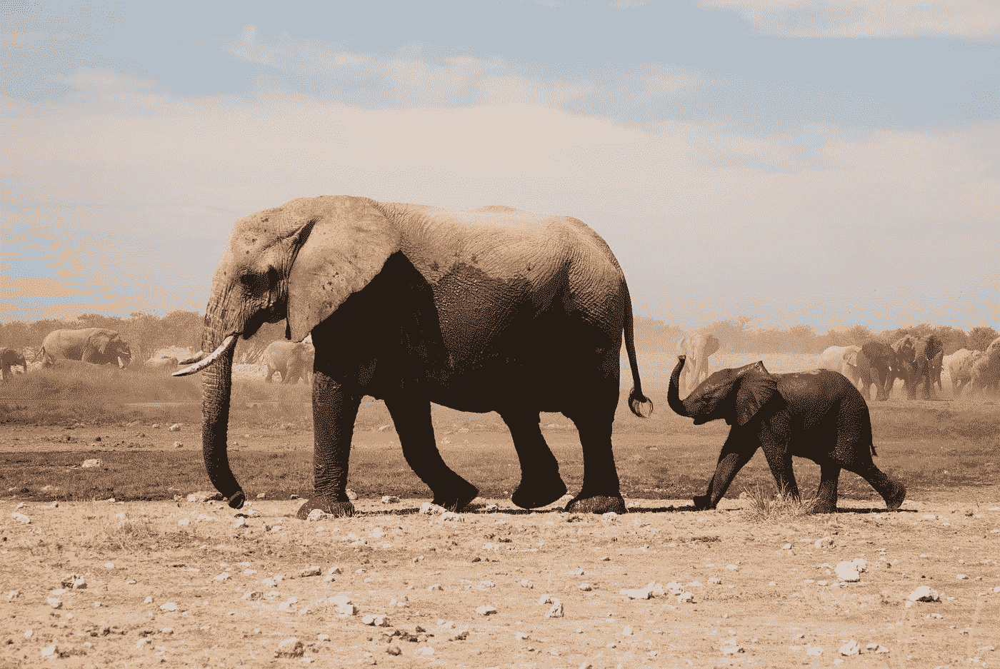
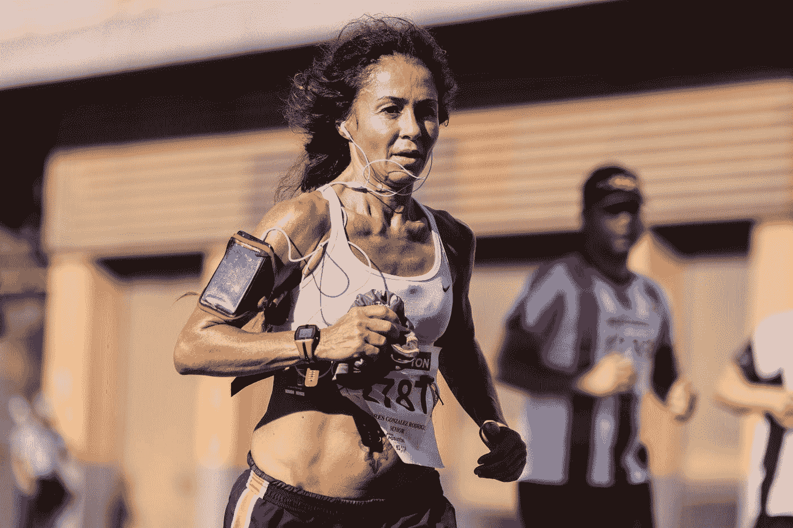

# 你所看到的是你所猜测的

> 原文：<https://towardsdatascience.com/what-you-see-is-what-you-guess-cab74d486ab9?source=collection_archive---------55----------------------->

## 第一次接触微软 Azure 计算机视觉



Alessandro Vallainc 在 [Unsplash](https://unsplash.com?utm_source=medium&utm_medium=referral) 上拍摄的照片

浏览微软云服务平台提供的服务菜单时，我遇到了计算机视觉(CV)。我决定玩一会儿，感受一下这项服务能提供什么。

所以我用我的 github 证书创建了一个免费账户，并在常规验证步骤后成功登陆([链接【美国 )。然后，我按照说明创建了一个 CV 实例，并获得了我的 API 键。](https://azure.microsoft.com/en-us/free/)

该服务分析用户提供的或互联网上公开的图像和视频内容。该服务在前 12 个月是免费的，上限为每月 5000 笔交易，最大速率为每分钟 20 笔，这足以进行一些测试。

从技术上讲，该服务是通过 REST web 服务交付的，这使我认为我可以很快开始测试它，我也确实这样做了。

## 它提供了什么

在 CV 的各种服务中，我将重点介绍图像分析。在这种情况下，CV 为您提供了以下信息:

*   **标签**:从数千个标签的宇宙中，CV 列出了你图像中已识别的物体类型，比如*狗*、*树*或*车*。
*   **对象**:只要有可能，CV 还会提供一个由图片中的矩形所包围的对象列表。因此，如果有三辆已识别的自行车，它将给出这三辆自行车的边界框的坐标。
*   **品牌**:它可以从一组数以千计的知名品牌中检测标志。
*   **类别**:从预先定义的 86 个类别的固定列表中，CV 会给你的照片分配最合适的类别(例如:*美食 _ 烧烤*或*户外 _ 街道*)
*   **描述**:以您选择的语言对整个图像进行描述。实际上这是我感兴趣的特性，所以我将在这里停止列举。完整列表见[本](https://docs.microsoft.com/en-us/azure/cognitive-services/computer-vision/overview)。

足够的文献，让我们写一些 python 代码，并把一些 Unsplash 图像扔给 CV 来开始乐趣



第一次尝试:托比亚斯·亚当在 [Unsplash](https://unsplash.com?utm_source=medium&utm_medium=referral) 拍摄的照片

## 简化的计算机视觉客户端

REST web 服务基本上可以在任何通用编程语言中使用。我们将在这里使用 Python 处理这条线上方的图像。看看吧，看看评论:

```
import requests
import json

# connection details
# Replace this silly pun with your API
azure_cv_api_key = "MyAPI Heat"
# same here
azure_cv_endpoint = "somesubdomain.cognitiveservices.azure.com"
azure_cv_resource = "vision/v3.1/analyze"
language = "en"
# We just ask for some features
visual_features = "Objects,Categories,Description"
image_path = "c:/work/images/tobias-adam-Twm64rH8wdc-unsplash.jpg"

azure_cv_url = "https://{}/{}".format(azure_cv_endpoint,
                                      azure_cv_resource)
headers = {'Ocp-Apim-Subscription-Key': azure_cv_api_key,
           'Content-Type': 'application/octet-stream'}

params = {"visualFeatures": visual_features, "language": language}

# We need to read the image as a byte stream
image_data = open(image_path, "rb").read()

response = requests.post(azure_cv_url, params=params, data=image_data, headers=headers)

# assume you get a 200 status (ok)
content = json.loads(response.content.decode(response.encoding))

# This is where the picture description can be found
print("Description\n{}".format(content["description"]["captions"][0]["text"]))# Which objects have you found?
for o in content["objects"]:
    print("Object {} Parent {} Grandparent {}".format(o["object"], o["parent"]["object"]), o["parent"]["parent"]["object"])
```

我们运行它并得到:

> 描述
> 一只小象走在它妈妈的旁边
> 对象非洲象母象祖父母哺乳动物
> 对象非洲象母象祖父母哺乳动物

哇——我知道，更大的大象可能是父亲或阿姨，但听起来真的很好。

## 改变语言

在语言分配中，我们用“es”代替“en”。我期待的是将英语原文直接翻译成西班牙语，但这是我们得到的结果(省略了对象):

> 描述
> 火车上的一个小孩

哪个**不是**的直译——如果你不相信我，谷歌翻译一下。这是为什么呢？我不知道，我的猜测是模型在不同的语言中被不同地训练，否则我不知道为什么会发生这种情况。

顺便说一句，Unsplash 中由人类创作的标题是这样的:

> 两只灰色的大象走在灰色的天空下

## 又一次尝试



第二次尝试:照片由 [Quino Al](https://unsplash.com/@quinoal?utm_source=medium&utm_medium=referral) 在 [Unsplash](https://unsplash.com?utm_source=medium&utm_medium=referral) 上拍摄

我替换`image_path`如下

```
image_path = "c:/work/images/quino-al-iRt9yOWzfOk-unsplash.jpg"
```

得到这个结果

> 描述
> 穿衣服的人
> 对象人
> 对象人
> 对象人

该人未被识别为跑步者或运动员。为什么？也许她的腿不在画面上并没有帮助。用西班牙语说:

> 描述
> 一个人的馅饼

有趣的是，CV 已经认出了照片中的第三个人，即使照片很模糊，而且只有不到三分之一的身体是可见的。

## 光学字符识别

CV 中提供的另一个服务是从提供的图像中提取文本。要调用服务，请替换资源:

```
azure_cv_resource = "vision/v3.1/ocr"
```

参数是:

```
params = {'language': 'unk', 'detectOrientation': 'true'}
```

在生成的字典`(content)`中，您会发现一个名为`regions`的列表，其中包含 CV 找到的所有填充文本框。我已经用几张图片试过了，结果好坏参半。不要用超 bif 图片尝试，有大小限制。

## 结论

计算机视觉和图像识别的进步是惊人的。虽然图像分析还没有达到完美，但 CV 等服务的潜在应用是巨大的。

CV 提供了更多的可能性，例如使用定制模型(称为定制视觉的独立服务)或分析视频。

该服务主要是将这一功能集成到第三方开发应用程序中。写这篇文章是为了鼓励你使用这个服务，并想象这个额外的功能可能带来的新的应用。