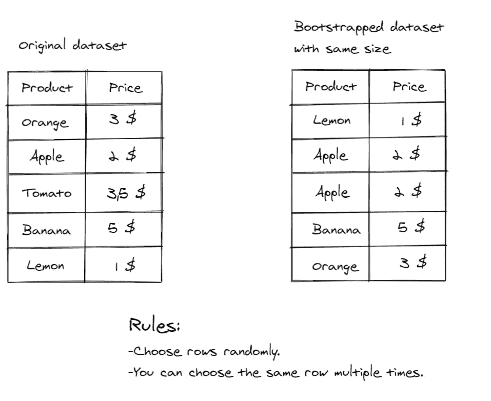
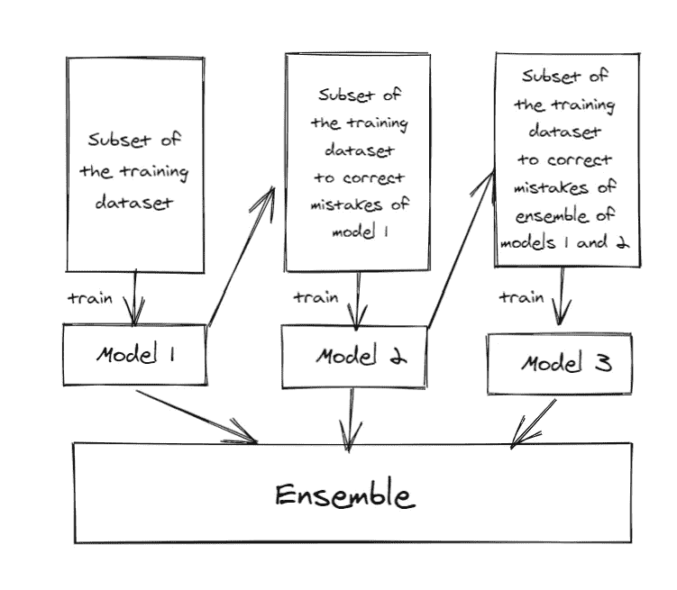
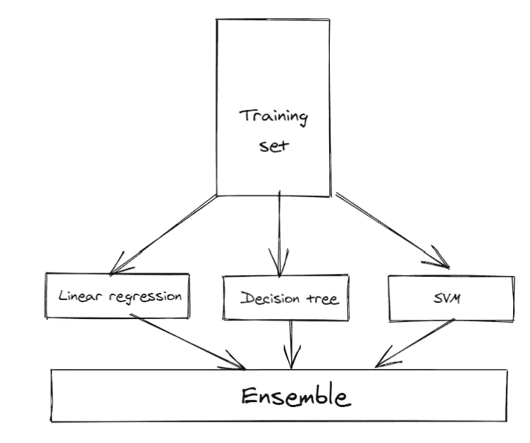

# 关于集成学习你应该知道什么

> 原文：<https://towardsdatascience.com/what-you-should-know-about-ensemble-learning-e92d4b3c3608?source=collection_archive---------45----------------------->

## 大众对机器的智慧

马库斯·斯皮斯克在 [Unsplash](https://unsplash.com?utm_source=medium&utm_medium=referral) 上的照片

# 简介:

你想和你的朋友组织一个电影之夜，你正在寻找一部完美的电影，你在网飞上搜索，你偶然发现了一部引起你注意的电影。要决定这部电影是否值得看，你有多种选择。

方案一:去问已经看过电影的哥哥。

选项 B:去 IMDB 检查评级和阅读多个希望剧透免费评论。

很明显你会选择 B，因为如果你从你哥哥那里得到多种观点而不是单一观点，那么得到有偏见的观点的风险会更小。这是集合方法背后的想法和动机。这是群众的智慧！现在让我们深入到集成学习的一个更技术性的定义。

照片由[阿里安·达尔维什](https://unsplash.com/@arianismmm?utm_source=medium&utm_medium=referral)在 [Unsplash](https://unsplash.com?utm_source=medium&utm_medium=referral) 上拍摄

# 什么是集成学习:

根据 scholarpedia:

> 集成学习是一个过程，通过该过程，多个模型(如分类器或专家)被战略性地生成和组合，以解决特定的计算智能问题。

这意味着采取生成多个模型和聪明地采纳它们的意见的方式，以获得可能的最佳预测。理论上，集合模型总是比单一模型更好。为了有效地工作，构建集合的个体模型应该是不同的，如果所有的个体观点都相同，那么接受集体观点是没有意义的。我们可以通过使用不同的算法，改变超参数，或在数据集的不同部分训练它们来区分我们的模型。

# 我们如何合奏学习(技巧):

## 装袋:

代表“ *bootstrap aggregating”，这是理解起来最简单、最直观的技术之一。在 bagging 中，我们将在数据的不同子集上训练时使用相同的算法。为了得到这些子集，我们使用了一种叫做* ***的技术:引导:***

基本自举插图，作者图片

如你所见,**苹果**重复了两次。在实践中，我们通常为自举数据集选择较小的大小。在创建一些自举数据集后，我们将在每个数据集上建立一个模型，然后将它们组合成一个集合模型，这被称为**聚合**。对于分类问题，投票最多的类别是预测，对于回归问题，我们对模型的输出进行平均。

## 增压:

虽然 bagging 可以并行完成(只需同时训练所有模型)，但 boosting 是一个迭代过程。像 bagging 一样，我们将使用相同的算法，但我们不会同时引导数据和训练所有模型。提升是连续的，这意味着一个接一个地训练模型，前一个模型的性能将影响我们如何为下一个模型选择训练数据集，更准确地说，每个新模型将尝试纠正其前任犯下的错误

boosting 的基本工作原理，按作者排序的图像

实现 boosting 的流行算法有 **AdaBoost** 和**梯度 Boosting。**

## 堆叠:

这个很简单，我们将使用不同的算法，只是结合他们的预测。

堆叠的基本工作原理，按作者排列的图像

# 你为什么要合奏学习？

由于直觉和实践证实，集合方法产生更准确的结果，并且当明智地使用时，对过度拟合更有弹性，因此，它们被广泛用于 Kaggle 比赛。一个缺点是他们需要更多的时间来训练。

# 摘要

集成学习正在将多个弱模型转变为一个强模型“在一起我们更强”。已经开发了多种技术来实现这一点，例如装袋、助推和堆叠。一个集合模型总是比一个单一的模型更准确，并且能更好地概括。

我希望你已经对集合模型有了一个基本的概念。现在是时候将它应用到你的项目中了！

感谢阅读！❤

关注我，了解更多信息丰富的数据科学内容。