# 你的员工在网上对你有什么看法？—使用 Python 进行文本挖掘

> 原文：<https://towardsdatascience.com/what-your-employees-are-saying-online-about-you-text-mining-using-python-72fe2a9bd615?source=collection_archive---------49----------------------->

## 数据科学、商业智能、网络搜集

## Web 抓取 Glassdoor，从员工评论中获取见解

在当今世界，几乎每个人都在使用互联网，如消费者、企业、政策制定者、政治家和各种组织，以便相互交流，它使我们有空间分享、表达和接收意见，并让企业在网上发布他们的更新，并与他们的利益相关者互动。它还允许员工在线查看和匿名反馈他们的组织，以便于他人检索信息。

因此，由于大多数来自个人的反馈都是以评论的形式发布在 Indeed 和 Glassdoor 等平台上，因此每个组织都应利用这一机会，通过**文本挖掘&自然语言处理(NLP)技术**关注在线讨论，这一点非常重要。虽然收集调查数据也是更好地了解员工工作生活需求的一种好方法，但并不是所有的评估都能产生有用且不带偏见的信息，在某些情况下，问卷本身也可能是公司问题的原因。

收集在线评论可以为企业提供一个好主意，了解他们的员工是否快乐，他们为什么快乐，什么可以变得更好，以及他们关心的问题。通过了解这一点，我们不仅可以评估当前公司内部政策的效率，而且组织还可以在未来制定更好的数据驱动决策。

在这个项目中，我们将调查 Glassdoor Italy 上公司员工评论的趋势，我们将取消以下组织在线发布的最后(110 - 120)条评论。

## (普华永道—德勤—埃森哲)

> *Glassdoor 是一个现任和前任员工匿名评论公司的网站。Glassdoor 还允许用户匿名提交和查看薪水，以及在其平台上搜索和申请工作。*

你说得够多了，让我们开始谈正事吧。

值得注意的是，大多数评论都是用意大利语收集的，然后被翻译成英语*。*每个公司将有一个优点(优点)和缺点**(缺点)**栏，此外，每个公司将根据员工匿名条目对以下措施进行评分 **(0 至 5)** :

**(工作/生活平衡——文化&价值观——职业机会——薪资&福利——高管)**

# 1-普华永道

首先，我们知道普华永道的总体平均评级为 3.8/5 颗星。

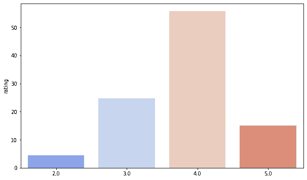

在接下来的两张图中，我们展示了评分和每次评价的长度之间的关系，从中我们可以注意到，当人们给 4 星时，他们倾向于写更长的正面和负面评价。

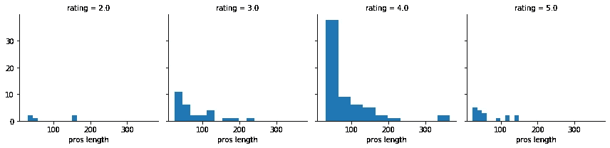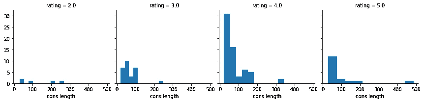

在下面的 5 张图中，我们展示了前面提到的措施的评分。普华永道在工作/生活平衡方面的平均得分为 2.3/5，在文化和价值观方面的平均得分为 3.8/5，在职业机会方面的平均得分为 4.1/5，而在薪酬和福利方面的平均得分为 2.8/5，在高管方面的平均得分为 3.2/5。

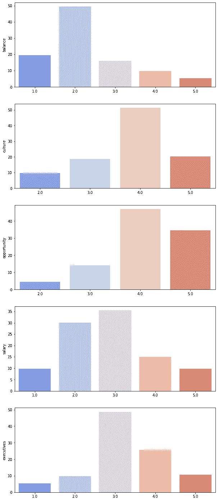

在接下来的部分中，我们将运用自然语言处理技术来可视化员工在谈论**积极的**时使用的前 35 个重复和频繁的词语。

列表的顶部如下:

**(环境—机遇—学习—伟大—事业)**

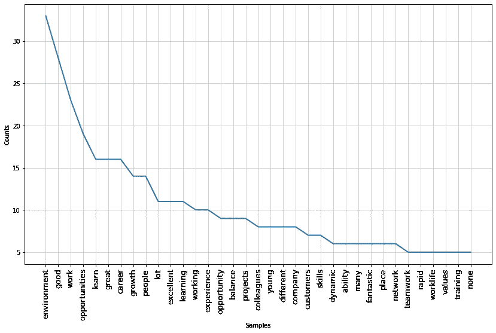

在单词云中可视化之前的结果

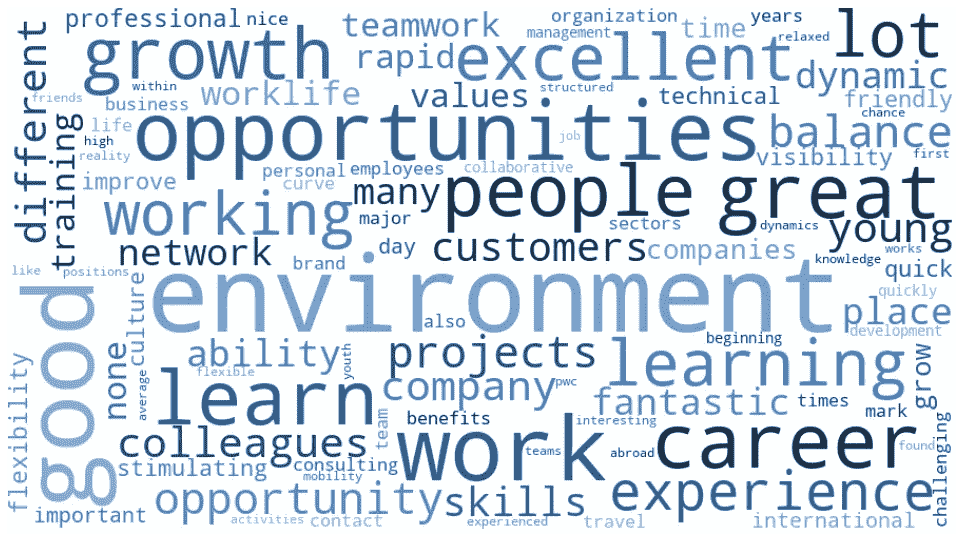

然而，在这一部分，我们将探究员工在谈论**负面信息**时最常重复使用的 35 个词。

列表的顶部如下:

**(工作—寿命—小时—余额—长)**

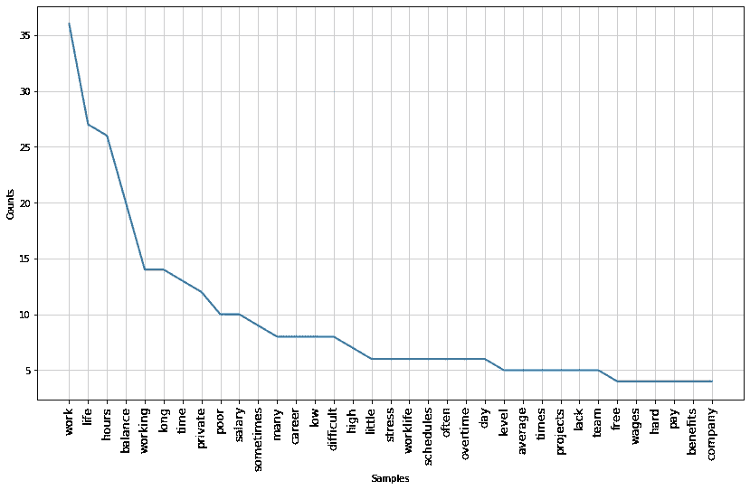

再次用文字云表示结果。

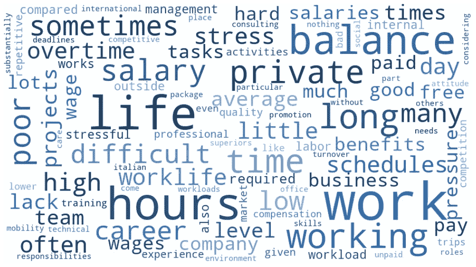

普华永道的正面评价样本:

```
"A good working environment. Good opportunities to grow and learn, depending on the specific role Great name to be displayed on the curriculum" "The company was clearly focused on learning and development of employees was a young and ambitious environment and colleagues very qualified for their jobs""Ability to work for major clients"
```

普华永道负面评论样本:

```
"No recognition for activities, repetitive activities, High hierarchy of roles and tasks, Poor coaching, Excessive bureaucracy and unnecessary paperwork that make waste a lot of time. Total lack of concern for others""Poor work-life balance, salaries relatively low"'Salaries should be aligned with the rest of the network, In addition, employees who work in large cities and a high cost of living should earn more just like it happens in other countries'
```

# 2-德勤

德勤获得了 3.8/5 星的总体平均评级。

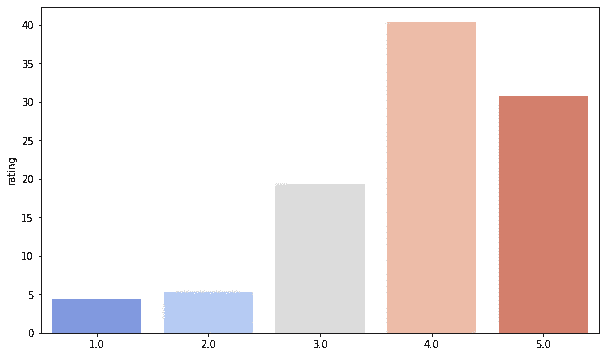

此外，我们可以注意到趋势和以前一样，当人们给 4 星时，他们倾向于写更长的正面和负面评论。

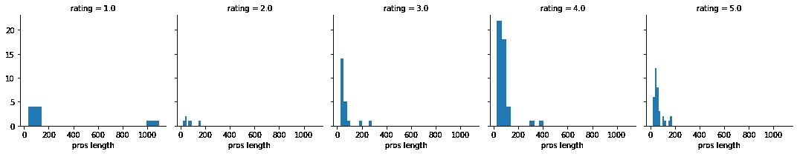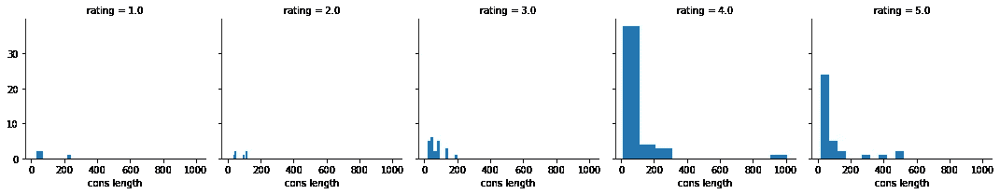

德勤在工作/生活平衡方面的平均得分为 2.3/5，在文化和价值观方面为 3.7/5，在职业机会方面为 4.1/5，而在薪酬和福利方面为 3.6/5，在高管方面为 3.4/5。

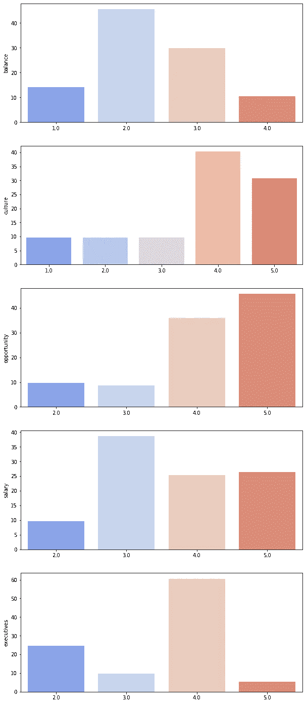

接下来，我们将会看到员工在谈论**积极方面**时经常重复使用的前 35 个词。

列表的顶部如下:

**(成长—环境—字—好—经验—年轻)**

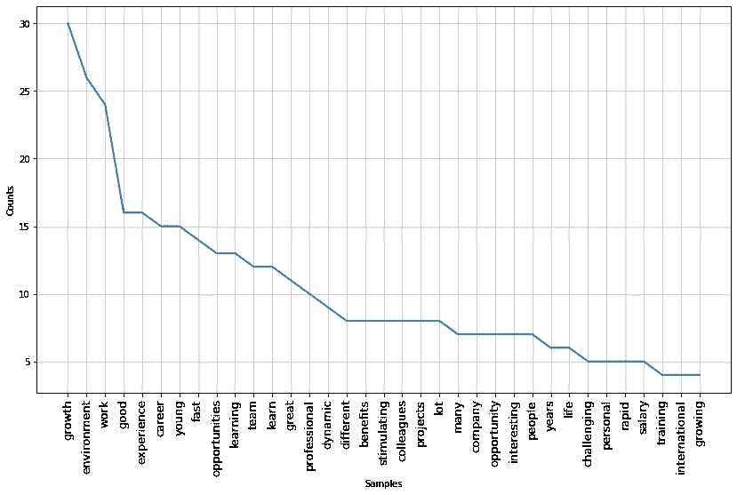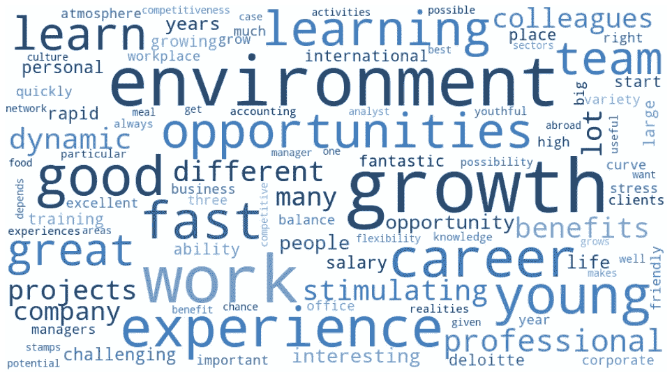

最后但同样重要的是，我们将可视化前 35 个重复和频繁使用的单词**负面**。

列表的顶部如下:

**(工作—时间—平衡—生活—时间)**

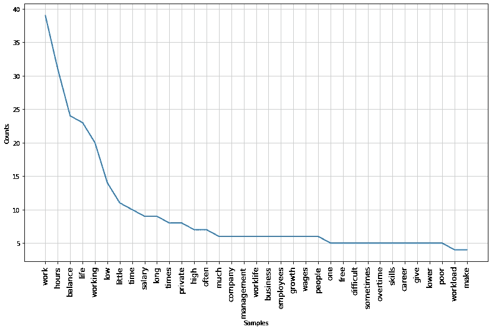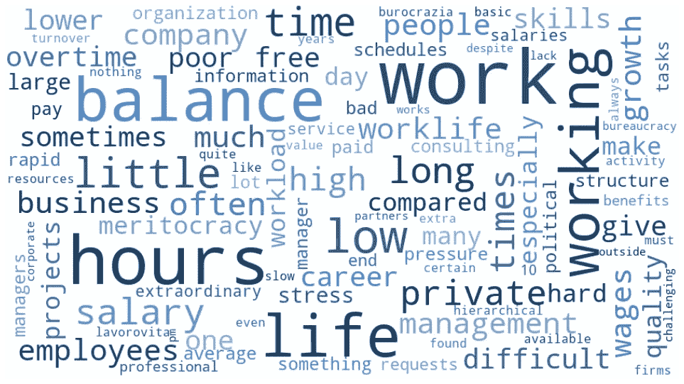

正面评论的示例:

```
"Good career opportunities if you want to climb the corporate ladder""multicultural learning environment rapidly competitiveness precision""Interesting, an inspiring place to start your career and learn as much as possible"
```

负面评论的例子:

```
"Too much unpaid overtime work" "Too many partners to manage, too many events. Conflicts with the marketing division" "unpaid overtime, little interest in resources, little attention to talent, excessive working hours, revaluation of the person depending on the amount of hours worked and not according to the results and capabilities"
```

# 3-埃森哲

埃森哲的总体平均评分为 3.7/5 颗星。

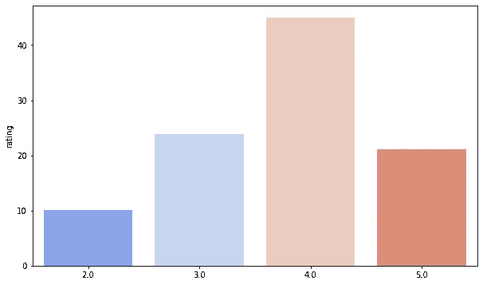

从接下来的数字中，我们可以注意到，当人们给 4 星时，他们倾向于写更长的正面评价，而当他们给 3 星和 4 星时，他们倾向于写更长的负面评价。

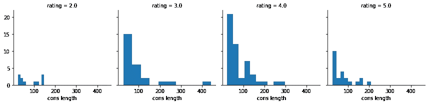

在下图中，我们像之前一样展示评级。埃森哲在工作/生活平衡方面的平均得分为 2.6/5，在文化/价值观和职业机会方面的平均得分为 3.6/5，而在薪酬/福利和高管方面的平均得分为 3.3/5

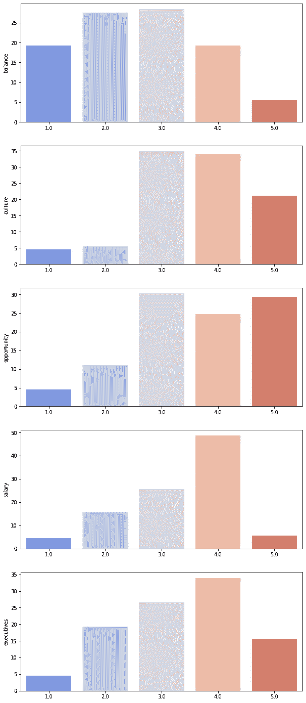

此外，我们可以看到员工在谈论**积极方面**时使用的前 35 个重复和频繁的词。

列表的顶部如下:

**(成长—环境—机会—薪酬—福利)**

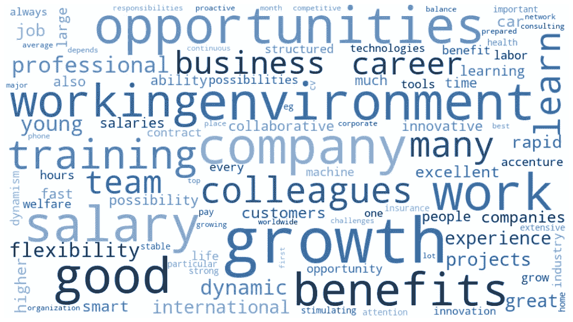

然而，在这一部分，我们将探究员工在谈论**负面**时使用的前 35 个重复和频繁的词。

列表的顶部如下:

**(工作时间——小平衡——压力)**

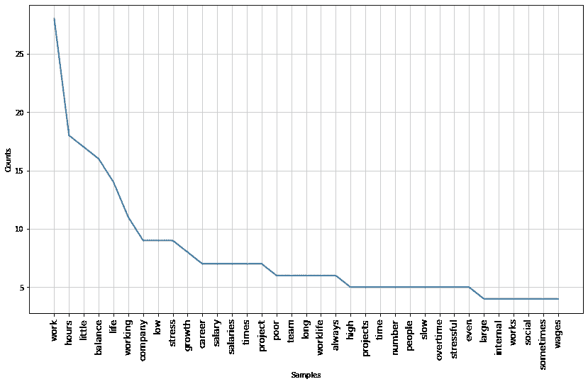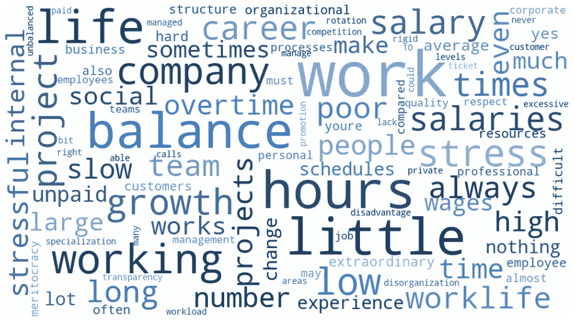

正面评论的示例:

```
"dynamism and growth opportunities, wonderful environment"
"young and dynamic Environment, motivating"
"very rapid growth and learning"
"Great opportunities for growth - Competitive Salary - Core Value"
```

负面评论的例子:

```
"Spaces a bit 'tight compared to the number of employees""General Incompetence - Body rental - No respect for workers' rights - crazy hours - Extraordinary imposed and unpaid - It rewards those who make the soldier 'yes man' who works 10 hours a day rather than who is responsible - You receive orders from above - You must give orders down - They tell a lot of stupid things to customers - professional Growth nothing - Inconsistency between the presentation of the company and the reality"
```

# **结论**

我们可以得出这样的结论:职业机会和工作/生活平衡是我们样本中讨论最多的正面和负面话题。数据显示，普华永道的员工认为他们的薪酬不够高，但他们对高管和职业机会的满意度更高。

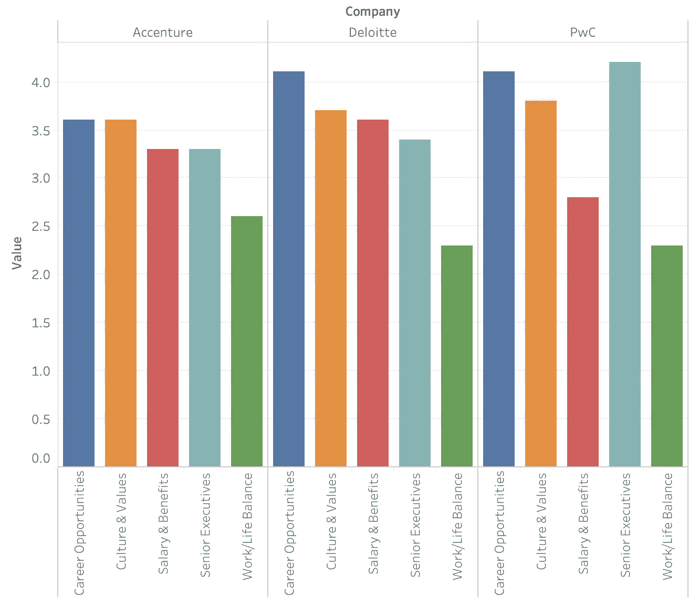

此外，德勤收集的正面和负面词汇数量最多，而埃森哲收集的正面和负面词汇数量最少。

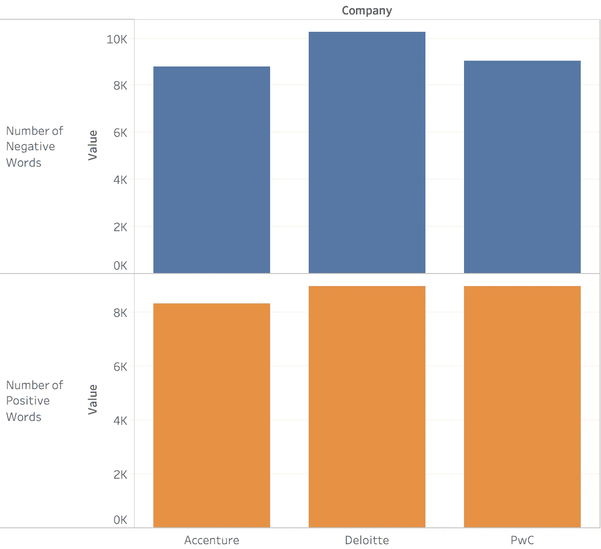

简而言之，我们设法从在线平台获得了文本数据样本，这些样本可以明确地告诉我们，并捕捉员工的需求、偏好、要求和担忧。因此，文本挖掘和自然语言处理可以成为公司内部整合的竞争优势工具，以从员工在线获得有意义的反馈和见解。与企业绩效问卷和调查一起，可以防止让组织处于最有利位置的有偏见的结果。这意味着帮助所有员工在工作中感受到价值感和满足感。当员工感到受到重视时，他们更有可能对组织保持忠诚，从而获得更好的绩效、生产率和收入。