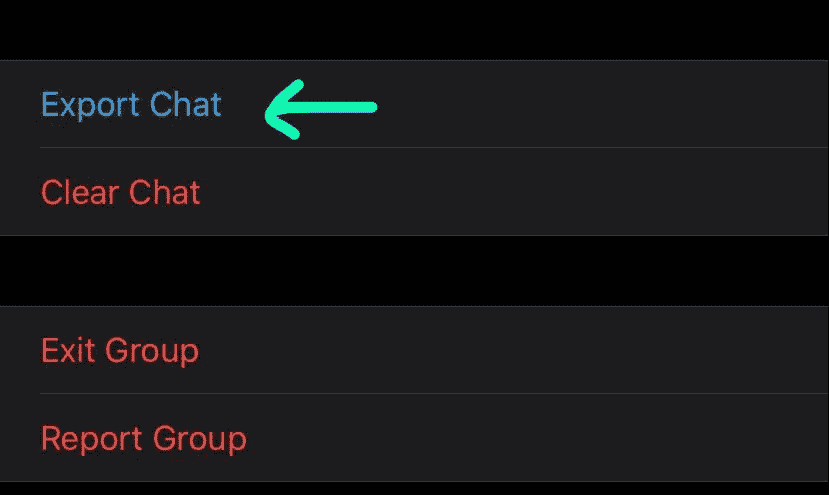
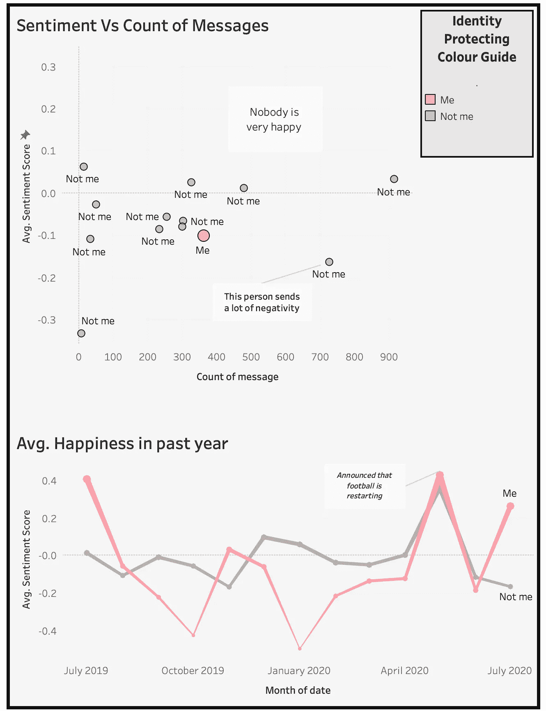

# 你的 WhatsApp 信息告诉你什么是快乐，5 个简单的 Python 步骤

> 原文：<https://towardsdatascience.com/what-your-whatsapp-messages-say-about-your-happiness-in-5-easy-python-steps-26ee2fb52333?source=collection_archive---------44----------------------->

## WhatsApp 聊天情感分析入门指南


齐比克在 [Unsplash](https://unsplash.com?utm_source=medium&utm_medium=referral) 上的照片

在过去的几年里，情感分析和其他形式的自然语言处理变得越来越流行，尤其是 Python。虽然我已经在其他平台上运行情感分析和其他文本分析很多年了，但我想扩大我的学习范围，探索用 Python 来运行它，这是一种我还不太熟悉的语言。

希望这可以作为对情感分析相对陌生的人的指南。

# 5 个步骤

有时有人向我指出，我是一个相当消极的人。不是否定，但我强烈反对。

所以我想我应该测试一下，在我的 WhatsApp 群组对话中进行情绪分析，看看我和朋友/家人在快乐方面相比如何。如果你想“找到自己的幸福”，下面是我采取的步骤:

## 1.提取您的 WhatsApp 对话

这出奇的容易。单击组名并点击导出(如下所示)。它会下载一个 Zip 文件，解压后会给你一个. txt 文件。



## 2.打开 Python 并将 Flair 导入 Python 包

Flair 是由 Zalando Research 开发和开源的自然语言处理(NLP)库。我不会在这里详细介绍，只是说我选择使用它的原因是因为它简单易用，包括随时可用的情感分析。关于为什么它是一个很好的博客，有很多其他的博客。

```
!pip3 install flair
import flair
import pandas as pd
```

## 3.带上。txt 文件转换成 Python 并做一些基本的清理工作

的。txt 文件需要快速解析成单独的列。我只是在这里提取“日期”、“人”和“消息”:

```
***# bring in data and give it header 'text'***
data = pd.read_table('YourPathHere/_chat.txt', names=['text'], header=None)***#get rid of top 2 rows (e.g. "this chat is encrypted" etc.)***
data = data.iloc[3:]
data.head()***# parse the data into the columns 'date', 'person', and 'message'***
data[['date','remaining']] = data['text'].str.split(']',expand=True, n=1)
data[['person','message']] = data['remaining'].str.split(':', n=1, expand=True)data.drop(['text', 'remaining'], axis=1, inplace=True)
data
```

在进行任何情感分析之前，我们都希望去掉任何我们不想向下游传递情感的行。这可能包括任何空值，也可能包括任何简短的响应消息(例如“Ok”、“Lol”或“Thanks”)。此外，为了进行任何时间序列分析，将我们的日期字段转换为实际的日期数据类型是有意义的:

```
***# get rid of all the "image omitted"***
data = data[~data["message"].str.contains("omitted", na=False)]***# remove null rows*** 
data.dropna(inplace=True)***# remove any small messages***
data = data[data['message'].map(len) > 10]***# sort of the date into a proper date column***
data['date'] = data['date'].map(lambda x: x.replace(',',''))
data['date'] = data['date'].map(lambda x: x.strip('['))
data['date'] = pd.to_datetime(data['date'], format="%d/%m/%Y %H:%M:%S", errors='coerce')
data.head()
```

## 4.运行情绪分析

我使用 flair _ perspective . predict()来提供标签，这些标签将告诉我们值是正还是负，以及预测的置信度的 0 到 1 分。

```
sentiment = []
def run_sentiment(a):
    b = flair.data.Sentence(a)
    flair_sentiment.predict(b)
    sentiment.append(b.labels)data['message'].apply(lambda x: run_sentiment(x))
data['sentiment'] = sentiment
```

## 5.想象并理解你的结果

是时候快速看到结果了。你现在可以直接在 Python 中运行可视化，或者像我下面这样进入 Tableau。



# 开心了吗？

显然我不是最消极的。我很激动。

为了方便截图，我在这里“匿名”了一些人的名字，但我个人最喜欢的是分散图左下角的人:他们很少说话，但当他们说话时，这是这个群体收到的最负面的东西。感谢您的参与。

同样明显的是，实际上**我们当中没有人特别积极，这并不令人惊讶。唯一真正的例外是在 5 月，可能是因为这是宣布体育运动再次开始的时候(这是这个小组讨论最多的话题)。**

# 最后的想法

我选择分享这个，因为我在 Python 中找不到太多简单的*情绪分析例子。希望它对其他不熟悉 Python 的人也有用。*

同样，我绝对欢迎任何反馈或提示，以改善这里列出的任何东西。