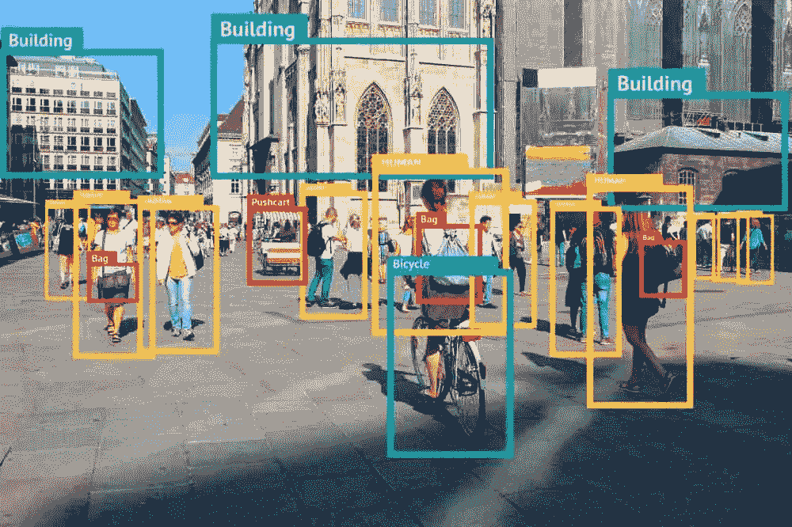

# 你买的不是人工智能:如何区分事实和虚构

> 原文：<https://towardsdatascience.com/what-youre-buying-is-not-ai-how-to-tell-fact-from-fiction-c47f9cd3913?source=collection_archive---------63----------------------->

## “人工智能”这个时髦词被频繁使用。这可能意味着简单的自动化，甚至 excel 公式。你是怎么发现的？

当涉及到人工智能(AI)的产品时，越来越难区分真假。事实上，这很难，约会应用程序现在用假脸来增加他们的数量，广告商甚至用它们来增加广告的多样性。围绕人工智能的这种模糊性范围很广，并且在我们许多人不知道的情况下，进一步蔓延到我们的日常生活中。

对这种生成性媒体的使用既有非法的，也有良性的。

根据处方制作的人造脸——库存照片的商业替代品(来源:[生成的照片](https://generated.photos/)

这些是人工智能在现实世界中帮助伪造的例子。但是，技术提供商一开始试图伪造人工智能解决方案怎么办？

在商界，“人工智能”这个时髦词经常被提起。即使是对技术有基本了解的人也经常把它与简单的自动化、统计测试甚至 excel 公式混为一谈。

研究发现，40%的欧洲人工智能初创公司实际上并不使用人工智能，其中许多公司没有纠正第三方分析网站因围绕该技术的炒作而做出的错误分类。公司秘密使用人类来做人工智能机器人的工作并不罕见。

在这种情况下，当您的组织准备好开始人工智能之旅时，您如何评估技术解决方案？有一些你应该问的标准问题，以确保你得到你所支付的东西。这些准则适用于评估任何“智能”机器学习解决方案，包括人工智能等先进技术。

照片*由*[*inês piment El*](https://unsplash.com/@deadqueenines?utm_source=unsplash&utm_medium=referral&utm_content=creditCopyText)*上*[*Unsplash*](https://unsplash.com/s/photos/unicorn?utm_source=unsplash&utm_medium=referral&utm_content=creditCopyText)*。*

# 真的还是假的 AI？要问的首要问题

所以，你决定扩展你的能力，投资人工智能。问这六个问题可以很好地了解你得到了什么，以及它实际上有多先进。

## 1.它是如何工作的？

首先问一个供应商他们的解决方案到底是如何工作的，为什么它是人工智能的一个例子。很好地理解它如何做它声称要做的事情，并质疑为什么自动化或更简单的技术不够。一家销售人工智能技术的公司应该能够以一种易于理解的方式解释对人工智能的需求以及他们使用的方法。不要担心在这里听起来很幼稚。

有了这个，你就可以开始区分人工智能算法和出色的营销了。例如，一个向客户推荐产品的系统可以建立在简单的商业启发之上，也可以由人工智能驱动。提出试探性的问题必须是你揭开真相的第一步。

## 2.解决方案是否基于数据？

任何人工智能解决方案都需要大量数据。数据使人工智能变得聪明，所以找出哪些数据被用来训练人工智能。例如，Open AI 的 GPT 2 模型具有撰写新闻文章的能力，并在数百万篇维基百科文章上接受了训练，从而赋予它智能。

询问供应商你必须提供什么数据来保持人工智能在使用中的智能。如果没有对数据的强烈需求，这是一个潜在的危险信号。

美国宇航局在 [Unsplash](https://unsplash.com/s/photos/data?utm_source=unsplash&utm_medium=referral&utm_content=creditCopyText) 拍摄的照片

## 3.数据是如何标注的？

对于今天的许多人工智能来说，数据需要以某种格式标记，以便人工智能理解。为了训练人工智能阅读图像并识别属性，获得高质量的图像是不够的。它们必须被仔细标记，以便人工智能从中学习。在面部识别的情况下，人类需要在每个人的脸上画出方框，以首先教会人工智能人脸是什么样子的。

询问 AI 厂商他们如何标记他们的数据，以及当你部署它时，这种标记是否需要继续——这是 AI 是否真正从数据中学习的另一个标志。

来源: [mc.ai](https://mc.ai/a-convolutional-neural-network-tutorial-in-keras-and-tensorflow-2/)

## 4.有没有一个学习的过程？

传统的技术解决方案会以第一次运行程序的方式运行第一百万次。当涉及到人工智能时，解决方案可能会在每次运行数据时进行学习，并根据每次反馈进行调整。

提出问题以了解学习过程和你必须提供的反馈类型。例如，当你在 Gmail 中将一封电子邮件标记为重要时，人工智能会从中学习，以改善未来所有电子邮件的分类。这是一个智能应用程序简单、持续学习的例子。一个不接受这种明确反馈的系统可能终究不是“智能”的。

## 5.应用程序需要什么样的维护？

像人类一样，任何人工智能都需要处于不断改进的状态，才能保持相关性。一个非人工智能的标准技术应用程序将提供预期的功能，几乎不需要维护。然而，真正的人工智能需要学习新数据，并定期调整内部智能。

如果你看不到一个明确的路线图，让智能保持最新或随着时间的推移而改进，那就是一个危险信号。例如，一个准确预测员工流失的人工智能在几个月后就不会那么好了。它需要重新学习员工动态、业务场景和市场条件的变化。

[JESHOOTS.COM](https://unsplash.com/@jeshoots?utm_source=unsplash&utm_medium=referral&utm_content=creditCopyText)在 [Unsplash](https://unsplash.com/s/photos/maintenance?utm_source=unsplash&utm_medium=referral&utm_content=creditCopyText) 上拍照

## 6.我能看一下我公司的现场演示吗？

大多数人工智能演示在精心策划的场景中工作，并作为试点。任何高质量人工智能解决方案的供应商都应该提供他们产品的现场演示，而不仅仅是营销视频。如果他们能拿着你的数据用 AI 解决方案兜一圈就更好了。

例如，一个能够识别选定领域法律文档风险的人工智能解决方案，应该能够证明它能够识别你上传的类似文档的风险。在现场演示解决方案时犹豫不决可能是问题的早期迹象。

来源:[相机陷阱演示](http://cameratraps.eastus.cloudapp.azure.com:8000/)微软人工智能地球& [Gramener](https://gramener.com/)

由于许多公司继续“驾驭人工智能的浪潮”，而没有实际提供人工智能解决方案，因此业务团队自学如何识别真假非常重要。从上面列出的问题开始讲区别，继续加深你对 AI 在实践中是什么样子的认识，以避免落入陷阱。

*这篇文章最初是在 Entrepreneur.com**发表的* [*。增加了插图。标题照片由*](https://www.entrepreneur.com/article/347759) [*埃里克·克鲁尔*](https://unsplash.com/@ekrull?utm_source=unsplash&utm_medium=referral&utm_content=creditCopyText) *上的*[*Unsplash*](https://unsplash.com/?utm_source=unsplash&utm_medium=referral&utm_content=creditCopyText)*。*

*对数据科学感兴趣但不确定从哪里开始？查看我关于* [*的文章，了解何时以及如何组建您的数据科学团队*](/when-and-how-to-build-out-your-data-science-team-157b977e4c31) *。*