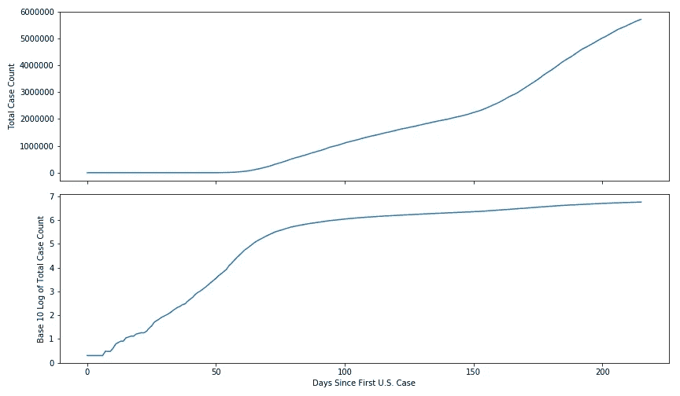
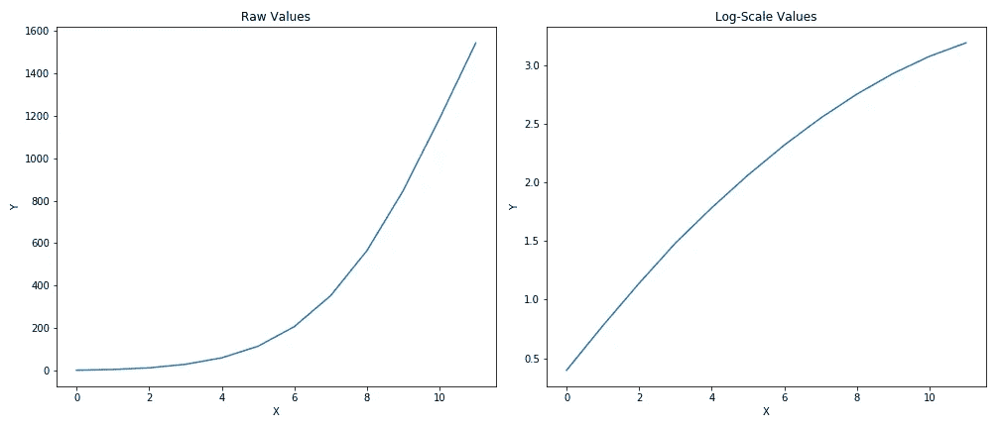
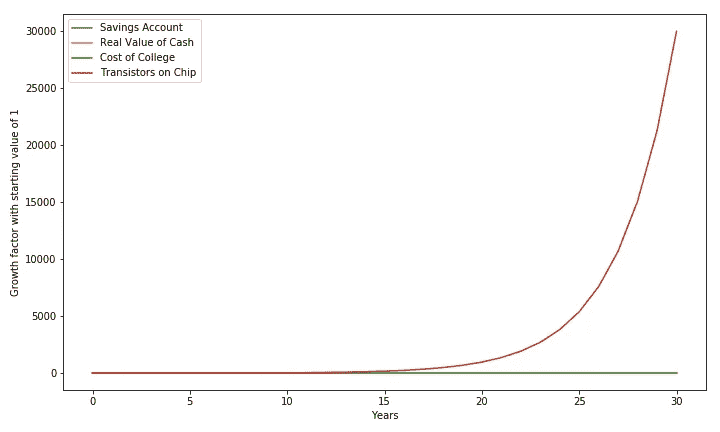
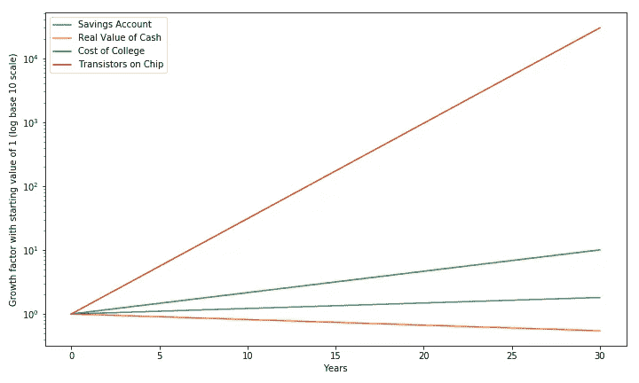
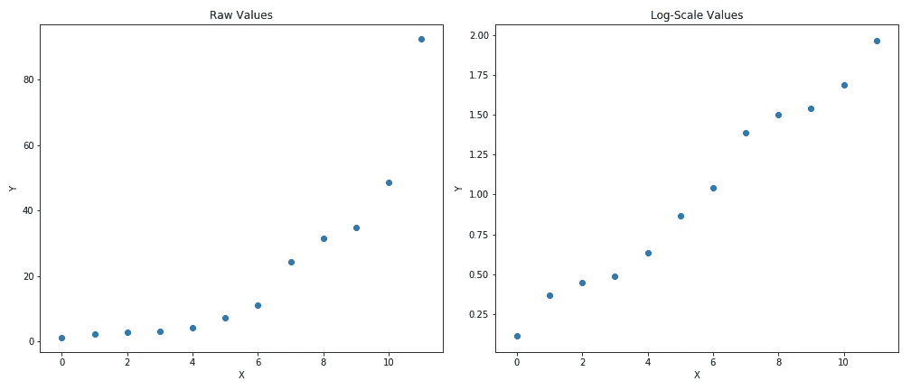

# 对数是什么？

> 原文：<https://towardsdatascience.com/whats-a-logarithm-cca50d031241?source=collection_archive---------3----------------------->


Joel&Jasmin fr estbird 在 [Unsplash](https://unsplash.com?utm_source=medium&utm_medium=referral) 上拍摄的照片

## 我们为什么需要它们？

你可能在高中数学课上学到了它们，然后就再也没想过它们。我承认，直到今天，对数(简称 log)都不是我最好的朋友。它们并不那么直观。但它们真的很有用，所以我学会了勉强接受它们。

# 定义

对数是这样一个问题的答案:我需要将什么样的**次方 x** 应用于以 b 为底的**才能获得数字 y** :

```
log_b(y) = xis another way of specifying the relationship:b^x = y
```

让我们插入一些数字来使这一点更清楚。我们以 10 为基数，所以 b=10。

```
log_10(100) = 2The base-10 logarithm of 100 is 2 because:10^2 = 100
```

基本上就是问我需要多少个 b 相乘才能得到 y，要得到 100，我只需要**把两个 10**相乘。

这实际上是处理乘法序列的一个很好的方法。

```
Assume something is growing at a changing rate denoted by rn. Over 3 years, its total growth rate is:**(1+r1)*(1+r2)*(1+r3)**In log-scale, we would just take the log of the entire thing:
*(I will use log to denote log_10 to simplify notation)*One rule of logs is that *log(A*B*C) = log(A) + log(B) + log(C) so:***log{(1+r1)*(1+r2)*(1+r3)}
= log(1+r1) + log(1+r2) + log(1+r3)**Now let's think about log(1+r1) - it's asking what power do I need to apply to 10 so that it equals (1+r1):
**10^z1 = 1+r1, so log(1+r1) = z1
10^z2 = 1+r2, so log(1+r2) = z2
10^z3 = 1+r3, so log(1+r3) = z3**This allows us to rewrite each term, and the previous equation simplifies to:
**log(1+r1) + log(1+r2) + log(1+r3)
= z1 + z2 + z3****Thus, in log-space, a multiplicative sequence becomes an additive one:
log{(1+r1)*(1+r2)*(1+r3)} = z1 + z2 + z3**
```

# 一个例子

普通的非数学爱好者最有可能在以对数标度绘制的图表上遇到对数。例如，以下是美国新冠肺炎病例总数的对数比例(基数为 10)图:


美国新冠肺炎病例总数的十进制对数

当我看到对数尺度的图表时，我总是要花一秒钟来确定自己的方向。y 轴上的数字是什么意思？当剧情开始变平，趋于平稳，意味着什么？

让我们来看看美国案例总数的原始未记录数据。所以我们可以更容易地进行比较，我在上面的图表中绘制了未记录的数据，在下面的图表中绘制了记录的版本(与前面的图相同)。



原始美国案例总数及其基数为 10 的日志

除了病例在短短 200 多天内从 0 迅速增加到近 600 万以外，我们从顶部副曲线(未记录的数据)中没有收集到太多信息。但我们真正想知道的是感染率是否在下降，使用未记录的数据是不可能知道的。事实上，由于缩放比例(以及开始时未记录的数据的明显平坦性)，一个没有经验的分析师在查看该图表时可能会错误地得出结论，感染率在突然加速之前的前 50 天非常低。

那将与现实完全相反。对数标度的救援。我马上会解释它是如何工作的，但是现在请相信我:

*   对数刻度线斜率的增加意味着感染率在增加。
*   恒定的斜率意味着感染率没有变化。
*   斜率的降低意味着感染率在下降。
*   y 轴是基数的幂。在这种情况下，因为 y 轴是以 10 为底，1 表示 10，2 表示 10，依此类推。

回到我们的图，我们可以看到对数标度图讲述了一个完全不同的故事。在减速前的头 75 天左右，感染率实际上非常高。所以对数可以很快告诉我们某个东西的变化率是在增加(比如汽车加速)，保持不变，还是在减少(逐渐踩下刹车)。让我们再举一个例子，看看对数如何帮助我们更好地观察数据的增长趋势。假设我们的数据以下列高速度增长，但持续下降:

```
rates = [1.5, 1.4, 1.3, 1.2, 1.0, 0.9, 0.8, 0.7, 0.6, 0.5, 0.4, 0.3]
```

从未记录的图(左)来看，我真的不知道增长率是否在下降。但是从对数坐标图(右)来看，增长正在放缓是显而易见的。



日志帮助我们更好地看到增长率的变化

# 我们为什么关心？

对我来说，当我学习数学的时候，我经常缺少的是知道为什么我应该关心一个特定的概念。所以从实际意义上来说，为什么日志很重要呢？

答案是(还有其他的，但这是最实际的一个)日志让我们在处理呈指数增长的事物时有更大的灵活性。与普遍的看法相反，指数增长并不总是像一棵树长到天上一样，它仅仅意味着数据以合理的恒定速率复合(或衰减)。指数增长的一些例子有:

*   储蓄账户。这些天可能没什么回报，但它仍在不断复利。一个年利率为 2%的储蓄账户会在 35 年后让你的钱翻倍(1.02 ⁵ = 2)。这是指数增长，因为为了得到总增长率，我们用 1 加上增长率，再乘以 N 的幂，其中 N 是年数。
*   通货膨胀。相反，每年我们的购买力都会下降 2%(商品和服务价格上涨 2%)。我们的钱，如果不投资，35 年后会贬值 50%(0.98⁵= 0.5)。
*   一个明显的例子是像我们现在这样的疫情。在今年 2 月和 3 月的早期，感染以平均每天 20%的速度增长。因此，有一段时间，我们基本上每 4 天就有一倍的新冠肺炎病例(1.2⁴ = 2.07)！这也是为什么仔细追踪和降低感染率是如此重要的部分原因。
*   大学费用每年增长约 8%。这对于每 9 年翻一番(1.08⁹ = 2)来说是好事。
*   摩尔定律表明，微芯片上的晶体管数量大约每两年翻一番，这意味着年增长率为 41%。

作为一个普普通通的规则，如果我们可以说某样东西每 N 年大约翻一番(或减半)，那么我们就有了指数或复合增长。

为了好玩，让我们先正常地绘制所有这些(除了新冠肺炎，因为它会在图表上爆炸),然后用对数标度。以下是未记录绘图的代码:

```
import numpy as np
import pandas as pd
import matplotlib.pyplot as pltyrs = 30
rates = [0.02, -0.02, 0.08, 0.41]
labels = ['Savings Account', 'Real Value of Cash', 
          'Cost of College', 'Transistors on Chip']
values = []for r in rates:
    temp_list = []
    for y in range(yrs+1):
        temp_list.append((1+r)**y)
    values.append(np.array(temp_list).reshape(-1,1))

ax = pd.DataFrame(np.concatenate(values, axis=1), 
                  columns=labels).plot(figsize=(10,6));
ax.set_ylabel('Growth factor with starting value of 1')
ax.set_xlabel('Years')
plt.tight_layout()
```

剧情不是很有意思。晶体管的生长速度如此之快，以至于其他所有东西看起来都像一条扁平的线。



原始未记录值

让我们看看能否更好地了解对数标度图的情况。要获得 y 轴上的对数标度，我们只需切换 Pandas 绘图方法中的 *logy* 选项(以对数标度绘制 y 轴):

```
ax = pd.DataFrame(np.concatenate(values, axis=1), columns=labels).plot(figsize=(10,6), logy=True);
ax.set_ylabel('Growth factor with starting value of 1 (log base 10 scale)')
ax.set_xlabel('Years')
plt.tight_layout()
```

对数标度图是四条直线。为什么会这样？**简而言之，它们都是直线，因为它们都在以恒定的速度增加(或者在现金实际价值的情况下减少)。**



数值的对数标度图

让我们利用摩尔定律更深入地了解一下，该定律指出，晶体管数量应该以每年 41%的速度增长:

```
 Unlogged          log_10
Year 0:   1 transistor      **0**      <- 10^**0**    = 1
Year 1:   1.41              **0.15**   <- 10^**0.15** = 1.41
Year 2:   1.98              **0.30**   <- 10^**0.30** = 1.98
Year 3:   2.80              **0.45**   <- 10^**0.45** = 2.80
Year 4:   3.95              **0.60**   <- 10^**0.60** = 3.95**Explanation:**We get year 3’s value of 2.80 as 1.41^3.Because 10^0.15 = 1.41, we can reframe this as:**1.41^3 = (10^0.15)*((10^0.15)*(10^0.15)**Now let's take the log of both sides using the rule that:
*log(A*B*C) = log(A) + log(B) + log(C)*We get:
*(I will use log to denote log_10 to simplify notation)* **log(1.41^3) = log{(10^0.15)*((10^0.15)*(10^0.15)}
log(1.41^3) = log(10^0.15) + log(10^0.15) + log(10^0.15)**Recall log(10^0.15) asks what power do I need to apply to 10 in order to get the value in the parentheses, 10^0.15? Obviously the answer is 0.15.So the previous equation simplifies to:
**log(1.41^3) = 0.15 + 0.15 + 0.15 
log(1.41^3) = 0.45**Thus, something growing 41% a year, would in log-scale (with a base of 10), would grow by adding 0.15 a year like so:**0, 0.15, 0.30, 0.45, 0.60**And to get the actual unlogged values, you just apply these values as powers to the base:**10^0, 10^0.15, 10^0.30, 10^0.45, 10^0.60**
```

# 对数使指数数据线性化

对数允许我们将乘法(也称为复合)序列转换成加法序列。除了使指数数据的图表更容易解释之外，这还有另一个真正有用的应用——线性回归。线性回归的要求之一是因变量和自变量之间的关系必须是线性的。让我们制作一些假数据来形象化地说明这一点:

```
rates = [0.3, 0.8, 0.2, 0.1, 0.4, 0.7, 0.5, 1.2, 0.3, 0.1, 0.4, 0.9]
x = [i for i in range(len(rates))]
y = (np.array(rates)+1).cumprod()
fig, (ax1, ax2) = plt.subplots(1,2,figsize=(14,6), sharex='all')
ax1.scatter(x, y);
ax1.set_xlabel('X');
ax1.set_ylabel('Y');
ax1.set_title('Raw Values');
ax2.scatter(x, np.log10(y));
ax2.set_xlabel('X');
ax2.set_ylabel('Y');
ax2.set_title('Log-Scale Values');
plt.tight_layout()
```

我们的 y 变量以非常高的速度增长。尽管比率不同，但似乎 x 越大，y 的增加速度越快。因为左侧曲线的斜率在变化(并且在增加)，所以 y 和 x 不具有线性关系。所以线性回归是行不通的。



原始值与记录值

但是一旦我们应用对数(以 10 为底)，我们就得到右边的图。对我来说这看起来很线性。指数数据是指数数据，因为对于每个时间步长(假设时间序列)，当前值会乘以某个值:

```
At time step 1, y is: x^1At time step 2, y is: x^2At time step 3, y is: x^3
```

所以在 y 和 x 之间有一个指数关系。但是注意在 y 和应用于 x 的指数之间有一个**线性关系。取对数(让我们作弊，使用基数 x)得到指数:**

```
At time step 1: log(x^1) = 1At time step 2: log(x^2) = 2At time step 3: log(x^3) = 3
```

现在我们有了 log(y)和 x 之间的线性关系，这是线性回归所需要的。

# 结论

这就是所有的人。日志是数学不可或缺的一部分，这篇文章仅仅触及了它们有用的表面。但希望读完这篇文章后，你不再觉得它们可怕，并鼓励你在日常工作中使用它们！干杯！