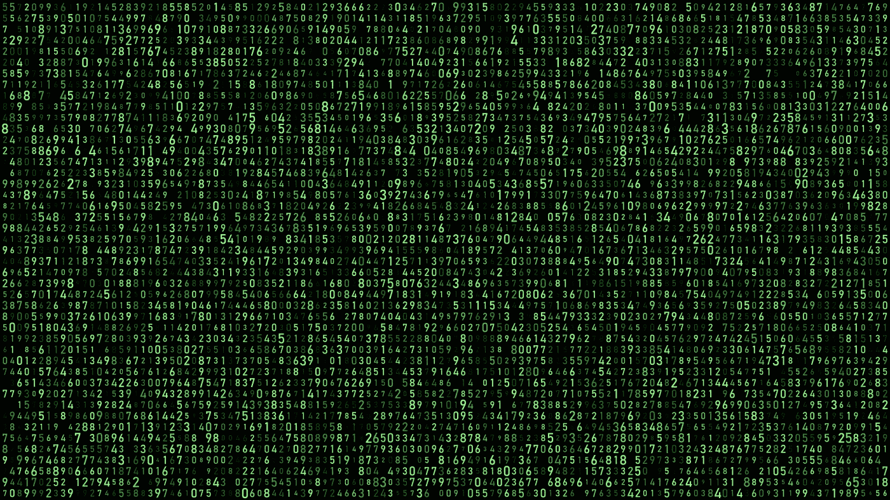
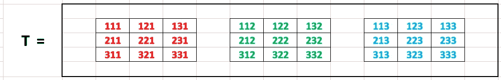
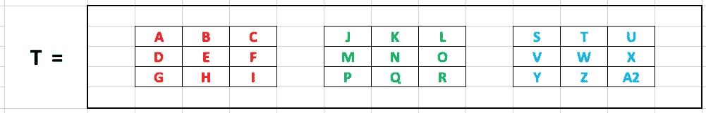

# 什么是张量？

> 原文：<https://towardsdatascience.com/whats-a-tensor-e5525149cba3?source=collection_archive---------25----------------------->

## 打开通用数据科学结构的包装



从 Adobe Stock 获得许可的图像

张量的概念是由两位意大利数学家 Tullio Levi-Civita 和 Gregorio Ricci-Curbastro 在 1900 年创立的，并且，正如通常所见，他们是建立在其他数学家的工作基础上的。维基百科关于“张量”的页面是这样开始的:

> [在数学中，**张量**是描述与向量空间相关的代数对象集之间的(多线性)关系的代数对象。](https://en.wikipedia.org/wiki/Tensor)

对于非数学家来说，要解开的东西太多了！

幸运的是，在实际意义上掌握张量是什么以及我们如何在数据科学中操纵它们要容易得多。

我发现把张量想象成嵌套的数字“列表”很有帮助，可以有任意数量的“层次”另一种形象化的方法是想象 Excel 电子表格中的每个单元格都包含另一个完整电子表格中的所有内容。然后，在第二个电子表格中，每个单元格都链接到另一个完整的电子表格，依此类推。每个电子表格都可以被视为一个额外的“维度”

“一阶”张量只有一维。在计算机科学中，这将被称为“向量”，一个有序的数字列表。“二阶”张量是一个矩阵，像 Excel 电子表格一样，有两个维度。随着维度的增加，我们可以将这些信息想象成嵌套在数组中的向量、矩阵或数组，具有任意数量的维度( *n 维*)。

三阶张量可能是这样表示的:



可视化三阶张量

三组“顶级”值中的每一组都用不同的颜色表示。在本例中，每个值的数字对应于该值在整个数据结构中的特定位置。每个值最右边的数字对应于它所属的顶级组。所有红色的值都在顶级组 1 中，绿色的值在组 2 中，红色的值在组 3 中。

每个顶级组中都有一个矩阵(二维)。每个值最左边的数字对应于它所在的“行”，中间的数字对应于它所在的“列”通过这种方式，所有值的顺序得以保持，并允许我们使用其他向量、矩阵或数组对整个结构执行计算。

这是相同的结构，用不同的信息可视化:



三阶张量

每个字母代表结构中的一个独特位置，使用相同的颜色编码来区分顶级矩阵。

使用三维立方体可以实现更复杂的可视化。立方体的每个垂直层将包含来自这些“顶级”组之一的数据，创建一个具有 27 个唯一“位置”的 3x3x3 立方体但是一旦我们超越了三维，我们用图形来形象化张量的能力就失效了。

由于这一限制，让我们来看看如何使用计算机软件对相同的数据进行编码。使用 Python 和 Numpy，我们可以用第一个例子中的数字数据创建一个数组:

```
from numpy import arrayT = array([[[111,121,131], [211,221,231], [311,321,331]],[[112,122,132], [212,222,232], [312,322,332]],[[113,123,133], [213,223,233], [313,323,333]],])
```

以这种方式对数据进行编码使得拥有任意数量的维度成为可能，这在我们拥有大量复杂数据时具有巨大的价值！

我希望这有助于解释为什么，至少在数据科学中，张量可以被认为是“嵌套”数组。

在以后的文章中，我将讨论“基于元素的”加法、减法、乘法、除法等。以及“Hadamard 积”和“张量积”之间的区别——一个需要相同维数的张量，一个不需要。

互联网上有很多关于数据科学教育的资源。以下是我更喜欢的一些资源:

*   杰森·布朗利的《机器学习大师》
*   [免费神经网络入门课程](https://www.manning.com/livevideo/3blue1brown-neural-networks)，由 3Blue1Brown 提供
*   [熨斗学校](https://flatironschool.com/)(付费项目)

我乐观地认为，人工智能将越来越多地被用来让我们所有人的生活变得更好。您是否面临数据科学问题/挑战？我很乐意帮忙；我们连线吧！

感谢阅读！