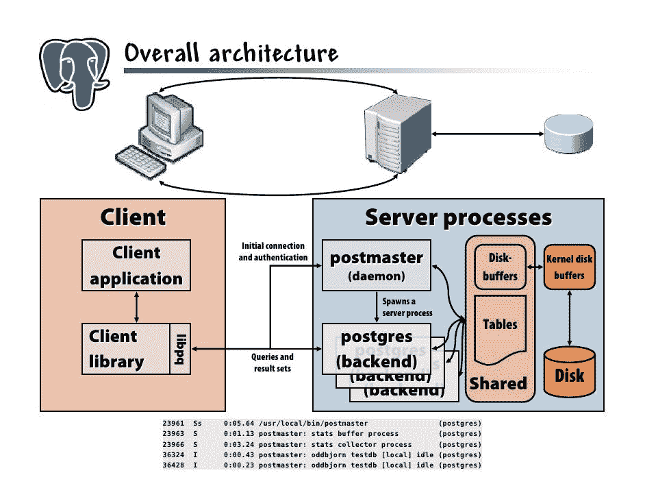
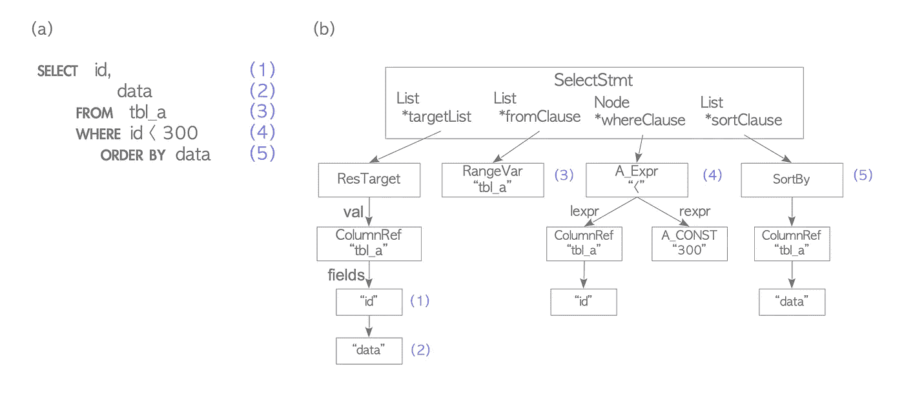
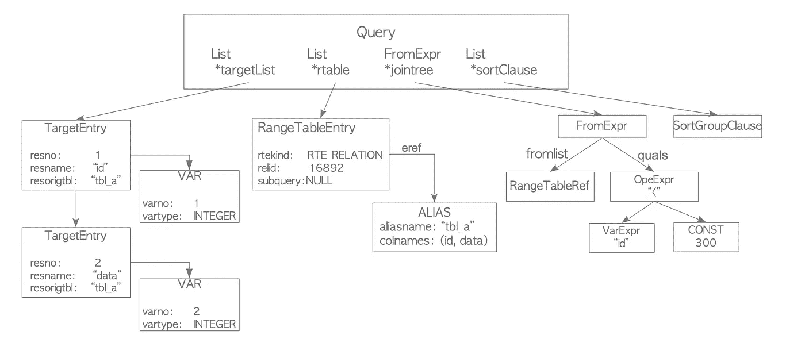
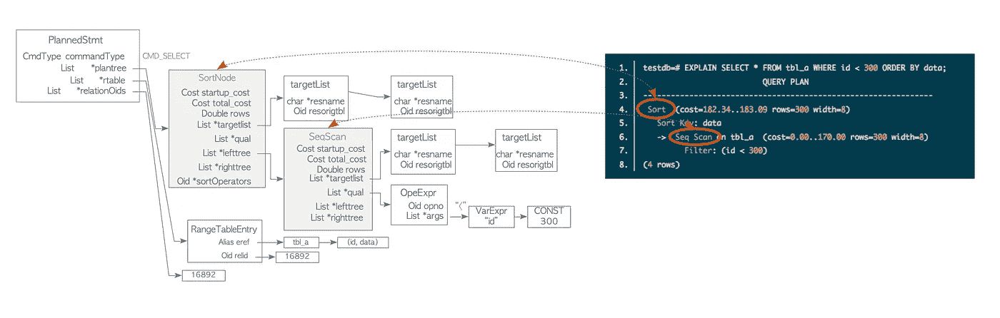
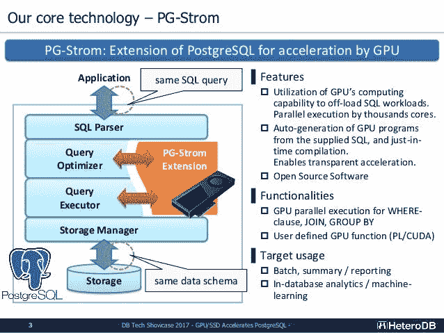
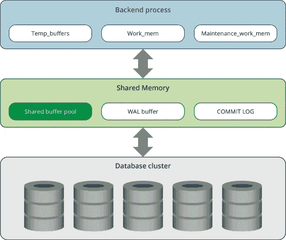

# 一个简单的 SQL 查询背后是什么？

> 原文：<https://towardsdatascience.com/whats-behind-a-simple-sql-query-c78e3ded8321?source=collection_archive---------9----------------------->

## 简要回顾一下当应用程序/开发人员运行 SQL 查询从 PostgresDB 数据库获取数据时会发生什么。


肉从哪里来？照片由[弗拉德·chețan](https://www.pexels.com/@chetanvlad?utm_content=attributionCopyText&utm_medium=referral&utm_source=pexels)从[佩克斯](https://www.pexels.com/photo/photo-of-herd-of-cattle-on-road-2600277/?utm_content=attributionCopyText&utm_medium=referral&utm_source=pexels)拍摄

就像现在大多数孩子似乎不知道他们的肉来自哪里(提示:不是长在树上，而是可能来自实验室)或者为什么天空是蓝色的(提示:蓝光的波长更短、更小)，数量惊人的开发人员不(真的)知道他们的数据来自哪里以及如何处理和存储。这篇文章应该是工程师理解其工作原理的起点。不管营销人员试图教给你什么样的框架和无代码平台，这都是一件非常好的事情。尤其是如果数据真的是新的石油(显然这已经持续了几年)，看看数据库是如何工作的可能会有回报。

*免责声明:这不是 SQL 教程*

简单的 SQL 语句直接从名为 users 的数据库中获取所有用户:

*免责声明 2:重点不在于编写花哨的 SQL 语句，而是展示一旦您这样做了会发生什么*

```
SELECT * FROM users;
```

那么，有多少人真正知道在 psql 终端中按下 enter 键和返回结果之间发生了什么？

## 基本原则

为了理解这一点，我们必须从头开始——PostgresDB 的架构。

归根结底，它是一个用 C++编写的客户机/服务器应用程序。客户是任何访问数据库的人，比如你的 psql 终端，你的 Lambda 函数，JDBC 驱动等等。服务器是 PGDB 后端，它接受你的请求，存储数据等等。

下面是 PostgresDB 的基本架构概述，整篇文章都会详细介绍:



这是一种老派，但仍然有效:)来源:[幻灯片分享](https://www.slideshare.net/oddbjorn/Get-to-know-PostgreSQL)

## 查询的路径

在 PostgresDB 官方文档中有一个关于“查询路径”的很好的概述。以下是你应该知道的:

**1。建立连接，发送查询&等待结果**

PGDB 可以同时处理多个连接(通过“postmaster”，参见架构)，并且对于每个连接，它派生一个新的进程(“postgres”，参见架构)来处理该连接的请求(例如 SQL 语句)。换句话说，这是一个简单的“每个用户一个进程”的客户机/服务器模型。邮局主管处理初始连接和身份验证，然后将该连接移交给新的 postgres 进程。这些进程通过共享内存和信号量相互通信，以确保即使在并发连接的情况下整体数据的完整性(还记得 ACID 吗？)

**2。解析查询**

这包括两个阶段:

*   解析:PGDB 解析器利用 UNIX 工具 bison 和 flex 作为[解析器和 lexer](https://stackoverflow.com/a/2852716) 来验证传入的查询字符串(ASCII 文本)是否是有效的 SQL 查询。这只能通过关于 SQL 语法的固定规则来完成，而不需要了解查询字符串的底层语义。输出是一个解析树:



SELECT 语句的解析树示例。来源: [interdb.jp](http://www.interdb.jp/pg/pgsql03.html)

*   转换:使用解析器树构建查询树，查询树包含查询的语义解释，例如引用了哪些表、数据类型、运算符和函数。查询树的根是这里定义的查询数据结构。输出:



同样的例子，查询树作为输出。来源: [interdb.jp](http://www.interdb.jp/pg/pgsql03.html)

深入查询:

*   targetList:保存查询的输出及其数据类型，在本例中是列 id 和 data，它们都是整数
*   rtable:保存对表的引用
*   jointree:保存 FROM 和 WHERE 操作符
*   sortClause:保存数据应该如何排序

直接来自官方文件的重要说明:

*将原始解析与语义分析分开的原因是系统目录查找只能在事务中完成，我们不希望在收到查询字符串时立即启动事务。原始解析阶段足以识别事务控制命令(BEGIN、ROLLBACK 等)，然后这些命令可以被正确执行，而无需任何进一步的分析。一旦我们知道我们正在处理一个实际的查询(比如 SELECT 或 UPDATE)，如果我们还没有在一个事务中，就可以开始一个事务。只有这样才能调用转换过程。*

**3。重写**

PGDB 的重写系统使用查询树作为输入，并基于存储在其系统目录中的规则执行转换，这些规则可以应用于查询树。输出也是一个查询树。一个很好的例子是视图(虚拟表)的实现，其中重写系统重写用户查询以访问视图定义中的原始表，而不是视图的别名。

关于规则系统如何为视图工作的综合例子可以在[这里](https://www.postgresql.org/docs/9.1/rules-views.html)找到。

**4。查询计划**

*计划器/优化器*使用上一步重写的查询树为查询创建最佳/最便宜(=最快/最有效)的执行计划——查询计划。优化器会寻找所有可能的路径来执行查询。除非该语句有大量超过 [geqo_treshold](https://www.postgresql.org/docs/9.1/runtime-config-query.html#GUC-GEQO-THRESHOLD) 的连接，在这种情况下查看所有可能性在计算上是不可行的。在这种情况下，使用通用查询优化器[来代替。](https://www.postgresql.org/docs/9.1/geqo.html)



查询计划/计划树的示例相同。来源: [interdb.jp](http://www.interdb.jp/pg/pgsql03.html)

上图中的例子显示了一个简单的例子，其中执行器必须对表 tbl_a 进行顺序扫描，然后进行排序。

您可以通过在查询前键入 EXPLAIN 来检查您的查询计划:

```
EXPLAIN SELECT (...)
```

**5。遗嘱执行人**

官方文件尽可能清楚地解释了这一点:

*执行器递归地遍历计划树，并以计划表示的方式检索行。执行器在扫描关系时使用存储系统，执行排序和连接，评估资格，最后返回派生的行。*

执行器用于评估所有 4 种基本 SQL 查询类型选择、插入、删除和更新。您可以在这里找到每个查询类型[的执行者步骤的更多细节。](https://www.postgresql.org/docs/9.1/executor.html)

**奖励:GPU 加速**

实际上有类似 [PG Strom](https://heterodb.github.io/pg-strom/) 的工具用于 GPU 加速，特别是针对查询优化器和执行器，如下图所示:



又是那种老派，但是有什么不喜欢的呢？:)来源: [SlideShare](https://www.slideshare.net/kaigai/gpussd-accelerates-postgresql-challenge-towards-query-processing-throughput-10gbs)

这篇文章没有测试过这一点，但它可能会启发你去看看有什么，因为这似乎是一项非常酷的技术。

## 记忆

好的。现在您知道了(1)当您连接到 PGDB 实例时会发生什么，以及(SQL 查询是如何被解析、优化和执行的。唯一缺少的是数据如何存储，以涵盖现代数据库如何工作的(非常)基础。

**鉴于 PostgresDB 的历史，你可以对“现代”持保留态度，但它仍然被广泛使用，是当今使用的主要关系数据库之一。*

这个题目[这里](https://severalnines.com/database-blog/architecture-and-tuning-memory-postgresql-databases)有很大的解释，所以下面只是简单总结一下。



PostgresDB 内存架构的(非常)高级概述。来源:[severalnines.com](https://severalnines.com/database-blog/architecture-and-tuning-memory-postgresql-databases)

有两种类型的内存:

**1。本地存储器**

它由每个 postgres 后端进程使用。该内存由每个进程分配，用于查询处理，包括:

*   temp_buffers:由执行器存储临时表
*   work_mem:由执行程序用于连接等。
*   maintenance_work_mem:像 REINDEX 这样的维护操作

**2。共享内存**

它是在 PGDB 服务器启动时分配的，所有后端进程都使用它来确保数据完整性(还记得文章的开头吗？)这也是后端进程与之接口的内存—它通常不直接与持久性存储接口。该共享存储器包括:

*   共享缓冲池:表和索引中的页面被加载到的地方
*   WAL buffer: Postgres 有一个预写日志，即事务性日志，确保不会因为服务器故障而丢失数据。WAL 数据在传输到持久存储之前存储在 WAL 缓冲区中。
*   提交日志:保存所有事务状态，作为并发控制机制的一部分

您可以调整这些值以及分配给它们的内存量，以提高数据库的性能。关于存储器各部分实用程序的更多信息可在[这里](https://pgadminedb.readthedocs.io/en/latest/module_02/)找到。

## 整合/持久存储怎么样？

最后会怎么样？数据是如何持久化的？执行器可以通过缓冲区管理器读取/写入数据库中的表和索引，缓冲区管理器可以通过将数据添加到共享缓冲池来访问持久存储中的数据。

## 摘要

到目前为止，您应该对最流行的数据库之一的内部工作原理有了基本的了解！在一天结束的时候，你只是在和一个非常智能的 C++应用程序交互——这多酷啊？希望这能消除一些“数据库很复杂”的污名。也许它甚至会启发你更深入地挖掘，并了解如何通过更好地理解如何存储数据来优化应用程序——这是现代软件工程中最大的瓶颈之一。

来源:

*   2020 年 8 月 5 日，https://www.postgresql.org/docs/9.1
*   2020 年 8 月 5 日，http://www.interdb.jp/pg/pgsql08.html
*   2020 年 8 月 5 日，http://www.interdb.jp/pg/pgsql03.html
*   2020 年 8 月 5 日，https://www.slideshare.net/oddbjorn/Get-to-know-PostgreSQL
*   [https://www . slide share . net/kaigai/gpussd-accelerates-PostgreSQL-challenge-forward-query-processing-throughput-10g bs](https://www.slideshare.net/kaigai/gpussd-accelerates-postgresql-challenge-towards-query-processing-throughput-10gbs)，05.08.2020