# 76 人的客场之旅背后是什么？

> 原文：<https://towardsdatascience.com/whats-behind-the-76ers-road-woes-939a3d9a78c2?source=collection_archive---------23----------------------->

## NBA 历史上最糟糕的主场比赛背后的理论分析。

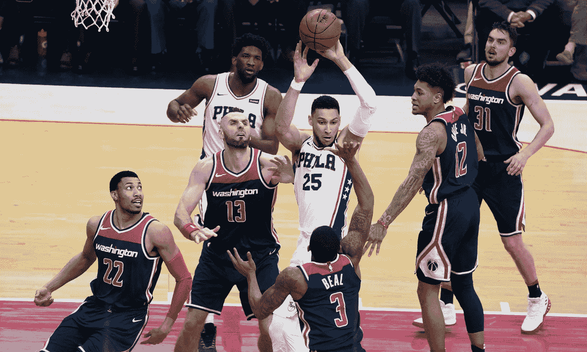

76 人有望成为 NBA 历史上唯一一支至少赢得 90%主场比赛，输掉超过 2/3 客场比赛的球队。没人知道为什么。[本·西蒙斯](https://www.flickr.com/photos/keithallison/38682036240/)([CC BY-SA 2.0](https://creativecommons.org/licenses/by-sa/2.0/))BY[KA 体育照片](https://www.flickr.com/people/keithallison/)

费城 76 人队在主场度过了一个伟大的赛季。NBA 球队在费城南部比赛时的战绩是 28 胜 2 负，胜率为 93%，而在客场比赛时的战绩是 9 胜 23 负，胜率仅为 30%。这 63 个百分点的主客场差距使他们成为 NBA 历史上唯一一支至少赢得 90%主场比赛而输掉超过 2/3 客场比赛的球队。

如何解释这种差异？有据可查，NBA 的[主场优势效应是美国四大职业体育联盟常规赛中最大的](https://statsbylopez.netlify.com/post/playing-at-home/)，在[胜率约 60%](https://fivethirtyeight.com/features/a-home-playoff-game-is-a-big-advantage-unless-you-play-hockey/) 。本赛季 60 场比赛后，76 人 93%的主场胜率显然是一个异常值，但他们糟糕的客场表现引发了一个问题:为什么他们在客场表现如此糟糕？

在过去一周的体育分析播客[的](https://twitter.com/WMoneyball)[一集中，统计学和营销学教授凯德·梅西、谢恩·詹森、阿迪·韦纳和埃里克·布拉德洛讨论了 76 人队主场大比分失利的潜在理论(从](https://podcasts.apple.com/us/podcast/the-wharton-moneyball-post-game-podcast/id1159695411?i=1000466758383) [17:35](https://podcasts.apple.com/us/podcast/the-wharton-moneyball-post-game-podcast/id1159695411?i=1000466758383) 开始):

> 阿迪·韦纳(AW): 这是有史以来最大的差距之一……【他们的主场优势】难以置信的不同！…超过四个标准误差，太荒谬了！…我不知道这实际上是不是史无前例的，但就概率而言，我没想到会发生这种事，也许以前有过一次？…
> 
> *凯德·梅西(CM):* 那么，这说明了车队的什么？
> 
> *AW:* 这就是其中的奥秘！
> 
> *CM:* 当情况如此严峻时，不可能…我们不可能没有洞察力…
> 
> 肖恩·詹森(SJ): 他们显然是在偷标语，伙计们！..
> 
> 我会猜测，这只是一个完整的，没有受过教育的，但可能是正确的猜测，它与谁在玩以及他们实际上是如何玩的结构有关。我认为篮球是最容易受努力影响的运动…在三巨头中…在篮球中，我们可以看到当明星们想上场时，他们就变成了不同的球员！…
> 
> *SJ:* 几周前在《运动》杂志上写了一篇非常有趣的关于负荷管理的文章，当然在篮球领域，我们只是把它作为常规赛的一部分，因为负荷管理是一个巨大的战略…
> 
> *AW:* 我猜负荷管理在某种程度上与 76 人的主场优势有关，因为他们的球星在主场比赛，而我*打赌*他们不会在客场比赛…
> 
> SJ:这是一个至少可以很容易分析的问题，他们是不是在做一种极端版本的负载管理，他们只是在家里不成比例地发挥他们的明星…
> 
> 很想知道比赛的时间是多少，主客场平分……
> 
> *AW:* 还要努力！…
> 
> SJ:……负载管理促使我们让更好的球员在主场比赛，而不是在客场比赛……

总而言之，主持人提出了三种理论:

1.  76 人的明星球员在客场的上场时间更少。
2.  76 人的球员在客场花费的精力更少。
3.  六代移民在作弊。

在这篇文章的剩余部分，我将评估前两个理论，使用来自 NBA.com/stats 的数据来看看这些理论是否有效。显然，最后一个理论是对最近发生的[休斯顿太空人队偷牌丑闻](https://en.wikipedia.org/wiki/Houston_Astros_sign_stealing_scandal)的半开玩笑的引用，现在我将让其他人根据需要进行评估！

相反，我将评估我自己的第三个不同的理论:

3.76 人在客场的对手比他们在主场遇到的对手要强大得多。

用于以下分析的数据是从 3 月 1 日周日中午的 NBA.com/stats 收集的，当时 76 人的总战绩为 37 胜 23 负，主场 28 胜 2 负，客场 9 胜 23 负。

分别从[Basketball-Reference.com](https://www.basketball-reference.com/leagues/NBA_2020_games-october.html)和[五三八](https://projects.fivethirtyeight.com/2020-nba-predictions/games)同时收集历史进度和强度进度数据。

# 理论 1:76 人的明星球员在客场的上场时间更少

为了确定 76 人队是否正在部署一个极端版本的负荷管理，让他们的明星球员在路上休息，但在主场比赛，我首先看了看主场和客场比赛时间的差异:

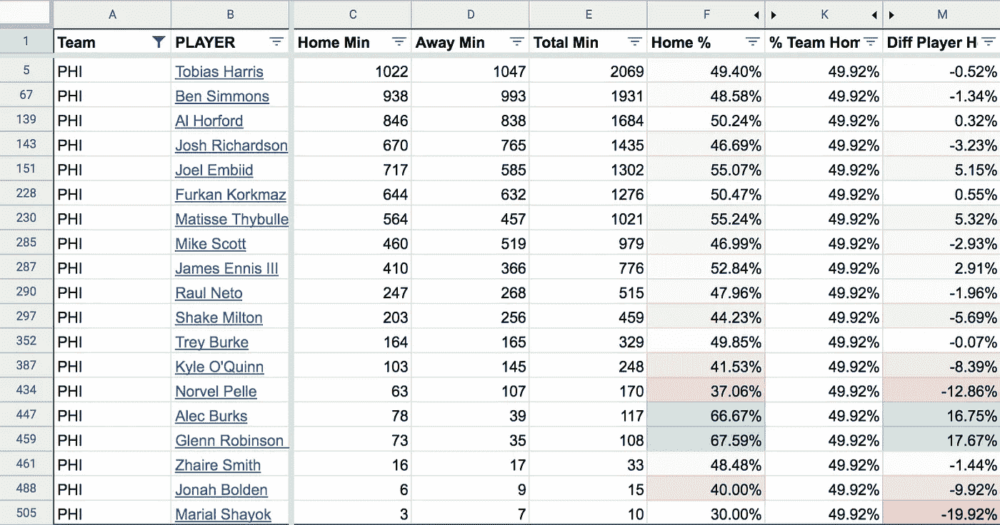

比较每个 76 人球员主客场上场时间，按上场时间排序。[数据](https://docs.google.com/spreadsheets/d/16UWNnufdC0rl3LCR3pmyNOjGDFeodjgMDu8aI8FuB8U/edit#gid=1123310593)。

在总共出场超过 1000 分钟的 76 人队中，只有两名球员，乔尔·恩比德和马蒂斯·蒂布尔，在主场的出场时间明显多于客场。他们都有大约 55%的时间是在主场而不是在客场。

其他关键球员，像本·西蒙斯和约什·理查德森，实际上更多的时间是在客场，分别只有 48.6%和 46.7%的时间在主场比赛。

平均来说，76 人是不是主场打球星多，客场打球星少？为了确定主场-客场比赛时间差对特定球队的整体影响，我计算了每支球队的分数，对主场比赛多于客场比赛的球员，这一分数会向上调整总得分。如果团队为他们的明星部署这种形式的极端负载管理，我们会在他们调整后的幻想点中看到差异。

举个例子:相对于球队 49.92%的主场率，乔尔·恩比德 55.07%的时间都在主场比赛。*因此，恩比德在主场的表现比预期高出 5.15 个百分点。为了权衡他的主场比赛时间不平衡的影响，我根据他在主场比赛的额外时间调整了他今年的 1，963.2 分。1963.2 *(1+5.15%)=调整后分数 2064.3。为了确定这种加权的绝对效果，我从他调整后的幻想总点数(2，064.3)中减去他的实际幻想总点数(1，963.2)，得到 101.1 点的差值。

**注:76 人实际上有 50%的时间在主场比赛，但由于某种原因，* [*总的球员主场出场时间*](https://stats.nba.com/players/traditional/?sort=PTS&dir=-1&Season=2019-20&SeasonType=Regular%20Season&Location=Home&TeamID=1610612755&PerMode=Totals) *不等于* [*总的客场出场时间*](https://stats.nba.com/players/traditional/?sort=PTS&dir=-1&Season=2019-20&SeasonType=Regular%20Season&Location=Road&TeamID=1610612755&PerMode=Totals) *。为了说明这种差异，当比较*球员*主客场分钟和*球队*主客场分钟时，我将同一球队球员的分钟相加，而不是使用* [*报告的球队统计数据*](https://stats.nba.com/teams/traditional/?sort=W_PCT&dir=-1&Season=2019-20&SeasonType=Regular%20Season&PerMode=Totals) *。*

恩比德的幻想总得分和他调整后的幻想总得分之间的差异，我称之为他的**“主场偏差得分”**，在现实中没有任何意义，但确实给了我们一种感觉，如果我们怀疑一支球队在客场让明星球员休息，他在主场比赛的不平衡应该给予多少权重。

对于每个本赛季在 76 人队打球的球员来说，我们可以看到让那个球员在客场休息的效果。恩比德是客场休息的最大受益者，但在某种程度上被其他首发西蒙斯、哈里斯和理查德森抵消了，他们在主场的比赛比客场少:

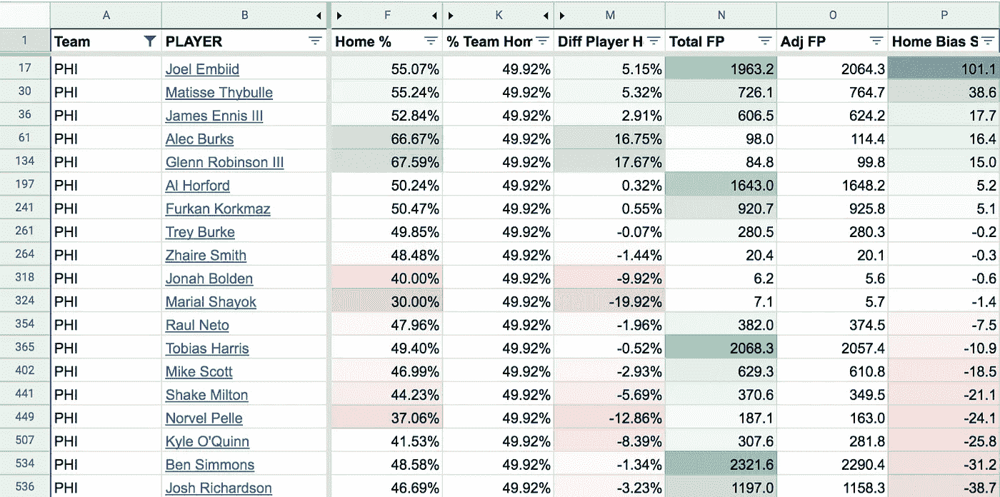

根据主场得分给每个球员排名。[数据](https://docs.google.com/spreadsheets/d/16UWNnufdC0rl3LCR3pmyNOjGDFeodjgMDu8aI8FuB8U/edit#gid=1123310593)。

通过合计所有球员的得分，我们看到 76 人只是略微倾向于让他们的球星更多地在主场比赛，在其他球队中排名中间:

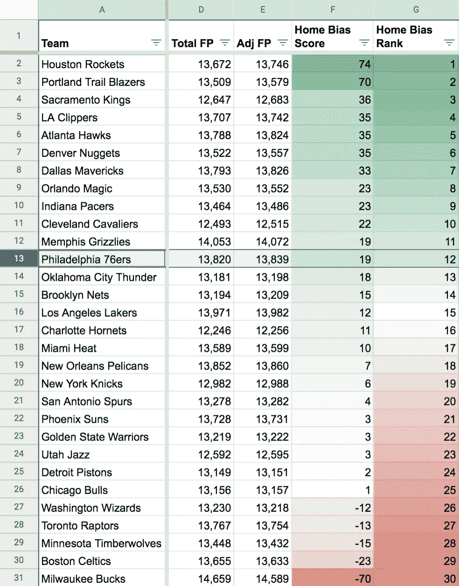

排名每支球队在主场和客场让他们更好的球员上场的次数。[数据](https://docs.google.com/spreadsheets/d/16UWNnufdC0rl3LCR3pmyNOjGDFeodjgMDu8aI8FuB8U/edit#gid=875399765)。

在所有球队中，看起来休斯顿火箭队和波特兰开拓者队最有可能为他们最好的球员部署一种负荷管理形式，让他们在路上休息，尽管差异仍然小到足以成为巧合。

对休斯顿来说，先发球员詹姆斯·哈登和拉塞尔·维斯特布鲁克都有 52%的时间是在主场，而不是在客场:

休斯顿火箭队球员的主客场分钟分裂和主场偏向得分。[数据](https://docs.google.com/spreadsheets/d/16UWNnufdC0rl3LCR3pmyNOjGDFeodjgMDu8aI8FuB8U/edit#gid=1123310593)。

由于哈登和威斯布鲁克都在幻想积分所有球员的前 15 名，所以显著扭曲了球队的主场偏差得分。

波特兰的五名先发球员中有四名在主场比赛的时间(49-60%)比球队整体(48%)多:

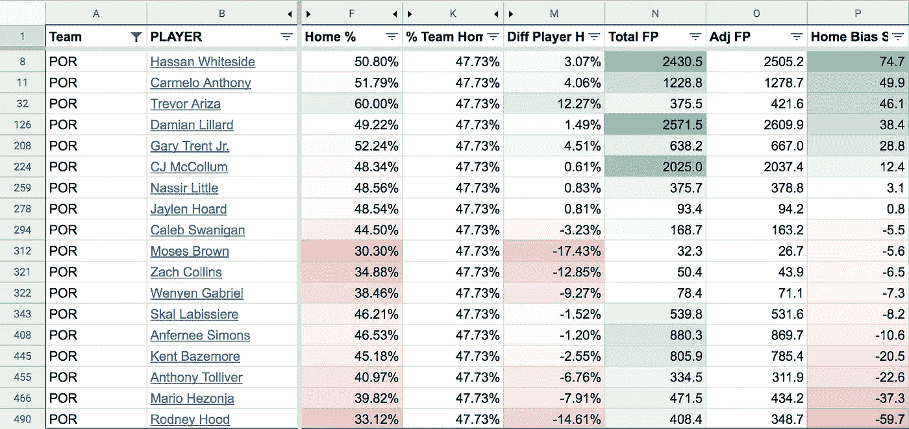

波特兰开拓者球员的主客场分钟分裂和主场偏向得分。[数据](https://docs.google.com/spreadsheets/d/16UWNnufdC0rl3LCR3pmyNOjGDFeodjgMDu8aI8FuB8U/edit#gid=1123310593)。

帕特里克·贝弗利、乔尔·恩比德和詹姆斯·哈登在主场优势得分上领先所有球员，这表明他们可能在客场很轻松。以下是主场优势得分最高的 30 名球员:

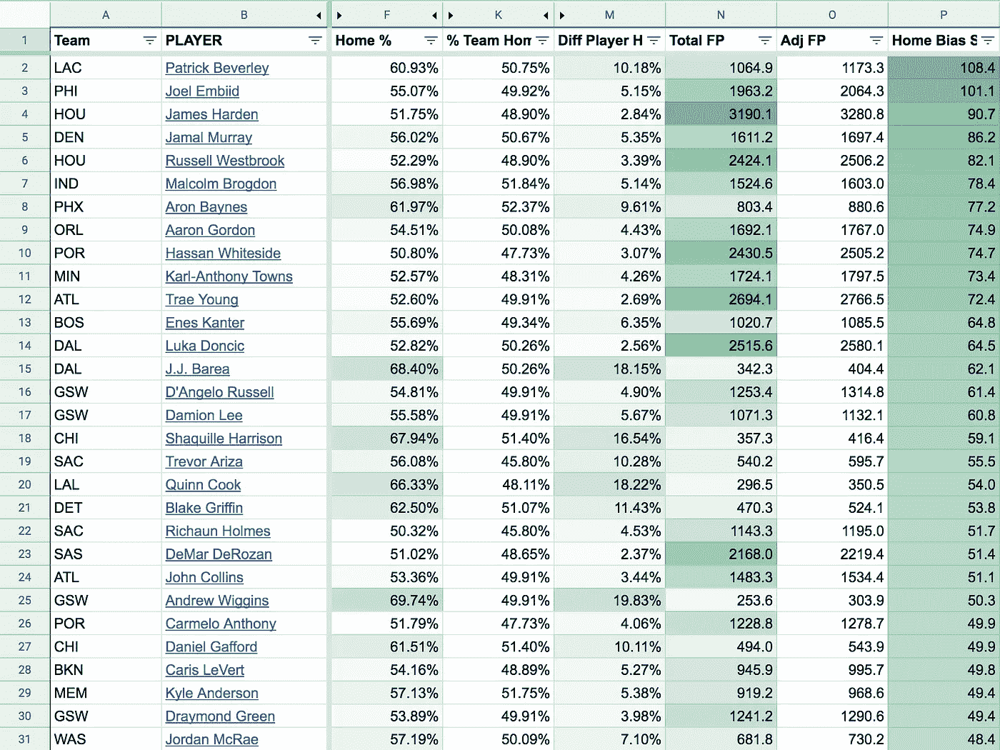

根据主场优势得分排名的前 30 名球员，计算为他们的总得分，以他们在主场比赛的分钟数与他们球队主场比赛的分钟数之间的百分比差异加权。[数据](https://docs.google.com/spreadsheets/d/16UWNnufdC0rl3LCR3pmyNOjGDFeodjgMDu8aI8FuB8U/edit#gid=1123310593)。

如果你很好奇，以下是前 35 名幻想得分者如何分配他们的主场和客场时间，以及他们最终的主场偏差得分:

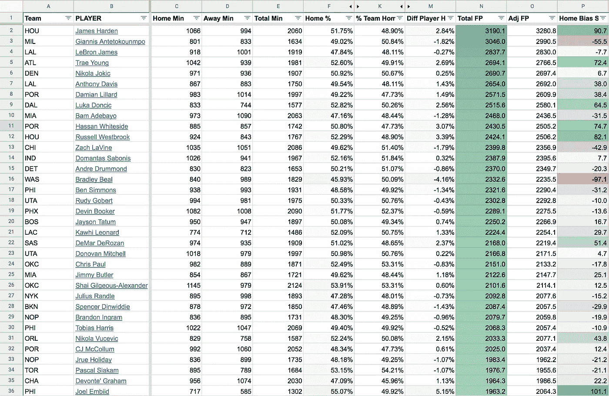

前 35 名球员的总幻想点，他们的主客场比赛时间分裂，和他们的计算主场优势得分。[数据](https://docs.google.com/spreadsheets/d/16UWNnufdC0rl3LCR3pmyNOjGDFeodjgMDu8aI8FuB8U/edit#gid=1123310593)。

当比较一支球队的主客场胜利百分比差异和他们的主场优势得分时，我们发现实际上没有相关性:

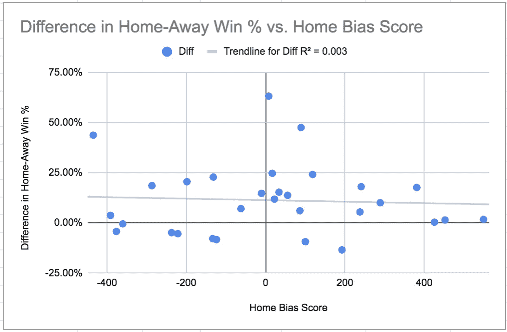

主客场胜率%与主场优势分数的差异。76 人是图表顶部中间的点，他们的主场胜利和主场偏差得分之间有 63 个百分点的差距。

**理论#1 结论:**总的来说，76 人似乎没有比其他球队更多地在客场休息他们的天赋，这足以解释他们主场胜率的差异。恩比德拥有所有球员中第二高的主场偏向得分，当然是一个潜在的异数，但他在客场的相对休息在很大程度上被其他球星在客场比主场打得更多所抵消。总的来说，球队在主场和客场使用顶尖人才似乎与球队在主场和客场的胜率差异没有太大关联。

# 理论 2:76 人的球员在客场花费更少的精力

为了衡量 76 人是否在客场“尝试更少”，我们不得不求助于一组更主观的统计数据。

[回到 2016 年](https://www.hoopcoach.org/nba-hustle-stats/)，NBA 开始发布[“hustle”统计](https://stats.nba.com/teams/hustle/)。这些包括屏幕辅助，偏转，回收球，收费和有争议的投篮。此外，他们已经公布了关于[禁区](https://stats.nba.com/teams/box-outs/)、[距离和速度](https://stats.nba.com/players/speed-distance/)的数据。这些数据是用来衡量一个球队或球员在一场比赛中所付出的努力。

对于上述每个类别，我收集了每支球队每场比赛的主场和客场数据。然后，我把在家时的每场比赛数据和在旅途中的每场比赛数据相除，得出一个比率分数；一支在客场和主场付出同样多努力的球队会得到 1.00 的中性分数。

例如，76 人每场主场比赛平均投篮 54.8 次，而每场客场比赛平均投篮 53.9 次。54.8/53.9 = 1.02 的分数，这表明球队在主场比赛中比在客场比赛中付出更多努力的可能性(尽管更可能是巧合)。

然而，与客场比赛(8.4 分)相比，他们每场主场比赛(8.3 分)回收的松散球略少，得分为 0.99:

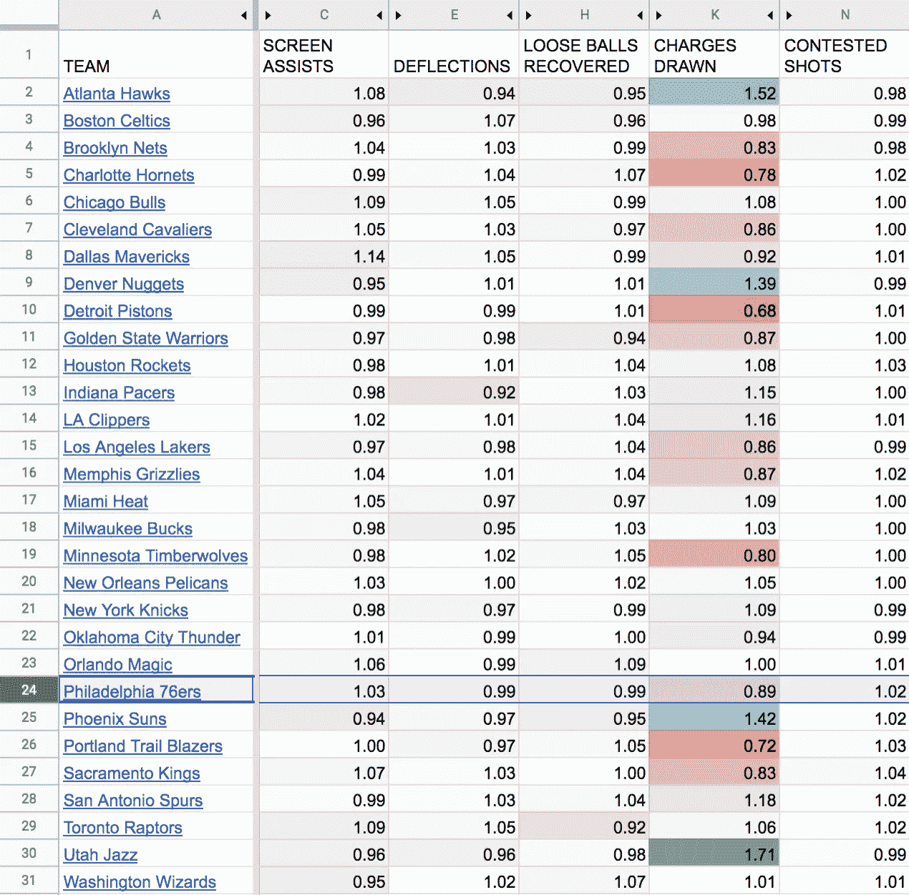

按球队选择的每场比赛的主场优势率。比率为 1.00 表示每场比赛球队的主场和客场表现没有差异。高于 1.00 的比率表明在家比在路上花费的精力可能增加(反之亦然)。[数据](https://docs.google.com/spreadsheets/d/16UWNnufdC0rl3LCR3pmyNOjGDFeodjgMDu8aI8FuB8U/edit#gid=252866324)。

当比较所有球队的主场和客场时，76 人并不突出；对于这些统计数据中的大多数，他们排在中间位置:

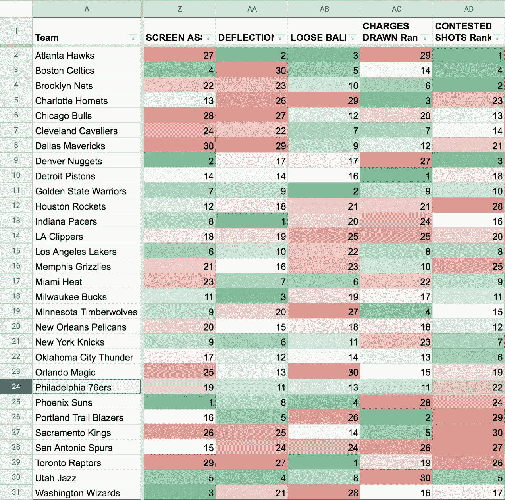

对所有 30 支球队的主场优势进行排名。[数据](https://docs.google.com/spreadsheets/d/16UWNnufdC0rl3LCR3pmyNOjGDFeodjgMDu8aI8FuB8U/edit#gid=875399765)。

此外，我查看了球队在禁区、距离和速度方面的平均水平，比较了每场比赛主客场的平均水平。这些可能不太能代表努力程度(例如，速度可能是团队和对手比赛风格/节奏的一个属性)，但可能表明努力程度存在一些差异。

在这里，76 人再一次相对于其他球队排名中游甚至垫底:

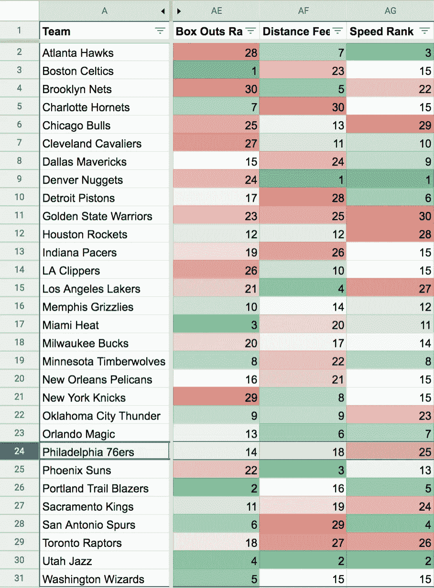

根据 30 支球队的主场优势、球场行进距离和球场速度对他们进行排名。[数据](https://docs.google.com/spreadsheets/d/16UWNnufdC0rl3LCR3pmyNOjGDFeodjgMDu8aI8FuB8U/edit#gid=875399765)。

**理论#2 结论:**根据屏幕助攻、偏转、回收的松散球、冲锋、有争议的投篮、禁区、行进的距离或速度来衡量，相对于其他球队，76 人在主场比赛时似乎没有花费更多的努力。

# 理论 3:76 人的客场比主场更难对付

为什么 76 人在主场表现更好的第三个可能的解释是，他们只是打弱队，而在客场打强队。

为了验证这个理论，我收集了每个队相对于对手在赛季中每场比赛的预期获胜概率的数据。我使用了 [FiveThirtyEight 基于猛禽玩家评级的游戏预测](https://projects.fivethirtyeight.com/2020-nba-predictions/games)。

由于 NBA 球队众所周知的主场优势，所有球队在客场比赛的平均对手获胜概率都高于主场比赛。但一些球队在客场比在主场与对手的胜算差距更大，这表明赛程更加艰难。按照这个标准，76 人在客场面对的最强对手方面排名中等，30 个中有 14 个:

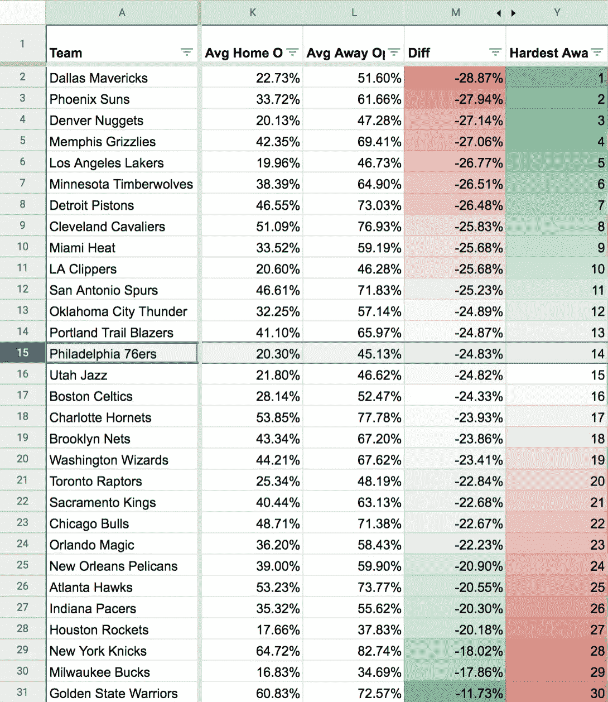

根据对手主场与客场比赛的平均获胜概率的差异对所有 30 支球队进行排名。[数据](https://docs.google.com/spreadsheets/d/16UWNnufdC0rl3LCR3pmyNOjGDFeodjgMDu8aI8FuB8U/edit#gid=875399765)。

你可能想知道这些数据是否受到球队主场优势差异的影响；例如，丹佛掘金队(和其他丹佛职业运动队)因其比赛地的高海拔而在主场拥有更大的优势，这可能解释了他们在上图中相对较高的排名。然而，FiveThirtyEight 的概率考虑了[一般的主场优势、疲劳、旅行和海拔](https://fivethirtyeight.com/methodology/how-our-nba-predictions-work/)，可能会减少这些影响。举个例子:犹他州也因海拔高而被认为是一个潜在的困难之地，排名仅次于 76 人，这表明在客场比赛时，固有的主场优势可能不是比赛程更重要的因素。

令人惊讶的是，当将一支球队的客场胜率差异与其客场对手的相对实力进行比较时，我们发现没有相关性:

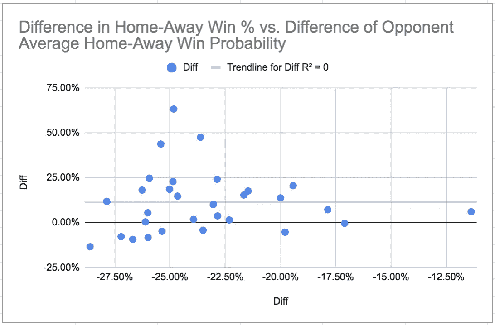

比较一支球队在主场和客场比赛中主客场胜率的差异与对手平均胜率的差异(76 人是最大的点，分别为-25%和 65%)。[数据](https://docs.google.com/spreadsheets/d/16UWNnufdC0rl3LCR3pmyNOjGDFeodjgMDu8aI8FuB8U/edit#gid=875399765)。

我会认为，至少在主场和客场的胜率之间的一些差异是由于对手在主场和客场比赛前的平均获胜概率的差异。

**理论#3 结论:**相对于主场的对手，76 人在客场还没有遇到过不成比例的强劲对手。

# 那么 76 人的客场之旅背后是什么呢？

这一分析表明:

1.  平均而言，当考虑明星球员时，76 人的球员在客场比赛的时间更少。
2.  当通过屏幕辅助，偏转，回收的松散球，冲锋，有争议的投篮，出界，行进距离或速度来衡量时，76 人的球员在路上花费的精力确实*而不是*少。
3.  相对于主场的对手，76 人在客场面对的对手更强大。

因此，我们可能需要转向更“模糊”的理论来解释 76 人在客场的挣扎。

二月初，艾尔·霍福德对道路上的模糊“注意力不集中”发表了评论:

> 我们的更衣室里发生了一些事情，我们会保密的。我们都知道我们需要变得更好。我们需要加快步伐，明天是一个很好的机会。
> 
> 我们不够专注，尤其是在路上。我们在上半场很专注(对抗热火)，然后下半场他们有一点点跑动，出于某种原因我们没能恢复。作为一个团队，我们需要更加专注。我们在客场做得好一点，但我们又回到了糟糕的状态。

蔻驰[布雷特·布朗不太相信](https://www.nba.com/article/2020/02/22/road-philadelphia-76ers-get-put-test)一个原因:

> 你看看我们在路上的记录，就像是，‘这怎么可能？’你家里有*这个*，路上有*这个*，这是两种不同的性格。…我们有过糟糕的枪战吗？我们有过不好的做法吗？这个团体的精神被污染了，以至于我们不能浏览所有的东西吗？事实并非如此。
> 
> (我们的道路斗争)有点神秘…我做这个已经够久了，足以生活在现实世界中。我不能指出任何[理论]是“哦哦。”

那么如何解释 76 人的客场之旅呢？不幸的是，目前答案并不令人满意:这是一个谜。

# 在你走之前…

如果你喜欢这篇文章，你可能也会喜欢[我关于体育和数据的其他文章](https://medium.com/@dglid)——给我一个关注，当我发布更多内容时会通知我:

*   [填写三月疯狂的最终指南](https://medium.com/s/story/the-ultimate-guide-to-filling-out-your-bracket-for-march-madness-9e7d76f16449)
*   [我如何正确预测比利亚诺瓦赢得 2018 年 NCAA 男篮锦标赛](https://medium.com/@dglid/how-i-correctly-picked-villanova-to-win-the-2018-ncaa-mens-basketball-tournament-3764e9442ee2)
*   [我是如何智胜一个 538 预测算法的](https://medium.com/s/story/how-i-outsmarted-fivethirtyeights-nfl-forecasting-algorithm-592a301fa318)
*   [我如何使用 200 名专家和 Reddit 的评论排名算法赢得我的 Office NFL Pick'em Pool](https://medium.com/@dglid/how-i-used-200-experts-and-reddits-comment-ranking-algorithm-to-win-my-office-nfl-pick-em-pool-cbca64abe31d)
*   [2020 梦幻足球拍卖守门员策略综合指南](https://medium.com/swlh/the-comprehensive-guide-to-keeper-strategy-for-2020-fantasy-football-auctions-394c99d61be3)