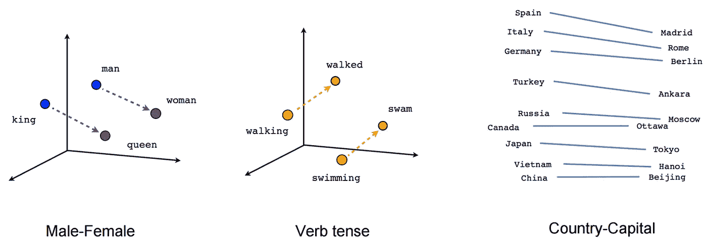

# 在煮什么！—用自然语言处理对菜肴进行分类

> 原文：<https://towardsdatascience.com/whats-cooking-categorizing-cuisines-with-nlp-ac44affe6b1d?source=collection_archive---------46----------------------->

## 学习用于食谱分类的 word2vec 和单词嵌入


[凯蒂·史密斯](https://unsplash.com/@kate5oh3?utm_source=medium&utm_medium=referral)在 [Unsplash](https://unsplash.com?utm_source=medium&utm_medium=referral) 上拍照

兴奋地想去旅行，但在疫情却被困在家里？想尝试世界各地的美食却被困在家里？嗯，这是给你的项目！作为一名美食家，这是一个有趣的数据集，了解每种美食的不同特色食材。“什么是烹饪”数据集是来自 20 种不同菜系的食谱列表，任务是为不同的食谱建立一个分类器。在本文中，我将比较理解这个数据集的两种不同方法。

# 维度的诅咒

在将数据输入机器学习模型之前，第一步是将数据转换成机器学习模型能够使用的定量形式。最简单的方法是使用一键编码，这种技术根据条目是否存在，将列表转换为 1 和 0 的向量。


在这个包含 7137 种成分的数据集中，如果没有额外的处理，事情可能会很快失控。维度过多将使执行操作在计算上更加困难，这将大大延长训练模型所需的时间。这个问题是一个常见的问题，被称为维数灾难。

为了解决这个问题，我们必须将数据投影到一个更低的维度上，这样我们更容易处理。这些低维向量被称为单词向量或单词嵌入，它们本质上是单词含义的数字表示。然后可以将这些单词向量组合起来创建句子向量，或者在这种情况下，创建菜谱向量。为了获得这些配方向量，我们看两种方法，第一种方法是主成分分析，或者使用被称为连续单词包的自然语言模型。

# **主成分分析**

PCA 是一种统计技术，用于将数据集压缩到更低的维度。这是通过找到最高方差的方向，然后将数据投影到这些轴上来实现的。这背后的想法是，方差最大的轴能够保留数据集中的大部分信息，从而最大限度地减少变换到较小维度时的信息损失。


在这个问题的背景下，PCA 可以直接应用于配方向量，而无需学习每种成分的嵌入。原始的大小矩阵被压缩成 32 维，作为配方的嵌入。

# **自然语言处理方法**

自然语言处理领域的一个巨大突破是 word2vec 的出现，这是一种可以将单词的意思转换为计算机可以理解的数字向量表示的系统方法。著名的等式“女王-女人+男人=国王”向我们展示了精确的单词向量如何能够有效地捕捉单词的语义。



word2vec 的单词类比

用于生成该单词向量的一种常见模型是连续单词袋(CBOW)模型，该模型使用相邻单词(上下文单词)来学习不同单词之间的关联。


CBOW 模型架构。[谷歌图片](https://stats.stackexchange.com/questions/342174/word2vec-difference-between-the-two-weight-matrices)

在第一部分中，该模型通过编码器传递上下文单词的独热向量，以将其转换到较低的维度。然后将这些向量相加，得到我们正在寻找的 32-D 嵌入向量。然后，模型的下一部分将尝试将该低维嵌入向量转换回目标单词的独热码编码向量。正如所预期的，从嵌入向量重建一位热码向量将不是完美的，并且两个向量之间的误差将通过模型反向传播。在连续的学习时期之后，该模型将能够将一次性向量转换为嵌入向量，同时保留尽可能多的信息。

如果你有兴趣了解更多，你可以看看这篇解释其他模型的文章[这里](/introduction-to-word-embedding-and-word2vec-652d0c2060fa)或者对于那些想深入研究数学的人来说，这里[的注释](https://cs224d.stanford.edu/lecture_notes/notes1.pdf)相当不错。

然而，与句子不同的是，配方中的配料本质上是无序的，不是采用配方中的相邻配料，而是从整个配料列表中随机抽取上下文配料。训练数据集也每 5 个时期重新采样，以学习尽可能多的关联。

```
def sample(recipe,ingredient,samples):
    recipe = recipe[:]
    recipe.remove(ingredient)
    if len(recipe) < CONTEXT_SIZE+1:
        context = random.choices(recipe, k=samples) 
    else: 
        context = random.sample(recipe, k=samples) 
    return context
```

在找到模型训练的最佳学习速率后，CBOW 模型被训练 60 个时期，其中数据每 5 个时期被混洗一次。这导致损失函数每 5 个时期增加，因为模型必须适应新的混洗数据，这将有希望允许它更好地概括。

一旦我们使用这种技术获得了单词嵌入，我们就可以对它们做一些初步的评估。观察这些向量的定量方法是找出我们期望相似的向量之间的相似性。比如酱油和鸡肉的相似度要明显高于酱油和牛奶。这可以使用余弦相似性来评估，余弦相似性测量两个向量之间的角度的余弦。指向相似方向的向量将具有接近 1 的余弦相似性，而不同的向量应该具有接近-1 的相似性。

# 估价

回到手头的任务，我们更感兴趣的是分类食谱，而不是成分向量。对配方中的所有成分进行平均将得到配方向量，然后我们可以将该向量与从 PCA 获得的配方向量进行比较。评估这两个模型的定性方法是将它们在二维空间中可视化。然后，我们可以观察不同菜系的食谱之间的区别，以评估算法的有效性。

我们可以做到这一点的方法是使用 t-SNE 一种流形降维工具，它对于绘制高维空间非常有用。根据从两种技术获得的 32-D 向量，对两者执行 t-SNE 以获得 2-D 图。


NLP 模型(左)和 PCA 模型(右)的比较

显然，我们看到从我们的 NLP 模型获得的图比预期的 PCA 模型表现得好得多。与 PCA 相比，CBOW 模型等神经网络可以学习更多的高维特征，我们可以从图中更好的分离看出这一点。同时，这些情节可以为不同的美食提供有价值的见解。从图中我们可以看出，墨西哥菜和印度菜形成了一个非常独特的群体，而希腊菜和美国南方菜则更加分散，这表明它们融合了更多种类的食材。从每个集群之间的距离，我们也可以比较不同美食的相似之处。正如所料，日本，中国和泰国聚集在一起，而希腊，意大利和法国美食形成另一个相反的一端集群。看看你还能从这些数据中获得什么见解！

Github 链接:[https://github.com/reoneo97/Whats_Cooking](https://github.com/reoneo97/Whats_Cooking)

在 LinkedIn 上联系我:【https://www.linkedin.com/in/reo-neo/ 