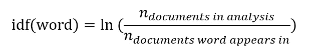
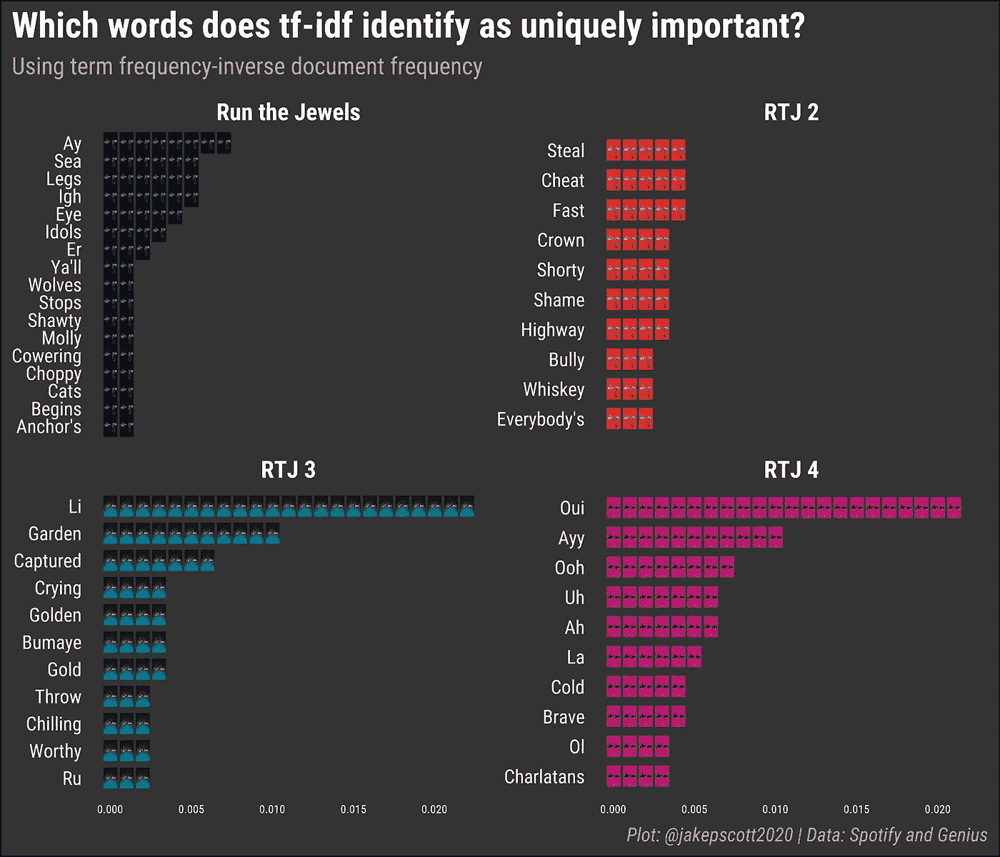
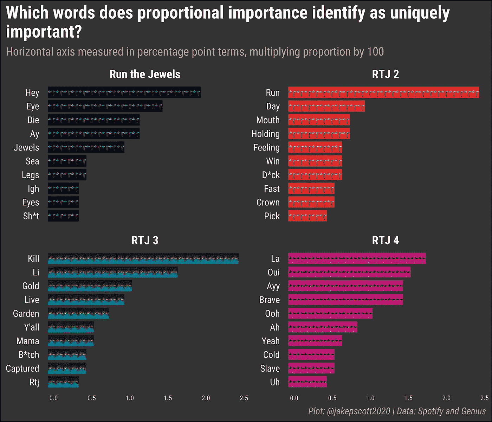
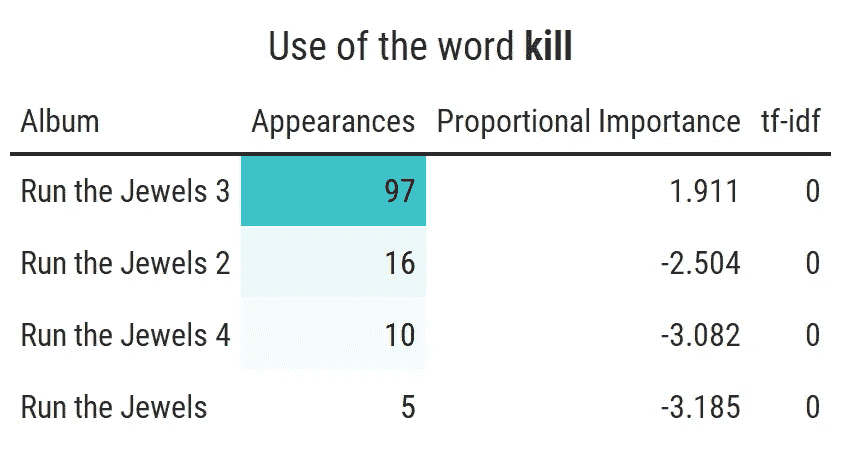
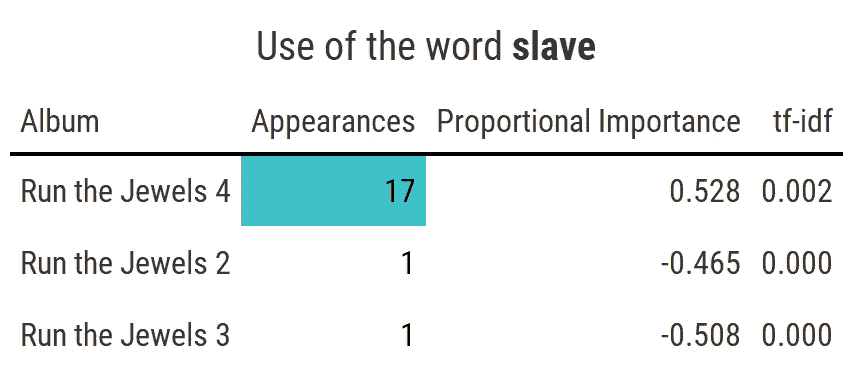

# 一句话里有什么？

> 原文：<https://towardsdatascience.com/whats-in-a-word-da7373a8ccb?source=collection_archive---------20----------------------->

## 入门指南

## 为什么 tf-idf 有时不能准确捕捉单词的重要性，我们可以用什么来代替

*TL；DR:Term Frequency-Inverse Document Frequency(TD-IDF)是一个强大而有用的工具，但它有一些缺点，导致它对相对重要的词赋予较低的值，在大范围内过于敏感，在密集范围内过于抗拒。一个更纯粹的比例方法改善了这些问题。*

由[安妮·斯普拉特](https://unsplash.com/@anniespratt?utm_source=medium&utm_medium=referral)在 [Unsplash](https://unsplash.com?utm_source=medium&utm_medium=referral) 上拍摄

# **目录**

*   *TF-IDF 简介*
*   *弊端*
*   *比例重要性*
*   *进行珠宝案例研究*
*   *结论*

# **TF-IDF 简介**

正如我向任何对文本分析感兴趣的人推荐的那样，我最近在通读朱莉娅·西尔格和大卫·罗宾逊的优秀著作《与 R 一起进行文本挖掘》。在那本书中，他们有一章讲述了如何使用一种叫做“词频-逆文档频率”(tf-idf)的统计方法来量化给定文档中哪些词相对重要。在阅读那一章之前，我当然看过甚至使用过 tf-idf，但是说实话，我从来没有真正质疑过它。我知道这是一个简单而强大的工具，可用于各种应用程序，所以我只是简单地继续使用它，没有想太多。

然而，读完那一章，更仔细地考虑它是如何计算的，我开始意识到，也许有比我以前认为的更多的理由来质疑它。事实上，我注意到了两个相当重要的缺点，正如我将要展示的，它们可以有意义地改变一个分析。

但是在讨论这些缺点之前，我应该简单解释一下 tf-idf 的实际目标是测量什么以及如何计算。

tf-idf 的目标是量化一个感兴趣的单词对于文档集合中的一个给定文档有多重要。

它这样做的方式很简单。它将给定单词在给定文档中出现的频率(术语频率)乘以该单词在其他文档中出现的次数(逆文档频率)。经常在文档 A 中出现并且在很少或没有其他文档中出现的单词将为该文档获得高值，而在文档 A 中不常见和/或在许多其他文档中出现的单词将为文档 A 获得低值

在数学上，这是通过将术语频率(给定文档中由感兴趣的单词组成的单词的比例)乘以逆文档频率(分析中文档数量的自然对数除以感兴趣的单词出现的文档数量)来完成的。

正如我上面提到的，这是一个简单而强大的工具，通常可以很好地估计语料库中哪些词定义了文档。然而，它有两个具体问题。

# 缺点

paweczerwi ski 在 [Unsplash](https://unsplash.com?utm_source=medium&utm_medium=referral) 上的照片

首先，我称之为“零价值问题”，它源于逆文档频率计算。通过构造，如果感兴趣的单词出现在所有文档中，则 tf-idf 值将为零；分析中的文档数与该单词出现的文档数之比为 1，1 的自然对数为零。这意味着这个词对于任何给定的文档都不是唯一重要的。

在许多情况下，这可能是合理的:如果一个词出现在任何地方，它在任何地方都不是唯一的，这一想法似乎是一个可靠的启发。然而，在有些情况下，这给分析带来了有意义的挑战，在我看来，分配的重要性是不正确的低。

要了解这是如何造成问题的，请考虑下面的场景。假设我们有三个文档:A、B 和 c。假设我们想获得文档 A 中单词“apple”的 tf-idf 值，并假设 apple 构成了该文档中整整 75%的单词。如果苹果只在文档 B 中出现过一次，而在文档 C 中根本没有出现，那么 tf-idf 值就应该很高。然而，如果苹果只在*的*文档 B *和* C 中出现一次，tf-idf 就会一路跌到*零*。尽管唯一的变化是 apple 现在再次出现在文档 A 之外，尽管文档 A 几乎完全由单词 apple 组成，但是 tf-idf 统计数据从相对较高的值骤降到零。这是一个不受欢迎的衡量标准，因为它表明这两个案例远比实际情况不同，也因为它表明苹果对 A 并不是唯一重要的，尽管它显然是重要的。

第二个缺点与第一个相似，我称之为“广泛的保证金问题”。这是因为 tf-idf 的逆文档频率部分没有考虑一个单词在其他文档中出现的频率(密集边距)，而只是考虑它是否出现(广泛边距)。这导致它在广泛边际上有变化时过度敏感，而在密集边际上有变化时过度抵制变化，尽管后者可能更重要。

要了解这一点，请考虑上面的相同设置，这一次 apple 占了文档 a 中 10%的单词，如果 apple 根本没有出现在文档 B 中，tf-idf 值会相对较高。然而，如果它只在 B 中出现一次，值就会急剧下降(尽管只要它不在 C 中出现，就不会降到零)。尽管这两个场景几乎相同，唯一的变化是苹果的外观增加了一个，但价值发生了巨大的变化，这都是因为这种变化是在广泛的范围内发生的(即苹果从没有外部文档变为有外部文档)。当然，在实践中，apple 这个词在文档 a 之外只出现一次或者根本不出现没有什么区别。但是 tf-idf 认为这两种情况是完全不同的。

另一方面，如果苹果从只在文档 B 中出现一次，变成几乎 100%地使用文档中的文字，tf-idf 也不会有任何改变。也就是说，*这个词在文档 B 中出现多少次*并不重要，因为 tf-idf 忽略了密集边距。重要的是它是否出现。然而，如果我们的目标是获得一个指示相对重要性的度量，那么区分这些场景是非常关键的。在前者中，与 B 相比，苹果对文档 A 相对重要(只在 B 中出现一次)，而在后者中，相对于它对文档 B 的重要性(100%的单词)，苹果对文档 A 根本不是唯一重要的(10%的单词)。然而，tf-idf 认为没有什么不同。

概括一下:零值问题意味着如果感兴趣的词出现在所有外部文档中，即使它只在每个文档中出现一次，tf-idf 也会突然降到零。大范围裕度问题意味着，当大范围裕度上有较小的和相对不重要的变化时，tf-idf 会有显著的不同，但当大范围裕度上有变化时，即使是实质性的变化，TF-IDF 也不会有任何不同。

我们能做些什么呢？

# 比例重要性

由[真诚媒体](https://unsplash.com/@sincerelymedia?utm_source=medium&utm_medium=referral)在 [Unsplash](https://unsplash.com?utm_source=medium&utm_medium=referral) 上拍摄

输入:比例重要性。

比例重要性是我试图提出的一种方法，它同样能告诉我们一个给定的单词对于一个给定的文档是否既重要又独特，而没有 tf-idf 的缺点。我将指出，这是可能的，甚至可能类似或相同的事情以前已经做过。我没有亲眼见过，但尽管如此，我并不声称自己是第一个想到这种方法的人。记住这一点，让我来解释这个方法。

背后的想法很简单。为了计算给定文档中给定单词的比例重要性，我只需查看该文档中由感兴趣的单词组成的总单词的比例，并减去由感兴趣的单词组成的该文档之外的单词的比例。

这有点拗口，所以让我们看一个例子。使用与上面相同的场景，我的测量将采用文档 A 中由苹果公司创造的单词的比例，并从中减去 B 和 C 中由苹果公司创造的单词的比例。因此，如果文档 A 中有 50%的单词是苹果，而 B 和 C 中有 20%的单词是苹果，那么苹果在文档 A 中的重要性比例就是 0.3(30%)。请注意，与 tf-idf 不同，此度量可能会变为负值。负值只是表示该单词在给定文档外部比在文档内部更常见。

这种简单的方法既解决了零值问题，也解决了广泛的利润问题。对于零值问题，如果苹果占文档 A 的 50%,并且只在 B 和 C 中出现一次，那么比例重要性将正确地保持苹果在文档 A 中的高值，而 tf-idf 统计的值将为零。

对于扩展边距问题，如果我们保持文档 A 中由 apple 构成的单词比例不变，那么在 apple 构成文档 B 中 1%的单词的情况下，与 apple 构成文档 B 中 0%的单词的情况相比，比例重要性将相差很小。它会将这两种情况视为相似，忽略扩展边距上的微小变化。另一方面，同样假设苹果在文档中的流行度为常数，比例重要性将在苹果占文档 B 中 1%的单词的情况下与苹果占文档 B 中 50%的单词的情况下有很大不同。考虑到密集边界的变化，比例重要性将把这两种情况视为完全不同。

# 运行珠宝案例研究

这在理论上似乎是合理的，但我想看到它的行动。为了做到这一点，我看了一下由黑仔·迈克和埃尔-P 组成的嘻哈二人组“奔跑吧珠宝”的唱片目录。这对组合已经发行了四张专辑:奔跑吧珠宝、奔跑吧珠宝 2、奔跑吧珠宝 3 和奔跑吧珠宝 4。我把每个都缩短为“RTJ”和数字。

为了获得用于分析的数据，我在 r 中使用了{Rspotify}、{genius}和{geniusr}包，然后使用{tidytext}包将这些原始数据转换成可供分析的“整洁”形式。最后，在开始实际分析之前，我使用 SMART、snowball 和 onix 词典删除了所谓的“停用词”,比如“the”和“for”。

准备好数据后，我开始使用{tidytext}包计算每个单词-相册对的 tf-idf 值。下图显示了 tf-idf 测量的专辑中最重要的前十个单词(由于平局，一些专辑有超过 10 个单词)。

歌迷们会意识到，许多歌词是由专辑中特别独特的歌曲驱动的(这一点我希望在未来的帖子中再次提到)。例如，《奔跑吧珠宝》中的歌曲 *Sea Legs* 不出所料地包含了 Sea 和 Legs 这两个词，这两个词在其他任何专辑中都没有出现过。因此，这两个词在该专辑中都获得了较高的 tf-idf 分数。类似的模式也出现在《RTJ 2》中的单词 steal 和 check(来自歌曲 Lie Cheat Steal)和《RTJ 3》中的单词 garden(来自歌曲 Call Ticketron，在这首歌中，他们唱的是在麦迪逊广场花园表演)。

一个独立但同样有趣的模式是，与以前的专辑相比，像“是”、“是”和“哦”这样的表达在他们最近的专辑《RTJ 4》中尤为重要。

记住这些有趣的模式后，下一步是用我的衡量标准，比例重要性，来看看哪些单词被列为重要的。请注意，我将该图的度量从比例转换为百分比。

一些相似之处是显而易见的,《RTJ》中出现了《海与腿》(尽管重要性降低了),而《RTJ 3》中出现了《花园》。然而，有 21 个词没有被 tf-idf 列为重要的词，我的衡量标准表明它们实际上是专辑中最重要的十个词之一。

其中一些差异相对较小。RTJ2 中的“偷”和“骗”以及 RTJ 3 中的“布迈耶”没有出现在排行榜上，因为虽然它们确实是专辑中独有的，但实际上它们对他们来说并不那么重要，每个都被使用了 8 到 9 次。鉴于这种缺乏内在重要性的情况，我的衡量标准没有考虑它们。

更有意思的是度量之间的主要变化，这表明了相对重要性如何在 tf-idf 上得到提高。

一个很大的变化立即引起了我的注意，虽然 kill 根本没有出现在 tf-idf 的《RTJ 3》最重要的十个单词中，但它实际上按照重要性比例被列为专辑中*最重要的*单词。这确实是一个巨大的差异。然而，只要看一看基础数据，就能立即弄清楚为什么会出现这种情况。

Kill 在《RTJ 3》中出现了 97 次，几乎占了专辑中所有不间断单词的 3%。它不仅在专辑中很重要，而且相对来说也是独一无二的，在《RTJ 3》中比在专辑中多出现了整整 6 次，它出现的频率位居第二(《RTJ 2》)。因此，它的比例重要性值很高。

然而，正如我们在表中看到的，tf-idf 值实际上是*零*，这表明这个词对专辑来说一点也不独特或重要。怎么回事？归结起来就是零值问题。因为 kill 在所有四个专辑中至少出现一次，所以逆文档频率为零，因此 tf-idf 分数本身为零。尽管这个词在《RTJ 3》中既重要又相对独特，但还是出现了这种情况。

在 tf-idf 中，RTJ 的“嘿”和 RTJ 2 中的“跑”也会出现同样的问题。和“kill”一样，这两个词都没有被 tf-idf 列为重要词，但它们都被列为*专辑中最重要的*词。就像“kill”一样，这种差异是有棱有角的，因为这两个词在所有专辑中都至少出现过一次。因此，尽管这两个词在他们给定的专辑中很常见并且相对独特，但他们在 tf-idf 中的得分为零。

事实上，对于比例重要性和 tf-idf 不一致的超过一半的单词(11 ),原因是 tf-idf 测量的零值问题。这证明我的方法确实改善了 tf-idf 面临的零值问题。

广泛的保证金问题呢？RTJ 4 中的“奴隶”一词显示了我的措施是如何应对这一挑战的。虽然比跑或杀更微妙，奴隶同样没有出现在《RTJ 4》中关于 tf-idf 的前十个词中，但却有相应的重要性。同样，原始数据有助于解释为什么会这样。

Slave 在《RTJ 4》中出现得有点频繁(虽然不是压倒性的),在其他地方很少出现。事实上，大约 90%的“奴隶”出现在《RTJ 4》中，只有两次在专辑外提到它(一次在《RTJ 2》，一次在《RTJ 3》)。因此，我的衡量标准认为它对 RTJ 协议 4 非常重要。另一方面，对于 tf-idf，由于它在 4 张专辑中的 3 张专辑中至少出现一次(即使只是一次)，所以该值较低(0.002)。

为了显示 tf-idf 处理这种情况的脆弱性，考虑一下当我简单地删除 RTJ 4 之外的 slave 的两个实例并重新计算时会发生什么。tf-idf 统计不仅翻了三倍达到 0.008，而且成为《RTJ 4》中任何单词的第三高*分数。换句话说，这个词从甚至不在最重要的十个词之列变成了第三名。尽管奴隶出现在 RTJ 4 之外两次和没有出现两次之间几乎没有实际差别，这种情况还是发生了。这是 tf-idf 在大范围内过度敏感的一个很好的例子。*

另一方面，如果你增加奴隶出现在 RTJ 4 之外的次数，比如 400 次，tf-idf 的统计数据不会改变，仍然是 0.002！尽管这个词在第一种情况下对 RTJ 4 来说有些重要和独特，但在第二种情况下却一点也不独特，tf-idf 的统计数据并没有改变。这证明了我上面所讨论的:tf-idf 不仅在广泛的边界变化时过度敏感(该词出现在外部相册中的数量从零到一个或两个)，而且在密集的边界变化时过度抵制变化(当外部提及的总数从两个到数百个)。

我的比例重要性度量更好地处理了这种情况。它承认 slave 确实对 RTJ 4 非常重要，但没有赋予过高的价值，因为它也承认虽然独特，但对专辑并不特别重要(只占总字数的 0.5%)。此外，当 slave 出现在 RTJ 4 之外的次数从 2 到 0 时，它正确地指出这是一个小变化。另一方面，当外部出现的数量急剧增加时，它变得非常消极，正确地表明奴隶对于 RTJ 4 已经变得相对不重要。

这些发现同样适用于其他单词，比如《RTJ 2》中的“holding”。事实上，tf-idf 对这个词的大范围变化比对 slave 更敏感。简单地除去《RTJ 2》之外的两次出现，tf-idf 的统计数据从甚至不在前十名变成专辑中任何词的最高*。也就是说，仅仅通过删除这个词的两个外部实例，tf-idf 就从在《RTJ 2》中说持有基本上不重要变成了字面上最重要的词。同样，我的措施以一种更有分寸的方式处理这种情况。它给它一个中等的值，因为它认识到虽然这个词对《RTJ 2》非常重要(在这张专辑中出现的次数是其他专辑的 19 倍)，但它对整个专辑并不特别重要(只占单词总数的 0.7%)。*

*最终，这个案例研究证明了比例重要性确实实现了我为它设定的目标。在许多方面，它反映了 tf-idf，捕捉了许多相同的单词，并将它们列为重要单词。然而，它避免了 tf-idf 的主要缺点:它不会突然逐步下降到零，它不会对广泛边际的变化过于敏感，它不会忽略密集边际的变化。*

# *结论*

*这一切给我们带来了什么？当然，这并不是说 tf-idf 是无用的，应该被完全抛弃。这不会发生，也不应该发生。一般来说，这是一个有用的统计数据，我发现的问题通常只发生在边缘情况下。*

*相反，我写这篇文章只是为了建议分析师和研究人员在使用这种方法时应该谨慎行事，承认它的缺点以及它们可能如何和何时改变分析。就在上面的小案例研究中，当我切换到比例重要性时，最重要的词的组成发生了一些戏剧性的变化，并且以一种提出关于 tf-idf 的问题的方式这样做。事实上，这种转变肯定大到足以改变分析的结论。*

*就比例重要性而言，我写这篇文章也不是暗示它将取代 tf-idf。我强烈怀疑它不会，这没关系。也就是说，我真的希望我已经让你相信它是一个强大的工具，反映了 tf-idf 的优点并减轻了它的缺点，我很乐意分享我用来计算它的代码(代码仍在开发中。它完成了工作，但是还没有优化速度。*

*当我等待成百上千的关于比例重要性的消息涌入时，我会简单地说祝你文本挖掘愉快！*