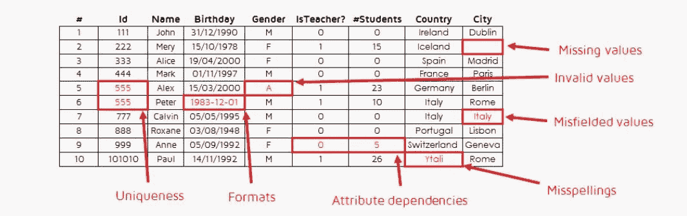
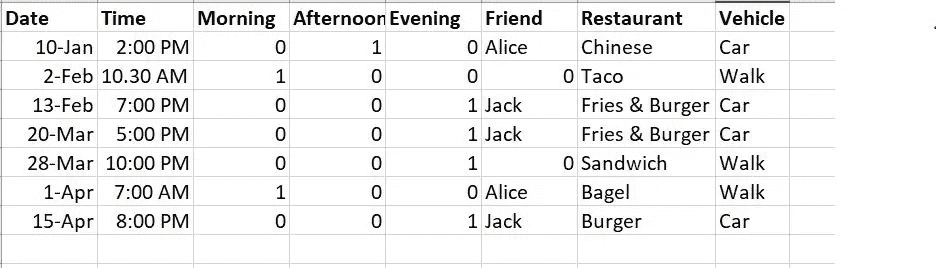

# 数据里面有什么！

> 原文：<https://towardsdatascience.com/whats-inside-the-data-aadbb28ba8cd?source=collection_archive---------64----------------------->

## 预处理、EDA 和特征工程

弗兰基·查马基在 [Unsplash](https://unsplash.com?utm_source=medium&utm_medium=referral) 上拍摄的照片

信不信由你，这部分占了整个 ML 工作的 60-70 %!我不会在这里谈论代码，因为我相信如果你知道逻辑，找到一个代码并不是超级困难的，只是到那里会因人而异。获得代码的地方有 StackOverflow、Kaggle、Github 或 Google 上任何有助于实现这种逻辑的地方！

相反，让我们谈谈作为数据科学家在进行初始分析时要记住的一般逻辑/概念。这将包括**整理数据，理解背后不同的模式，等等**。

可以去翻翻我的[上一篇](/data-science-where-do-i-start-76693f6ae597)了解一下**“我从哪里开始学 ML”**，适合初学者或者任何不同背景想学 ML 的人。

# 整理数据

> **数据清理**或**数据清理**是从记录集、[表](https://en.wikipedia.org/wiki/Table_(database))或[数据库](https://en.wikipedia.org/wiki/Database)中检测并纠正(或删除)损坏或不准确的[记录](https://en.wikipedia.org/wiki/Storage_record)的过程，是指识别数据中不完整、不正确、不准确或不相关的部分，然后替换、修改或删除[脏的](https://en.wikipedia.org/wiki/Dirty_data)或粗糙的数据。——(来源——维基百科)。

为什么我们需要清理数据？让我们看看下面的例子:

来源: [Pablo Sanchez](https://quantdare.com/author/psanchezcri/) 通过[quandare](https://quantdare.com/data-cleansing-and-transformation/)

在这个“脏数据”的小例子中有许多问题。

1.  ID 列(应该是主键)应该有唯一的值，但是有**个重复记录**。
2.  日期列有**不同的日期格式**，这使得后面在一个层次上的分析变得困难。
3.  在某些列中有**个缺失记录**
4.  相同的名字有不同的拼写或**打字错误。**

这些只是数据如何变脏的几个例子。也可能有其他东西会弄乱数据，应该被删除。所以在分析数据之前，清理数据是非常重要的一部分。

现在，你知道数据是混乱的，那么你如何修复它呢？

1.  **最好的情况→与消息来源**谈谈，看他们能否帮你清理数据。
2.  如果那是不可能的，那么你必须自己做。**数据中不同类型的错误可以基于用例和数据集类型以多种方式修复**。
3.  **重复行**可以在某些级别(例如在学生级别、城市级别或教师级别)进行聚合，以创建唯一的记录。
4.  **不同格式**日期、数字、收入、分数等。应采用相同的格式，以适用者为准。
5.  如果有人填写作为数据来源的表格，打字错误是不可避免的。但是，从长远来看，使这种数据输入系统自动化有助于更好地获取数据。
6.  **缺失记录**——根据缺失项目值和用例的列，有多种填写方式。

a.你可以用一个普通的值来填充(比如 0 或者 9999 或者“:<blanks>”)，</blanks>

b.使用整个列的平均值/中值

c.使用先进的方法，如 KNN(k-最近邻)或，

d.如果没什么区别，就让它保持原样。

一旦所有不同的数据集都清理干净，你需要**把它们放在一起。**因为对于机器学习来说，如果我们有一个大文件，就更容易输入到模型中。

一旦数据清理到一定程度，我们就可以进入下一步了。

# 理解背后的模式

一旦我们清理了数据，我们就可以开始分析它了。分析是可以从数据中收集到的任何有用的发现/见解。例如，如果你可以将你的整个人生放入数据中(从你出生的第一天到你今天午餐吃了什么)，我们从中选取一个随机样本，你可以获得的一些见解可能是:

来源:作者

1.  你今年吃了多少汉堡？其中，你吃了多少薯条？
2.  你和朋友一起吃过几次饭？
3.  当你和你的朋友在一起的时候，你吃了多少次汉堡？诸如此类的事情。

为什么分析是必要的？它帮助我们理解**“我们有足够的样本/特征来解决最终问题吗”**？

我们可以了解数据中的不同模式，或者多个列如何相互关联，或者不同级别的发现—就像在这个示例中，我们可以在天/月级别、食物类型、使用的交通工具等方面获取数据。它还可以帮助我们删除对我们的查找不必要的列。我将在下一篇博客中详细解释这个步骤，并附上代码和示例。

# 特征工程

> 特征==属性==列==维度

特征工程是指操纵/改变特征以创造新的特征。为什么这很重要？因为这有助于我们展现数据的不同属性。

例如-地址包含:伦敦贝克街 221b 号。我们可以**溶解这个列以带出更多的值** —城市、街道、公寓#。类似地，生日“1994 年 1 月 21 日”可以分解成日期、月份、年份、一年中的某一天、一年中的某一周等。这些新栏目比原来的功能更有意义。

另一个例子，如果整个数据集是伦敦的，我们可以删除新创建的城市列，因为它**不会增加任何附加值。**类似地，如果我们有一个年龄列，并且添加了与出生日期列相同的值，我们可以删除其中的一个。

以上两种方法都是**特征工程**的例子。还有其他方法来创建新的功能，你可以添加滞后，做一个总收入/累计总收入，列的平均值/中值，不同类别的计数等。因此，通过这种方式，我们可以创建许多功能来帮助模型很好地理解和预测数据。

但是，有一个东西是我在读硕士期间碰到的——**“维度的诅咒”。**这暗示了拥有大量维度实际上并不好。那我们该怎么办？嗯，曾经有一件简单的事情要做:
a .没有给数据增加任何价值的列应该被删除。
b .应删除暗示相同细节的多列。

除此之外，我们还有其他方法可以自动为模型选择最佳列，如特征重要性、SHAP 等。但是我们将在创建模型的阶段讨论它们！:)在此之前，享受预处理数据，并让我知道你的反馈！