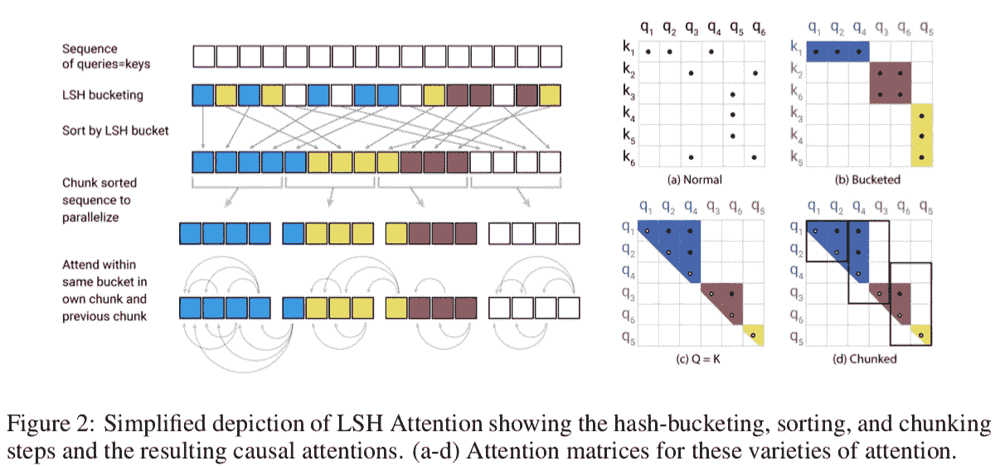
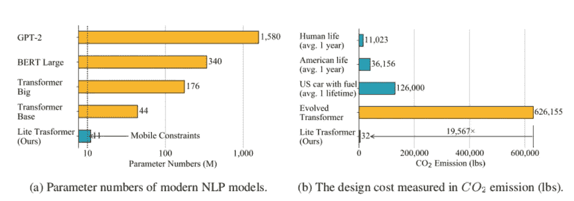
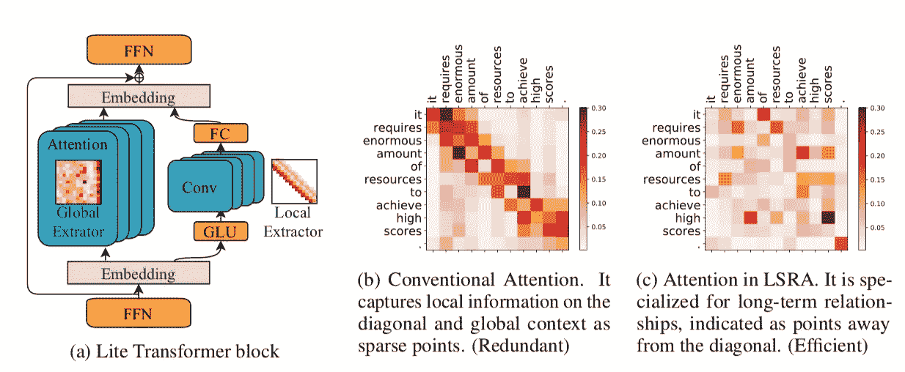
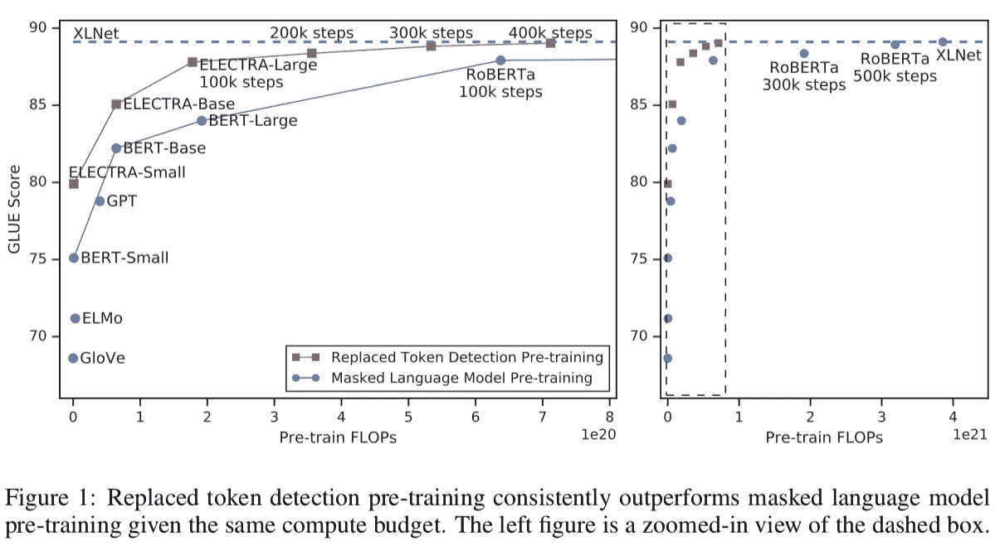
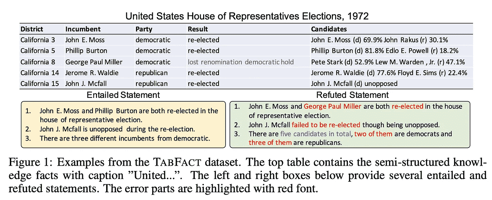
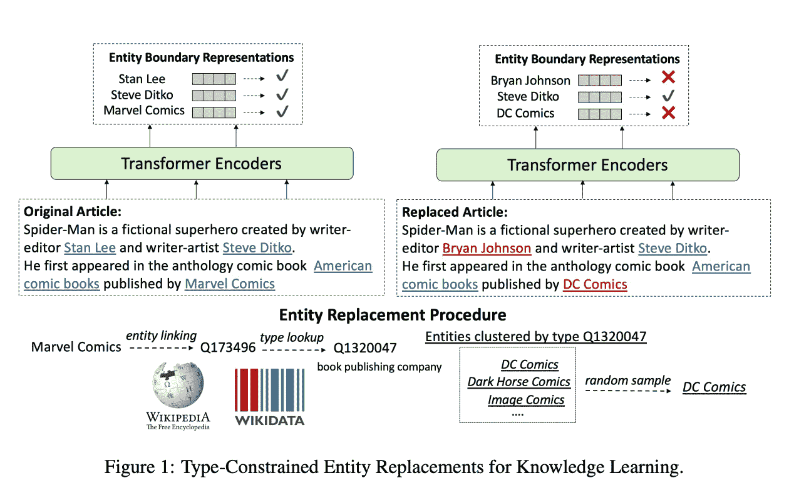
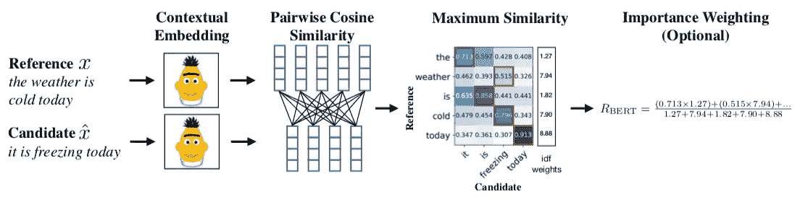
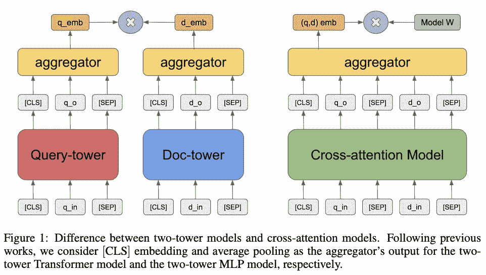
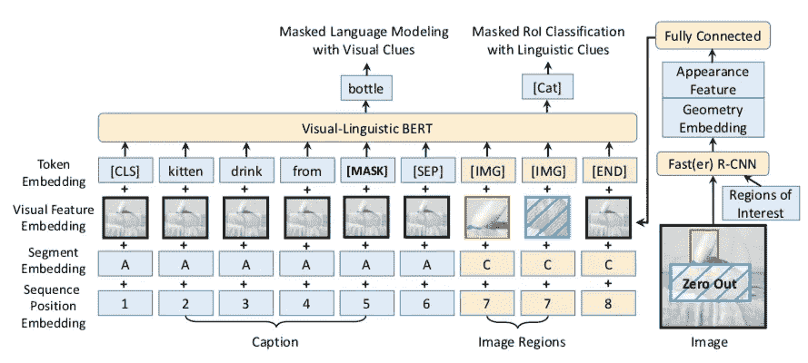
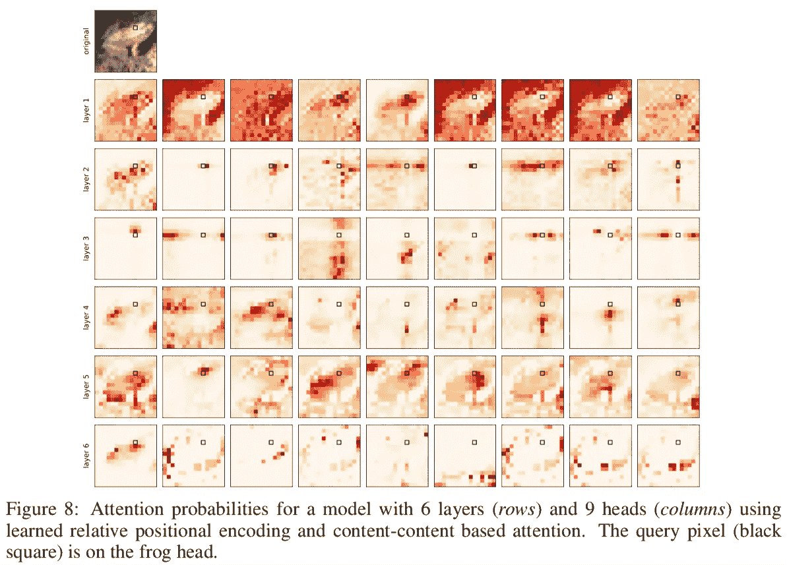

# ICLR 2020 大会上的变形金刚有什么新内容？

> 原文：<https://towardsdatascience.com/whats-new-for-transformers-at-the-iclr-2020-conference-4285a4294792?source=collection_archive---------33----------------------->

## 变形金刚是一种基于注意力的神经架构，它在推出后将 NLP 领域推向了新的高度。国际学习代表会议有大量的相关出版物，所以这里有一个相关出版物的精选集，可以帮助你浏览它们。

学习表示国际会议(ICLR)是机器学习社区最受欢迎的舞台之一。如今，该领域的会议通常作为高质量的商标，并成为已经存在于预印服务器中的出版物的焦点。尽管如此，呈现的工作量越来越大，这使得它很难跟上。

在 [Zeta Alpha](https://www.zeta-alpha.com) ，我们密切关注自然语言处理(NLP)和信息检索(IR)研究的前沿。本着这种精神，在我们的语义搜索引擎的帮助下，我们从 40 多篇论文中精选了 9 篇！—从三个主要角度与亮相 ICLR 2020 的变形金刚有关:**建筑修改、培训创新和*衍生*应用**。尽情享受吧！

# 🏛建筑修订

了解最新的变形金刚模型。

## 1. [ALBERT:用于语言表达自我监督学习的 Lite BERT](https://openreview.net/pdf?id=H1eA7AEtvS)|[ICLR 会议](https://iclr.cc/virtual/poster_H1eA7AEtvS.html)

变压器在很大程度上变得过度参数化，因为这是在几个 NLP 任务中实现最先进水平的成功秘诀。或者，ALBERT 是一个已经很有影响力的例子，说明了如何在保持让 BERT 出名的令人印象深刻的性能的同时，减少它对资源的消耗。

这些优化包括:

*   **因式分解嵌入参数化**:通过使用不同于文字块嵌入尺寸的隐藏尺寸，嵌入参数化可以因式分解，将其尺寸从 O(Vocab × Hidden)减小到 O(Vocab × Emb + Emb × Hidden)，如果隐藏≫ Emb，这可能是实质性的。
*   **跨层参数化共享**:为不同的变换块重用参数，如 FFN 和/或注意力权重。
*   **句子排序目标**:作者认为从原始 BERT 中预测下一个句子不够有挑战性，引入了这个新的句子级自我监督目标。

**结果如何？与 BERT-large 相比，参数少 18 倍，性能相当，推理速度略快。**

## 2.[改革者:高效的变压器](https://openreview.net/pdf?id=rkgNKkHtvB) | [ICLR 会议](https://iclr.cc/virtual/poster_rkgNKkHtvB.html)

早期转换器的一个限制是注意力机制的计算复杂度与序列长度成二次方关系。这项工作引入了一些技巧，以允许更有效的计算，这使得对更长的序列(从 512 到 64k！).为此，该模型的主干包括:

*   允许在整个模型中仅存储激活的单个副本的可逆层。
*   使用**位置敏感散列法(LSH)** 通过快速最近邻居来近似注意力计算。这就用 O(L log L)代替了注意层中的 O(L)因子。

来源:[重整器:高效变压器](https://openreview.net/pdf?id=rkgNKkHtvB)

## 3.[Lite Transformer with Long-Short Range Attention(LSRA)](https://openreview.net/pdf?id=ByeMPlHKPH)|[ICLR 时段](https://iclr.cc/virtual/poster_ByeMPlHKPH.html)

这里有另一个提议，通过强加他们所谓的“移动约束”来克服变压器中的长距离依赖性和高资源需求。这一次，他们对短期依赖使用卷积，对长期依赖使用选择性注意力，创造了一个新的更有效的变压器 LSRA 积木。

虽然结果无法与其他成熟的旗舰变形金刚相提并论，但其有原则的架构设计和深思熟虑的动机使其值得一提。

来源:[带长短程注意的 Lite 变压器(LSRA)](https://openreview.net/pdf?id=ByeMPlHKPH)

**优秀奖** : [变压器-XH](https://openreview.net/pdf?id=r1eIiCNYwS) ，[深度自适应变压器](https://openreview.net/pdf?id=SJg7KhVKPH)，[压缩变压器](https://openreview.net/pdf?id=SylKikSYDH)。

# 🧠关于学习

模特如何学习和模特看起来如何一样重要，所以这里有一些令人耳目一新的出版物，推动了变形金刚如何学习的界限。

## 1.[伊莱克特拉:预先训练文本编码器作为鉴别器而不是生成器](https://openreview.net/pdf?id=r1xMH1BtvB) | [ICLR 会议](https://iclr.cc/virtual/poster_r1xMH1BtvB.html)

自引入 BERT 以来，掩蔽语言建模(MLM)一直是模型预训练目标的学习基础。本文提出了一种更便宜、更快速的替代方案:**替代令牌检测。**

主要想法非常简单:不是让模型猜测屏蔽的令牌，而是需要区分哪些令牌被一个小型生成器网络所取代，该网络提出了看似合理但错误的令牌。作者声称，这个目标比 MLM 更有样本效率，因为任务是在所有序列上定义的，而不仅仅是屏蔽的标记。如果这些结果证明自己很容易重现，这项任务有可能成为无监督预训练的新标准。

来源: [ELECTRA:预训练文本编码器作为鉴别器而不是生成器](https://openreview.net/pdf?id=r1xMH1BtvB)

## 2. [TabFact:用于基于表的事实验证的大规模数据集](https://openreview.net/pdf?id=rkeJRhNYDH) | [ICLR 会议](https://iclr.cc/virtual/poster_rkeJRhNYDH.html)

随着现代变压器缩小与人类性能的差距，许多经典的 NLP 数据集正在变得过时，这意味着需要创建新的更具挑战性的基准来刺激进步。在这种情况下，提出了一种新的数据集来解决对用自然语言表达的基于事实的信息进行建模的问题。

它由来自维基百科的 16k 个表格和 18k 个人类陈述组成，带有引用事实数据的`ENTAILMENT`或`REFUTED`标签。基线的性能仍然一般，所以这是一个激动人心的创新解决这个任务的时刻！

来源: [TabFact:用于基于表的事实验证的大规模数据集](https://openreview.net/pdf?id=rkeJRhNYDH)

## 3.[预训练百科:弱监督知识-预训练语言模型](https://openreview.net/pdf?id=BJlzm64tDH) | [ICLR 会议](https://iclr.cc/virtual/poster_BJlzm64tDH.html)

这项工作没有采用传统的 MLM 目标，而是从稍微更加结构化的数据中探索自我监督训练的力量:维基百科及其实体。它们用其他相似类型的实体替换文本中的实体( *a la* ELECTRA)，模型学习通过上下文辨别被替换的实例。使用这种方法，模型被迫学习关于真实世界实体及其关系的信息。

当在预训练中将该任务与经典 MLM 相结合时，它导致零射击事实完成的性能的显著提高，以及以实体为中心的任务(如问题回答和实体打字)的性能的改善。

**优秀奖:** [一种语言表征学习的互信息最大化视角](https://openreview.net/pdf?id=rkxoh24FPH)；[用频谱控制改善神经语言生成](https://openreview.net/pdf?id=ByxY8CNtvr)；[深度学习大批量优化:76 分钟训练 BERT](https://openreview.net/pdf?id=Syx4wnEtvH)。

# 🤖*分拆*用途

变形金刚不仅仅是语言建模。以下是一些作品，巧妙地利用这些模型的力量来解决相关问题。

## 1. [BERTScore:使用 BERT 评估文本生成](https://openreview.net/pdf?id=SkeHuCVFDr) | [ICLR 会议](https://iclr.cc/virtual/poster_SkeHuCVFDr.html)

在松散定义的环境下客观地测量质量(即生成连贯的文本)本质上是具有挑战性的。在语言中，BLUE score 被广泛用作文本相似性的代理，它与人类对文本生成任务(如翻译或问答)的判断有很好的相关性，但它仍然远非完美。

这项工作解决了这个问题，并展示了如何为序列对设计一个基于 Bert 的评分函数，用于文本生成，使**与人类判断**更好地关联。该过程非常简单，不涉及任何微调:只有预先训练的上下文嵌入，余弦相似性和基于频率的重要性加权。

尽管失去了一些可解释性，这种学习得分能成为新的标准吗？只有时间能证明一切。

基于 BERT 的评分函数之一的示例。来源: [BERTScore:用 BERT](https://openreview.net/pdf?id=SkeHuCVFDr) 评估文本生成

## 2.[基于嵌入的大规模检索预训练任务](https://openreview.net/pdf?id=rkg-mA4FDr) | [ICLR 会议](https://iclr.cc/virtual/poster_rkg-mA4FDr.html)

鉴于 BM25 这样的简单基线是如此强大和难以超越，信息检索领域已经晚于*神经革命*。目前，大多数神经增强的 SOTA 方法需要两个主要步骤:第一个快速过滤整个文档集——基于 *BM25 类算法—* ,以及重新排序步骤，其中通过神经网络处理查询和一小部分文档。这种方法存在许多局限性，因为在第一步中错过的任何文档都不会被进一步处理，并且在推理时完全处理查询和文档对的计算成本严重限制了现实世界的适用性。

相反，这项工作探索了受约束的问题，其中推理只能通过预先计算的文档表示的嵌入相似性得分来完成，从而实现大规模的端到端基于转换器的检索。

要得出的关键见解是，使用**段落级自我监督任务进行预训练是必不可少的**，而标记级屏蔽语言建模对这一特定任务的影响可以忽略不计。在结果部分，他们展示了即使在相对缺乏监督训练数据的情况下，BM25 如何能够在问答任务中被击败。

来源:[基于嵌入的大规模检索的预训练任务](https://openreview.net/pdf?id=rkg-mA4FDr)

## 3.[VL-伯特:通用视觉语言表征的预训练](https://openreview.net/pdf?id=SygXPaEYvH) | [ICLR 会议](https://iclr.cc/virtual/poster_SygXPaEYvH.html)

如何利用预训练和微调框架来共同学习通用语言和视觉表示？这里我们找到了一个很好的例子:视觉语言 BERT 将 Transformer 架构和 R-CNN 一起作为主干。虽然这不是同类中的第一个，但它是对现有模型的一个令人耳目一新的改进，并且**为视觉常识推理** (VCR)基准设定了一个新的最先进水平(嗯，在出版时)。预培训程序依赖于两个主要目标:

*   **具有视觉线索的掩蔽语言建模:**类似于原始的 MLM 任务，但是增加了被加字幕的图像区域的表示。
*   **利用语言线索的掩蔽的感兴趣区域分类:**以一定的概率，图像的区域被掩蔽，并且目标是在给定语言信息的情况下预测该区域的类别。

来源:[VL-伯特:通用视觉语言表征的预训练](https://openreview.net/pdf?id=SygXPaEYvH)

## 🎉奖金:[关于自我关注和卷积层的关系](https://openreview.net/pdf?id=HJlnC1rKPB) | [ICLR 会议](https://iclr.cc/virtual/poster_HJlnC1rKPB.html)

这篇非传统的论文对注意力机制和卷积可能存在的共同点进行了令人信服的分析。有趣的是，他们发现的重叠比人们事先预期的要多:正如他们的证据所表明的那样，注意力层经常学会像 CNN 一样注意“像素网格模式”。

使用计算机视觉作为案例研究，以及详细的数学推导，他们得出结论，变压器架构可能是 CNN 的概括，因为它们经常学习等效的模式，甚至可能由于同时学习局部和全局信息的能力而呈现优势。

来源:[关于自我注意和卷积层的关系](https://openreview.net/pdf?id=HJlnC1rKPB)

**优秀奖:** [符号数学深度学习](https://openreview.net/pdf?id=S1eZYeHFDS)；[逻辑和 2-单纯变压器](http://LOGIC AND THE 2-SIMPLICIAL TRANSFORMER)(用于深度 RL)。

今年的 ICLR 完美地反映了机器学习的一个充满活力的活跃分支是如何成熟的:模型、训练技术、数据集和应用变得更加完善，围绕它们的理解也更加深入。我们这篇文章的变压器之旅到此结束，但会议还有很多内容需要探索。我和我的团队将密切关注相关的会谈和研讨会，并通过我们公司的 twitter feed 在 [@zetavector](https://twitter.com/ZetaVector) 上实时报道有趣的见解，所以如果你不想错过任何事情，请收听我们的节目！