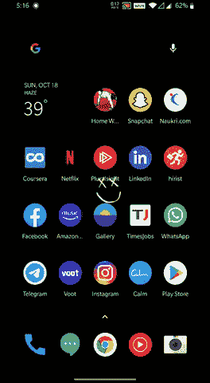

# 谷歌新推出的人工智能“哼歌搜索”功能可以搜索歌曲

> 原文：<https://towardsdatascience.com/whats-new-in-google-s-ai-powered-hum-to-search-song-feature-f6c9da14d492?source=collection_archive---------45----------------------->

## 人工智能搜索你最喜欢的歌曲

来源: [Unsplash](https://unsplash.com/)

借助人工智能的力量，我们可以想象的一切现在都有可能实现。你有没有想象过，如果你能在某个地方找到你听过的那首歌，而你的脑海里只有音乐？你可能这样问过你最好的朋友。

**像这样“哼哼哼哼哼哼”的那首歌叫什么来着但是你的朋友(一个人类)也没有告诉你歌名。**

人工智能已经证明，它现在可以读取你在想什么，但人类不能。有了大量的数据、机器学习算法和高处理能力的机器，这一切都是可能的。

这种哼唱的主要特点是，即使你在嘈杂的背景下，这种功能也能很好地准确工作。要使用这种功能，你不需要成为一名歌手，你可以哼唱，谷歌将使用其人工智能算法和高端计算能力来完成剩下的工作。

该功能目前支持 20 种语言。这意味着我们可以哼唱，谷歌将找到 20 种不同语言的歌曲。现在还不知道这二十种语言是什么。我已经在印度语和英语歌曲中测试过了，它运行得相当快和准确。

# 谷歌是如何做到的

我对幕后的技术很好奇，我发现它使用了[谷歌的下一代音乐识别](http://ai.googleblog.com/2018/09/googles-next-generation-music.html)功能。它使用深度学习算法，可以通过大量数据来训练我们的模型。此前，谷歌在 Pixel 2 手机中推出了类似的功能，可以在另一台设备上播放歌曲，Pixel 的手机可以通过音乐和歌词识别歌曲。我们现在可以在谷歌搜索功能中使用我们的声音，即使没有歌词，也可以通过哼唱找到这首歌。

# 如何有效地使用“哼声搜索”功能

由作者添加

你可以说，“好吧，谷歌，这首歌是什么？”或者你可以从谷歌小工具中添加快捷方式。你需要哼唱大约 10-15 秒，接下来，你会发现这首歌在你的脑海中回响。

# 你觉得这个功能怎么样？

照片由 [Ehimetalor Akhere Unuabona](https://unsplash.com/@theeastlondonphotographer?utm_source=medium&utm_medium=referral) 在 [Unsplash](https://unsplash.com?utm_source=medium&utm_medium=referral) 上拍摄

这一新的人工智能搜索功能上周刚刚推出。更新您的 Google 应用程序后，您可以更有效地使用该功能。对于 Siri 中的 IOS 用户，该功能目前不可用。但作为一个突破性的功能，Siri 可能很快就会有这个功能。这个功能对我们许多人来说是一种祝福，因为我们可以哼唱并找到歌曲；我们不需要去问别人，也不需要靠猜歌词去四处搜索。