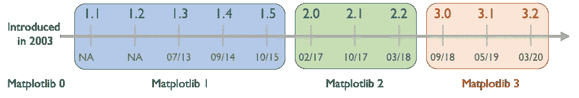
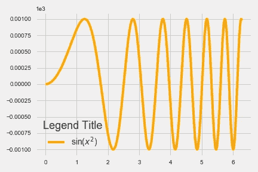
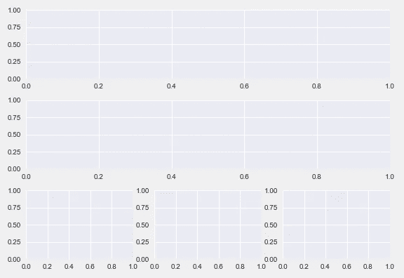
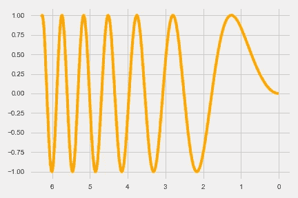

# Matplotlib 3 的新特性

> 原文：<https://towardsdatascience.com/whats-new-in-matplotlib-3-1b3b03f18ddc?source=collection_archive---------15----------------------->


照片由[卡拉·伊德斯](https://unsplash.com/@karaeads?utm_source=medium&utm_medium=referral)在 [Unsplash](https://unsplash.com?utm_source=medium&utm_medium=referral) 拍摄

## 第 3 代中最重要的更新概述

> 如果说可视化在数据中无处不在，无论大小，那么 Matplotlib 在 python 中同样无处不在。

[Matplotlib](https://matplotlib.org/) 是 python 中使用最广泛的绘图库。**句号。**自 2003 年首次发布以来，它已经经历了四代开发，最新版本是最近发布的 3 . 2 . 2(2020 年 6 月 17 日)。最新一代的 Matplotlib 3 只与 Python 3 兼容，是近两年前推出的。



Matplotlib 开发的历史时间表(未按比例绘制)

为了保持这篇文章的简短，我将关注从 Matplotlib 3.0 开始的**最有趣的特性**(在我看来)**，然后转移到 3.1 和 3.2 版本**。如果你对学习 python 绘图的基础感兴趣，请阅读我最近在《走向数据科学》中的文章[，如果你想了解最新的 Matplotlib 3.3 中的特性，请阅读我的第二篇文章](/a-laymans-guide-to-plot-with-python-and-matplotlib-8462054f2059)[这里](https://medium.com/@ankitgupta.tech/latest-cool-features-of-matplotlib-c7a1e2c060c1)。

> 生存下来的不是最强壮的物种，也不是最聪明的物种，而是对变化最敏感的物种——查尔斯·达尔文

## 所以准备好在 Matplotlib 3 上更新自己吧

# Matplotlib 3.0 中的新功能

1.  **轴的可缩放性** 如果您想按给定的数量级缩放轴的值，您可以指定**相同的值**作为上限和下限。例如，下面的代码片段将 y 轴缩放 1000 倍。

```
import numpy as np
import matplotlib.pyplot as pltfig, ax = plt.subplots()x = np.linspace(0, 2*np.pi, 1000)ax.plot(x, np.sin(x**2), 'orange', label=r'sin($x^2$)')
ax.legend(title='Legend Title', fontsize=14, title_fontsize=18)ax.ticklabel_format(style='sci', scilimits=(3, 3), axis='y')
```



sin(x)函数的重新缩放 y 轴。注意左上角的乘法因子 1e3。

2.**自由选择图例标题的字体大小**

您现在可以分别设置**图例标题**和**图例标签**的字体大小。这已经在代码片段和上图中显示出来了。如果你正在使用`rcParams`，你也可以使用`rcParams["legend.title_fontsize"]`和`rcParams["legend.fontsize"]`分别指定两者

```
plt.rcParams["legend.title_fontsize"]  = 18
plt.rcParams["legend.fontsize"] = 14
```

3.**饼图现在默认为圆形**

*与 Matplotlib 2 不同，饼状图现在默认总是圆形的*，你不需要手动设置纵横比`"equal"`。在早期版本中，您需要指定`ax.set_aspect("equal")`或`plt.axis("equal")`来制作圆形饼图。如果您不喜欢这个默认行为，您可以使用`ax.set_aspect("auto")`或`plt.axis("auto").`来覆盖它**

**4.**轴标题和*x*-轴**之间不再重叠**

**如果图的顶部有*x*-轴(或双*y*-轴)，图标题 ***将不再与顶部 *x* 轴标签和刻度标签*** 重叠。以前，您必须手动重新定位图形标题。**

***捕捉 *:*** 默认*y*-标题值为 1.0。即使您手动指定默认位置为`ax.title.set_position(0.5, 1.0)`、*，这是多余的，因为它已经默认了*，底层算法仍然会重新定位标题并防止重叠。如果你不想重新定位，并且你是一个混乱和喜欢重叠的人，你可以使用一个不等于 1 的值 *y* 来防止它，例如`ax.title.set_position(0.5, 1.005)`*

*5. **GridSpec 现在更方便了***

*以前，要添加子情节网格，您必须使用需要导入`gridspec`的`gridspec.GridSpec()`和`gridspec.GridSpecFromSubplotSpec()`方法。现在这两个都换成了`add_gridpec()`和`SubplotSpec.subgridspec()`。这移除了*显式需要*来导入`gridspec`，如下面的[官方](https://matplotlib.org/3.0.0/users/whats_new.html#new-convenience-methods-for-gridspec)示例所示*

```
*fig = plt.figure()
gs = fig.add_gridspec(3, 1)ax1 = fig.add_subplot(gs[0])
ax2 = fig.add_subplot(gs[1])
sub_gs = gs[2].subgridspec(1, 4)for i in range(4):
    fig.add_subplot(sub_gs[0, i])*
```

**

*Matplotlib 3 中“add_gridspec”和“subgridspec”的演示*

# *Matplotlib 3.1 中的新功能*

1.  ***创建辅助 *x-y* 轴**的新方法*

*假设您正在用欧元计算股票价格，但是您的老板要求您也在同一数字中显示相应的美元价格，那么 ***副轴*** 就是您所需要的。你现在可以简单地使用`ax.secondary_xaxis()`和`ax.secondary_yaxis()`。您必须定义两个转换函数，例如下面的`eur2dol()`和`dol2eur()`，它们将定义主轴和副轴之间的关系，如[这个](https://matplotlib.org/3.1.0/gallery/subplots_axes_and_figures/secondary_axis.html)官方示例所示。*

```
***def** eur2dol(x):
    **return** x * 1.14  # Taking 1 Eur = 1.14 US Dollar as Rate

**def** dol2eur(x):
    **return** x / 1.14

secax = ax.secondary_xaxis('top', functions=(eur2dol, dol2eur))*
```

*2.**整洁简洁的日期格式器***

*如果你正在处理日期，你会喜欢这个功能的！新的日期格式器，被称为`ConciseDateFormatter()`，属于`matplotlib.dates`，与默认的格式器相比，它可以简洁明了地显示刻度标签。*

*3.**轻松创建散点图的图例***

*以前，在为标记绘制不同颜色和大小的散点图时，需要一种变通方法，要么用单个标签条目绘制多个散点图，要么使用代理美工手动添加它们。Matplotlib 3.1 通过引入返回唯一句柄和标签的`legend_elements()`简化了这一过程，这些句柄和标签可用于生成图例。此处提供了一个官方示例[。](https://matplotlib.org/3.1.0/gallery/lines_bars_and_markers/scatter_with_legend.html#automated-legend-creation)*

*4.**反转轴的新方法***

*现在，您可以使用`set_inverted()`反转轴，使用`get_inverted()`检查轴之前是否被反转过。后者将返回 Matplotlib 2 中的`True`或`False.`，等效方法为`invert_xaxis()`和`invert_yaxis()`用于反转，`xaxis_inverted()`和`yaxis_inverted()`用于检查轴是否已反转。*

```
*fig, ax = plt.subplots()x = np.linspace(0, 0.5, 100)ax.plot(x, np.sin(x**2), 'orange')
ax.xaxis.set_inverted(True) # <-- Takes Boolean as argumentax.xaxis.get_inverted()
>>> True*
```

**

*x 轴倒置的图形*

*5.**滑块控件终于俯身直起***

*现在可以有一个垂直的小部件滑块。您需要传递一个可选参数`orientation`，它可以是`'horizontal'`或`'vertical'`。*

# *Matplotlib 3.2 中的新功能(最新版本是 3.2.2)*

1.  ***控制轴的标题位置和颜色***

*在定制您的`rcParams`文件/设置时，您现在还可以传递图形标题的位置及其颜色。标题的位置可以是以下任意一个:`"left", "center", "right"`。标题的颜色可以是`"auto"`或任何指定的颜色，如`"red"`、`"mediumseagreen",`等。这里列出了[和](https://matplotlib.org/3.1.0/gallery/color/named_colors.html)。*

```
*plt.rcParams["axes.titlelocation"] = "left"
plt.rcParams["axes.titlecolor"] = "red"*
```

*2.**3d 条的阴影***

*你现在可以用`bar3d().`从不同的角度投射光线来制作漂亮的 3d 条，这可以用`[lightsource](https://matplotlib.org/3.2.0/api/_as_gen/matplotlib.colors.LightSource.html#matplotlib.colors.LightSource)`参数来配置，它有两个角度:方位角和高度。阴影参数需要是`True`来调用这个效果。*

*3.**选择显示哪些误差线***

*有时您可能希望在数据点上显示误差线。然而，如果您有大量的数据点，您不希望在每个点上添加误差线。到目前为止，您只能选择在每个 *n* 数据点后放置误差线。现在，您还可以指定误差线的起点。下面的第一个代码将在`x[::5], y[::5]`点放置误差线，而第二个代码将在`x[2::5], y[2::5]`放置误差线，即从第二个点开始每隔第五个点放置误差线。`[::5]`是 NumPy 的切片符号，它返回每第 5 个元素。*

```
*# Before matplotlib 3.2 
plt.errorbar(x, y, yerr, errorevery=5)# matplotlib 3.2 onwards
plt.errorbar(x, y, yerr, errorevery=(2, 5))*
```

*这就是我的帖子的结尾。恭喜你！现在，您已经更新了 Matplotlib 3 的一些最新特性。下一个候选版本是 [3.3.0](https://matplotlib.org/3.3.0/index.html) 。当这种情况发生时，我会更新这个帖子。*

*您可以在以下超链接中找到 Matplotlib 3 中**新增功能的完整列表: [3.0](https://matplotlib.org/3.0.0/users/whats_new.html#shifting-errorbars) 、 [3.1](https://matplotlib.org/3.1.0/users/whats_new.html#shifting-errorbars) 和 [3.2](https://matplotlib.org/3.2.0/users/whats_new.html#shifting-errorbars) 。如果你对学习 python 绘图的基础感兴趣，请阅读我在《走向数据科学》中的文章。***

****Matplotlib-ing 快乐！****