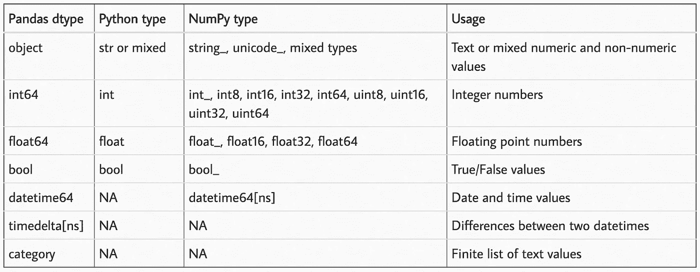
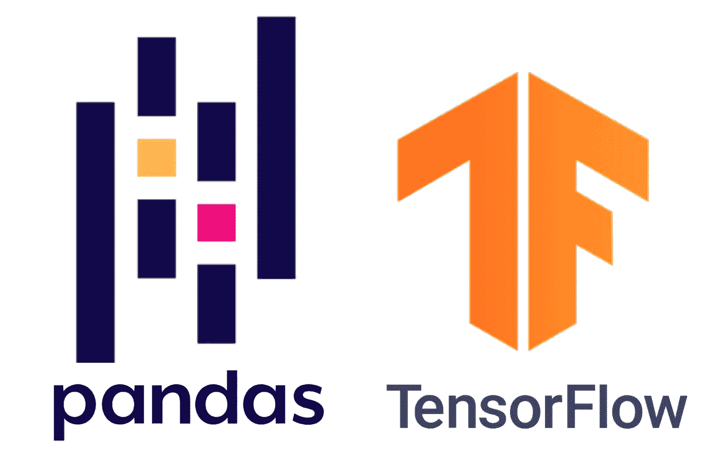

# 熊猫 1.0 和 TensorFlow 2.0 的新增功能

> 原文：<https://towardsdatascience.com/whats-new-in-pandas-1-0-and-tensorflow-2-0-7c8e68251dd5?source=collection_archive---------22----------------------->

## 关于用于数据分析和机器学习的流行 python 包的大版本，需要记住一些事情。

本文假设读者对这些库有一定的了解。如果你需要一个快速介绍，这里有一些关于[熊猫](/an-introduction-to-pandas-in-python-b06d2dd51aba)和 [TensorFlow](/a-beginner-introduction-to-tensorflow-part-1-6d139e038278) 的很棒的媒体文章。

# 熊猫 1.0.0


来源:[熊猫用户指南](https://pandas.pydata.org/docs/user_guide/index.html)

## (2020 年 1 月 29 日发布)

pandas(Panel Data 的缩写)是一个用于数据分析和操作的 Python 包，早在 2008 年就从 AQR Capital Management [开源了。它的主要特性是 DataFrame 对象，该对象为 Python 用户提供了一种简单且标准化的方式来与表格数据进行交互。当我开始使用它时，我觉得很奇怪，这样一个突出和广泛使用的软件还没有 1.0 版本。](https://en.wikipedia.org/wiki/Pandas_(software))

从 0.25.3 →1.0.0 变化不多。尽管如此，以下是主要的主题。

## 新数据框列类型

这是熊猫在 1.0 *版本*之前处理数据类型的方式:



来源:[https://pbpython.com/pandas_dtypes.html](https://pbpython.com/pandas_dtypes.html)

现在我们可以在列表中再添加两个:`pd.StringDtype()`和`pd.BooleanDtype()`。

**字符串类型:**在添加`string`数据类型之前，Pandas 字符串列被编码为 NumPy `object`数组。这太笼统了，因为任何东西都可以存储在熊猫对象列中。很难区分哪些列是只有字符串的，哪些列包含混合的对象类型。

现在有了 Pandas 中的`pd.StringDtype()`列，你应该可以在字符串列上运行所有的 [python 字符串方法](https://docs.python.org/3.8/library/stdtypes.html#string-methods)，比如`.lower()`、`.upper()`、`.replace()`等等。

**布尔类型:**在新的熊猫布尔类型之前，布尔列被编码为`bool`类型的 NumPy 数组。唯一的问题是这些数组不能包含缺失值。新的`pd.BooleanDtype()`解决了这个问题。

## 说到缺失值…

三种不同的数据类型表示熊猫对象的“缺失”:`np.NaN`表示浮点类型，`np.NaT`表示日期时间类型，`None`表示其他对象类型。一些人(包括我)认为这很烦人，很困惑。

引入`pd.NA`，新的捕捉所有缺失数据的熊猫类型。那么它是如何工作的呢？

用于算术运算；任何被加、减、连、乘、除等的东西。将返回`pd.NA`。

```
In[1]: pd.NA + 72
Out[1]: <NA>In[2]: pd.NA * "abc"
Out[2]: <NA>
```

除了少数特殊情况，比如`pd.NA`所代表的数值与结果无关。

```
In[3]: 1 ** pd.NA
Out[3]: 1In[3]: pd.NA ** 0
Out[3]: 1
```

为了便于比较，`pd.NA`的行为就像您所期望的那样，通过操作进行传播。

```
In[4]: pd.NA == 2.75
Out[4]: <NA>In[5]: pd.NA < 65
Out[5]: <NA>In[6]: pd.NA == pd.NA
Out[6]: <NA>
```

要测试缺失数据:

```
In[7]: pd.NA is pd.NA
Out[7]: TrueIn[7]: pd.isna(pd.NA)
Out[7]: True
```

对于布尔运算，`pd.NA`跟在*三值逻辑* ( [又名 Kleen 逻辑](https://en.wikipedia.org/wiki/Three-valued_logic#Kleene_and_Priest_logics))之后，类似于 SQL、R、Julia。

```
In[8]: True | pd.NA
Out[8]: TrueIn[9]: False | pd.NA
Out[9]: <NA>In[10]: True & pd.NA
Out[10]: <NA>In[11]: False & pd.NA
Out[11]: False
```

如果`pd.NA`的值可以改变结果，那么操作返回`<NA>`，但是如果`pd.NA`的值对结果没有*可能的影响，就像在`True | pd.NA`和`False & pd.NA`中那样，那么它将返回正确的值。*

**挑战问题**:这也能评价什么？(*答案在最后。)*

```
In[12]: ((True | pd.NA) & True) | (False & (pd.NA | False))
Out[12]: ???
```

注意:该`pd.NA`值是实验性的，并且*行为可能会在没有警告*的情况下改变。有关更多信息，请查看文档中的 [*处理缺失数据*](https://pandas.pydata.org/pandas-docs/version/1.0.0/user_guide/missing_data.html#missing-data-na) 部分。

## 速度和动力


来源: [Numba 文档](http://numba.pydata.org/)

C 运行速度比 Python 快主要原因是 C 得到编译而 Python 得到直接解释*(注:* [*稍微多一点*](https://www.quora.com/Why-does-C-code-run-faster-than-Pythons) *)* 。Pandas 和 NumPy 使用 [Cython](https://cython.org/) 将 Python 代码转换成 C 语言并获得性能提升。

但是在 Python 社区中，另一个编译器 [**Numba**](http://numba.pydata.org/) 正在迅速获得关注。Numba 允许你编译 Python 代码到*几乎*达到 C 和 FORTRAN 的速度；没有任何额外编译步骤或安装 C/C++编译器的复杂工作。只需导入`numba`库，[用`@numba.jit()`修饰](http://book.pythontips.com/en/latest/decorators.html)你的函数。
举例:

```
@numba.jit(nopython=True, parallel=True)
def my_function():
    ...
    # Some really long and computationally intense task
    return(the_result)
```

Pandas 在`apply()`函数中添加了一个`engine=’numba’`关键字，用 Numba 运行你的数据操作。我认为我们将开始在 Python 数据科学生态系统中看到更多这种功能。

## 可视化原始数据

眼见为实。甚至在用数据制作图表之前，当人们将数据放入 DataFrame 对象时，他们做的第一件事就是运行`.head()`方法来了解数据的样子。

您现在有 2 个选项来轻松查看您的数据。

```
# Create a DataFrame to print out
df = pd.DataFrame({
       'some_numbers': [5.12, 8.66, 1.09],
       'some_colors': ['blue',  'orange', 'maroon'],
       'some_bools': [True, True, False],
       'more_numbers': [2,5,8],
})
```

**漂亮的 JSON:**`.to_json()`方法现在有了一个`indent=`参数，它将以更易于阅读的方式打印出您的数据。

而不是像这样得到输出的文本转储:

```
print(df.to_json(orient='records'))[{"some_numbers":5.12,"some_colors":"blue","some_bools":true,"more_numbers":2},{"some_numbers":8.66,"some_colors":"orange","some_bools":true,"more_numbers":5},{"some_numbers":1.09,"some_colors":"maroon","some_bools":false,"more_numbers":8}]
```

你可以这样美化 JSON:

```
print(df.to_json(orient='records',indent=2))[
  {
    "some_numbers":5.12,
    "some_colors":"blue",
    "some_bools":true,
    "more_numbers":2
  },
  {
    "some_numbers":8.66,
    "some_colors":"orange",
    "some_bools":true,
    "more_numbers":5
  },
  {
    "some_numbers":1.09,
    "some_colors":"maroon",
    "some_bools":false,
    "more_numbers":8
  }
]
```

这只是将表格打印到控制台的另一种方式。这产生了一种更容易复制和粘贴到 markdown 文档中的格式。仅供参考，你需要安装`tabulate`包才能工作。

```
print(df.to_markdown())|    | some_numbers | some_colors | some_bools  | more_numbers |
|---:|-------------:|:------------|:------------|-------------:|
|  0 |         5.12 | blue        | True        |            2 |
|  1 |         8.66 | orange      | True        |            5 |
|  2 |         1.09 | maroon      | False       |            8 |
```

## 有趣的事实

您过去可以从 Pandas 包中访问 NumPy 和 datetime 名称空间。像这样:

```
import pandas as pdx = pd.np.array([1, 2, 3])current_date = pd.datetime.date.today()
```

但是你不应该这样做。这使得代码变得混乱。自己导入库。

```
from datetime import date
import numpy as np
import pandas as pdx = np.array([1,2,3])
current_date = date.today()
```

这种名称空间攻击最终被否决了。点击查看公关讨论[。](https://github.com/pandas-dev/pandas/issues/30296)

# 张量流 2.0


来源:[发行说明](https://blog.tensorflow.org/2019/09/tensorflow-20-is-now-available.html)

## (2019 年 9 月 30 日发布)

TensorFlow 是一个深度学习的 Python 包，已经被整个行业广泛采用。它最初是谷歌 DeepMind 的一个内部项目，但在 2015 年 11 月 9 日向公众发布。[1.0 版本](https://github.com/tensorflow/tensorflow/blob/07bb8ea2379bd459832b23951fb20ec47f3fdbd4/RELEASE.md)2017 年 2 月问世。现在我们已经到了 2.0。

TensorFlow 因其可移植性和易于将模型部署到生产级软件中而在工业用例中广受欢迎。但对于研究用例，许多人发现，与 PyTorch 等其他框架相比，它缺乏创建和运行机器学习实验的便利性([阅读更多](https://thegradient.pub/state-of-ml-frameworks-2019-pytorch-dominates-research-tensorflow-dominates-industry/))。

不管你喜欢还是讨厌 TensorFlow 1。x，以下是你需要知道的。

## 更多关注热切的执行

在 TensorFlow 1。x 您通常会构建出想要执行的操作的整个控制流，然后通过运行一个会话来一次执行所有的操作。

这不是很 Pythonic 化。Python 用户喜欢能够交互式地运行数据并与数据交互。TensorFlow v1.7 中发布了急切执行，现在在 2.0 中将成为处理计算的主要方式。这里有一个例子。

没有急切的执行。

```
In[1]: x = tf.constant([[1,0,0],[0,1,0],[0,0,1]], dtype=float)In[2]: print(x)
Out[2]: Tensor("Const:0", shape=(3, 3), dtype=float32)
```

急切地执行。

```
In[1]: x = tf.constant([[1,0,0],[0,1,0],[0,0,1]], dtype=float)In[2]: print(x)
Out[2]: Tensor([[1,0,0]
                [0,1,0]
                [0,0,1]], shape=(3, 3), dtype=float32)
```

当您可以实际看到您正在处理的数字时，理解和调试正在发生的事情会容易多少？这使得 TensorFlow 与原生 Python 控制流更加兼容，因此更容易创建和理解。([阅读更多](https://medium.com/coding-blocks/eager-execution-in-tensorflow-a-more-pythonic-way-of-building-models-e461810618c8))

## 功能强大，但仍便于携带

行业背景下的 ML 从业者较早采用 TensorFlow 的部分原因是它的可移植性。您可以用 Python 构建逻辑(或执行图)，导出它，然后用 C、JavaScript 等无缝运行它。

TensorFlow 听到了人们的呼声，即让接口更加 Python 化，但仍然保持了使用`@tf.function` decorator 将代码移植到其他执行环境的便利性。这个装饰器使用 [AutoGraph](https://www.tensorflow.org/guide/function) 自动将您的 python 函数翻译成 TensorFlow 执行图。

[来自文件](https://www.tensorflow.org/guide/effective_tf2):

*   `for`/`while`->-`[tf.while_loop](https://www.tensorflow.org/api_docs/python/tf/while_loop)`(支持`break`、`continue`)
*   `if`->-
*   `for _ in dataset` - > `dataset.reduce`

```
# TensorFlow 1.X
outputs = session.run(f(placeholder), 
                      feed_dict={placeholder: input})
# TensorFlow 2.0
outputs = f(input)
```

## Keras 的本地支持

Keras 最初是作为一种更高级别的深度学习 API 开发的，它包装了 TensorFlow、Theano 或 CNTK。从[首页](https://keras.io/):

> “它的开发重点是支持快速实验。能够以尽可能少的延迟从想法到结果是做好研究的关键。”

TensorFlow 决定在`tf`名称空间内原生支持 Keras API。这为用户提供了模型实验的模块化方法，并解决了“ *TensorFlow 不适合研究*”的问题。

Keras 仍然作为一个独立的库存在，但建议使用 TensorFlow 后端的用户切换到`tf.Keras`。所以现在当人们说他们在用“Keras”时，我不知道它是`tf.Keras`还是原来的`Keras` …哦，好吧。

## API 重构

从 v1 手动升级您的旧代码。x 到 v2。x 并不容易。但是 TensorFlow 开发人员通过创建一个脚本来自动重新排序参数、更改默认参数和切换模块名称空间，从而减少了这种痛苦。

来自[指南](https://www.tensorflow.org/guide/effective_tf2):

> 很多 API 在 TF 2.0 中要么没有了，要么移动了。一些主要的变化包括移除`*tf.app*`、`*tf.flags*`和`*tf.logging*`以支持现在开源的 absl-py，重新组织存在于`*tf.contrib*`中的项目，以及通过将较少使用的函数移动到类似`*tf.math*`的子包中来清理主`*tf.**`名称空间。一些 API 已经被替换为它们的 2.0 等效版本- `*tf.summary*`、`*tf.keras.metrics*`和`*tf.keras.optimizers*`。自动应用这些重命名的最简单方法是使用 v2 升级脚本。

# 结论

Pandas 反对在其名称空间中使用 NumPy 和 datetime，并建议用户直接导入它们。但是 TensorFlow 建议使用 Tensorflow 内部的 Keras，而不是直接导入它。🤷‍♂️



我希望你觉得这很有用。如果有你认为应该包含的大功能，请告诉我。

感谢阅读！

**挑战问题的答案**:

```
In[12]: ((True | pd.NA) & True) | (False & (pd.NA | False))
Out[12]: True
```