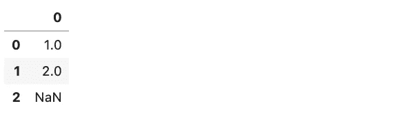
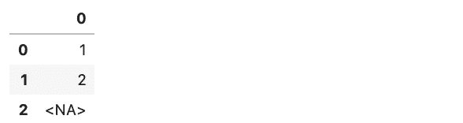

# 熊猫 1.0 有什么新功能？🐼

> 原文：<https://towardsdatascience.com/whats-new-in-pandas-1-0-ffa99bd43a58?source=collection_archive---------5----------------------->

## 你需要知道的比普通熊聪明的一切

熊猫开发团队刚刚在 2020 年 1 月 29 日正式发布了熊猫 1.0.0 版本。在本文中，我将回答您的迫切问题，讨论主要的变化，并向您展示如何从今天开始使用新版本。😀

请注意，这篇文章已经更新，以反映官方发布。🎉


普通的熊

# 熊猫

[Pandas](https://github.com/pandas-dev/pandas) 是最流行的用于清理、探索和操作数据的 Python 库。它将命名的行和列添加到 NumPy 的 [*ndarray*](https://docs.scipy.org/doc/numpy/reference/generated/numpy.ndarray.html) 数据结构中。它还增加了许多方便的方法，使处理数据变得更加容易。Pandas 是 Python 成为数据科学家和数据工程师主导语言的重要原因。


我们走吧！🚀

# 我们说的是 1.0。这是一件有很多重大变化的大事吗？

不完全是。1.0 的标签并不意味着与 0.25.3 有很大的不同，0 . 25 . 3 是截至 2020 年 1 月 22 日(本文最初撰写时)的稳定版本。你会看到，没有那么多大的变化。

1.0 版本也并不意味着这种语言已经达到了一个成熟点。Pandas 是一个相当稳定的库，已经在生产代码中使用了多年。韦斯·麦金尼从 2008 年开始在图书馆工作。 [GitHub](https://github.com/pandas-dev/pandas) 显示在撰写本文时，它已经在大约 170，000 个 GitHub 仓库中使用。👍

1.0 中的变化可能会在短期内引入更多的复杂性，但从长远来看，它们为语言打下了更好的基础。


良好的基础是一份礼物

# 有什么新鲜事？

除了通常的错误修复和小的 API 清理，熊猫 1.0.0 引入了一些主要功能。

## 警察。钠

在 pandas 0.25 中，一个数据帧可以有三个不同的值——T0、T1 或 T2——来表示缺失的数据，这取决于列的数据类型。如果你想知道细节，请看我的关于熊猫[中丢失数据值的文章](https://dev.to/discdiver/the-weird-world-of-missing-values-in-pandas-3kph)。

许多人面临的缺失值的最大问题是，一个缺失值的整数列会自动转换为 float。呀。🙀

这种现状很大程度上是由于底层 NumPy 库的能力。为了改善这种情况，pandas 开发团队创建了一个新值来表示几个 dtypes 的缺失数据。如 1.0 [文档](https://dev.pandas.io/docs/user_guide/missing_data.html)所述:

> 从 pandas 1.0 开始，可以使用一个实验性的`pd.NA`值(singleton)来表示标量缺失值。此时，它被用于可空的[整数](https://dev.pandas.io/docs/user_guide/integer_na.html)，布尔和[专用字符串](https://dev.pandas.io/docs/user_guide/text.html#text-types)数据类型中作为缺失值指示器。
> 
> `pd.NA`的目标是【提供】一个“缺失”指示器，可以在所有数据类型中一致使用(而不是根据数据类型使用`np.nan`、`None`或`pd.NaT`)。

从长远来看，缺失数据的单个值和避免将缺失数据的整数列自动转换为浮点数听起来很棒！👏从短期来看，它创造了更多需要学习和记忆的东西。

新的`pd.NA`的一个问题是，你不能直接将其与布尔条件中的值进行比较。所以没有带`pd.NA`的`==`。相反，您可以使用`df.isna()`返回数据帧中缺失值的布尔掩码。

我们来看看能装`pd.NA`的三种 dtypes。

## 可空整数数据类型

如果您想使用新的`pd.NA`并避免将 int 类型转换为 float，现在您必须指定特殊的可空整数 dtype`Int64`——注意大写的 *I* 。这个 dtype 和你所了解和喜爱的标准`int64` NumPy dtype 不一样。❤️

下面是用整数 dtype 列创建数据帧的老方法(熊猫和 NumPy 以它们通常的别名导入):

```
pd.DataFrame([1, 2, np.nan])
```

这导致了:



请注意，自动类型转换为浮点型。

下面是创建可以处理`pd.NA`的列的方法。

```
pd.DataFrame([1, 2, np.nan], dtype="Int64")
```

只需在创建系列或数据帧时指定`dtype=”Int64"`,就可以得到可空的整数数据类型。请注意不同之处:



该列仍有整数！还有新的 *<娜>。*👍

关于`int64` 和`Int64`的微妙之处 pandas 版本只有一个大写的 *I* 而现有 NumPy 版本只有一个小写的 *i* 看起来可能会引起一些混乱。☹️


迷茫？

## 布尔数据类型

如果引入了缺失值，一个`bool` dtype 列将被转换为一个`object` dtype。如果想要一个缺少`pd.NA`值的布尔整数列，那么用 dtype`boolean`指定该列。

你可以这样做:

```
pd.DataFrame([True, False, np.nan], dtype=”boolean”)
```

同样，这很酷，但是`boolean` dtype 似乎很可能与现有的`bool` dtype 混淆。

让我们看看新的`string`数据类型。


新字符串

## 字符串数据类型

一种新的、更直观的文本数据类型对我来说是个好主意，至少乍一看是这样。`object` dtype 是文本数据和任何不属于另一个类别的杂项数据的默认集合。

`string` dtype 使用`pd.NA`来表示缺失值，节省内存，并告知您只需要一列中的文本值。现在，你需要指定你想要它。你可以这样做:

```
pd.DataFrame(['a', 'b'], dtype='string')
```

这些变化的短期负面影响是，缺失值和数据类型现在有了更多的细微差别。☹️

为了使转换更容易一些，现在有了一个 pandas DataFrame 方法`convert_dtypes()`。

## 转换类型

在数据帧或系列上调用`convert_dtypes()`，pandas 将尝试将每一列转换成支持`pd.NA`的 dtype。(这些是上面讨论的新数据类型)。在[新奇的新文件](https://pandas.pydata.org/pandas-docs/stable/reference/api/pandas.DataFrame.convert_dtypes.html?highlight=convert_dtypes)中了解更多信息！

感谢凯文·马卡姆给我指出了这个方法。

因此，尽管可能有更多的细微差别需要学习，但新数据类型的好处是 pandas 在更直观地处理整个 API 中的缺失值方面迈出了一大步。对我来说，这似乎是一种必要的成长的痛苦。😀

# 其他值得注意的变化

*   这些文档有一个漂亮的新外观和一个关于[扩展到大数据集](https://dev.pandas.io/docs/user_guide/scale.html#scale)的新部分。
*   熊猫团队将开始使用语义版本化的松散变体来管理弃用、API 兼容性和版本编号。
*   您可以使用`to_markdown()`将数据帧输出为[降价](https://dev.pandas.io/docs/whatsnew/v1.0.0.html#converting-to-markdown)表。
*   像`df.info()`这样的函数的输出现在组织得更好了。
*   `pandas.util.testing`模块已被弃用。我喜欢它，因为它可以快速制作各种数据类型的数据框架。然而，您可以通过其他几种方式创建这样的数据帧，但它似乎没有得到广泛使用。从好的方面来说，这是一个少学的东西，我可以把它从我即将出版的熊猫书里删掉。📘
*   熊猫 1.0.0 支持 Python 3.6.1 及以上版本。😉


变化

# 我如何安装新版本？(截至 2020 年 1 月 29 日更新)

## 点

以下是如何用 pip 安装熊猫 1.0:

```
pip install pandas
```

就是这样！😀建议你用 Python 内置的 *venv* 创建一个虚拟环境。因此，要使用 Python 3.8 创建虚拟环境，您需要:

```
python3.8 -m venv my_env
source my_env/bin/activate
```

如果您已经安装了 pandas，您可以通过以下方式升级到 1.0:

```
pip install pandas --upgrade
```

## 康达


以下是如何用 Python 3.8 和 pandas 1.0 创建一个新的 conda 环境:

```
conda create -n my_conda_env pandas
```

或者你可以更新你当前活动的 conda 环境，如果它有熊猫的话

```
conda update pandas
```

向那些一直致力于改善熊猫的人们大声呼喊！谢谢大家！🎉


# 建议

熊猫 1.0 来了。现在正是开始使用的好时机！👍

如果你一直在关注最近的熊猫发布，并对那些弹出的警告做了些什么，更新到 1.0 应该不会太难。然而，你在以前版本的 pandas 中看到的许多警告现在会出错，所以要小心。😀

如果你想学习熊猫，我已经起草了一本关于熊猫的书。订阅我的[邮件列表](https://dataawesome.com)，确保你不会错过发布。

如果你还不知道香草 Python，先看看我的书，[难忘的 Python](https://memorablepython.com) 。

[](https://memorablepython.com)

如果你想要一份关于 conda 命令的便签，我为你我制作了这个要点。😀

# 包装

希望你觉得这个熊猫 1.0 的指南有用。如果你有，请在你最喜欢的社交媒体上分享，这样其他人也可以找到它。👍

我撰写关于数据科学、 [Docker](https://memorabledocker.com) 、 [SQL](https://memorablesql.com) 和其他技术主题的文章。如果你对此感兴趣，请关注 [me](https://medium.com/@jeffhale) ，点击阅读更多[。](https://medium.com/@jeffhale)

[](https://dataawesome.com)

熊猫快乐！🐼