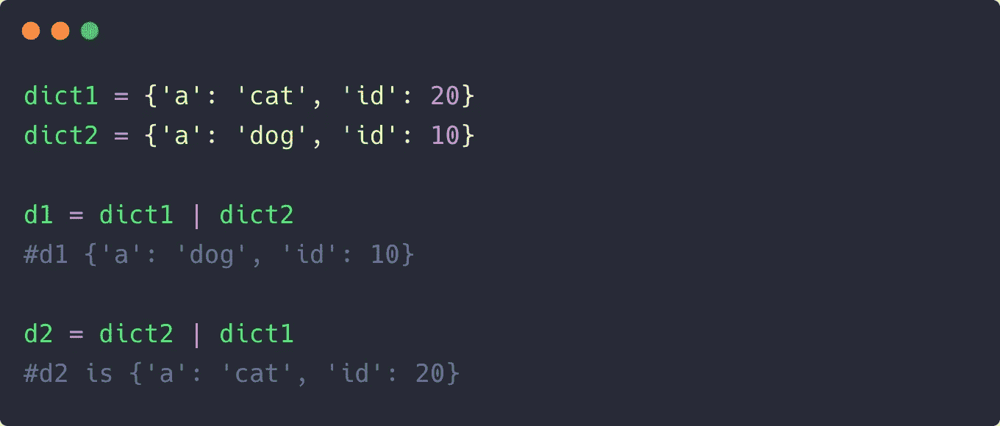

# Python 3.9 字典有什么新特性？

> 原文：<https://towardsdatascience.com/whats-new-in-python-3-9-dictionaries-ddb5d18460da?source=collection_archive---------41----------------------->

## 首先看一下新的 union 操作符，它有助于合并和更新字典


[自由库存](https://unsplash.com/@freestocks?utm_source=medium&utm_medium=referral)在 [Unsplash](https://unsplash.com?utm_source=medium&utm_medium=referral) 上的照片

Python 3.9 目前处于测试阶段，预计将于 2020 年 10 月发布，有很多东西值得期待。对于急切等待更新的 Python 开发人员来说，有一些有趣的补充，可以是新的字符串方法、拓扑排序或类型提示。

但是对我来说最突出的是新的 union 操作符，它提供了一种更简洁的方式来合并或更新字典。在接下来的几节中，我们将看看新的 union 操作符如何使操作字典变得更加简单和简洁。

# 合并或更新 Python 字典的旧方法

字典是一种内置的 Python 数据类型，用于保存可变的、插入有序的键值对集合。在 Python 3.8 之前，我们通常使用`update`方法或`**`解包操作符，但是更新字典最简单的方法是插入一个键值对，如下所示:

```
d1 = {'a': 'Cat', 'b': 10}
d1['type'] = 'animal'
{'a': 'Cat', 'b': 10, 'type': 'animal'}
```

但是在用多个新的键-值对更新字典时，这并不会让我们走得太远。

在这种情况下，`update()`方法显然是更好的选择:

```
dict1 = {'a': 'Cat', 'b': 10}dict2 = {'c': 'Dog', 'd': 11}dict1.update(dict2)
#prints {'a': 'Cat', 'b': 10, 'c': 'Dog', 'd': 11}
```

虽然上面的方法对于更新字典很有效，但是对于合并字典，您需要依靠`copy()`方法。这是因为`update()`方法就地执行，会修改原始字典。因此，您必须创建第一个字典的克隆，以便在不进行修改的情况下进行合并，如下所示:

```
d3 = d1.copy()
d3.update(d2)
```

这看起来不错，但不是 pythonic 式的。通过使用双星号操作符`**`在单行代码中合并字典，我们可以做得更好。

```
dict4 = {**dict1, **dict2, **dict3}
#or
d3 = dict(d1, **d2)
```

虽然上面的方法很有效，当然也很简洁，但是有一个警告。对于像 Python 这样以可读性赢得加分的高级语言来说，上面的解包操作符对许多开发人员来说可能很难看。

难怪 Python 3.9 中有两个新的 union 操作符。

# 新字典运算符

Python 3.9 以`|`和`|+`的形式引入了新的 clean union 操作符，分别用于合并和更新字典。

为了合并两个字典，我们像这样使用操作符:

```
d3 = d1 | d2
```

上面的操作符整齐地修剪了`copy()`和`update()`方法。此外，该操作符在 Python 中带来了一致的行为，因为它已经用于合并两个集合。

同时，我们可以通过使用`|=`操作符来使用字典的就地合并或更新。它的工作方式与扩充赋值操作符`+=`相同。

```
d1 |= d2
#equivalent to
d1 = d1 | d2
```

如果我们在两个或更多字典中有公共键，那么在合并或更新操作中会从第二个或最后一个字典中选取键值。



重要的是要注意插入顺序的重要性，正如我们在上面看到的。

# 结束语

Python 3.9 中推出的新的 union 操作符虽然很小，但是很受欢迎。好的一面是，在合并字典和可重复项时，它们也能工作。

这一次到此为止。感谢阅读。