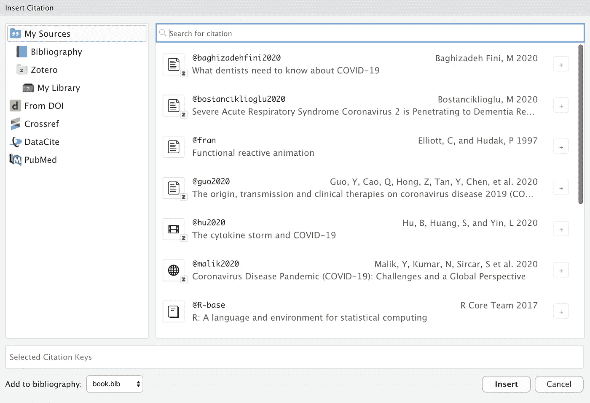
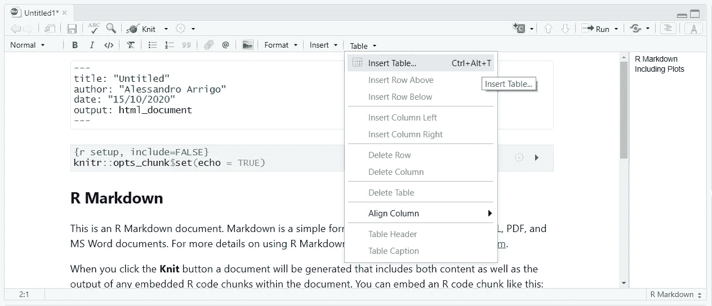
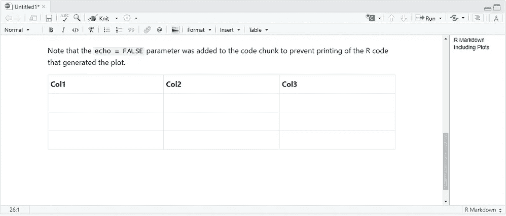
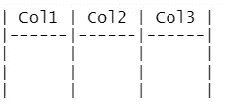
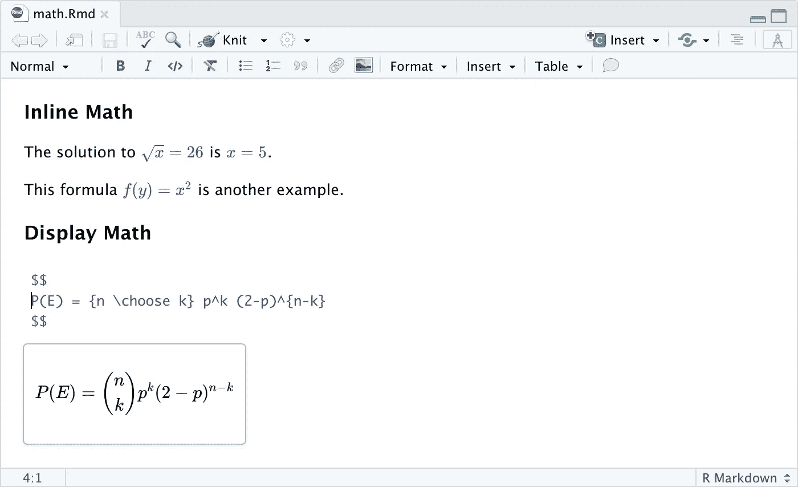
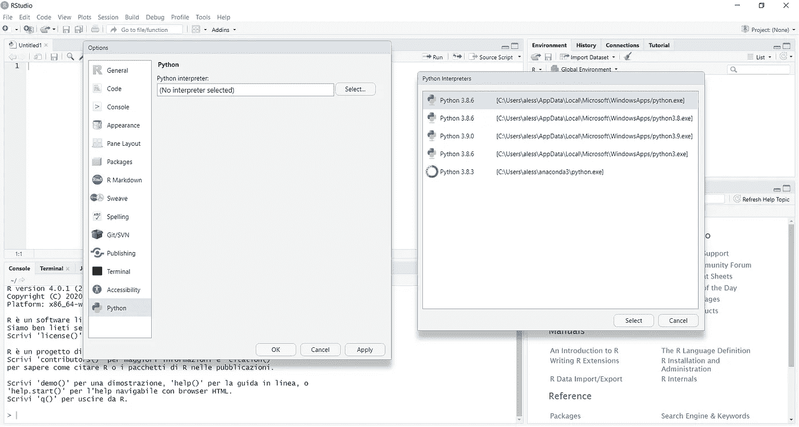
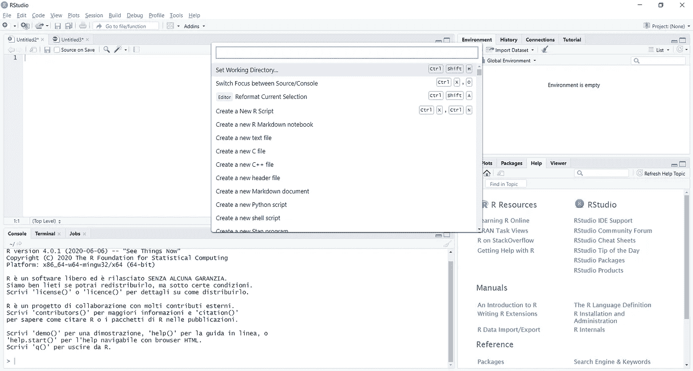
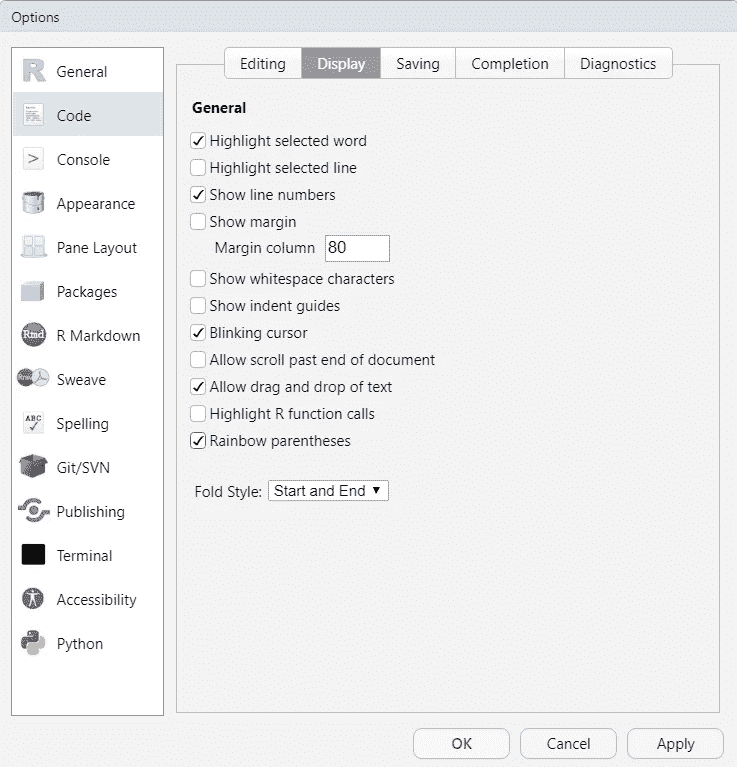
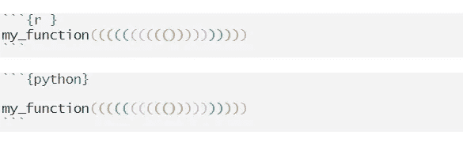

# RStudio v1.4 版的新功能(预览版)

> 原文：<https://towardsdatascience.com/whats-new-in-rstudio-v1-4-preview-5611f08c6233?source=collection_archive---------28----------------------->

## Python 支持、可视化 RMarkdown 编辑和许多很酷的东西

由[克里斯多夫·高尔](https://unsplash.com/@cgower?utm_source=medium&utm_medium=referral)在 [Unsplash](https://unsplash.com?utm_source=medium&utm_medium=referral) 上拍摄

不到六个月前，RStudio 发布了最后一个稳定版本(1.3)，但最近发布了 r studio 1.4 版的功能预览。看起来我们将会有关于两个关键点的重要消息:带有 markdown 的可视化文档版本和 Python 的使用。

如果您想提前试用新版本，请点击链接并下载该软件的预览版(非最终版或稳定版):

 [## RStudio 预览

### RStudio v1.4.904-1 预览版-发行说明这是 RStudio 1.4 的预览版，是 RStudio 的主要新版本。

rstudio.com](https://rstudio.com/products/rstudio/download/preview/) 

看起来在这个 1.4 版本中我们会有重要的变化和新的特性:

*   用于 R Markdown 文档的新的**可视化编辑器**
*   改进了对 Python 的支持，包括 Python 的**环境面板**和 Python 对象的可视化
*   工作台生产率的提高，包括一个**命令面板**和**彩虹括号**
*   更具可配置性的工作空间，具有**额外的源列和改进的可访问性**
*   在 RStudio Server Pro 中支持 **SAML** 和 **OpenID** 认证，以及对 **VS 代码**会话的实验性支持

你可以在他们的[网站](https://rstudio.com/products/rstudio/download/preview-release-notes/)上阅读完整的发行说明。

让我们开始吧！

# ✍️视觉降价编辑

R markdown 是我每天坚持使用 Rstudio 的原因。从版本 1.4 开始，此功能更深入地集成到系统中，允许您查看文档中的动态变化，而无需每两分钟编织一次文档。

资料来源:RStudio

此更改不是强制性的，您可以使用编辑器工具栏右上角的一个按钮从可视编辑器切换回 classic R markdown 文档。

任何可以在 pandoc markdown 中表达的东西(包括表格、脚注、属性等。)可以在可视模式下编辑。此外，还有许多旨在创作技术内容的生产力增强，如嵌入式代码、等式、引用、交叉引用和内联 HTML/LaTeX。

让我们来看几个新特性:

## 引文

可视模式使用引用的标准 Pandoc 标记表示法(例如`[@citation]`)。可以从各种来源插入引文:

*   您的文档参考书目。
*   [Zotero](https://blog.rstudio.com/2020/09/30/rstudio-v1-4-preview-visual-markdown-editing/#citations-from-zotero) 个人或团体图书馆。
*   [DOI](https://blog.rstudio.com/2020/09/30/rstudio-v1-4-preview-visual-markdown-editing/#citations-from-dois) (文档对象标识符)引用。
*   搜索[交叉引用](https://www.crossref.org/)、[数据引用](https://datacite.org/)或 [PubMed](https://pubmed.ncbi.nlm.nih.gov/) 。

资料来源:RStudio

如果您插入来自 Zotero、DOI 查找或搜索的引文，它们会自动添加到您的文档参考书目中。

这会让写报告快很多。

## 桌子

现在，您有一个专门的部分来处理表。插入它们，编辑它们，做你通常做的任何事情，但是更快。

来源:作者

来源:作者

不再有愚蠢的内嵌式绘画，比如:

## 乳液

新的可视化编辑器也适用于方程式。现在你可以写乳胶公式，并立即看到，如果像我一样错过了一些花括号。

资料来源:RStudio

要查看新的可视化编辑器的所有特性，请查看精美的文档[。](https://rstudio.github.io/visual-markdown-editing/#/)

# 🐍Python 集成

RStudio 1.4 版本引入了许多功能，这些功能将进一步改善 Python 编辑体验。

当使用 **reticulate** 时，通常使用 reticulate 函数选择 Python 解释器——例如，通过`reticulate::use_python(…, required = TRUE)`或通过设置`RETICULATE_PYTHON`环境变量。(或者，他们信任 **r** eticulate 找到并激活他们系统上可用的适当版本的 Python。)

然而，人们可能想要控制 Python 的版本，而不明确地使用 reticulate 来配置活动的 Python 会话。RStudio 现在提供了一个 Python 选项面板，既可以全局(通过`Tools -> Global Options…`)使用，也可以按项目(通过`Tools -> Project Options…`)使用，可以用来配置 RStudio 中使用的默认 Python 版本。

在 Python 首选项窗格中，可以查看和修改 RStudio 使用的默认 Python 解释器:

来源:作者

此外，当`reticulate` REPL 处于活动状态时，RStudio 环境窗格现在能够显示 Python 模块的内容。默认情况下，显示主模块的内容。

来源:作者

# 🔎命令选项板

命令选项板是一种软件启示，它提供对程序所有命令的即时、可搜索的访问。可以使用键盘快捷键 Ctrl + Shift + P(在 macOS 上为 Cmd + Shift + P)来调用调色板。

也可以在*工具*菜单中找到(*工具*->-*显示命令面板*)。

首先也是最重要的一点，命令调板是一种只需几次击键即可快速搜索和调用 RStudio 命令的方法。每个 RStudio 命令都在调色板中，除非它在当前模式下被显式隐藏。这将提高速度，因为从调色板中快速击几下键来调用命令通常比使用鼠标或进入菜单要快得多。

# 🌈彩虹括号

你是否曾经错过在一个长函数中关闭一个括号或者编辑你的代码(或者从 StackOverflow 中复制粘贴)？现在，这可能是一个过去的噩梦。

在全局选项面板中，您现在可以启用彩虹括号选项:

来源:作者

结果是这样的:

来源:作者

它对 R 和 Python 脚本都有效，并且会使括号匹配变得非常容易。

# 参考

编辑视觉—[https://blog . r studio . com/2020/09/30/r studio-v1-4-preview-Visual-markdown-editing/](https://blog.rstudio.com/2020/09/30/rstudio-v1-4-preview-visual-markdown-editing/)

python—[https://blog . r studio . com/2020/10/07/r studio-v1-4-preview-python-support/](https://blog.rstudio.com/2020/10/07/rstudio-v1-4-preview-python-support/)

命令面板—[https://blog . r studio . com/2020/10/14/r studio-v1-4-preview-command-Palette/](https://blog.rstudio.com/2020/10/14/rstudio-v1-4-preview-command-palette/)