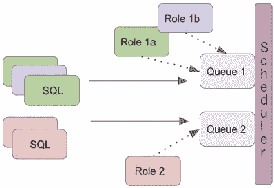
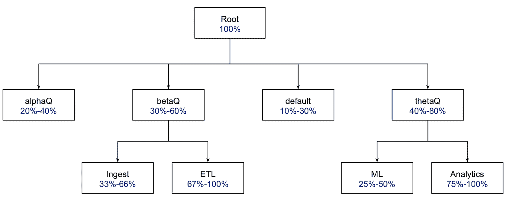
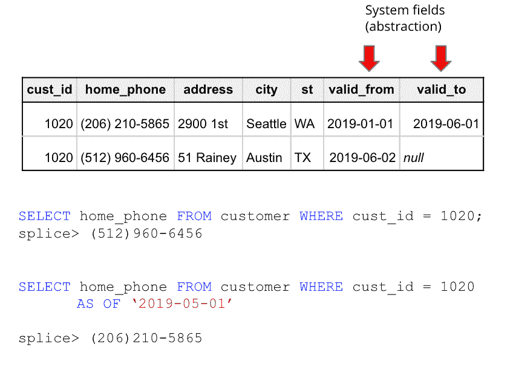
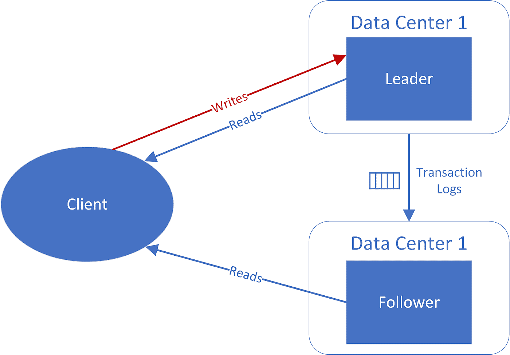
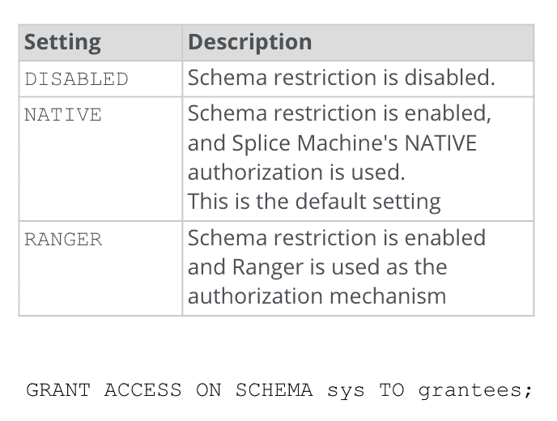
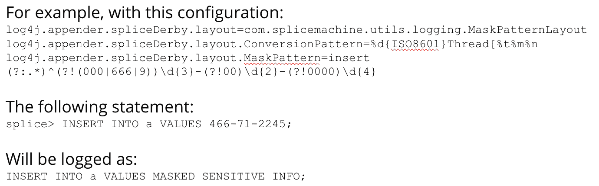
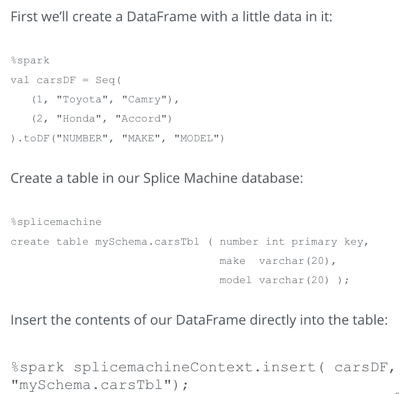

# 拼接机 3.0 的新功能

> 原文：<https://towardsdatascience.com/whats-new-in-splice-machine-3-0-9047556c3390?source=collection_archive---------44----------------------->

## Splice Machine 3.0 增加了地理复制、Kubernetes 支持、时间旅行、Jupyter 笔记本、DB 内机器学习模型部署等等

Splice Machine 是数据库管理系统(DBMS)市场中一个相对较新的细分市场的一部分，在这个市场中，交易和分析功能集中在一起。2013 年 7 月，Gartner 使用术语 *HTAP* 或混合交易分析处理来描述这一新兴细分市场。弗雷斯特称之为*易位*。今天，Splice Machine 宣布发布其平台的最新版本，Splice Machine 3.0。这份新闻稿证明了自分析师创造出这些词汇以来，我们已经取得了多大的进步。Splice Machine 是一个集成平台，企业可以使用它来支持其任务关键型运营应用程序，以及用作管理报告的决策支持系统和构建机器学习模型，所有这些都在一个无缝集成的平台上。

使用集成平台的好处是:

1.  弹性可扩展性
2.  显著降低开发和许可成本
3.  最小 ETL 延迟
4.  AI/ML 更快的上市时间
5.  能够通过现代化来延长传统应用程序的寿命

在 3.0 版本中，我们在添加特性和功能方面迈出了重大步伐，这些特性和功能将使我们的平台能够被企业用来实现其关键任务应用的现代化。凭借全面的 SQL 支持、出色的事务性和分析性工作负载性能、内置的机器学习功能以及内部和云中的统一部署体验，Splice Machine 3.0 在应用程序现代化数据库方面具有独特的定位。

Splice Machine 3.0 为应用程序开发人员、开发人员/数据库管理员、分析师、数据工程师和数据科学家提供企业级功能。在 3.0 版中，DBA 将能够使用分析资源队列按角色分配分析资源，以便特定用户的工作负载获得足够的资源。这有助于确保高优先级工作负载的性能，也有助于在不同的业务组织之间分配计算资源。Splice Machine 3.0 通过主动-被动故障转移来保护业务数据，并在面临自然灾害、基础设施故障和用户错误时确保业务连续性和高可用性。在 Splice Machine 3.0 中，我们通过提供编辑敏感业务数据的能力，提供了广泛的高级安全选项。

Splice Machine 3.0 的标准 ODBC/JDBC 接口使分析师能够集成他们选择的商业智能和数据可视化工具，并提供对数据科学家创建的笔记本的访问，以执行假设分析。3.0 版提供了我们的 ML Manager 2.0，它支持端到端的数据科学工作流，具有前所未有的操作 ML 的简便性，新的原生 JupyterLab 笔记本，以及跟踪 ML 实验的新功能。

Splice Machine 3.0 显著降低了 IT 组织管理运营、分析和 ML/AI 工作负载的负担，以支持历史报告的分析查询和运营记录系统用例。这大大减少了维护该架构所需的实施时间和数据工程师的数量。对于计划从专有数据库迁移的组织，Splice Machine 3.0 通过详尽的 SQL 实施，包括对一些专有 SQL 扩展的支持，提供了遗留数据库的无缝替换。Splice Machine 3.0 提供了与基础设施无关的部署，可以灵活地部署在内部或云上。

拼接机 3.0 在多个功能领域进行了重大改进，包括:

*   工作量管理
*   SQL 覆盖率
*   复制和高可用性
*   安全性
*   数据科学生产力
*   Kubernetes 支持

让我们来详细探讨其中的每一个。

**工作量管理**

*   **应用服务器队列:**该特性支持使用多个 OLAP(在线分析处理)队列，允许用户为特定查询预留集群容量，跟踪每个服务器/角色消耗的资源，并为特定种类的查询和组织管理资源容量。该功能允许用户相互隔离工作负载，以确保即使在多个资源密集型查询同时运行时也有足够的资源可用。

*Splice Machine 3.0 引入了应用服务器队列(asq)来提供工作负载管理和隔离。*

*公平调度器使集群上的所有应用程序都能获得同等份额的集群资源。容量调度程序为用户指定最小或最大容量*

**SQL 覆盖率**

*   **对特定于 DB2 的 SQL 语法的支持:** Splice DB 3.0 现在支持许多特定于 DB2 的扩展，这使得通过最少的 SQL 重写就可以轻松地从 DB2 进行迁移。例子包括支持 DB2 触发器语法、错误代码、文本操作语法等。
*   **全外连接支持:**全外连接是一些 SQL 语言中的一个连接选项，可以通过使用以前的 Splice DB 语法重写查询来实现，但现在在 Splice DB 3.0 中直接支持。这将消除重写针对使用这种语法的遗留数据库编写的查询的需要。
*   **时间旅行—时间点查询:** Splice DB 3.0 支持强大的新 SQL 语法扩展，允许数据库用户查询过去某个时间的数据库。这种功能在很多情况下都非常有用。它可用于在处理缓慢变化的维度时支持灵活性，支持各种数据审计场景，了解用户所做的可能需要取消的更改，再现历史报告，以及分析一段时间内的趋势。

*时间点查询或时间旅行查询允许数据库用户查询过去某个时间点的数据*

*   **增强的触发器支持:**Splice Machine 3.0 为触发器提供了新的选项，允许更灵活地处理可触发自动操作的事件，以及作为这些触发器的结果可采取的操作。

**复制和高可用性**

*   **主动-被动复制:**在此版本中，Splice DB 支持通过主动-被动复制自动保持同步的多个数据库集群，以实现严格的恢复点目标(RPO)和恢复时间目标(RTO)。

*Splice DB 3.0 包括异步、主动/被动复制*

**安全**

*   **模式访问限制:**允许限制对属于指定模式的对象的访问，这样，如果没有适当的管理权限，其他用户就无法查看、访问甚至了解这些对象的存在。

*必须明确授权用户访问 sys 模式，或者必须禁用模式限制配置。*

*   **日志编校的定制模式匹配:**该特性允许用户使用正则表达式定义的模式来编校系统日志中的敏感信息。

*可以通过定义“掩码”将日志配置为自动识别和编辑敏感信息*

**数据科学生产力**

1.  **对 Jupyter 笔记本的支持:** Jupyter 笔记本是目前最流行的开源笔记本实现。在拼接 DB 3.0 Jupyter 笔记本电脑是标准。Splice 的本地 Jupyter 支持来自 JupyterHub 和 BeakerX。

*   JupyterHub 是向多个用户提供 Jupyter 笔记本的最佳方式。每个用户都有自己的专用服务器来托管、存储和运行他们的 Jupyter 笔记本电脑，并且保证用户与其他人隔离。由于增加了链接 GitHub 帐户的功能，用户可以轻松共享笔记本电脑，从而加快协作和开发速度。
*   BeakerX 是位于 Jupyter 之上的一个附加层，提供了许多强大的功能:
*   多语言编程。每种语言都有独立的内核，Splice Machine 允许在一个 Jupyter 笔记本中用多种不同的语言编程，从 SQL 到 R 到 Python 甚至 Java 和 Scala。这极大地增加了开发时间，因为它允许特性工程和实验在同一个地方进行。
*   跨内核变量可用性。BeakerX 的全局名称空间为构建跨语言模型创造了机会。您可以将变量存储到 Python 内核中的全局 beakerx 对象中，并在 r 内核中访问这些数据。您甚至可以在 SQL 中选择一个变量，并从任何其他内核中访问它。这一强大的功能为任何想要快速进入并分析其数据子集的数据科学家节省了大量时间。

2.**模型工作流管理**

*   通过我们基于 MLFlow 的新 MLManager 平台，我们已经结束了机器学习生命周期。我们改进的 API 使管理您的 ML 开发变得更快更容易，从模型参数和指标的批量记录到管道阶段和特性转换的完全可见性。只需添加几行代码，您就可以在几秒钟内重新创建任何 ML 管道。
*   因为一切都存储在 Splice DB 中，所以维护模型的治理特别容易。通过直接访问培训和测试表，您可以确保新模型与当前部署的模型基于相同的数据进行评估。
*   新的数据库内事务性机器学习模型部署—具有一个基于数据库触发器的数据实时评分功能。
*   MLFlow 1.1.0
*   与平台无关:模型、工件和元数据保存在 Splice DB 中
*   对 SQL 炼金术的拼接支持

**重大平台升级**

*   **支持 Cloudera 6.3 和 HWX 3.2.3**
*   **Apache Spark 和 Apache HBase 的最新版本:** Splice Machine 3.0 使用户能够利用 HDFS 3.0、HBase 2.0 和 Spark 2.4.1 提供的底层功能

**Kubernetes 支持—原生 Spark 数据源(NSDS)**

Splice 使数据工程师和数据科学家能够使用熟悉的火花模式，通过数据帧与数据库进行交互。NSDS 2.0 通过容器/网络边界将数据帧流式传输到 Splice，提供了一种在 Kafka 后台实施的高吞吐量解决方案。

*NSDS 支持数据工程师和数据科学家对 Spark 数据帧进行拼接操作，避免了 JDBC/ODBC 协议 serde 和网络开销。*

要观看拼接机器 3.0 的运行，请注册参加[网络研讨会](https://info.splicemachine.com/splice-machine-db-3-webinar.html?utm_source=blog&utm_medium=website&utm_campaign=3.0)。