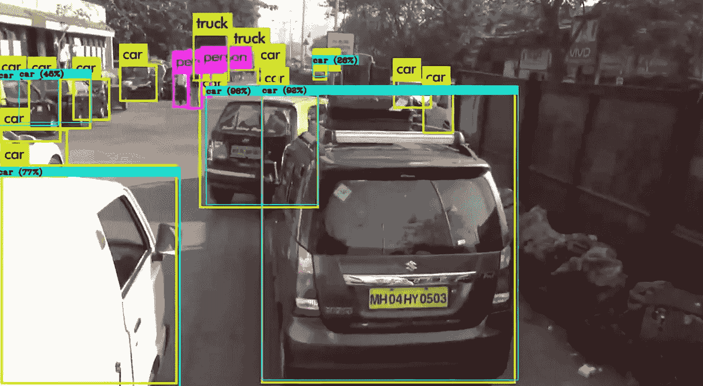
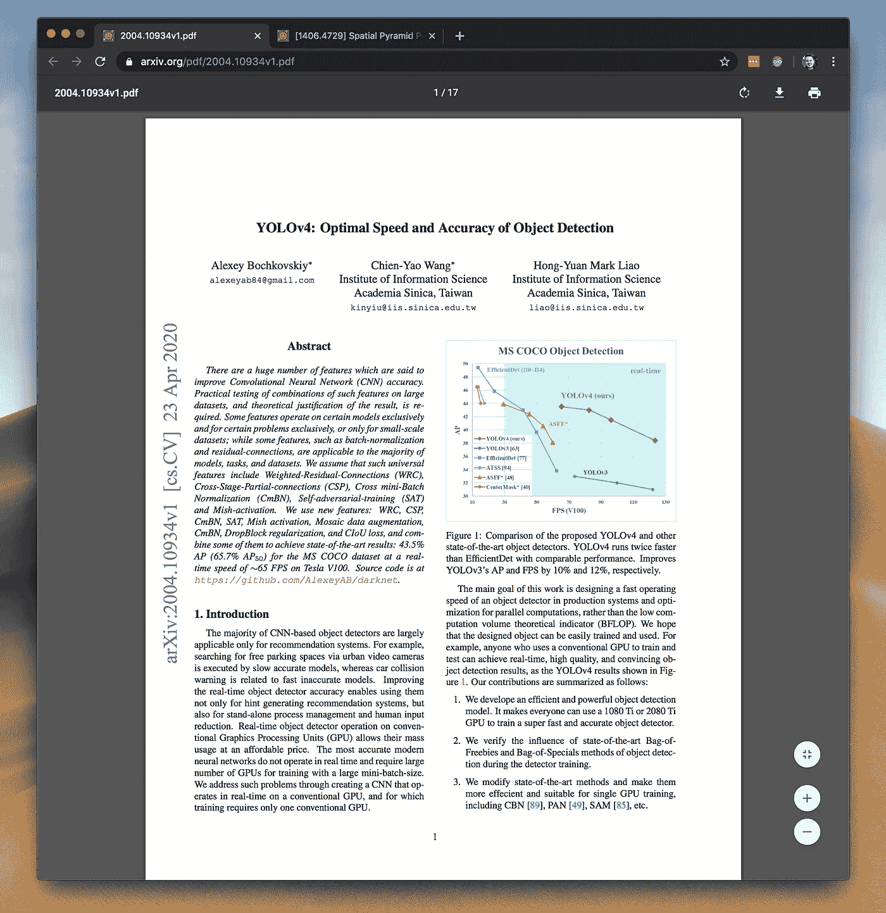

# YOLOv4 有什么新功能？

> 原文：<https://towardsdatascience.com/whats-new-in-yolov4-323364bb3ad3?source=collection_archive---------6----------------------->

## YOLO 是一个实时物体识别系统，可以在一个帧中识别多个物体——而且它还变得更好了！



YOLO 实时检测视频中的对象。

# 什么是 YOLO？

YOLO 是你只看一次的简称。这是一个实时对象识别系统，可以在单个帧中识别多个对象。YOLO 识别物体比其他识别系统更准确、更快速。它可以预测多达 9000 个类，甚至看不见的类。实时识别系统将从图像中识别多个对象，并在对象周围创建边界框。它可以很容易地在生产系统中训练和部署。

**这里有几个你可能感兴趣的链接:**

```
- [Complete your Python analyses 10x faster with Mito](https://trymito.io/) [Product]- [Free skill tests for Data Scientists & ML Engineers](https://aigents.co/skills) [Test]- [All New Self-Driving Car Engineer Nanodegree](https://imp.i115008.net/c/2402645/1116216/11298)[Course]
```

*你愿意多读一些这样的文章吗？如果是这样，你可以点击上面的任何链接来支持我。其中一些是附属链接，但你不需要购买任何东西。*

# YOLO 是如何工作的？

YOLO 是基于一个单一的卷积神经网络(CNN)。CNN 将图像划分成区域，然后预测每个区域的边界框和概率。它同时预测这些类别的多个边界框和概率。YOLO 在训练和测试期间看到整个图像，因此它隐式地编码了关于类及其外观的上下文信息。

YOLO v3 对 YOLO v4

# 谁开发了 YOLO？

YOLO 是由[约瑟夫·雷德蒙](https://pjreddie.com/)开发的。2016 年推出的 YOLO 实时物体识别系统是物体识别研究的基石。这导致了更好更快的计算机视觉算法。

# YOLOv4 是谁开发的？

YOLO v4 由阿列克谢·博奇科夫斯基、钱和廖宏远三位开发人员开发。

# 为什么 Joseph Redmon 不开发 YOLOv4？

他放弃了开发 YOLO v4，因为他的技术可能被滥用。他特别提到“军事应用和数据保护问题”。他停止了对计算机视觉的研究，因为他发现其中涉及的伦理问题“变得无法忽视”。

# YOLOv4 有什么新功能？



[YOLOv4:物体检测的最佳速度和精度](https://arxiv.org/pdf/2004.10934v1.pdf)

YOLOv4 的架构由 CSPDarknet53 作为主干，空间金字塔池附加模块，PANet 路径聚合颈和 YOLOv3 头组成。

CSPDarknet53 是一种能够增强 CNN 学习能力的新型主干。在 CSPDarknet53 上添加了[空间金字塔池](https://arxiv.org/abs/1406.4729)块，以增加感受野并分离出最重要的上下文特征。PANet 取代了 YOLOv3 中用于目标检测的特征金字塔网络(FPN ),用作不同检测器级别的参数聚合方法。

# 什么是成绩的提高？

YOLOv4 的速度是 EfficientDet(竞争识别模型)的两倍，但性能相当。此外，AP(平均精度)和 FPS(每秒帧数)相比 YOLOv3 分别提高了 10%和 12%。

# 结论

YOLO 是一种未来主义的识别器，具有更快的 FPS，比现有的探测器更准确。该检测器可以在传统的 GPU 上训练和使用，这使得广泛采用成为可能。YOLOv4 中的新功能提高了分类器和检测器的准确性，并可用于其他研究项目。

# 参考

*   [YOLOv4:物体检测的最佳速度和精度](https://arxiv.org/pdf/2004.10934v1.pdf)
*   YOLO 回来了！版本 4 拥有改进的速度和准确性
*   [YOLO 创始人 Joseph Redmon 因伦理问题停止了简历研究](https://syncedreview.com/2020/02/24/yolo-creator-says-he-stopped-cv-research-due-to-ethical-concerns/)

# 在你走之前

在 [Twitter](https://twitter.com/romanorac) 上关注我，在那里我定期[发布关于数据科学和机器学习的](https://twitter.com/romanorac/status/1328952374447267843)消息。


照片由[Courtney hedge](https://unsplash.com/@cmhedger?utm_source=medium&utm_medium=referral)在 [Unsplash](https://unsplash.com/?utm_source=medium&utm_medium=referral) 拍摄