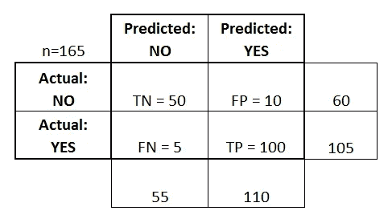
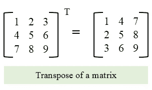
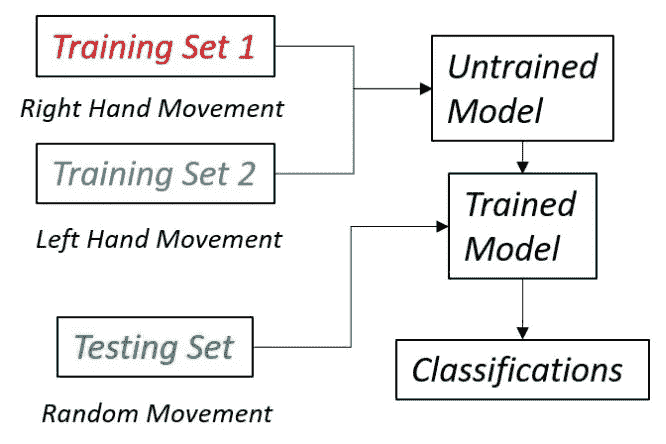
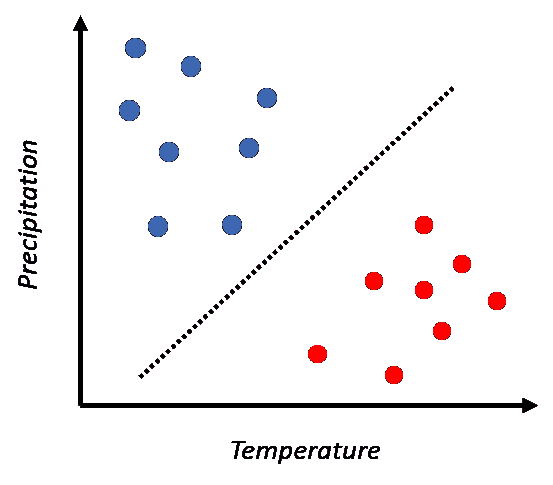
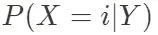
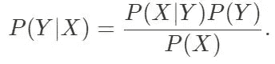
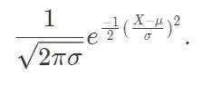
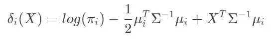
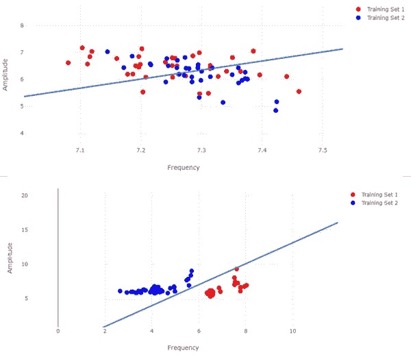
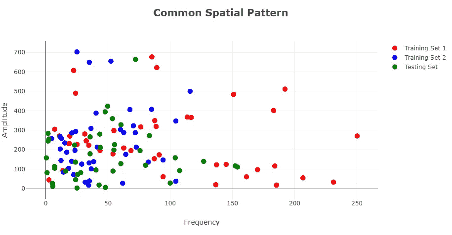

# 你在想什么？

> 原文：<https://towardsdatascience.com/whats-on-your-mind-a8f556af8839?source=collection_archive---------57----------------------->

## 皮质

## 第 2 部分:运动想象的机器学习

图片来源:chombosan | Getty Images

> 第 1 部分，共 4 部分:大脑计算机界面之旅的开始
> 
> 第 2 部分，共 4 部分:运动想象的机器学习

当我们还是孩子的时候，世界对我们来说是新的。我们不能理解它，但我们可以用我们的感觉器官看到它，触摸它，闻到它，以及更多。除了翻译。但是随着年龄的增长，我们的老师、父母等等。教会我们社会和物质世界是如何运作的，让我们最终形成新的视角来理解我们周围的世界。随着大数据和不断改进的计算机器时代的到来，研究人员开始以同样的方式思考机器；空白的石板，当美联储收集数据(充当老师)，它可以开始形成关于数据集描述的系统的新见解。尤其是这方面最著名的例子是 IBM 的[沃森](https://www.ibm.com/watson)，一种能够提取重要数据并提供分析和见解以预测工作场所和行业结果的人工智能。沃森是使用大型金融和企业数据集进行训练的，使其能够提供人类因大量数据而无法检测到的洞察力。随着机器智能的这些进步，研究人员已经开始在不同领域使用学习系统，特别是神经科学和神经计算领域。诸如线性判别分析(LDA)和支持向量机(SVM)之类的机器学习算法可以用于检测脑电波中的模式，这些模式可以导致运动和情绪状态分类。

这个系列试图让一个在脑机接口(BCI)领域没有专业知识的人了解他们是什么，以及我们如何使用机器学习以独特的方式分析脑电波。本系列探索的项目是与阿拉巴马大学人类技术互动实验室的[克里斯·克劳福德](http://cs.ua.edu/people/crawford/)博士合作的。这也证明了业余科学家可以使用基本的脑电图(EEG)设备来提取和分析脑电波，进而可以部署大规模的开源平台，以便公众可以用自己的大脑数据进行实验。

在这里，我们将涵盖机器学习背后的基础知识及其在脑波分类中的应用:

1.  *BCI.js* 简介:我们将过一遍 [*BCI.js*](https://bci.js.org/) ，一个动态高效的库，用于对脑电波数据运行基本的机器学习算法。
2.  实验流程:在我们进入算法本身之前，建立一个实验流程将有助于我们理解运行这些算法所必需的设置。
3.  线性判别分析(LDA)和公共空间模式(CSP):我们将探索这两种机器学习算法，以及它们可以给我们的运动和情绪状态分类的洞察力。

为了实现本文中描述的项目部分，您将需要以下内容:

*   对 JavaScript/React 以及如何使用 React 组件创建组件树有初步了解。这里是 [React 文档](https://reactjs.org/docs/getting-started.html)。
*   一个 Chrome 浏览器和一个 [Muse EEG 版本 2](https://choosemuse.com/muse-2/)

本系列的第 1 部分探讨了 Muse EEG、蓝牙系统和项目架构；这里可以看[。](/connecting-your-thoughts-9ebb24b4c68d)

# BCI.js:一个强大的机器学习库

一个基于 EEG 的 BCI 项目从使用电极系统或小型硬件解决方案(如 Muse EEG)收集神经系统数据开始。然后，这些数据被传输到 MATLAB 等计算环境中，在那里用傅里叶变换(将在本系列的后面讨论)等过滤算法和 LDA 等分类算法进行处理。阿拉巴马大学人类技术互动实验室的研究人员意识到，MATLAB 对脑电波的分析不是模块化的，不能分布在采用这种数学建模的应用程序中。他们试图将这些算法移植到更模块化的编程语言中，如 C 语言，但这对编程新手来说很难实现，而且学习曲线很陡。 [*BCI.js*](https://bci.js.org/) 就是为了解决这些问题而开发出来的；它是一个 JavaScript 库，可移植且相对易于使用，是开源的，并且可以很容易地与现有的应用程序集成。

*BCI.js* 包含许多可以帮助脑机接口应用开发的模块，但最重要的是用于机器学习算法的*学习*和*分类*函数、*混淆矩阵*函数和*转置*函数。*学习*和*分类*功能代表机器学习系统的两个主要阶段:学习和分类。在我们之前的类比中，学习步骤旨在充当教师，向系统提供数据，目的是在能够从新数据中得出自己的结论之前，向程序传授有关环境的知识。在分类步骤中，程序能够根据新的数据集以及从训练数据中学习到的信息来识别某些模式。为了说明这一点，我们将以线性判别分析(LDA)为例。LDA 是一种算法，它在两个数据类之间绘制一个边界，允许对新数据进行分类。我们将在本文的后面讨论 LDA 背后的数学，但是由于这是一个 *learn* 和 *classify* 函数的例子，这个定义已经足够了。下面是用于从现有数据中学习和对新数据进行分类的 LDA 函数的示例。类别 1 和 2 分别代表范围从 0 到 2 和 7 到 10 的两类数据点。 *ldaParams* 是存储从 *ldaLearn* 函数学习到的优化函数的变量，predictions 存储*未知点*所属类的分类向量。我们将在下一节中介绍优化函数以及 LDA 实际上是如何学习的，但只需知道 *BCI.js* 为机器学习算法提供了简单的实现，不需要深入的数学或统计知识。

混淆矩阵函数是 BCI.js 必须提供的第二个最重要的函数。混淆矩阵是分类系统上的性能度量，其利用分类结果的识别作为假阳性/阴性和真阳性/阴性。混淆矩阵的术语可能很难，但是这里的[是让你熟悉这些术语的资源。](https://www.dataschool.io/simple-guide-to-confusion-matrix-terminology/)

混淆矩阵示例

这个混淆矩阵将允许我们分析我们的机器学习模型的性能，并调整系统，以最小化系统中的假阳性和假阴性的数量。下一个最重要的，也可能是最简单的函数是*转置*函数，它做一件基本的事情:翻转一个对角线上的矩阵(从左上延伸到右下),同时保持元素的原始顺序。在大多数矩阵中，左上、中、右下的元素在转置时保持在它们的原始位置，因此原始元素顺序保持不变。*转置*功能很有用，因为它允许一个矩阵满足矩阵乘法的要求(参见[这里的](https://textbooks.math.gatech.edu/ila/matrix-multiplication.html)以深入了解乘法时矩阵的维数)。

由 [Codeforwin](https://codeforwin.org/2015/08/c-program-to-find-transpose-of-matrix.html) 提供

四个函数， *learn* 和 *classify* 、*混淆矩阵*和 *transpose、*在对大脑数据运行机器学习模型时极其高效。它还允许实时处理，由 *BCI.js* 实现的一些机器学习算法只需不到 4 毫秒即可完成。考虑到一些机器学习模型可能需要几个小时的训练， *BCI.js* 允许极快高效的实验。现在我们已经建立了这四个函数，我们将介绍实验流程和 LDA 以及公共空间算法(CSP ),以便我们可以开始在大脑数据上实现它们，用于运动状态分类。

如果你有兴趣回顾脑电图数据使用的其他常见分类策略，请查阅这篇论文:[分类系统 10 年回顾](https://iopscience.iop.org/article/10.1088/1741-2552/aab2f2/meta)。

# 实验流程

在我们进入关于这两种机器学习算法的技术细节之前，让我们先回顾一下。一旦系统开发完成，应该如何进行实验？我们可以使用机器学习模型的基本轮廓作为我们协议的基础；我们知道它需要一个训练阶段和一个测试阶段。如前所述，训练阶段“教导”模型理解标记的数据，以便在测试阶段，它可以在新数据中搜索和识别相似的模式。可以根据这个概念建立一个协议；我们需要一系列的训练和测试阶段来深入了解特定的认知任务。在这个项目和系列中，主要的认知任务集中在运动想象上，因为我有兴趣探索用 Muse 检测想象运动的可行性。

> 这个硬件不是为运动想象而设计的，但对于简单的运动任务来说已经足够了。[这里](https://www.sciencedirect.com/topics/neuroscience/premotor-cortex#:~:text=The%20premotor%20cortex%2C%20which%20is,neurons%20in%20the%20spinal%20cord.)是对前运动皮层和检测想象运动的硬件的回顾。

在本节中，我将使用右手和左手运动检测的例子来描述一个理想的实验流程，然后您可以推断出不同的认知活动的分类。

在右手与左手运动检测中，我们的目标是识别对象是在移动他/她的右手还是左手(甚至是两者的混合)。我们可以通过建立两个训练集和一个测试集来实现这一点:一个训练集用于右手数据，另一个用于左手数据，一个测试集用于测试阶段的未知数据点。在时间上，我们把它分成三个块，受试者记录他们自己移动右手一段时间，然后是左手，然后是他们希望模型分类的手部动作。例如，受试者 A 在记录期间移动他们的右手，然后移动他们的左手，对于测试集，他们决定只移动他们的右手。在对测试集中描述的运动进行分类之前，模型有足够的时间用两个训练集来训练自己。下面是实验流程的架构图。

实验流程

在[第 1 部分](/connecting-your-thoughts-9ebb24b4c68d)中，我提到为了节省计算时间，我们将存储在训练和测试集中的数据点(缓冲区)数量限制在 2000 左右。您可以随时增加或减少该数量，但需要注意的是，训练和测试收集周期必须足够长，以满足缓冲区设置的限制。如果不是，那么不相等的数组大小使得模型不可能正确训练。举个例子，在采样率为 256(每秒收集 256 个值)的情况下，填充 2000 个数据点的缓冲区大约需要 10 秒钟。当你开发自己的应用程序时，我给你的建议是选择这两个变量:最小化计算时间，最大化收集效率，限制训练和测试时间。计算时间最小化和收集效率最大化是机器学习的模型标准，但我们为什么要限制训练和测试的时间呢？尽管更多的训练数据会使你的模型更精确，但通过脑机接口实验，让你的参与者接受超过一分钟的活动是乏味和多余的；大多数有意义的数据会在实验的早期出现。

实验流程在 BCI 应用中极其重要，甚至必须在创建和测试机器学习模型之前建立。了解您的实验流程实际上可以让您清楚您的模型试图优化什么性能任务，从而更容易开发模型。现在有趣的事情开始了，我们将讨论两种基本的机器学习模型:LDA 和 CSP。

# 线性判别分析

线性判别分析(LDA)是统计学和模式识别中使用的一种方法，通过找到特定特征的线性组合来表征两类或更多类数据。虽然这个定义看起来很复杂，但算法背后的直觉其实相当简单。让我们以天气为例；我们将使用两个指标来确定与天气相关的一天的类型:温度和降水百分比(下雨的可能性)。对于我们的两个类别，热天和冷天，较高的温度和较低的降水百分比表示热天，冷天则相反。当用 x 轴建模温度和 y 轴建模降水量绘制在图上时，右下角的点是热的，左上角的点是冷的。下面是 16 个不同日子的曲线图(冷热混合)，每个班 8 天。LDA 将找到每个类的中心，并定义一个斜率和截距形式函数来分隔这两个类。因此，模型已经从训练数据中学习了哪些天是热的或凉爽的。如果您要向模型提供第 17 天的天气信息(作为测试集的一部分)，模型可以对其进行适当的分类。

温度与降水

在这一部分，我们将介绍 LDA 背后的数学原理，以及它如何应用于运动想象任务。如果你对统计学不熟悉，可以跳过数学部分；它不会限制你对 LDA 应用部分的理解。

## LDA 的数学

分类的正式定义是根据共有的特征和质量排列数据的过程。我们如何用数学方法将这些数据点归入各自的类别？在分类中，我们考虑 *Y* 类，类别 *i* ，以及一个输入向量 *X* ，假设只有两个类别/类。我们可以将 *X* 归类为最大化类:

LDA 中的分类依赖于贝叶斯定理，该定理规定:

我们将 *X* 被分类到每个类中的概率与在该类中被分类为 *X* 的每个后续值相关联，本质上识别每个子类中的数据聚类。由于我们希望贝叶斯定理提供一个具有良好数学特性的概率密度函数，因此使用了正态分布的公式:

正态分布提供的标准模型预测可变行为，如果这种预测不成立，模型的性能就会下降。将正态分布代入贝叶斯定理时，最大化结果值将导致正确的分类预测。简化后，判别函数为:

其中使用了类别 *i* 中输入的平均值(在我们的情况下为两个)和我们两个变量之间协方差的倒数(标准偏差)。 *X* 被分类到产生最高判别函数值的类别中。当评估两个类别的判别函数时，可以使用生成的等式对输入进行分类。如果有两个以上的类，跨 *i* 类评估上述函数；然而，为了运动想象的目的，两节课就足够了。为了绘制天气示例中显示的决策边界，您可以从两个类的判别函数输出中获取两个斜率的平均值，这将准确地绘制两个数据聚类之间的边界。现在，让我们继续右手和左手运动的运动想象的例子。

## LDA 和运动想象

正如我们在[第 1 部分](/connecting-your-thoughts-9ebb24b4c68d)中所建立的，在训练阶段收集的数据存储在 React 上下文中，以便可以随时从任何组件访问它。通过为 LDA 创建一个单独的组件，我们可以划分我们的代码，同时仍然能够向该组件传递值以及从该组件传递值。*BCI . js*' LDA*learn*和 *classify* 可用于从训练数据中学习参数并对新点进行分类。在 *learn* 函数中，计算了决策边界的斜率和截距，因此无需自己实现上述计算。在我们将数据输入 LDA *learn* 函数之前，我们必须从 CSP 算法中计算 LDA 参数，如下所示。

虽然我们还没有讨论 CSP，但我们采用了 CSP 信号投影算法来分离和放大这两个信号。*计算特征*函数用于计算参数并放大训练集的信号，然后我们可以在*学习*函数中使用这些信号来计算 LDA 的参数。下面是从预处理到 LDA 参数的数据流的代码片段。

我们首先*转置*数据集，以符合前面解释的矩阵乘法规则。然后，我们学习 CSP 的参数，以便我们可以隔离和放大两种不同的信号类型，一种用于右手运动，另一种用于左手运动。然后，我们从 CSP 参数和每个训练集生成特征向量，这将有助于训练分类器。接下来，学习 LDA 参数，并生成两个变量*θ*和 *b* 。*θ*描述 x 和 y 的变化， *b* 描述线性函数的截距。斜率 *m* 通过取 *y* 的负变化并除以 *x* 的变化来计算，并且 *b* 使用 *x* 轴的分布来归一化。我们可以用*θ*和 *b* 来描述一个方程 *y = mx+b* 来定义我们的决策边界。下面是绘制的 LDA 的两个示例，带有决策边界。

两个不同实验的 LDA

该可视化表示比较右手和左手运动的两个数据集。在这个实验中，受试者移动他们的左手或右手来收集两组训练数据。在图像的顶部，显示了一个图表，其中受试者在两个训练集中混合了右手和左手运动，这使模型混淆。在图像的底部，受试者在一个训练集中思考左手运动，在另一个训练集中思考右手运动，模型根据信号幅度准确地分离右手数据集(红色)和左手数据集(蓝色)，并使用判别函数在两个数据集之间绘制决策边界。通过适当训练的模型，测试数据可以根据绘制的线准确分类，用户可以直观地看到他们的脑电波的分类。

这都是为了艾达！我们讨论了算法背后的数学，以及如何在运动想象实验中应用它来绘制决策边界。接下来，我们将介绍常见的空间模式(CSP)算法，以及如何使用它们来隔离信号以帮助分类。

# 常见空间模式

用于多通道 EEG 设备中运动状态分类的另一种算法是公共空间模式，或 CSP。该方法使用线性变换将多通道 EEG 信号投影到子空间中以生成空间模式向量。在本节中，由于上一段中的天气示例不适用，因此我们将使用右手和左手运动分类的重复示例。虽然我们不会涉及常见空间模式的数学，因为这超出了本系列的范围，但我们将探索与运动想象相关的 CSP 示例。

CSP 算法本质上是隔离和投射信号。举个例子，如果您同时播放两个音频信号，CSP 算法可以将信号隔离并投影到同一个子空间，从而允许您单独分析这两个信号。我们已经在运动想象和 LDA 中看到了类似的例子，其中 CSP 算法将两个信号(右手和左手)投射到两个独立的轴上。下面是一个例子，红点代表右手运动，蓝点代表左手运动。红点沿 x 轴投影，蓝点沿 y 轴投影，这是 LDA 从每个信号生成参数的关键。绿点来自测试集，投影在两个轴上，意味着左手和右手都有运动。

左手与右手运动想象的 CSP 图

CSP 算法本身并不作为一种学习形式，而是处理数据以使学习过程更容易。 *BCI.js* 结合了 CSP 和 LDA，创建了一个强大的处理和分类系统。然而，还有其他形式的处理，如[傅立叶变换](https://mathworld.wolfram.com/FourierTransform.html)，可以提供更好的精度和性能。傅立叶变换可以与支持向量机(SVM)算法相结合，以在某些情况下提供更高的分类精度。我们将在第 3 部分讨论这个系统。然而，要构建一个简单的分类系统，CSP 是一种很好的处理方法，可以更好地帮助分类算法从 EEG 数据中提取特征。

# 结论

在本文中，我们介绍了 BCI.js、实验流程和 CSP-LDA 分类模型组合。你现在可以实现这个解决方案，开始从脑电波中提取有意义的数据。以下是一些有用的提示:

*   记得检查你的 Muse 上的版本，并充满电以获得最佳性能。有时不同版本的 Muse 需要修改源代码中的 MuseClient 配置(来自[第 1 部分](/connecting-your-thoughts-9ebb24b4c68d))。
*   尝试创建一个计时器，以确保在进入机器学习之前存储阵列已满，以便数据集保持一致。
*   总是输出一个性能指标来检查你的模型的准确性。BCI.js 有一个*混淆矩阵*函数，可以帮助你计算模型精度。

在本系列的第 3 部分中，我们将深入探讨一些更复杂的算法，如傅立叶变换和 SVM 算法，从而构建我们对机器学习的讨论。我们还将介绍一种通过称为数据带通滤波器的方法来提高模型精度和数据质量的方法。

请继续关注第 3 部分！