# 出什么事了？:关于流行音乐流行原因的探索性分析项目

> 原文：<https://towardsdatascience.com/whats-popping-an-exploratory-analytics-project-on-what-makes-popular-music-popular-7b183e6e48d2?source=collection_archive---------31----------------------->

## 对 Lyric、Spotify 和 Twitter 数据的 R 分析


照片由[埃利斯·摩尔](https://unsplash.com/@alicemoore?utm_source=medium&utm_medium=referral)在 [Unsplash](https://unsplash.com?utm_source=medium&utm_medium=referral) 拍摄

你有没有想过流行歌曲有什么共同的特点？你有没有听过一首流行歌曲，并想知道为什么它如此受欢迎，因为它的歌词真的很基本？(看着你，舞猴。)

音乐是每个人都听的东西。它以各种不同的形式和流派存在，是一种人们在非常个人的层面上产生共鸣的艺术形式。这使得分析不仅作为一种文化产品，而且由于现代分析，作为一种数据产品变得特别有趣。Spotify 等公司通过每周策划播放列表和 Spotify Wrapped 等项目开创了这种分析和音乐策划。我认为在一个更高、更数据化的层面上剖析一些我们都非常珍视的东西会很有趣。在这个分析中，我将探索歌曲的内容，包括歌词和音乐，如何与其流行度相关联，以及围绕歌曲的歌词和流行情绪如何转化为流行度。然后，我将应用我的发现来分析坎耶·韦斯特的椎间盘造影术。

用于为该分析提供信息的人类行为数据包括来自 Spotify API 的流行数据和来自 Twitter API 的情感分析。

# 流行歌曲中最常见的词

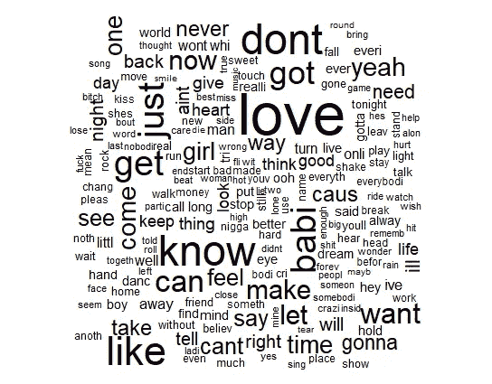

最流行单词的单词云(约 200 个单词)

> “爱”是热门歌曲中最流行的词。你上一次听到与爱情无关的歌曲是什么时候？

结果并不令人惊讶。这个词云显示了流行歌曲中的前 200 个词，越大的词意味着出现的次数越多。流行歌曲是那些能引起很多人共鸣的歌曲，而“爱”绝对是每个人生活中常见的主题。许多其他流行词都是非常常见的词，也是以“爱”为主题的。“Like”和“babi (baby)”在列表中也很高，因为它们也属于这种一般的浪漫类型。

其他大多数热门词汇都很常见:想要、知道、能、制造、不要、得到等等。其中很多往往是连接歌词部分的动词，可能出现的频率更高，因为它们很短，在歌词中容易使用。其他单词如“耶”和“嘿”是常见的填充词。

一些更有趣的词仍然很常见，尽管它们在这个词云上可能会变小，它们是:夜晚、时间、好、心、女孩等等。这些词也遵循轻微的浪漫主题。

荣誉提名去了 F 字和 B 字。

使用的数据集:3(附录)

# 按流派分类的最常用词

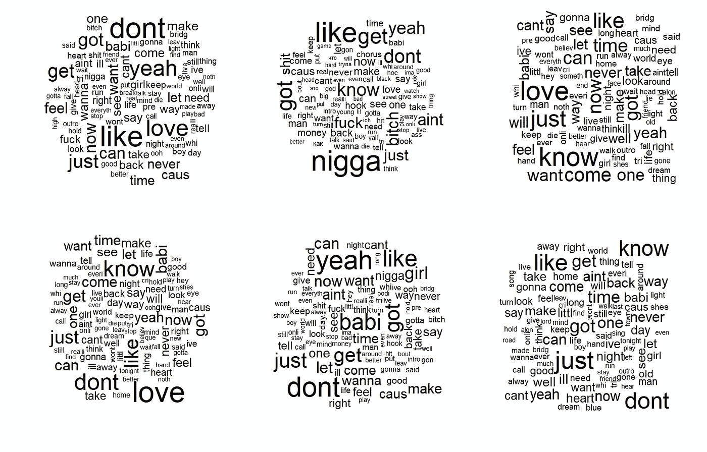

从左到右，从上到下排:另类/独立，嘻哈/说唱，摇滚，流行，R&B/灵魂乐，乡村

每种体裁中的热门词汇往往非常相似，有些词在某些体裁中出现的次数比其他体裁多。例如，Hip-Hop/Rap 中咒骂语的频率比其他流派高得多。R&B/灵魂使用更多的填充词，如“只是”和“是”。

使用的数据集:1(附录)

# 流行歌曲中最流行的词

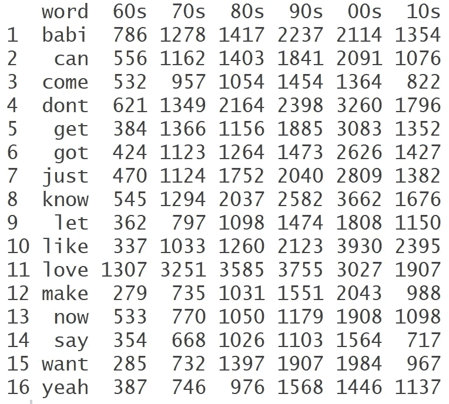

按十年划分的前 16 个单词的计数数据框架

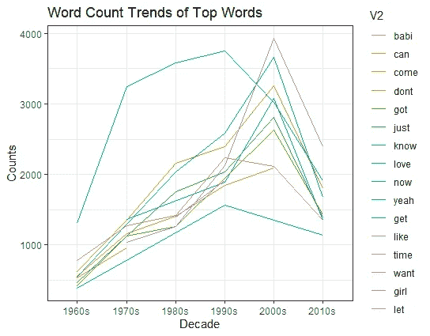

热门词汇随时间变化的趋势(折线图形式)

这两个图表显示了十年来歌曲中最热门词汇的数量。随着时间的推移，大多数流行词的计数都有增加的趋势，这很有趣。该数据集包含每年前 50 首歌曲，因此歌曲数量受到控制。这意味着这些词在更新的歌曲中出现得更多；这可能与最近的歌曲具有更多重复的歌词/诗句的现象有关。

下图更直观地展示了字数是如何随时间变化的。大多数单词会随着时间的推移而增加，但有些单词的数量会减少。2010 年的数据全面下降，但这可能是因为数据不完整(数据集只包括 2010 年至 2015 年的数据)。然而，从 20 世纪 90 年代开始，一些词的出现频率似乎有所下降，如“get”、“love”和“babi ”,这表明歌曲歌词稍微偏离了浪漫。

使用的数据集:3(附录)

# 流行歌曲的抒情情怀

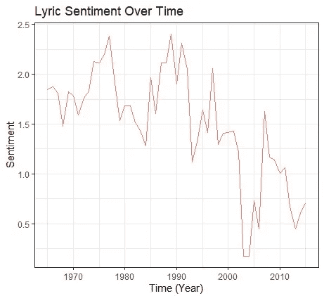

平均抒情情绪

在使用歌词计算歌曲的整体情绪后，计算了 1964 年至 2015 年公告牌 100 强年终排行榜的平均情绪。平均情绪如上图所示，似乎总体呈下降趋势。然而，尽管有这种下降趋势，总体情绪仍然是积极的(> 0)。一段时间内，歌曲人气波动似乎很大。例如，从 2007 年到 2011 年，市场人气有所下降，这可能与 2008 年金融危机有关。

使用的数据集:3(附录)+我使用 syuzhet 进行的情感分析

# 按流派划分的抒情情绪

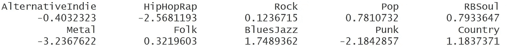

按流派划分的情感得分

以上是按流派划分的平均情绪表。此分析中使用的数据集是一个包含歌曲名称、歌词和流派信息的大型数据集。使用 syuzhet 方法(因为它在字典中有最多的单词)，通过将歌曲按流派分组来计算情感，积极的分数意味着更积极的歌曲。从这些结果中，我们看到金属是负面情绪最多的流派，其次是嘻哈/说唱和朋克作为下一个负面情绪流派。最积极的流派是布鲁斯/爵士乐和乡村音乐。

使用的数据集:1(附录)+我使用 syuzhet 进行的情感分析

# 流行歌曲的音乐特征

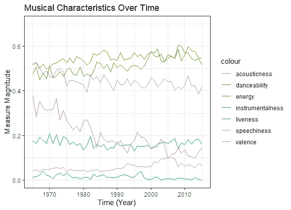

Spotify API 通过各种属性来描述每首歌曲的特征。例如，可跳舞性是“基于包括速度、节奏稳定性、节拍强度和整体规律性在内的音乐元素的组合，一个音轨有多适合跳舞”的度量，0 是最不适合跳舞，9 是最适合跳舞。你可以在这里找到其余的定义。

上图显示了 1964 年至 2015 年美国公告牌百强年终排行榜中的 7 个特征。一些有趣的趋势是，随着时间的推移，流行歌曲变得越来越不声学(红线)。效价，或者一首歌听起来有多积极/消极，也在轻微下降。除了趋势，有趣的是，这些流行歌曲往往具有相对较高的可舞性、活力和效价。他们也倾向于低语音，活跃度和工具性。

使用的数据集:3(附录)+我的 SpotifyR 采集/分析

# 流行歌曲的音乐情感与抒情情感

我觉得比较歌词的积极程度和音乐听起来的积极程度会很有趣。Spotify API/SpotifyR 包有一个度量标准，你可以用它来衡量这一点。这种特性被称为价，它被定义为“[对]一首曲目所传达的音乐积极性的描述”。

为了比较这两种情绪，因为它们是在不同的尺度上计算的(化合价的值是 0 到 1；歌词情感是单个单词情感值的总和)，我决定将音乐和歌词的情感分数简单地转换为它们总体上是正面的还是负面的。积极的歌词情感分数用 1 表示，消极的分数用 0 表示。积极的音乐情感分数或价数用 1 表示，消极的分数用 0 表示。为了将化合价分数转换为正数或负数，我选择 0.5 作为 0 到 1 的总临界值，因为整个 Spotify 的化合价分布看起来[相对正常和对称](https://developer.spotify.com/assets/audio/valence.png)。

```
#initializing the columns on the dataset
allfeatures$lyric.comp = c(2) 
allfeatures$music.comp = c(2)#looping through songs and assigning 0/1 for both lyric and musical sentiment scores
for (i in (1:nrow(allfeatures))) {
  if(allfeatures$sentiment[i] < 0) {
    allfeatures$lyric.comp[i] = 0
  } else {
    allfeatures$lyric.comp[i] = 1
  }

  if(allfeatures$valence[i] < 0.5) {
    allfeatures$music.comp[i] = 0
  } else {
    allfeatures$music.comp[i] = 1
  }
}
View(allfeatures)#calculating % of songs that have same sentiment for  music and lyrics
mean(allfeatures$lyric.comp == allfeatures$music.comp)
```

结果是， **60.89%的歌曲具有相同的音乐和抒情情感，**意味着它们要么[听起来消极，有更多消极的话]要么[听起来积极，有更多积极的话]。其余 39.11%的歌曲具有不同的音乐和抒情风格。这意味着他们要么[听起来积极，但有更多消极的话]要么[听起来消极，但有更多积极的话]。

使用的数据集:3(附录)+我的 SpotifyR 采集/分析

# 预测一首歌是否进入前 10 名

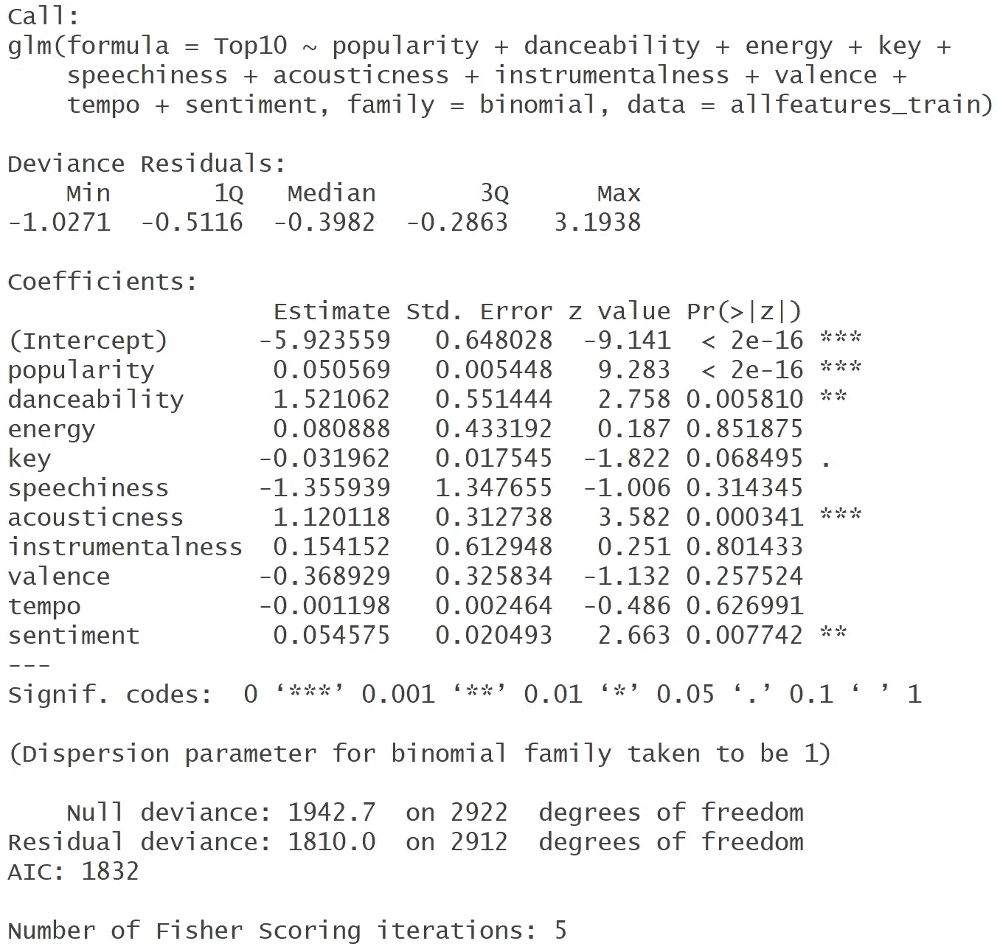

逻辑回归输出

我建立了三个不同的预测模型来预测一首歌是否会成为热门歌曲(出于这个项目的目的，半任意地定义为 Billboard 年度排行榜前 100 名)。第一个是使用各种行为和音乐指标的逻辑模型，可以在结果部分找到。

**逻辑回归结果***

从汇总模型输出来看，“流行度”，根据 Spotify 指的是歌曲的当前流行度，在预测一首歌是否进入前 10 名方面非常重要(***)。这些数据可以追溯到 1964 年，因此有趣的是，我们可以看到当前歌曲的流行程度与预测一首歌在当时是否流行有关。声音是另一个非常重要的预测因素，从 1.120118 的正“估计”值来看，前 10 名/热门歌曲似乎更有声音。

其他相对重要的变量(**)是可跳舞性和情绪。更多的可跳舞性与更有可能成为热门歌曲相关，这符合流行歌曲往往更容易上口和易于跟随的范式。情感是通过将歌词中的正面和负面单词相加来计算的，值越高意味着歌曲越积极。该模型发现，更积极的歌曲往往更有可能成为热门歌曲/前 10 名。即使悲伤歌曲的兴起，我想人们仍然喜欢听到好的事情。

在清理数据集并向其中添加 Spotify API、流行度和情感数据后，我将数据分为训练集和测试集。设定阈值~0.25 后，准确率为 **88.42%** ，相当高。然而，由于数据中的大多数值不是点击数/前 10 名(因此将被预测为 0)，这些数据点的优势可能会使模型预测更多的点击数/前 10 名，并且在预测前 10 名/点击数的歌曲时不准确。但是，这是一个模型的良好开端，进一步的分析应该检查所使用的预测因子，并进一步完善该模型的预测能力。更大的数据集也有助于提高准确性。

我还对数据运行了最近邻分类和随机森林模型，看看它们是否有更好的结果。精确度是相似的。代码和后续输出如下所示:

```
# NEAREST NEIGHBOR CLASSIFICATION
#model code, neighbors used = 3
neighbor = knn(allfeatures_train_neighbor, 
allfeatures_test_neighbor, allfeatures_train_neighbor_top10, k=3)#calculating accuracy
mean(neighbor == allfeatures_neighbor[-include_in_train, "Top10"])
```

从最近邻分类来看，准确率为 **87.51%。**

```
# RANDOM FOREST
#model code
rf = randomForest(as.factor(Top10) ~ popularity + key + tempo + 
                    sentiment, data = allfeatures_train_rf)
rf#calculating accuracy
rf_pred =predict(rf, allfeatures_test_rf)
mean(rf_pred == allfeatures_test$Top10)
```

从随机森林建模，准确率为 **88.70%** 。

*有关如何构建该模型的更多详细信息，请参见附录:流程/分析部分。

**关于指标的更多详细信息**

前两个指标是使用 Spotify API 和 R 包获得的。

*   流行度:Spotify 歌曲流行度的数值衡量标准(Spotify 自己对流行度的计算可能基于各种因素，如流的数量、独特的流等。).
*   情绪:从 syuzhet 包中的歌词计算情绪值，并使用 method = "syuzhet "(字典中有最多的单词)。

这些其他度量是使用数据帧中每个轨道的“获取 _ 轨道 _ 音频 _ 特征”获得的。以下单词的定义由 Spotify 给出，可在此处找到:

*   可跳舞性:根据音乐元素的组合，包括速度、节奏稳定性、节拍强度和整体规律性(从低 0 到高 1)，一首曲目适合跳舞的程度。
*   能量:强度和活动的感知度量。通常，高能轨道感觉起来很快，很响，很嘈杂。例如，死亡金属具有高能量，而巴赫前奏曲在音阶上得分较低。对该属性有贡献的感知特征包括动态范围、感知响度、音色、开始速率和一般熵。
*   key:估计的音轨的整体 key。整数使用标准的[音高分类符号](https://en.wikipedia.org/wiki/Pitch_class)映射到音高。例如，0 = C，1 = C♯/D♭，2 = D，等等。如果没有检测到密钥，则值为-1。
*   语音:音轨中出现的语音。越是类似语音的录音(例如脱口秀、有声读物、诗歌)，属性值就越接近 1.0。
*   声音:一种置信度，从 0.0 到 1.0，表示音轨是否是声音的。1.0 表示音轨是声学的高置信度。
*   乐器性:预测音轨是否不包含人声。“Ooh”和“aah”在这种情况下被视为乐器。Rap 或口语词轨道明显是“有声的”。仪器性值越接近 1.0。
*   配价:从 0.0 到 1.0 的一种量度，描述音轨所传达的音乐积极性。高价曲目听起来更积极(例如，快乐、愉快、欣快)，而低价曲目听起来更消极(例如，悲伤、沮丧、愤怒)。
*   速度:轨道的总体估计速度，单位为每分钟节拍数(BPM)。

使用的数据集:3(附录)+我的 SpotifyR 采集/分析

# 歌词和流行分析的含义

那么是什么*让流行歌曲流行起来呢？*

1.  铺天盖地的流行歌曲都有浪漫主题，并提到“爱”和“babi(宝贝)”等词。热门歌曲中的流行词因流派而略有不同，但大多数流派仍将浪漫词作为最常见的词。
2.  尽管浪漫主题仍然占据着排行榜的主导地位，但自 60 年代以来，“爱”和“babi(宝贝)”这两个词的使用越来越少。也许品味正在慢慢远离浪漫主题的歌曲？虽然现在，他们仍然是最受欢迎的主题。
3.  歌词情绪或歌曲信息/歌词的积极性正在下降。人们越来越不喜欢非常快乐的歌曲。这可能是由于更悲伤的流派和更能引起情感变化的音乐的兴起。
4.  当检查音乐情绪或衡量一个声音听起来有多快乐或悲伤时，有一个类似的趋势，人们喜欢听起来更快乐的歌曲(更高价)，而不喜欢原声歌曲。人们倾向于喜欢更适合跳舞、更有活力、更有积极意义的歌曲。
5.  大多数歌曲(~60%)都有一致的歌词和音乐情感，这意味着歌词的积极性与音乐的积极性相匹配。对于流行歌曲来说，在歌曲中传达一致的信息是很重要的。
6.  当建立一个模型来预测一首歌曲是否会成为热门/前 10 名时，发现歌曲的当前流行度、歌词情感和声音是重要的预测因素。展望未来，该模型的敏感性应该在更大的模型上进行测试，以提供更大的预测能力。然而，这个模型提供了一个大概的指导方针，如果一首歌的作者想要大获成功，他应该遵循什么样的指导方针。

# 让我们学以致用:Kanye West 分析


照片由 [Unsplash](http://unsplash.com) 上的 [israel palacio](https://unsplash.com/@othentikisra) 拍摄

说唱歌手兼企业家坎耶·韦斯特(Kanye West)是流行文化偶像。他的职业生涯多产，发行了 10 多张专辑，获得了 21 个格莱美奖和许多其他荣誉，这使他成为迄今为止获得最多奖项和最受好评的音乐艺术家之一。

作为一名艺术家，他一直在不断进化。从他早期更传统的 hip-hop sounding 专辑到他现在更混合的风格，结合了福音、电子和摇滚流派的影响，Kanye 一直被认为是业内的进步和创新者。

在音乐之外，他是一个非常直言不讳，甚至有争议的公众人物。坎耶因在 2009 年 MTV 音乐录影带颁奖典礼上打断泰勒·斯威夫特的演讲而声名狼藉。他经常利用他的平台来表达他对政治和音乐/时尚产业的观点。除了音乐，他还有自己的服装品牌 YEEZY。

综上所述，许多人认为坎耶是一个天才，而其他人则认为他是另一个令人讨厌的精神错乱的名人。无论哪种方式，看看 Kanye 的光盘目录是否与我们在上面收集到的一般结论一致都将是有趣的。他是一个在职业生涯中不断发展的艺术家，并产生了很多轰动，这使得这个分析特别有趣。他的歌词跟随流行歌曲的趋势吗？在他的职业生涯中，他的音乐和歌词在哪些方面发生了变化？我们能预测他的哪些歌曲是热门/前 10 名吗？最重要的是，人们对 Kanye 的音乐有什么感觉？

在我们深入分析之前，我想花点时间提醒你一些我最喜欢的标志性的坎耶歌词:

> “星期天关门，你是我的福乐鸡快餐店”(出自耶稣为王)
> 
> " Poopy-di Scoop
> Scoop-Diddy-hook
> hoop-di-Scoop-di-Poop
> Poop-di-scoopty "
> (出自《自我提升》)
> 
> “如果你摔倒在水泥地上，那是你屁股的错”
> (出自我美丽黑暗扭曲的幻想)

本节中使用的人类行为数据是为每张专辑收集的推文，然后进行情感分析。更多细节见下文。

在这个分析中，我修改了一个数据集，其中包含 Kanye 的全长个人专辑的歌曲、艺术家和歌词信息，以包括他最近的两张专辑以及流行度、情感和音乐属性/特征信息。数据集总共有 155 首歌曲。

用于以下分析的数据集:4(附录)+清洗+添加流行度、情感和音乐特征数据；5(附录)

# 总体椎间盘造影分析

**坎耶歌曲中最流行的词**

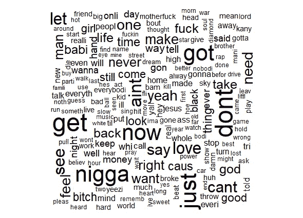

坎耶的全部字典中最常见的单词

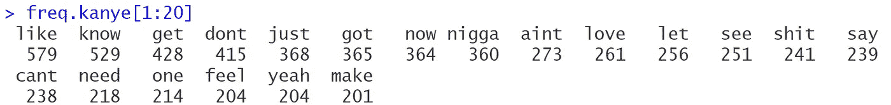

Kanye 全部词典中前 20 个单词的计数

从这个分析中，你可以看到 Kanye 的热门词汇与流行歌曲的热门词汇非常相似，如“喜欢”、“爱”、“知道”、“不要”、“只是”、“得到”等等。与一般的流行歌曲相比，Kanye 的歌曲中出现了一些特定的词，如 n-词，“shit”，“aint't”，“bitch”和“god”。这些词在嘻哈/说唱音乐中更受欢迎，Kanye 通常属于这种类型。就整体抒情内容而言，坎耶最受欢迎的词确实沿用了大多数流行歌曲的词。

**整体歌词情绪分析**

在进行了情绪分析后，我发现坎耶整个唱片集的抒情情绪是 **-0.154** ，意味着他的歌词倾向于负面多于正面的词。考虑到说唱更多的口语性质和更严肃、更广泛的话题，这并不奇怪。尤其是坎耶的歌词，众所周知，从滑稽到挑衅到激烈。

**整体音乐特征分析**

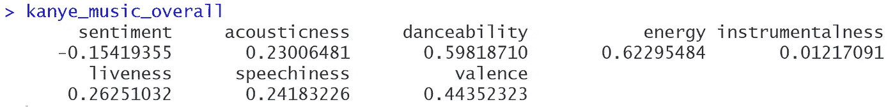

Kanye 整个唱片集的平均音乐特征

这个向量显示了 Kanye 整个唱片集的平均音乐特征。在 155 首歌曲中，平均来说，Kanye 的歌曲更适合跳舞，也更有活力。它们也具有较低的工具性。其他特征都很一般。具有很高的可舞性和能量是流行歌曲的特征，所以坎耶的歌曲具有流行歌曲的一般音乐特征。然而，Kanye 的唱片比大多数流行歌曲有更高的语音和活力，可能是由于说唱的性质。

# 逐个专辑分析

**专辑最常用词**

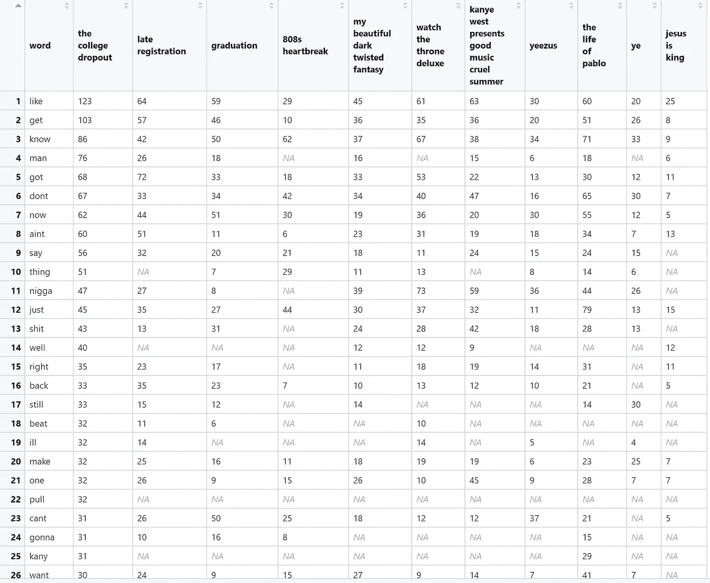

专辑中最常见的单词变化(从左到右:发行时间顺序)。

每本专辑中最常用的单词如上表所示。NAs 代表 0。正如你所看到的，随着专辑的进展，Kanye 一直在改变他写的词。像“喜欢”、“不要”这样的词，以及名词性的词越来越少被使用。一些单词在专辑中以相似的数量出现，如“just”、“make”和“want”。显然，这不是一个完整的分析，通过更严格的机器学习方法，看到更多的单词以及它们在专辑中的趋势会很有趣。

这可能是因为他最近创作的歌曲字数较少，更多的是歌唱性的。这也可能是对早期内容的真正转变。

**专辑感悟**

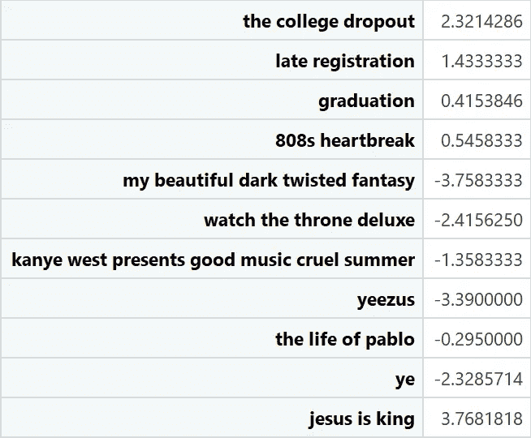

感情按专辑，按时间顺序往下。

这张表按发行时间顺序显示了每张专辑的人气。结果相当有趣。虽然 Kanye 的 discography 整体情绪略负(-0.154)，但也有积极的情绪专辑。其中包括《远离校园》、《迟到的登记》、《毕业》、《808 的心碎》和《耶稣为王》，后者是最积极的，平均情绪得分为+3.768。总的来说，似乎 Kanye 出道时歌词比较正面，然后进步到发布歌词比较负面的歌曲。他最近的专辑是这一趋势中的异类，所以看看他接下来发布的是正面还是负面的歌词会很有趣。

**专辑的音乐属性/特征**

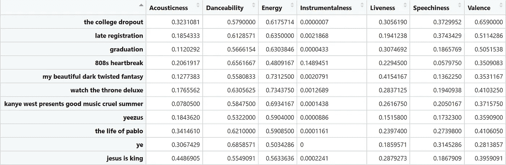

按专辑的平均音乐特征，从上到下按时间顺序排列。

从这个分析中，你可以看到每个音乐特征是如何随着时间的推移而演变的。非常有趣的是，尽管有更多负面的歌词(专辑的情绪)，一首歌听起来有多积极/消极的效价仍然相对积极。这是不匹配的，因为大多数流行歌曲(流行歌曲的音乐情感与歌词情感)具有匹配的歌词和音乐情感。

总的来说，Kanye 的音乐特征一直保持不变。他的专辑总是有很高的可跳性和活力，这可能是他的歌曲受欢迎的部分原因。随着时间的推移，他的专辑的音质会有所变化，这可能是因为制作风格的改变和尝试。

# 应用前 10 名/成功案例模型

当将逻辑回归模型应用于该 Kanye 数据集时，准确率为 **92.9%** 。然而，如果你仔细观察数据，坎耶的 9 首热门/前 10 名歌曲没有一首被正确预测。因此，即使准确率很高，那也可能是因为大多数歌曲不是热门歌曲，并且低于阈值。

这个模型有明显的问题。有多种促成因素:

*   Kanye 数据集只有 155 行，非常小。
*   从技术上来说，Kanye 不是一个“流行”艺术家，所以他的流行歌曲可能不会跟随一般趋势。
*   原始模型中的变量需要调整或纳入更多数据以获得更大的预测能力。

或者，也许这只是表明，创造一首热门/前 10 名的歌曲并不像人们想象的那样公式化！展望未来，更多地使用模型来获得更高的准确性会很有趣。

# 推特分析

**与“坎耶”相关的最常见词汇**

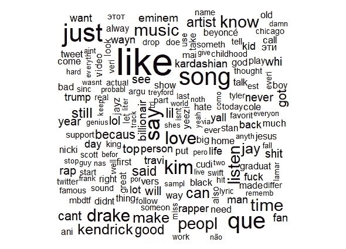

Twitter 上与 Kanye 相关的热门词汇。

使用 RTweet 包抓取 Twitter 数据，这些是最常与“Kanye”联系在一起的词。当人们谈论 Kanye 时，最流行的词似乎是“喜欢”，这表明艺术家周围的情绪通常是非常积极的。其他常用词包括“song”和其他类似的艺术家，如 Kendrick Lamar 和 Drake(你也可以看到 Travis Scott、卡迪小子和碧昂斯的较小单词散落在那里)。

**专辑推特人气**

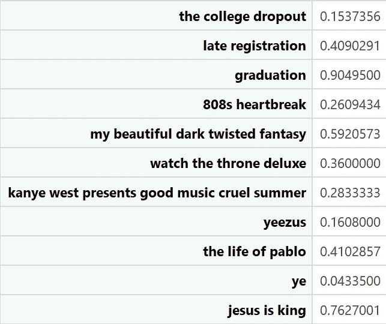

按专辑从上到下的时间顺序排列。

这些数据是通过搜索与 Kanye 相关联的每张专辑的名称并计算情感来抓取 Twitter 而生成的(更多详细信息请参见附录 9)。坎耶每张专辑的人气似乎都相当积极，这与坎耶作为一名广受好评的艺术家的地位相符。一些专辑比其他专辑更受欢迎，如《毕业》、《耶稣为王》和《我美丽的黑暗扭曲的幻想》。将来看看是否可以对单个曲目进行情感分析会很有趣，因为搜索更通用的歌曲名称音乐比搜索专辑名称要困难一些。

**整理专辑信息**

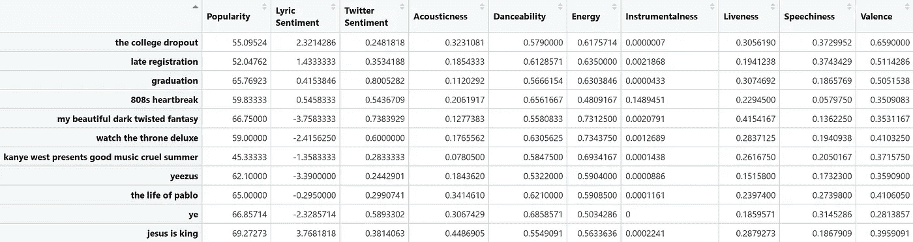

流行度、歌词情绪、推特情绪和音乐属性/特征。

此表显示了以上所有汇编到一个表中的指标。当并排在一起时，我们可以看到专辑的受欢迎程度、歌词情感、Twitter 情感和音乐属性是如何相互关联的。流行度是通过取专辑歌曲流行度的平均值来计算的。

最受欢迎的专辑“耶稣是王”有最积极的歌词情绪，但不是最积极的推特情绪。与 Kanye 的其他专辑相比，它没有最高价(11 张中的第 6 张)或积极向上的音乐，舞蹈性(11 张中的第 10 张)和活力(11 张中的第 9 张)较低。因此，即使它更受欢迎，它也没有通常与流行歌曲相关的最高音乐属性值(流行歌曲随着时间推移的音乐特征)。

Twitter 上人气最高的专辑“毕业”，意思是更积极的口碑，是 Kanye 第四大最受欢迎的专辑，歌词在所有专辑中排名第五。与 Kanye 的其他专辑相比，这张专辑的可跳舞性(第 8)和活力(第 5)也很一般，这可能表明听众在听 Kanye 的时候并不是在寻找“流行”的歌曲。

听起来最积极(高价)的专辑“远离校园”只有一般的可跳性和活力。这也是最不受欢迎的坎耶专辑之一(第三)，并有非常积极的抒情情绪(第二)。

我可以继续说下去，但根据这些结果，有时似乎最受欢迎的专辑(按 Twitter 人气和受欢迎程度)并不具备流行歌曲所具有的高度可舞性和活力的标志性特征。

# 结论

在进行情感分析并将其与 Spotify 和 Twitter API 数据等人类行为数据联系起来后，我发现肯定有一些词与积极的歌曲关联更多，尤其是那些有浪漫主题的词，如“爱情”和“babi(宝贝)”。随着时间的推移，我们越来越多地看到爱情主题的音乐不再主宰排行榜。

就歌词情绪而言，歌曲通常越来越悲伤，但总体上仍保持略微积极的情绪(情绪高于 0)。

一般来说，最流行的歌曲是高度可舞，充满活力和声音。他们往往还具有较低的工具性和演讲性。

将所有这些因素结合在一起，我们可以尝试预测哪些歌曲将成为热门歌曲，但该模型未能准确预测什么是热门歌曲。然而，我们仍然可以收集重要的见解，例如哪些变量是重要的，并使用这些来调整模型向前发展。

将这些发现应用于 Kanye West 作为一个案例研究是很有意思的，看看一般结论是否成立。他的唱片通常遵循流行歌曲的特点，包括具有高度的舞蹈性和活力。从他出道到现在，歌词的情绪普遍降低，最新专辑《耶稣为王》是个例外。逻辑回归热门/前 10 名模型并不成立，但这也意味着找出流行歌曲流行的原因更加微妙。通过分析 Kanye 每张专辑的 tweets，我们看到他的音乐广受好评。此外，查看专辑的歌词情感、推特情感、流行度和音乐属性/特征如何相互关联提供了有趣的观察。这也表明破解一首歌流行的原因是相当复杂的。总的来说，这个分析是这样做的一个很好的第一次尝试，编写代码也很有趣。

感谢阅读！

# **关于作者**

Alice Tang 是宾夕法尼亚大学生物学、商业分析和医疗保健管理专业的大四学生。音乐是她最大的兴趣之一，她认为她会找到一种有趣的方式将其融入她的学业。这个数据项目是 Prasanna Tambe 教授的 OIDD 245:分析和数字经济课程的一部分。

# 附录

**使用的数据集**:**

1.  Kaggle 数据集:Nikita Detkov 和 Ilya @[https://www . ka ggle . com/det kov/lyrics-Dataset # songs _ Dataset . CSV](https://www.kaggle.com/detkov/lyrics-dataset#songs_dataset.csv)超过 2k 位歌手的 25 万+歌词。该数据集包含 250，000 多首歌曲的歌手、专辑、歌曲、流派和歌词信息。当涉及流派并且歌曲的流行度/排名不重要时(例如，按流派分类的最常用词)，使用该数据集。
2.  Kaggle 数据集:Vageesha bud anur/Jin wook Chang @【https://www.kaggle.com/vageeshabudanur/songdetails】的歌曲详情。该数据集包含从 1900 年到 2010 年进入排行榜前 10 名的所有歌曲的歌曲、年份、艺术家信息。
3.  Kaggle 数据集:Billboard 1964–2015 歌曲+rakan nimer @[https://www.kaggle.com/rakannimer/billboard-lyrics](https://www.kaggle.com/rakannimer/billboard-lyrics)作词。该数据集包含 1964 年至 2015 年公告牌年度排行榜前 100 首歌曲中所有歌曲的排名、歌曲、艺术家、年份和歌词信息(每年年末的前 100 首歌曲)。该数据集用于涉及流行度的分析。
4.  Kaggle 数据集:威尔@[https://www.kaggle.com/slickwilly/kanye-west-discography](https://www.kaggle.com/slickwilly/kanye-west-discography)的 Kanye West Discography。该数据集包含除 Kanye 最近两张专辑之外的所有歌曲、艺术家和歌词信息。
5.  使用访问 Twitter API 的 RTweet 包自行生成的 Twitter 数据集。使用 search_tweets 功能，通过查询专辑名称，删除了过去 7 天的推文。

* *为这些 Kaggle 数据集的创建者大声疾呼！我一个人可能要花很长时间来搜集所有的歌词。

**流程/分析:**

1.  首先，数据集被导入并清理/标准化。在一些歌词中有一些奇怪的字符，我不得不寻找解决方法。所有相关字段(歌词、艺术家姓名、歌曲名称)都改为小写，并删除了标点符号。
2.  对于 wordcloud 分析，使用 wordcloud 包创建、清理和生成语料库文档。流派词云分析是在按流派过滤歌曲后进行的。
3.  为了生成一段时间内最流行的单词，构建了一个 for 循环来生成文档术语矩阵，然后将这些矩阵转换为计算频率的矩阵。由此产生的前 25 个单词和它们的频率被放入一个列表中，该列表可以用图表显示和打印。
4.  使用 syuzhet 软件包进行情感分析。使用 for 循环来获取每首歌曲的情感，并将该分数添加到新列中。
5.  受欢迎程度是这个项目中使用的人类行为数据。你可以通过使用“get_track”来获得歌曲的流行度，但你需要 Spotify ID 来调用这个功能，而我没有这个功能。相反，我使用了一个更迂回的功能“search_spotify”来首先搜索艺术家，然后从列表中识别歌曲。边缘情况(空搜索或不匹配的歌曲名称/艺术家)必须被合并，这样循环就不会烧坏。一旦匹配了歌曲，就可以提取流行度。我使用的主要数据集是第三个数据集，包含了从 1964 年到 2015 年的 Billboard 年度排行榜前 100 名的所有歌曲。由于我无法将所有歌曲与 spotify IDs 匹配，所以我最终使用了数据集中的 3654/5100 个原始行/歌曲，这仍然是一个相当大的数量。这个具有 n=3654 的流行度数据的清理过的数据集被用于其余的分析。
6.  Spotify 的音乐属性/特征必须在步骤 5 中手动添加到上述数据集中。使用 for 循环，提取 Spotify IDs 并将其输入函数“get_track_audio_features”以获取音乐属性数据。然后将其“绑定”到现有的数据集，以产生具有歌曲、艺术家、歌词、流行度和音乐属性/特征信息的数据集。
7.  对于逻辑回归，在步骤 6 中向数据集添加了一个名为“Top10”的附加列。这是从 1964 年到 2015 年的 Billboard 年度排行榜前 100 名歌曲的排名，如果这首歌是前 10 名歌曲，则分配“1”，如果不是，则分配“0”。这是一种半随意的方式来指定什么是超级流行/热门歌曲。未来应该使用不同的界限来检验预测因子的敏感性和显著性。然后对最终数据集运行三种不同的模型:逻辑回归、最近邻分类和随机森林。
8.  对于 Kanye 特定的分析，使用了与 1–7 相似的方法，但只针对 Kanye 的数据。为了使歌曲和专辑与 Spotify API 上的流行度和音乐属性值相匹配，进行了大量的清理工作。
9.  Twitter API/RTweet 用于提取每张专辑的人类行为数据。在过去的 7 天里，我能够从每张专辑中拉出 1000 条推文，包括流行的和最近的推文。我排除了转发、引用和回复。我用 Kanye 的名字搜索专辑名称的查询词，以过滤出通用的结果(例如，一般谈论“毕业”的推文与谈论 Kanye 专辑毕业的推文)。

**使用的包:**

lubridate，magrittr，spotifyr，tm，wordcloud，stringr，dplyr，readr，rvest，ggplot2，tidyr，tidytext，syuzhet，readr，rpart，httr，class，randomForest，rtweet

**其他来源:**

1.  [https://en . Wikipedia . org/wiki/Kanye _ West # 1996% E2 % 80% 932002:_ Early _ work _ and _ Roc-A-Fella _ Records](https://en.wikipedia.org/wiki/Kanye_West#1996%E2%80%932002:_Early_work_and_Roc-A-Fella_Records)
2.  图片来源:Unsplash
3.  AZlyrics.com 为坎耶最近的两张专辑搜集了不在第五号数据集中的歌词。