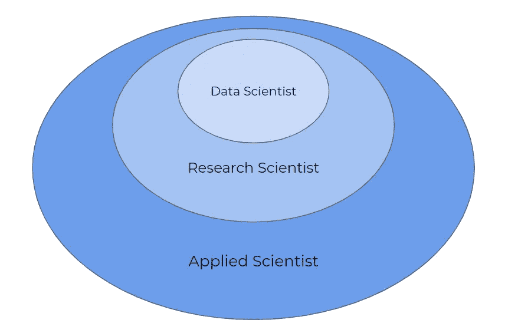

# 数据科学家、研究科学家和应用科学家之间有什么区别？

> 原文：<https://towardsdatascience.com/whats-the-difference-between-a-data-scientist-research-scientist-and-an-applied-scientist-30c04190c1fa?source=collection_archive---------12----------------------->

## 揭开数据科学角色之间的异同

由班德万托创作—[www.freepik.com](http://www.freepik.com)

随着数据科学领域的发展，各种职业术语之间的混淆也在增加。一些公司似乎将术语“数据科学家”与“应用科学家”互换使用，而其他公司则有明确的区别。

> 那么，数据科学家、研究科学家和应用科学家之间到底有什么区别呢？

由作者创建

**本质上，数据科学家、研究科学家和应用科学家在科学深度和期望水平方面是不同的。**研究科学家通常有更高的技术理解水平，因此也有更高的期望值。应用科学家和数据科学家也是如此。上面的图像概括了这个想法:应用科学家通常可以做研究科学家做的事情，并且做得更多，而研究科学家可以做数据科学家做的事情，并且做得更多。

让我们更深入地了解一下每个角色:

## 数据科学家

数据科学家做什么样的工作真的取决于公司。在某些情况下(或者很多情况下)，数据科学家做的正是数据分析师做的事情:他们查询数据、处理数据、分析数据和可视化数据。在上限上，数据科学家还应用统计和机器学习模型来提取见解。

总体而言，数据科学家通常能够回答前瞻性问题(*例如，我们能否预测明年我们将拥有多少客户*)以及回顾性问题*(例如，为什么我们的增长率下降了 8%？).他们能够收集数据、处理数据、应用特征工程、建模数据和可视化数据。他们是技术人员和商业头脑之间的纽带。*

## 研究科学家

科学家是研究的专家。研究科学家不制造产品或管道。相反，他们是构建实验、发展假设和证明假设真假的专家。它们通常出现在学术界，尽管公司越来越看到它们在应用中的价值。

## 应用科学家

**应用科学家**据说与研究科学家能力相当，但他们也是大规模应用知识和实施解决方案的专家。因此，虽然研究科学家更专注于科学发现，但应用科学家对现实生活中的应用更感兴趣。

在亚马逊，应用科学家是一个比研究科学家略高的角色，需要通过编码栏。例如，亚马逊的应用科学家专注于增强亚马逊客户体验的项目，如亚马逊的自动语音识别(ASR)、自然语言理解(NLU)、音频信号处理、文本到语音(TTS)和对话管理。

# 感谢阅读！

如果你喜欢我的工作并想支持我，我会非常感谢你在我的社交媒体频道上关注我:

1.  支持我的最好方式就是在**媒体**T2 上关注我。
2.  在**推特** [这里](https://twitter.com/terence_shin)关注我。
3.  点击这里订阅我的新 **YouTube 频道** [。](https://www.youtube.com/channel/UCmy1ox7bo7zsLlDo8pOEEhA?view_as=subscriber)
4.  在 **LinkedIn** 这里[关注我](https://www.linkedin.com/in/terenceshin/)。
5.  在我的**邮箱列表** [这里](https://forms.gle/UGdTom9G6aFGHzPD9)报名。
6.  查看我的网站[terenceshin.comT21](https://terenceshin.com/)。

# 来源

 [## 数据 vs 应用 vs 研究科学家@亚马逊

### 这三个角色有什么区别？

www.teamblind.com](https://www.teamblind.com/post/Data-vs-Applied-vs-Research-Scientist--%40Amazon-OiJ0KOSx)  [## 数据科学家、应用科学家、研究科学家的角色有什么区别…

### 答(第 1 题，共 4 题):数据工程师通常负责获取、处理、清理、存储和维护…

www.quora.com](https://www.quora.com/What-is-the-difference-between-the-roles-of-Data-scientist-Applied-scientist-Research-Scientist-Machine-Learning-Engineer-and-Data-Engineer)  [## “研究科学家”、“科学家”、“参谋科学家”、“数据科学家”之间有什么区别

### 回答(第 1 题，共 3 题):在我职业生涯的某个阶段，我曾从事过以上所有的工作(除了应用科学家)，我会…

www.quora.com](https://www.quora.com/Whats-the-difference-between-a-research-scientist-scientist-staff-scientist-data-scientist-and-applied-scientist)  [## ML 工程师，数据科学家，研究科学家:有什么区别？

### 如果你必须写一份人工智能(AI)或机器学习(ML)的工作描述，这可能很难…

www.topbots.com](https://www.topbots.com/understanding-different-ai-ml-job-descriptions/)