# 一年中最美好的时光是什么时候？提示:这不是《经济学人》所说的

> 原文：<https://towardsdatascience.com/whats-the-most-wonderful-time-of-the-year-hint-it-s-not-what-the-economist-says-45d96551b664?source=collection_archive---------23----------------------->

## 用 Python 和 Matplotlib 分析 Spotify 的 valence 评分


马塞拉·拉斯科斯基在 [Unsplash](https://unsplash.com/?utm_source=unsplash&utm_medium=referral&utm_content=creditCopyText) 上的照片

> 被困在付费墙后面？点击[这里](https://medium.com/@raffg/whats-the-most-wonderful-time-of-the-year-hint-it-s-not-what-the-economist-says-45d96551b664?source=friends_link&sk=f19e71cf528127960d9dfc0a1146b2d4)阅读完整的故事和朋友链接！

我是 Greg Rafferty，湾区的数据科学家。这个项目的代码可以在我的 [GitHub](https://github.com/raffg/spotify_analysis) 上找到。

在 2020 年 2 月 8 日出版的 [The Economist](https://www.economist.com/printedition/2020-02-08) 中，图表细节部分简要讨论了对 Spotify 数据的分析，表明 7 月是平均最快乐的一个月([悲伤的歌曲说明了很多:
Spotify 的数据表明，听众在 2 月最沮丧](https://www.economist.com/graphic-detail/2020/02/08/data-from-spotify-suggest-that-listeners-are-gloomiest-in-february))。我试图重复他们的研究，得出了一些不同的结论，并在此过程中有了一些新的发现。

# 数据

这种分析需要两个数据来源。第一个是 Spotify 在[spotifycharts.com](https://spotifycharts.com/)上提供的按日期和国家排名的最热门的 200 首歌曲。因为我不想从下拉菜单中选择每个国家和日期，并手动下载近 70，000 个每日图表 csv 文件，所以我构建了一个 [scraper](https://github.com/raffg/spotify_analysis/blob/master/RankingScraper.py) 来为我完成这一切。

第二组必要的数据是那些排行榜中每首歌的`valence`分数。Spotify 通过他们的[开发者 API](https://developer.spotify.com/) 提供这些数据。要获取这些数据，你需要在这里注册证书[。谢天谢地，Spotify 没有让这变得太难，所以你应该不会有任何问题。我构建了第二个](https://developer.spotify.com/dashboard/login)[刮刀](https://github.com/raffg/spotify_analysis/blob/master/FeatureScraper.py)，它遍历前 200 名排行榜中的每首独特歌曲，并下载其特征向量。这里有几个可用的特征，但《经济学人》使用的是`valence`分数，一个介于 0 和 1 之间的小数，它描述了歌曲的“快乐”。

这个乐谱最初是由一个名为 Echo Nest 的音乐情报和数据平台开发的，该平台于 2014 年被 Spotify 收购。a(现已死亡，但可通过 Wayback 机器获得)[的博客帖子](https://web.archive.org/web/20170422195736/http://blog.echonest.com/post/66097438564/plotting-musics-emotional-valence-1950-2013)对比分只有这样的说法:

> 我们让一位音乐专家根据效价对一些样本歌曲进行分类，然后使用机器学习将这些规则扩展到世界上所有其他的音乐，并在我们进行的过程中进行微调。

通过 API 可用的其他特征包括速度、能量、调、模式和可跳舞性等，并且已经推测这些特征在价分值中起作用。无论如何，效价分数是如何得出的有点像黑箱，但它似乎确实与歌曲非常匹配。然而，由于训练数据极有可能倾向于流行音乐，我想知道古典、爵士或非西方音乐风格是否没有被准确地评分。

# 分析

与《经济学人》的分析相比，我的分析显示了非常相似的数据分布:

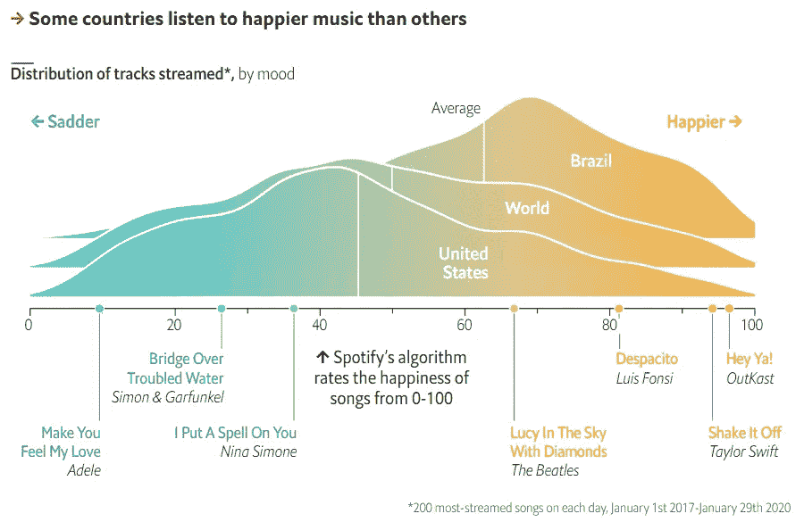

来源:[https://www . economist . com/graphic-detail/2020/02/08/data-from-Spotify-suggest-listeners-is-glow most-in-two](https://www.economist.com/graphic-detail/2020/02/08/data-from-spotify-suggest-that-listeners-are-gloomiest-in-february)

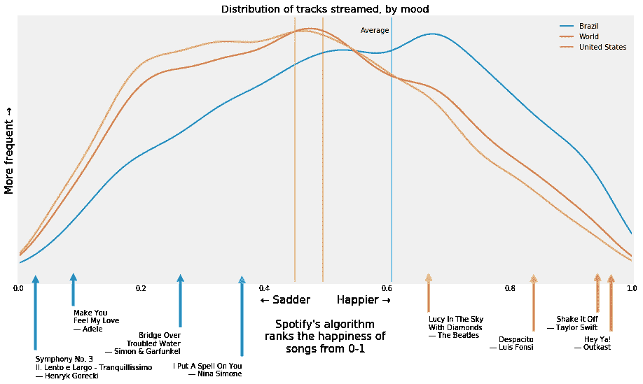

尽管我们的两个图表的外观不同，但两个核密度估计的形状非常相似(如果你不熟悉，核密度估计，或 KDE，几乎只是一个平滑的直方图，曲线下的面积总和为 1)。那些关键歌曲沿着价轴的位置也匹配。你可以看到，平均来说，巴西人比世界上其他地方的人听“快乐”的音乐，而在美国，听众听的音乐平均来说没有世界上其他地方的人快乐。正如我们将看到的，拉丁美洲的音乐典型的配价很高。

这是《经济学人》的第二张图表，我从中看到了一些关键的区别。

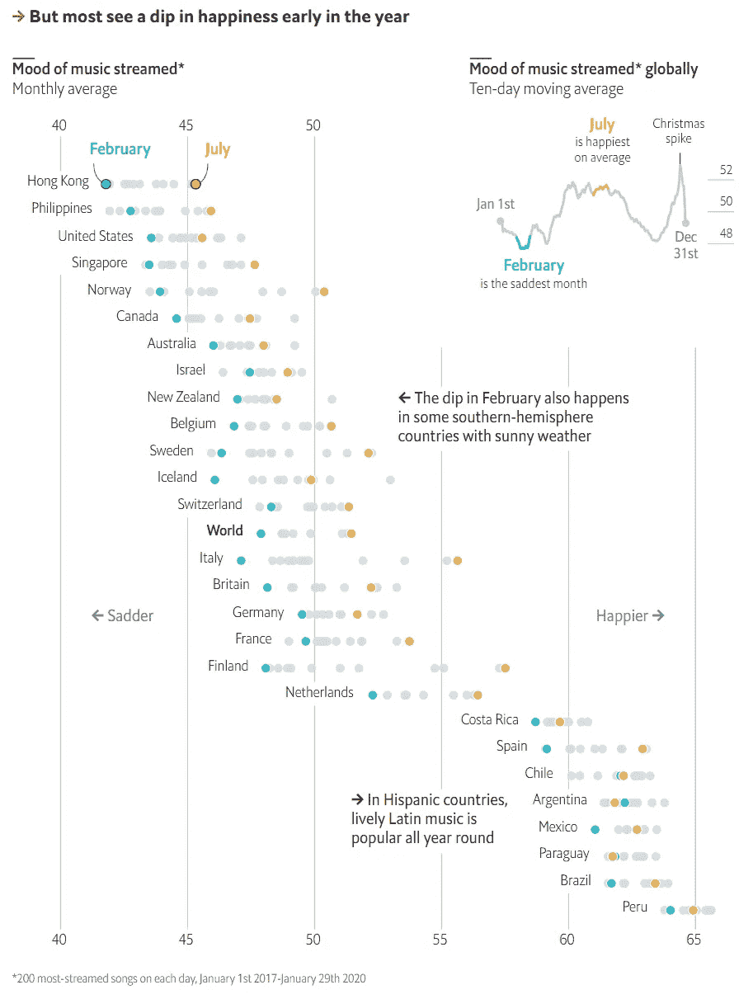

来源:[https://www . economist . com/graphic-detail/2020/02/08/data-from-Spotify-suggest-listeners-is-glometer-in-two](https://www.economist.com/graphic-detail/2020/02/08/data-from-spotify-suggest-that-listeners-are-gloomiest-in-february)

首先，我们来看看右上角的那个十日均线图。发现二月平均价最低，七月最高。以下是我的发现:

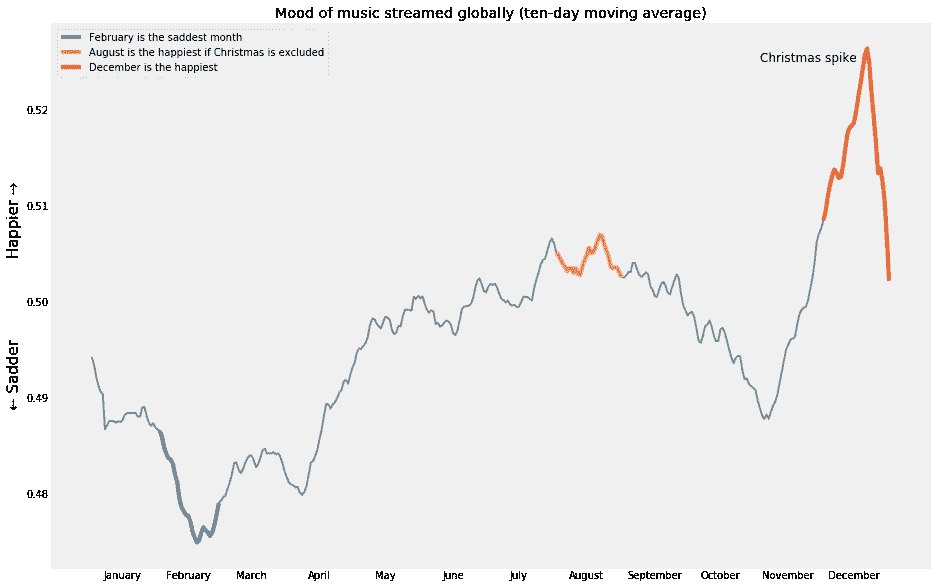

在我的分析中，12 月的平均化合价最高，其次是 8 月，第三是 7 月。我最初也发现了一些非常不同的二月平均价分数，因此研究了为什么我们的数据集会不同。《经济学人》使用了从 2017 年 1 月 1 日(Spotify 图表上最早可用的时间)到 2020 年 1 月 29 日(大概是他们进行抓取的时间)的数据。我有所有的数据，加上几乎所有的 2020 年 2 月的数据。没有像上面的图那样按月汇总，也没有执行移动平均，我看到同一个月的年与年之间的差异比我预期的要大得多:

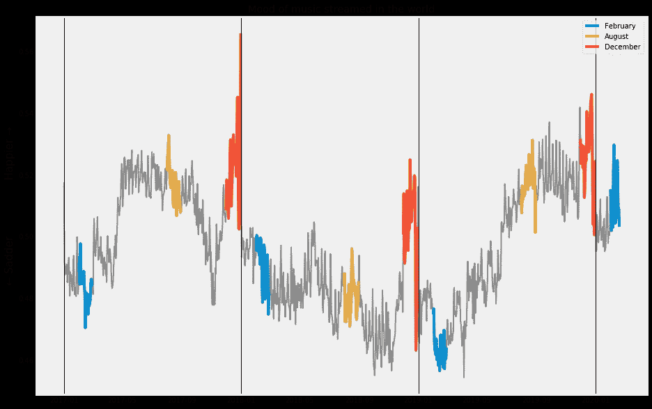

在任何一年，我都认为 12 月是最高的。然而，2018 年(特别难过的一年？)夏季的化合价得分低于二月份。此外，2020 年的数据远远高于前几年，这一数据的纳入导致了 2 月份的平均数据不断膨胀。因此，我选择排除 2020 年的数据。比较这两个图表，一个包含 2020 年，另一个不包含:

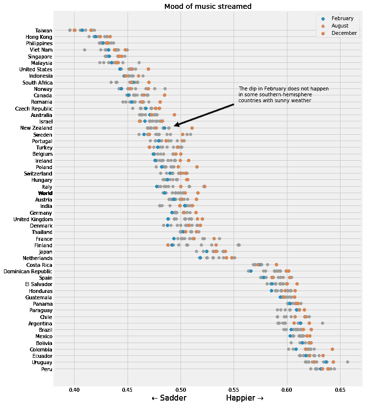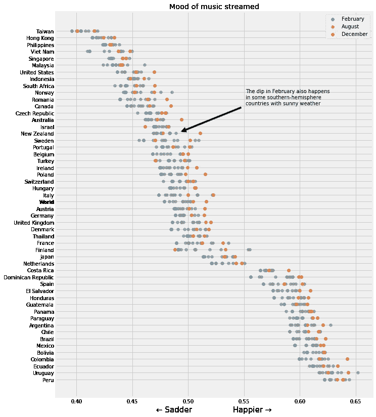

左侧:包括 2020 年 1 月/2 月；右侧:不包括 2020 年 1 月/2 月

这并没有改变图表太多，然而，经济学家在他们的图表中指出的一个关键点是，尽管与北半球相比，南半球的新西兰在 2 月份也经历了化合价的下降，尽管他们的夏季和冬季相反。当我包括 2020 年 2 月时，我看到了与《经济学人》所注意到的相反的效果，但当我排除 2020 年 2 月时，我确实看到了下降；然而远没有《经济学人》看到的那么明显。按照《经济学人》包括所有可用数据的惯例，我会包括 2 月份，因为 2020 年比往年快乐得多，这证明了相反的观点是正确的。不幸的是，在我看来，包含这些数据似乎有些武断——我们称之为合适的截止点是什么？不过，在我看来，每年包含相同数量的月份似乎是合理的，因此排除 2020 年的数据就不那么武断了。我很想在年底重新运行这个分析，看看它会是什么样子。

我的一个关键发现是，12 月是最快乐的月份，而不是他们发现的 7 月，这肯定与《经济学人》的发现不同。

我还将这些国家按大洲进行了分类，以观察更广泛的趋势。正如《经济学人》所发现的，拉丁美洲国家确实比世界上其他国家流传着更多快乐的音乐。还要注意的是，在除欧洲以外的每个大洲，12 月是最快乐的月份；除了非洲和澳大利亚，二月是最悲伤的:

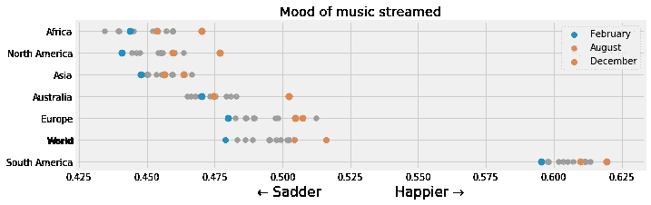

此外，我还观察了白天的情绪。正如我所料，我发现星期六是最快乐的。

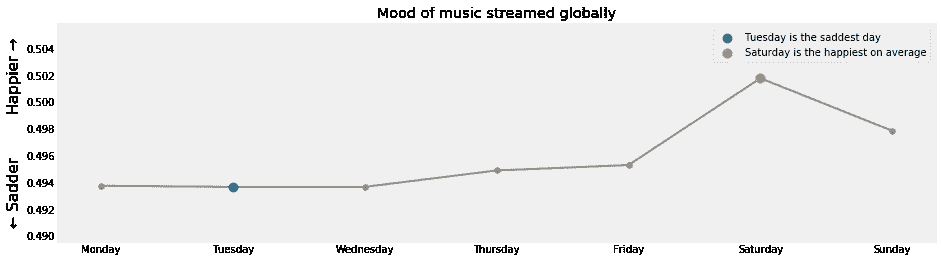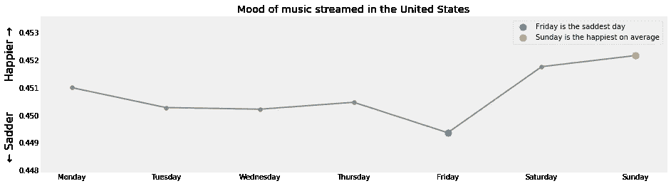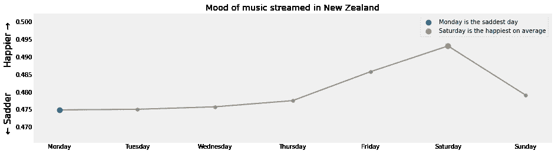

我也看了美国和新西兰的图表。我发现星期五是美国最悲伤的一天，而星期天是最快乐的一天。有什么可能的理论吗？新西兰展现了我可能最期待的行为，周一是最悲伤的，周六是最快乐的。

最后，我花了一点时间研究了 Spotify API 的其他功能，并制作了最后一个图表，每个国家的可跳舞性:

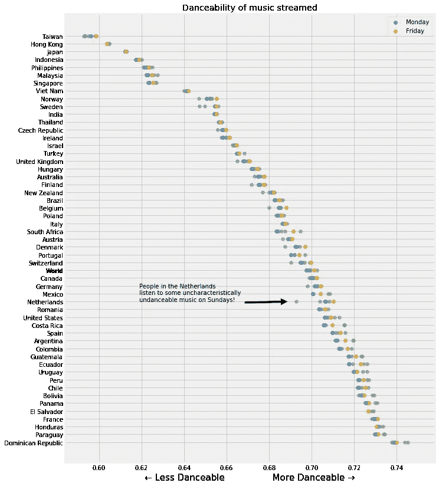

在这里，正如我所料，我发现周五比周一有更多适合跳舞的音乐。此外，从化合价表来看，国家的排序变化很大。例如，在这张图表中，美国处于价谱的最悲伤的一端，但却处于更适合跳舞的一端。我还注意到，可舞性排名最低的国家都是亚洲国家，它们的传统音乐风格不符合西方“标准”的 12 音 4 拍体系。我想知道当结构与大多数训练样本如此不同时，该算法是否很难预测可跳舞性。

我还注意到，在荷兰的周日，他们的舞蹈得分直线下降！挪威和瑞典也有这种现象，尽管程度较轻。宗教星期日可能是这一结果的一个解释，尽管在我看来，荷兰、挪威和瑞典并不比许多其他没有这种行为的国家更宗教化。

只是为了好玩，我查找了我所知道的最悲伤的歌曲(悲惨地从前 200 名排行榜中消失)，Henryk Górecki 的第三交响曲(非常恰当地命名为悲伤歌曲交响曲)。第二乐章的配价分数仅为 0.0280，远低于阿黛尔的 0.0896 的*让你感受我的爱*。这个分数将使它在所有 68，000 多首歌曲的效价排行榜上排名倒数第二，仅略高于 Tool 的*军团接种*，这是排行榜上最悲伤的歌曲，效价为 0.0262(尽管在我看来，Tool 的这首歌曲确实超出了合理的范围)。

我还查了一下 Pharrel Williams 的 *Happy* ，期望找到一个最高分，却失望地看到“只有”0.9620。相比之下，地球，风和火带来了近乎滑稽的快乐*九月*，化合价为 0.982(图表中最高)。

美国前 200 名排行榜中最快乐的 10 首歌:

```
[Earth, Wind & Fire - September](https://open.spotify.com/track/1mqlc0vEP9mU1kZgTi6LIQ)
[Gene Autry - Here Comes Santa Claus (Right Down Santa Claus Lane)](https://open.spotify.com/track/25leEEaz1gIpp7o21Fqyjo)
[The Beach Boys - Little Saint Nick - 1991 Remix](https://open.spotify.com/track/5xlS0QkVrSH7ssEbBgBzbM)
[Logic - Indica Badu](https://open.spotify.com/track/0jqBo5RYn008f4ZY8kPewW)
[Chuck Berry - Johnny B. Goode](https://open.spotify.com/track/3BUQFs6aFWh7EFNmI8bfL7)
[Shawn Mendes - There's Nothing Holdin' Me Back](https://open.spotify.com/track/79cuOz3SPQTuFrp8WgftAu)
[Foster The People - Pumped Up Kicks](https://open.spotify.com/track/7w87IxuO7BDcJ3YUqCyMTT)
[Tom Petty - I Won't Back Dow](https://open.spotify.com/track/7gSQv1OHpkIoAdUiRLdmI6)n
[OutKast - Hey Ya!](https://open.spotify.com/track/2PpruBYCo4H7WOBJ7Q2EwM)
[Aretha Franklin - Respect](https://open.spotify.com/track/7s25THrKz86DM225dOYwnr)
```

十大最悲伤的歌曲:

```
[TOOL - Legion Inoculant](https://open.spotify.com/track/48C0O5CXfQdfjUCUhOs1YP)
[Joji - I'LL SEE YOU IN 40](https://open.spotify.com/track/606F3qdYCXtDVtKN53YsuW)
[Trippie Redd - RMP](https://open.spotify.com/track/5e4oAwSsIzkNZxh4fLSKUH)
[Drake - Days in The East](https://open.spotify.com/track/4czcw3NVLY0of5hTD7OufN)
[Drake - Jaded](https://open.spotify.com/track/3jipFRgLyKK0oJoG1pKicx)
[Lil Uzi Vert - Two®](https://open.spotify.com/track/65kp3OFn7JXbCvkm3m2Ui2)
[TOOL - Litanie contre la Peur](https://open.spotify.com/track/4qE9yOgBNsARadpZTAb6RH)
[Russ - Cherry Hill](https://open.spotify.com/track/7eZOvhHWlB3AcrOuZfTTOA)
[2 Chainz - Whip (feat. Travis Scott)](https://open.spotify.com/track/6Z4rmc0uujCpl8yXe3yjgI)
[Rae Sremmurd - Bedtime Stories (feat. The Weeknd) - From SR3MM](https://open.spotify.com/track/6nI74KsH94IN0J2vp5shdT)
```

因此，看起来安迪·威廉姆斯是正确的:12 月实际上是一年中最美妙的时间(效价分数:0.7240)。