# 权重和偏差在神经网络中的作用是什么？

> 原文：<https://towardsdatascience.com/whats-the-role-of-weights-and-bias-in-a-neural-network-4cf7e9888a0f?source=collection_archive---------3----------------------->

## 以最全面的方式理解神经网络的权重和偏差。

阿洛拉·格里菲斯在 [Unsplash](https://unsplash.com?utm_source=medium&utm_medium=referral) 上拍摄的照片

# 介绍

我们都知道人工神经元是神经网络的基本构建模块。在进入主题“权重和偏差在一个神经网络中的作用是什么”之前，我们先来了解一下这个人工神经元的骨架。

作者图片

## 基本人工神经元的组成部分:

1.  **输入**:输入是我们需要预测输出值的一组值。它们可以被视为数据集中的要素或属性。
2.  **权重:**权重是每个输入/特征的真实值，它们传达了相应特征在预测最终输出中的重要性。(将在本文中详细讨论这一点)
3.  **偏差:**偏差用于向左或向右移动激活功能，您可以将其与直线方程中的 y 截距进行比较。(将在本文中对此进行更多讨论)
4.  **求和函数:**求和函数的工作是将权重和输入绑定在一起，并计算它们的和。
5.  **激活功能:**用于在模型中引入非线性。

# 如果没有重量呢？

> 只有当一件事物不存在时，我们才会理解它的重要性。

正如声明所说，让我们看看如果在神经网络中没有权重的概念会怎么样。为了简单起见，让我们考虑在一个数据集中只有两个输入/特征(输入向量**xϵ【x₁x₂】**)**，**，我们的任务让它执行**二元分类。**

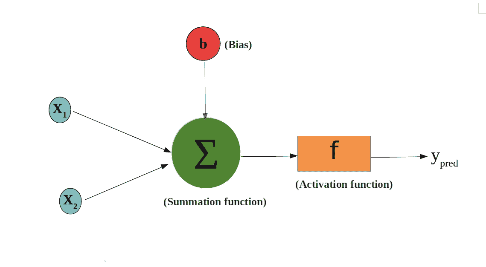

作者图片

求和函数 **g(x)** 对所有输入求和，并添加偏差。

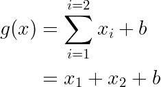

因此，在求和函数完成其工作后，我们得到一个整数值作为输出，但由于这是一个二进制分类问题，我们需要将这个整数值转换成一个二进制输出，为此，我们借助一个激活函数将整数值映射到二进制输出。激活函数看起来像这样

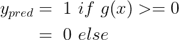

如果您观察，如果求和函数的输出大于或等于 0，激活函数将一个整数值映射到 1，否则它将输出为 0。

如果我们将激活函数表达式与直线方程进行比较:

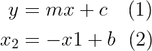

通过仔细观察上面 2 个表达式，我们可以推断出方程 **x₂ = -x₁ + b 的斜率(m)是固定的即-1** ，在任何情况下都不会改变。现在你应该明白这个问题了，对于任何给定的数据集，如果不涉及权重，那么对数据点进行分类的线的斜率永远不会改变，并且我们无法绘制一条可扩展的线来分隔两个类别**。**

## 放心吧！我们用一个例子来了解一下…

考虑这个用于演示的样本数据集，它包含两个输入(特征)**【x₁和 x₂】**和一个输出 **y.** 现在我们的任务是，如果我们提供 x1 和 x2 ，我们需要训练计算机**预测 y。**

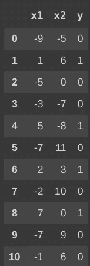

作者图片

因此，第一步是我们需要给求和函数输入(x1 和 x2)

下一步是使用激活函数将整数输出映射为二进制值，即(x1 + x2 + b ≥ 0)表示输出为 1，可视为(x2 ≥ -x1 -b ),边界条件为 **x2 = -x-b** ,因此落在这条线以上的所有点都被视为 1，而这条线以下的所有点都将为 0，因此我们绘制不同的线，并找到 b 的最佳值，以正确分类数据集。

现在，如果我们尝试拟合 x1 和 b 的不同值的直线方程 **( x₂ = -x₁ + b)** ，我们将得到这个图…

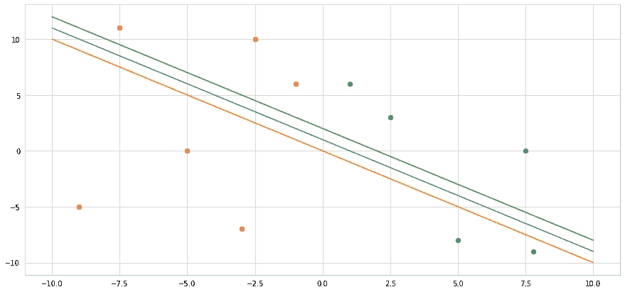

作者图片

在表达式(x2 = -x1-b)中，你可以任意多次改变 x1 和 b 的值，你观察到的一件事是所有的线都是平行的，斜率与(-1)相同。让我们再来看一个场景

如果我们认为 **b** 的值是 **0，**并且对于 x1 的任何值，直线方程看起来像( **x₂ = -x₁ + 0** )，那么它在上面的图中被表示为**橙色** **直线**。

如果我们考虑 **b** 的值为 **1，**则线方程看起来像( **x₂ = -x₁ + 1** )，就表示为上图中的**蓝色** **线**。

如果我们考虑 **b** 的值为 **2，**直线方程看起来像( **x₂ = -x₁ + 2** )，则在上面的图中表示为**绿线**。

如果我们继续改变 b 的值，我们只会得到平行线，但线的方向或斜率不会有任何变化，这样我们甚至不能正确地对数据集进行分类，所以我们需要一些额外的东西来改变线的斜率，这就是权重。

## 让我们将重量付诸行动！

当我们给每个输入分配权重时，等式看起来像…

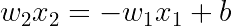

更符合上面数据集的线是: **x₁** = 0

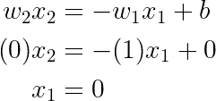

## 看一下涉及重量时的情节…

当 w2 = 0，w1 = 1，b = 0 时，该方程以最佳方式拟合数据集。

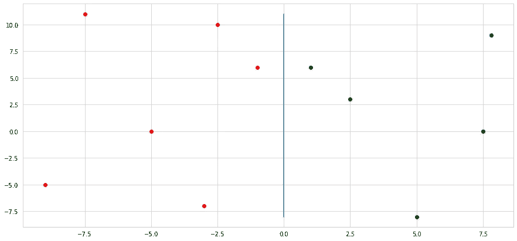

作者图片

从图中，我们可以观察到，随着等式中权重的引入，线的斜率发生了变化。

# 神经元中的权重向我们传达了什么？

## 1.功能的重要性

与每个特征相关联的权重传达了该特征在预测输出值中的重要性。与权重值较大的特征相比，权重值接近于零的特征在预测过程中的重要性较低。

在上面的例子中，w2 是 0，这意味着我们不需要 w2 来预测 y 的值，w1 的值是 1，这意味着我们可以单独使用 x1 来预测 y 的值。

## 2.说明数据集中特定要素与目标值之间的关系。

让我们考虑一个寻找买车可能性的例子，数据集包含两个输入特征，如

1.  汽车价格
2.  汽车普及度

让我们假设人们经常倾向于在他们的预算内买一辆车，并且是众多车中最受欢迎的一辆。

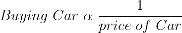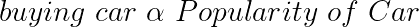

线的方程看起来像…

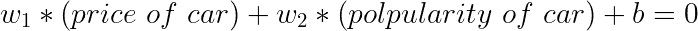

如果汽车的价格增加，那么表达价值也增加，这意味着“我们更有可能购买那辆车”，但我们不希望这种情况发生，所以我们必须用负价值的权重(w₁)来补偿它，这样他们的产品变成负的，表达价值降低，这意味着我们对购买那辆车不感兴趣，这样权重帮助了我们。

因此，如果与某一特征相关的权重为正，则意味着该特征与目标值之间存在直接关系，如果与该特征相关的权重为负，则意味着该特征与目标值之间存在反比关系。

# 摘要

*   权重在更改分隔两类或更多类数据点的线的方向或斜率时起着重要作用。
*   权重表明了某个特征在预测目标值时的重要性。
*   权重说明了特征和目标值之间的关系

# 神经元中偏差的使用？

偏置用于将激活功能向左向右移动，没有得到这种说法吗？😕别担心，让我们用视觉体验来理解它…

让我们考虑一个 sigmoid 激活函数来演示偏置的使用，我们可以用以下数学表达式来表示 sigmoid 激活函数

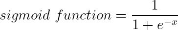

用直线方程代替 x

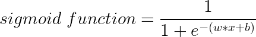

## 1.让我们改变 w 的不同值，并将 b 值固定为 0

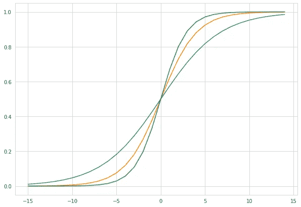

作者图片

当 b =0 且

w = 0.3 —图中的蓝线

w= 0.5 —图中的红线

w = 0.7 —图中的绿线

即使给出不同的 w 值，我们也不能移动激活函数的中心，在这种情况下，是 sigmoid 函数。

> 改变 w 的值只会改变曲线的陡度，但我们无法将曲线向左或向右移动，将曲线向左或向右移动的唯一方法是改变 bias(b)的值。

## 2.让我们改变不同的 b 值，并将 w 值固定为 0.5

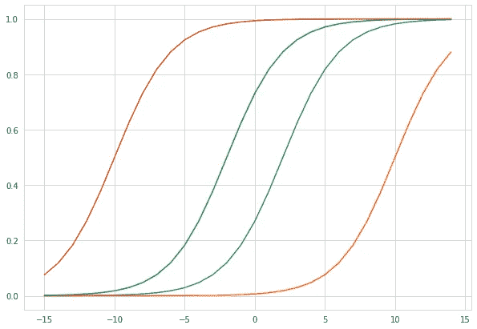

作者图片

当 w=0.5 且

b = -1 —图中的红线

b= -5 —图中的绿线

b = 1 —图中的蓝线

b = 5 —图中的黄线

查看该图，改变 b 的值会改变曲线的位置，因此 bias 用于向左或向右移动激活函数。

# 为什么我们需要将激活功能移向左边或右边？

让我们先了解乙状结肠的工作原理…

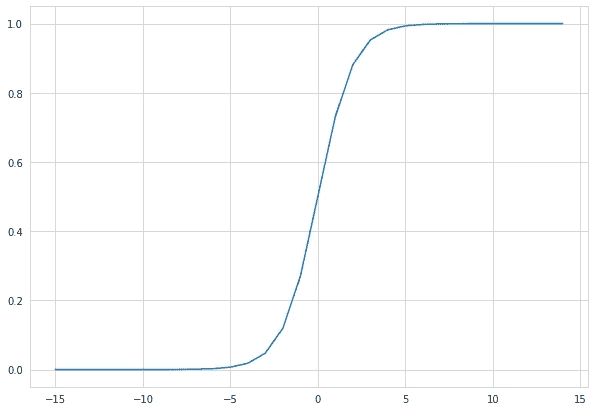

作者图片

曲线的方程式是

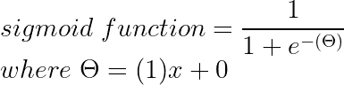

从图中，我们推断，所有朝向 0 右侧的**的值都被映射到 1** ，所有朝向 0 左侧的**的值都被映射到 0** 。

假设 x = -1，那么对应的 y 值大约为 0.1，我们将其四舍五入为 0，现在假设 x= 5，那么对应的 y 值大约为 1，我们将其四舍五入为 1。

## 如果我们希望 x<5 时 y 值为 0 呢？

答案是你需要向右移动曲线，即

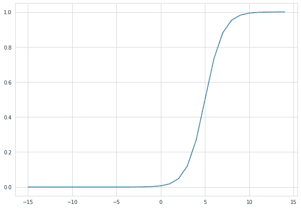

作者图片

曲线的方程式是

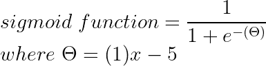

从图中，我们可以推断，x=5 的点左边的所有点的 y 值似乎都小于 0.5，当四舍五入时，y 值最终为 0。因此，我们通过将曲线移向偏移来实现我们的目标，而偏移负责将曲线移向右侧，这就是偏移在人工神经元中的应用。

# 结论

我希望这篇文章消除了你对为什么我们在人工神经元中需要权重和偏差的所有疑虑。

# 感谢阅读😃过得愉快