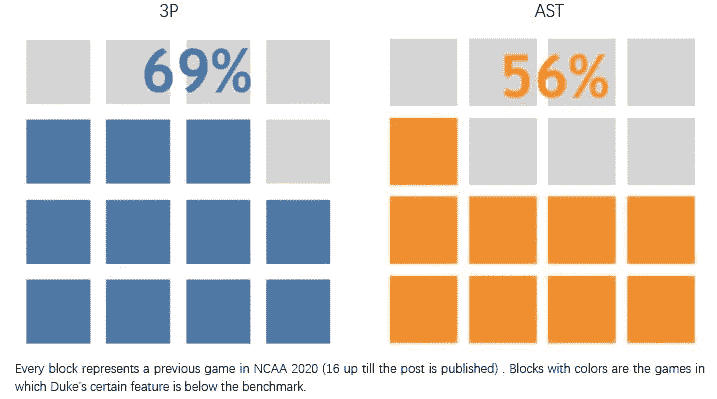

# NCAA 篮球冠军的秘诀是什么？

> 原文：<https://towardsdatascience.com/whats-the-secret-of-ncaa-basketball-champions-9cc8e649288?source=collection_archive---------40----------------------->

蓝魔庆祝 2015 年 NCAA 锦标赛

不到三个月，亚特兰大将见证激动人心的 2020 年 NCAA 篮球锦标赛。每年，男子全国大学生篮球锦标赛都会吸引公众的广泛关注，尤其是在临近决赛的时候。在急切等待最终结果的同时，我们注意到，尽管排名有所起伏，但一些篮球队总是位居榜首。这些获胜团队的秘诀是什么？他们成功的因素是什么？

在下面的帖子中，我们将通过分析 2008-2018 年 NCAA 篮球队和球员的数据来发现其中的秘密。

# **目标**

我们的项目有两个主要目标。

1.  一个冠军团队的成功因素是什么？
2.  每个位置(中锋、后卫、前锋)都有哪些高级功能？

然后，我们应用这些发现来看看我们的蓝魔如何继续领先。

# **数据理解**

我们使用团队数据集来发现团队成功因素，并使用球员数据集进行球员位置分析。两个数据集的数据源是 [*运动会*](https://www.sports-reference.com/cbb/) 。

在团队数据方面，我们检索了 2009-2019 年冠军团队的每一场 NCAA 比赛的表现数据。数据集有 23 个要素和一个二项式目标变量，win (=1)或 lose (=0)。

对于球员数据，我们选择了历史上排名前 10 的球队，并根据篮球参考编写了最近 10 年的每场比赛高级球员统计数据。我们还设计了三个功能:真实投篮命中率、有效投篮命中率和团队胜率。正常情况下，一场篮球赛有五个位置。然而，鉴于数据源的有限信息，我们将小前锋和大前锋组合为前锋(F)，得分后卫和控卫组合为后卫(G)。该数据集包含以下 37 个要素和 1531 条记录。

# **数据清理**

团队数据集是高度不平衡的(85%的记录有 win=1)，所以我们使用 SMOTE 来平衡数据。球员数据集包含板凳球员的大量缺失值和零。领军人物也有一些缺失的价值观。由于我们的目标侧重于后者，我们采取了以下两个步骤来清理数据:

1.  淘汰了每队的替补队员。
2.  用 0 来填补这些年来主要球员的缺失值。

# **方法论**

首先，我们在杜克的球员信息上使用无监督的 k-means 聚类来了解蓝魔的招募构成。UNC 和 Uconn 的数据用于比较。

我们的第一个目标是发现冠军团队的成功因素是一个监督学习问题。我们首先使用关联热图进行探索性数据分析。然后，我们建立了逻辑回归、决策树(CART)和随机森林模型。

第二个目标是探索每个职位的高级特征。我们使用逻辑回归和随机森林模型。

# **建模**

利用 k-means 对杜克大学 2009 年至 2019 年的球员信息进行聚类，我们发现蓝魔一般分为两类。第一个聚类更看重玩家在游戏中的实际表现，而第二个聚类更关心玩家的背景信息，如位置。类似的聚类结果也可以在北卡罗来纳焦油脚跟队和康涅狄格哈士奇队中找到，他们在过去十年中也获得过两次 NCAA 篮球冠军。

有趣的是，当我们查看集群时，我们发现在性能集群中，三所学校在配置上有不同的策略。康涅狄格大学更喜欢后卫，而北卡罗来纳大学有更多的前锋。杜克大学在后卫和前锋球员的数量上相当平衡。在与这两支球队比赛时，这种洞察力可以用来制定球场策略。

## **目标 1:** 冠军团队的成功因素

从热图中，我们观察到两个特征之间的强相关性，这是由于它们的部分-全部关系。比如投篮命中率% (FG%) &投篮命中率(FG)，2 分 FG (X2P) & 2 分 FG 尝试(X2PA)。我们发现 X2P 比 X3P 与 FG 更相关，防守篮板与总篮板也是如此。此外，与罚球相比，投篮命中率与总得分的相关性更强。

图 1 特征关联的热图

然后，我们使用逻辑回归(LR)、逐步回归、决策树(CART)和随机森林来预测团队获胜。表 2 显示了结果汇总:

随机森林模型的准确率最高，为 95.3%。在所有四个模型中，我们观察到增加的点数(PTS。防守篮板(DRB)和 2 分投篮(X2P)是赢得比赛的关键属性。由于随机森林更高的准确性和决策树更好的可视化，我们深入到细节中研究每个特征的重要性。

图 2 决策树可视化

让我们看看图 2。从根分裂条件点(PTS。g)，我们知道积分对胜利至关重要，这符合我们的直觉。再往下分支，如果个人犯规(PF)少于 23 次(分支右侧)，一支球队极有可能赢得比赛。否则，凭借队员之间良好的助攻，球队仍有机会获胜。防守篮板(DRB)是另一个至关重要的特点。高 DRB 有助于胜利。有趣的是，我们发现，当一支球队在对手错过一个投篮机会后不擅长获得控球权时，高尝试 2 分和 3 分投篮机会导致高概率的失败。

图 3 随机森林分类器

在随机森林分类器中，我们还可以通过比较两个条形之间的高度差来查看每个高级功能的重要程度。点数(PTS。g)保持获胜的最高级特征。DRB 的重要性也符合分类树模型的重要性。此外，投篮命中率(FG%)、2 分和 3 分投篮命中率(X2P & X3P)也非常重要。我们进一步发现，罚球在赢得一场比赛中更重要，X3P 对 X2P 也是如此。另一方面，上场时间(MP)相对来说是最不重要的。

总之，得分和防守篮板是成功的决定性因素。此外，更少的个人犯规大大增加了获胜的机会。FG%也起了重要作用，X3P 在凯旋中对 X2P 的贡献更大。然而要记住，盲目的 X2P 和 X3P 尝试可能会导致控球权的丧失并导致失败。我们将在下面的内容中进一步讨论每个位置的高级特性。

## **对象 2:每个位置的重要特征**

我们放大以探索每个位置的高级功能。如何将对方的实力发挥到前台，带动集体潜力？对于玩家分析，我们运行了两个模型:随机森林和逻辑回归。前者显示了所有玩家和各自位置的重要特征。

图 4 总体特征重要性

从上面的图表中，盖帽(BLK)，阻止进攻球员得分的能力，是个人对球队的一项基本能力，其次是三分球尝试。助攻(AST)仍然是一个重要的特性。但是，与球队分析不同的是，对于一个球员来说，进攻篮板(ORB)比防守篮板更关键。虽然上场时间是球队表现最不重要的特征，但它对每个人都很重要。

让我们来看看每个职位的细分情况。各职位的高级功能有什么不同吗？在历史上排名前 10 的团队中，我们从上表中得到了以下观察结果:

总的来说，对每个球员来说，三分球比两分球更重要。助攻和拦网是另外两个必备技能。那么每个位置都有各自的高级功能:

*   中心(C):在这个模型中没有明显的特征来区分中心。所以后来我们用逻辑回归发现了这个位置。
*   前锋(F):辅助技能和失误使这一职位与众不同，因为这两项在其他特征中具有更高的重要性。他们也有更高的机会开始一个游戏。
*   后卫(G):阻挡技能和投篮相关的指标区分后卫。篮板能力对他们来说也更重要。

我们还运行了一个多类逻辑模型。下面的结果表明，F 和 G 有更高的机会去偷，而 C 有更高的机会去挡。此外，在一场比赛中，C 比 F 和 G 更有可能进行个人犯规。

# **部署:针对蓝魔**

目标 1 的结果确定以下 11 个变量为高级特征。以历届冠军的平均值为基准，我们观察到杜克 2020 的 3P、3PA 和 DRB 低于这些基准。

图 5 与基准的比较

然后我们再分解看看之前 16 场的杜克 2020 表现。下图 6 显示了 3P 和 AST 是最常低于基准的两个特性，分别有 69%和 56%的早期游戏低于基准。虽然杜克 2020 的表现在 44%的游戏中缺少 DRB，但它的 2PA 相当高。

图 6 低于基准%

因此，我们对即将到来的杜克 2020 运动会有以下建议:

1.  更多地关注三分球，因为它们比 2P 和罚球更重要。
2.  加强后卫在防守篮板球方面的能力，这样高 2P 的尝试对胜利有更大的贡献。

对于未来蓝魔的招募，基于我们的分析，我们提出以下建议:

1.  首先测试所有候选人的拦网技巧，因为它起着至关重要的作用。然后测试一下 3P 候选人的命中率。
2.  评估前锋和后卫的防守技能，因为抢断是他们的一个重要特征。同样，考验前锋的助攻技术，后卫的得分技术。
3.  由于防守(BLK，DRB，STL)和进攻(FG，ORB，AST，TOV)特征在团队数据集中都显示出重要性，杜克可以评估每个球员的实力，组成一个平衡的团队，以避免出现明显的弱点。

对于未来的游戏策略，如果我们的蓝魔遇到像 UNC 和 Uconn 这样的老对手，我们可以相应地调整团队组成。

北卡罗来纳大学倾向于招募更多的前锋，所以它更注重整体合作。彼此最熟悉的蓝魔可以开始游戏，想出突破的策略。

Uconn 通常有更多的后卫球员可以在球队中获得高分。他们更有可能阻挡我们的进球，并在我们错过一个进球后接管球权。命中率高的玩家可以加入我们蓝魔队。

合著者:李嘉文和季春雨