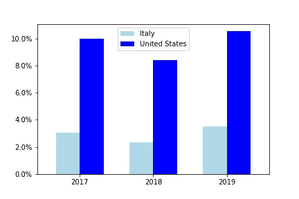
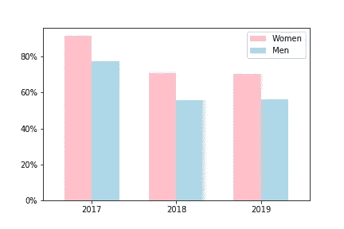
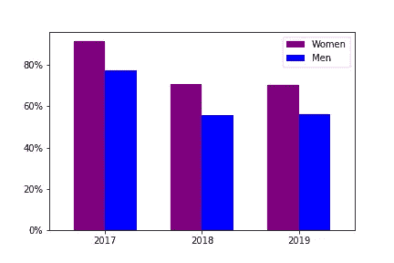

# 意大利计算机科学行业的性别差距有多大？

> 原文：<https://towardsdatascience.com/whats-the-situation-in-italy-for-women-in-the-world-of-computer-programming-7782bbb8a54b?source=collection_archive---------66----------------------->

## 一种基于数据的方法，使用 Stack Overflow 2017 年至 2019 年的开发者调查数据。

照片由 Unsplash 上的 ThisisEngineering RAEng 拍摄

## **简介**

几周前，我读了一篇关于阿达·洛芙莱斯的文章。可能你们很多人不知道她是谁，但你肯定知道英国诗人拜伦。

好吧，但是它们之间有什么联系呢？拜伦是阿达的父亲！

洛夫莱斯伯爵夫人奥古斯塔·爱达·拜伦是一位数学家，今天她被认为是第一位计算机程序员。

她出生于 1815 年，她接受了以数学和科学为基础的教育。这不是 19 世纪女性的标准。

一天，艾达决定翻译一篇关于计算机之父查尔斯·巴贝奇的文章。这篇文章描述了一种被称为分析引擎的设备，旨在处理复杂的计算。

她不仅翻译了这篇文章，还添加了一些关于机器潜力的思考。事实上，Ada 描述了如何用该设备创建代码，以便管理单词和符号以及数字。

她还为设备重复一系列指令的方法建立了理论，这一过程被称为计算机编程今天使用的循环。

**第一部分:与男性相比，意大利女性在编程领域的地位如何？**

从那篇关于阿达·洛芙莱斯的文章开始，我问自己，在计算机编程领域，尤其是在意大利，女性的现状如何。为了回答这个问题，我分析了 Stack Overflow 的开发者调查收集的数据。

在我分析的第一步中，我试图了解意大利和美国 2017 年至 2019 年从事编程语言工作的女性的百分比。所以，我注意到他们中的少数人在这个领域工作，尤其是在意大利。

正如你在下面的图表中所看到的，在工作中使用编程语言的总人数中，女性所占的比例非常低。意大利的情况并不好，三年来平均只有 3.5%的女性从事编程工作。

图 1:在编程界工作的意大利和美国女性的百分比(图片由作者提供)

**第二部分:在义大利从事计算机编程工作的女性背景如何？他们有什么资格？**

然后，我试图深入了解这种情况，以便了解这些妇女有什么资格。

我发现他们中的大多数都非常合格(例如，他们拥有学士学位、硕士学位或博士学位)。

下图显示，从 2017 年到 2019 年，拥有大学背景的计算机编程女性多于相同背景的男性。

图 2:意大利超级合格女性与超级合格男性的对比(图片由作者提供)

第三部分:相反，在美国，技术领域的超级合格女性是什么情况？

在美国，情况与意大利相似。从 2017 年到 2019 年，大多数从事编程语言工作的美国女性都超级合格，而且她们比男性更超级合格。

在下面的条形图中，可以观察到这种情况。

图 3:美国女性超级合格与男性超级合格的比较(图片由作者提供)

**结论**

多亏了我用 Python 分析的数据，我明白了，即使在今天，从事计算机编程的女性人数也非常少，只有非常优秀的女性才会尝试进入这个领域。这意味着由于文化偏见和排斥，有大量的女性不了解这个世界。

因此，在这个领域给女性适当的空间是很重要的，因为正如阿达·洛芙莱斯向我们展示的那样，她们有潜力改变和改善计算机编程世界的许多事情。

关于这个分析更详细的信息，你可以在这里看到我的 GitHub 的链接[。](https://github.com/moryba/Women-in-Computer-Programming)

可以在我的电报群 [**初学数据科学中联系。**](https://t.me/DataScienceForBeginners)