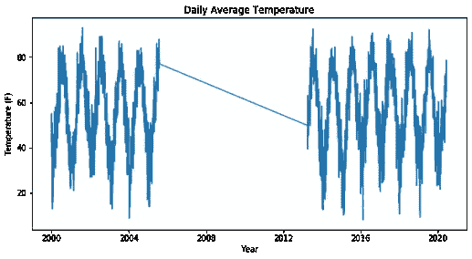
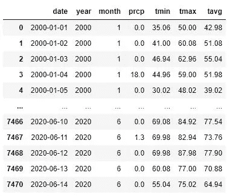
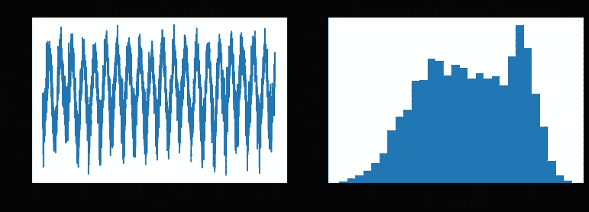
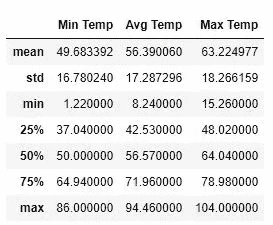
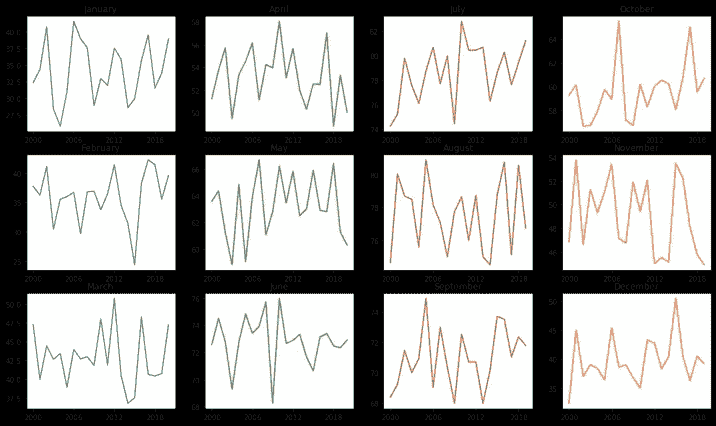
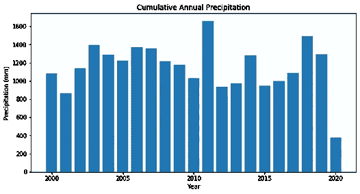

# 纽约天气数据:探索性分析

> 原文：<https://towardsdatascience.com/whats-the-weather-like-in-new-york-e8c1586e5c4?source=collection_archive---------35----------------------->

Giovanni Tancredi 在 [Unsplash](https://unsplash.com?utm_source=medium&utm_medium=referral) 上拍摄的照片

## 纽约的天气怎么样？

住在纽约，我想知道随着时间的推移天气会是什么样子。我几乎一生都住在这里，每年我都发现自己在抱怨天气比前一年热了多少。天气变暖了吗？气候真的在变化吗？也许那些夏天的热浪只是异常值。

气候变化是近年来最受争议的话题之一，尤其是在政治领域。有许多数据和研究表明，全球气温普遍上升。然而，这篇文章并不是要强加给任何人。它仅仅提供了对过去 20 年天气数据的快速探索和可视化，以调查趋势(使用 Python)。

# 数据

皇后区拉瓜迪亚机场的气象数据是根据 Ritvik Kharkar 的这篇[文章](/getting-weather-data-in-3-easy-steps-8dc10cc5c859)中的方法从美国国家海洋和大气管理局(NOAA)收集的。它演示了如何轻松地利用 API 从美国任何地方收集所需的天气数据。我对他的代码做了一些调整，从 2000 年到 2020 年提取平均气温、最低气温、最高气温和总降水量的每日记录。然而，当我试图这样做时，从 2006 年到 2012 年，有一整个时期都没有平均气温。

2006 年至 2012 年缺失的数据

我最初是在试图获取曼哈顿中央公园的数据时发现这个问题的，结果只得到 2000 年到 2005 年的平均气温。考虑到这可能只是 NOAA 数据可用性的问题，我决定通过使用最低和最高日平均气温作为代理来进行简单的修复。

包括降水量、最低温度、最高温度和平均温度的最终数据帧

# 分析

## 温度

对于任何时间序列，第一件事是随着时间的推移可视化。首先查看 2000 年至 2020 年的日平均气温，我们看到冬季全年平均气温在个位数之间，夏季在 90 多度之间。随着时间的推移，它看起来不会倾向于更暖或更冷的温度。平均温度的分布略呈双峰型(约 40°F 和 70°F ),有趣的是，这与时间序列中的拐点温度相对应。

日平均气温时间序列(左)和平均气温分布(右)

虽然肯定是不正常的，但纽约市有很多次出现极端温度，最冷时达到华氏 1 度，最热时达到华氏 104 度。我想纽约市过去也有几次出现零下温度，但我想我的记忆没有我希望的那么可靠。

温度统计

我们可以从另一个角度来看这个数据，那就是月度水平。这里我汇总了一年中每个月的日平均气温。

月平均温度

在一月、七月、五月和十月等几个月，似乎有轻微的上升趋势。而在 6 月份，过去 10 年的年同比变化一直在下降，徘徊在 73 华氏度左右。

## 沉淀

除了温度的变化，我还对总降水量随时间的变化感兴趣。下面是 20 年来的日降雨量，单位为毫米。老实说，我很惊讶地看到有这么多天的降雨量超过 25 毫米(约 1 英寸)。

每日降水量(左)和雨天的降水量分布(右)

单日最大降雨量是 169.9 毫米(约 6.7 英寸)，早在 2007 年 4 月中旬！纽约市一天的降雨量通常不会超过 10 毫米。

降水统计(包括无降水的天数)

在那张图上显示一段时间内的日降水量有点太忙了，所以我把数据汇总成了累积年降水量。

在过去的 20 年里，纽约市平均每年的降雨量为 1190 毫米。2011 年，降水量为 1659 毫米，比正常情况下多了 40%。在过去的两年里，降水量增加了 10-25%。这不重要，但肯定比平时多。

将所有有记录的降水天数加起来，2018 年的降水天数最多，为 150 天，而 2010 年的降水天数最少，为 100 天。这几乎比平均水平(122 天或一年的三分之一)多了整整一个月！

最后，我们可以看看这些年来逐月的降雨量。

平均月降水量

二月、七月和十二月似乎显示出降水增加的趋势，而六月变得越来越干燥。

# 结论

纽约的气温变化很大，从华氏 0 度到华氏 104 度，但通常这个季节的气温在华氏 30 度到 80 度左右。这些时间序列图显示，一些月份似乎正在变暖，但肯定需要更多的分析(可能需要一些 t 检验)。无论是下雨还是下雪，纽约一年中有四个月都有降水。最近几年甚至可能显示出年降水量和月降水量的增加。

最后，我绝不是一个气象学家或气候学家，只是一个来自纽约的发现这个数据集很有趣的人。我还意识到，湿度和露点等其他指标没有包括在这个分析中。更多的问题可能会从这个分析中产生，但最终，这只是为了教育和娱乐目的对纽约市气象数据的快速和肮脏的分析。

如果你有兴趣查看我的代码，请查看我的 [GitHub](https://github.com/matchin/nyc_weather) ！