# 什么是整齐的数据？

> 原文：<https://towardsdatascience.com/whats-tidy-data-how-to-organize-messy-datasets-in-python-with-melt-and-pivotable-functions-5d52daa996c9?source=collection_archive---------8----------------------->

## 如何用 Melt 和 pivot 函数在 Python 中组织杂乱的数据集

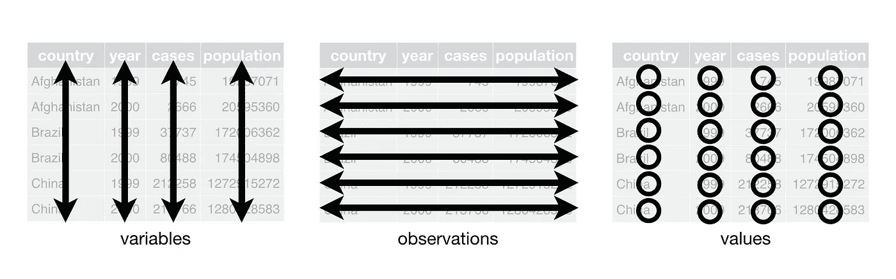

资料来源:R for Data Science(Hadley Wickham & Garrett grole mund)

数据科学家花费大约 80%的时间清理和组织数据。整齐的数据是一种组织数据集以促进分析的方式。

2014 年，Hadley Wickham 发表了一篇名为 Tidy Data 的精彩论文[，描述了用 r 整理数据集的过程，我这篇文章的目标是总结这些步骤并展示 Python 中的代码。](https://vita.had.co.nz/papers/tidy-data.pdf)

在**整理数据**:

1.  每个变量都必须有自己的列。
2.  每个观察必须有自己的行。
3.  每种类型的观测单位形成一张表。

杂乱数据是数据的任何其他排列。

# 杂乱的数据

我们将在这里探讨 5 个杂乱数据的例子:

*   列标题是值，不是变量名。
*   多个变量存储在一列中。
*   变量存储在行和列中。
*   多种类型的观测单位存储在同一个表中。
*   一个观察单位存储在多个表中。

当然，还有更多类型的脏乱没有在上面显示出来，但它们可以用类似的方式来整理。

## 列标题是值，不是变量名。

对于这个例子，我们将使用数据集“relinc.csv ”,它探索了收入和宗教之间的关系。注意，尽管很乱，这种安排在某些情况下还是有用的，所以我们将学习如何整理和不整理它。

```
import pandas as pddf_relinc=pd.read_csv("relinc.csv")
df_relinc.head()
```

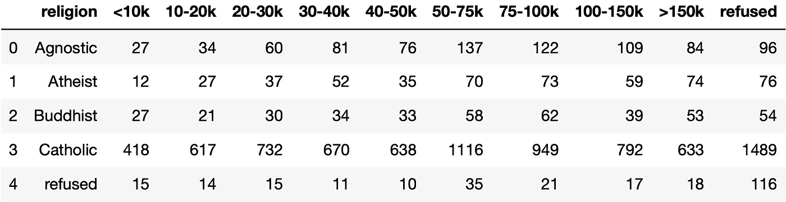

这个数据集中有三个变量:宗教、收入和频率。列标题是值，而不是变量名，所以我们需要将列(income)中的变量转换为行。我们将使用熊猫的功能**融化。**

```
# Applying melt (to a long format)df_relinc=df_relinc.melt(id_vars=["religion"],var_name=["income"],value_name="frequency")df_relinc.head()
```


上面的输出是我们数据集的整洁版本。

为了将数据集返回到宽格式，我们将使用 Panda 的函数 **pivot_table** 。

```
# Applying pivot_table (to a wide format)df_relinc=(df_relinc.pivot_table(index = "religion", columns = "income", values = "frequency")
   .reset_index() 
   .rename_axis(None, axis = 1))df_relinc.head()
```

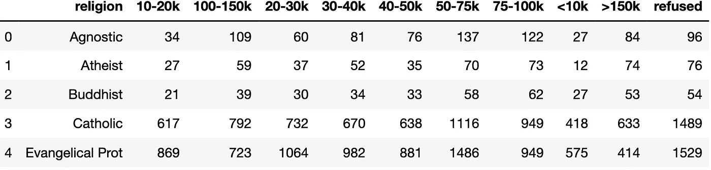

## 多个变量存储在一列中。

现在我们将研究来自世界卫生组织的结核病数据集。这些记录显示了按国家、年份和人口统计组分列的肺结核病例数。

人口统计组按性别(男，女)和年龄(0-14 岁，15-24 岁，25-34 岁，35-44 岁，45-54 岁，55-64 岁，65 岁以上，未知)细分。

```
df_tb=pd.read_csv('tb.csv')
df_tb.columns
```

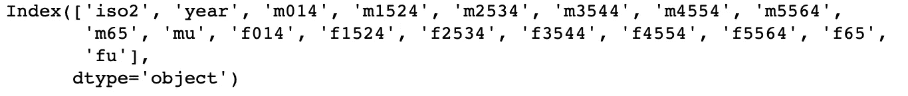

```
df_tb.tail()
```

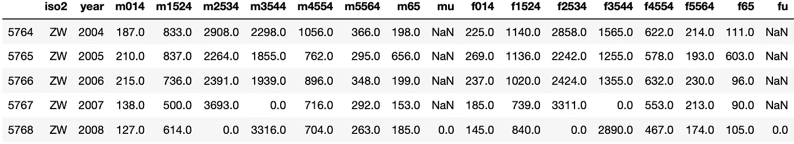

这些列包含性别和年龄值。请注意 0 和缺失值(NaN)的混合。这是由于数据收集过程造成的，这种区别对于该数据集非常重要。

首先，我们将收集非变量列，将年龄范围和性别移到一列中。为此，我们将使用**熔体。**

```
# Applying melt (to a long format)df_tb=df_tb.melt(id_vars=["iso2","year"],var_name=["demographic"],value_name="cases")df_tb.sample(5)
```

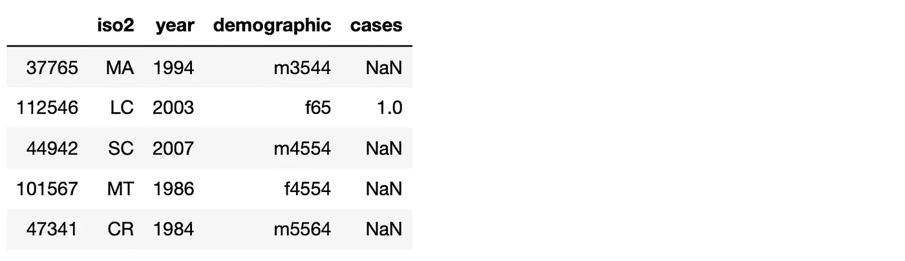

现在我们需要拆分人口统计列，得到两列变量性别和年龄。

```
# Creating new columns for sex and agedf_tb=(df_tb.assign(sex = lambda x: x.demographic.str[0].astype(str),
age = lambda x: x.demographic.str[1:].astype(str))
      .drop("demographic",axis=1))df_tb.sample(5)
```

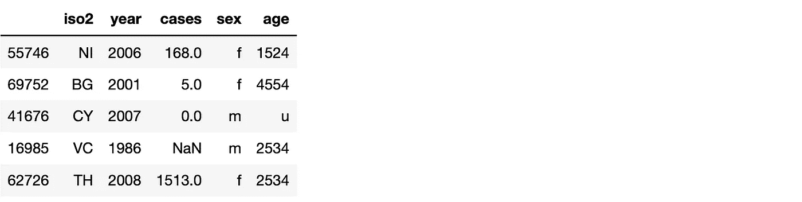

现在，每个观察都有自己的行，每个变量都有自己的列。我们刚刚整理了我们的数据集！在继续之前，让我们清理数据。

```
# Styling the datasetdf_tb.update(pd.DataFrame({"age":[age[:2]+'-'+age[2:] if len(age) == 4 else (age) for age in df_tb["age"]]}))df_tb=(df_tb.replace(to_replace =["m","f","014","65","u"],value =["Male","Female","0-14","65+","unknown"])
            .dropna())df_tb.sample(10)
```

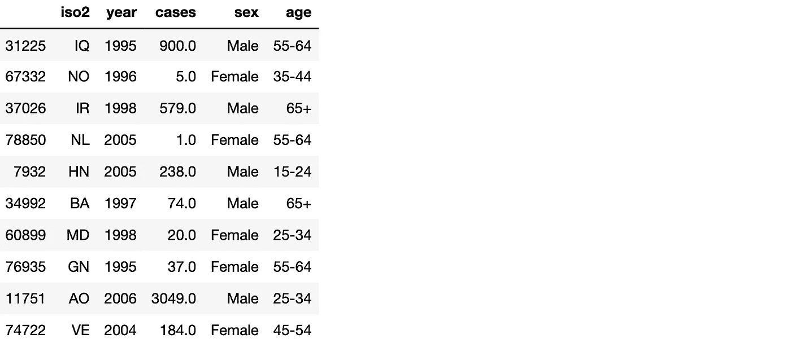

## 变量存储在行和列中。

我们将使用来自全球历史气候学网络的数据，这些数据代表了墨西哥 2010 年五个月的每日气象站(MX17004)。

它在单个列(id，year，month)中有变量，跨列(day，D1–d31)和跨行(tmin，tmax)(最低和最高温度)。少于 31 天的月份的最后一天有结构缺失值。为了更好的可视化，已经省略了列 d9 至 d31。

```
import datetimedf_weather = pd.read_csv('weather-raw.csv')df_weather.sample(5)
```

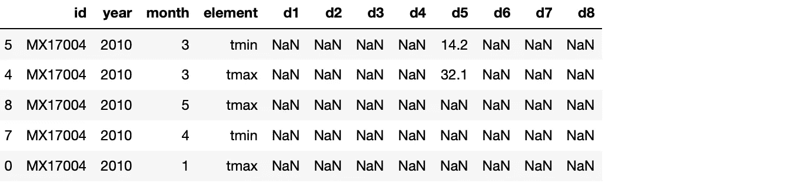

如上所示，数据集是杂乱的。变量存储在行(tmin，tmax)和列(days)中。让我们从 d1、d2、d3…列开始。

我们将应用 **melt** 为 day 变量的每个记录创建一行。

```
# Applying melt (to a long format)df_weather=df_weather.melt(id_vars=["id","year","month","element"],var_name=["day"],value_name="temp")
df_weather.update(pd.DataFrame({"day":[day[1:] for day in df_weather["day"]]}))df_weather.sample(5)
```

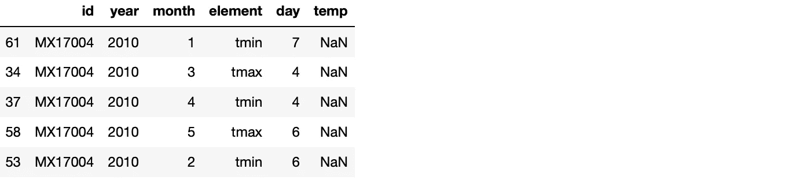

现在，我们将使用 **pivot_table** 函数为 tmin 和 tmax 创建新列，一旦它们是变量。

```
# applying pivot_table to create columns for tmin and tmaxdf_weather=(df_weather.pivot_table(index = ["year","month","day","id"], columns = "element", values = "temp")
       .reset_index().rename_axis(None, axis = 1))df_weather
```

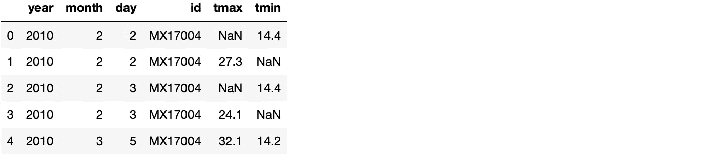

数据集看起来更好，但我们仍然需要改进它。让我们为日期创建一个列并对其进行分组。

```
# Creating a date columndf_weather=(df_weather.assign(date = lambda x: x.year.astype("str") +"/"+ x.month.astype("str").str.zfill(2) +"/"+ x.day.astype("str").str.zfill(2))
            .drop(["year", "month","day"],axis=1))
df_weather['date'] =  pd.to_datetime(df_weather['date'], format='%Y/%m/%d')# Grouping by datedf_weather=(df_weather.filter(["date", "tmax","tmin"]).groupby("date").aggregate("mean").reset_index())df_weather
```

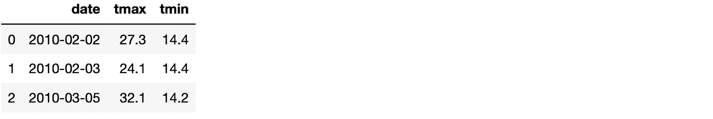

我们最终整理了我们的数据集。

## 多种类型的观测单位存储在同一个表中。

该数据集显示了 2000 年的 Billboard 热门歌曲。这个数据集记录了一首歌首次进入 Billboard Top 100 的日期。它包含艺术家、曲目、输入日期、峰值日期、流派、时间、排名和星期等变量。

```
import pandas as pd
import re
import numpy as np
import datetimedf_bill = pd.read_csv('billboard.csv',header=0,encoding = 'unicode_escape')df_bill.head()
```

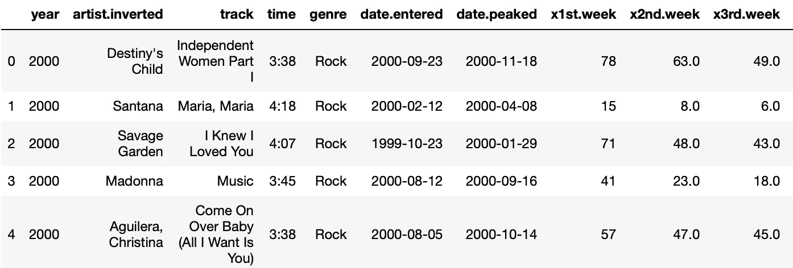

进入前 100 名后的每周排名记录在 76 列中，从第 1 周到第 76 周。如果一首歌进入前 100 名的时间少于 76 周，则剩余的列用 NaN 填充。

```
df_bill.columns
```

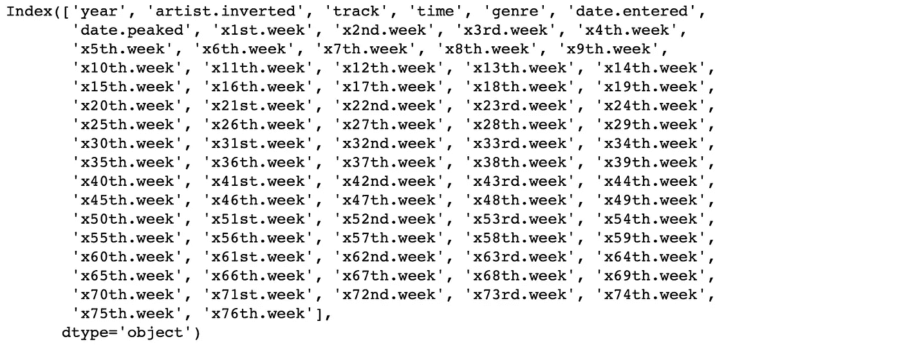

这个数据集包含对两种类型的观察单位的观察:歌曲和它在每个星期的排名。因此，艺术家和时间会在每周的每首歌曲中重复出现。在将 Billboard 数据集一分为二之前，我们需要对其进行整理。让我们从收集所有的周专栏开始。

```
# Applying melt (to a long format)
df_bill=(df_bill.melt(id_vars=["year","artist.inverted","track","genre","date.entered","date.peaked","time"],var_name=["week"],value_name="rank"))# Week to number 
df_bill.update(pd.DataFrame({"week": np.ravel([list(map(int, re.findall(r'\d+', i))) for i in df_bill["week"]])}))df_bill.head()
```

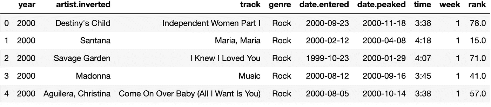

更好看！现在我们有一个可变周的列。顺便说一下，我们可以使用输入的日期和星期中的信息来创建一个新列，它将成为日期列。

```
# creating a date column from date.entered and weekdf_bill['date.entered'] =  pd.to_datetime(df_bill['date.entered'], format='%Y/%m/%d')df_bill=(df_bill.assign(date= [df_bill['date.entered'][i]+datetime.timedelta(weeks = df_bill["week"][i]-1) for i in range(len(df_bill["week"]))])
         .drop(['date.entered','date.peaked','week'], axis=1)
         .sort_values('artist.inverted', ascending=True)
         .reset_index(drop=True))df_bill.head()
```

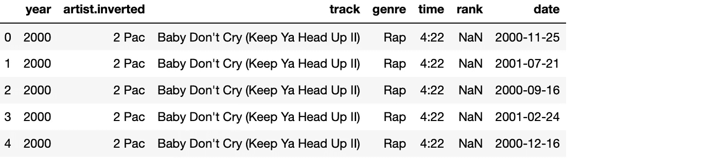

现在，我们将从轨道创建一个 id。每首歌曲必须有一个唯一的 id 号。为此，我们将使用熊猫的功能**因式分解。**

```
# creating an id column from tracklabels,unique=pd.factorize(list(df_bill["track"]))
df_bill["id"]=labels+1
df_bill.reset_index(drop=True)
df_bill.head()
```

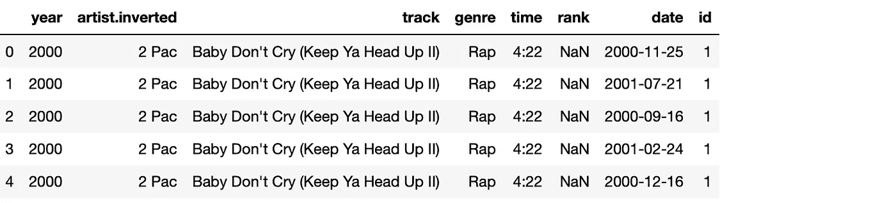

最后，我们将把数据集分成两个数据集:歌曲数据集和排名数据集。

```
# creating a new dataframe for rankdf_rank=df_bill.filter(["id", "date", "rank"]).dropna()
df_rank=df_rank.sort_values(by=['id','date']).reset_index(drop=True)# creating a new dataframe for songdf_song=df_bill.filter(["id", "artist.inverted", "track","time"])
df_song=df_song.drop_duplicates('id').reset_index(drop=True)df_rank.head(10)
df_song.head()
```

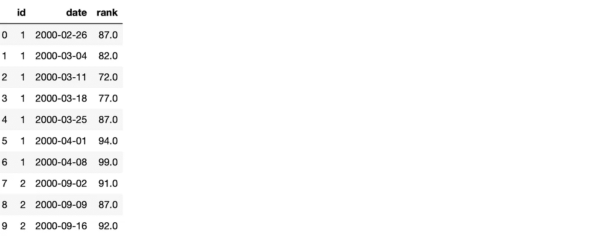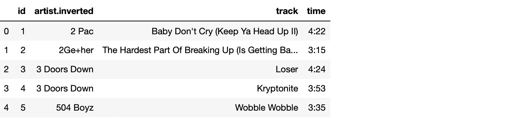

我们刚刚解决了在同一个表中存储多种类型的观测单位的问题！

## 一个观察单位存储在多个表中。

这个问题过去很容易解决。我们基本上需要读取这些表，添加一个记录原始文件名的新列，最后将所有表合并成一个表。

```
import pandas as pddf_baby14 = pd.read_csv("2014-baby-names-illinois.csv")
df_baby15 = pd.read_csv("2015-baby-names-illinois.csv")df_baby14.head()
```


```
df_baby15.head()
```


让我们根据文件名在每个数据集中创建一个列 year。最后，我们将应用 Panda 的 **concat** 函数来连接数据帧。

```
# Creating a column for the year
df_baby14["year"]="2014"
df_baby15["year"]="2015"# Concatenating the datasets
df_baby = pd.concat([df_baby14, df_baby15]).sort_values(by=['rank'])(df_baby.set_index('rank', inplace=True))df_baby.head()
```

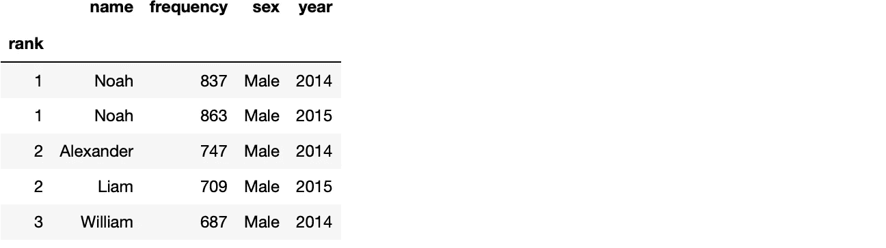

# 最终意见

本文的目标是解释整洁数据的概念，包括五种最常见的杂乱数据，以及如何用 Python 组织和清理这些数据集。

如果你发现任何错误，请不要犹豫与我联系！我最近开始在数据科学世界里冲浪，尽管我很喜欢，但我是个傻瓜。

我的代码和数据集可以在 Github 上找到:[https://github.com/rodrigomf5/Tidydata](https://github.com/rodrigomf5/Tidydata)。另外，这里是 Hadley Github，它提供了更多关于 Tidy Data 的信息:【https://github.com/hadley