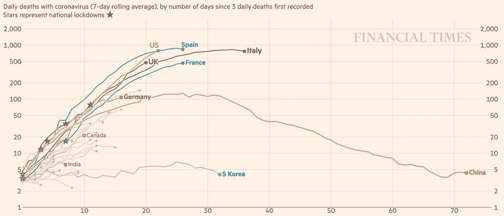

# 新冠肺炎数据可视化有什么问题，如何解决

> 原文：<https://towardsdatascience.com/whats-wrong-with-covid-19-data-visualizations-and-how-to-fix-it-3cdc9adc774d?source=collection_archive---------4----------------------->

英国《金融时报》新冠肺炎数据可视化报道示例

自从冠状病毒爆发以来，我一直对媒体甚至专家向我们展示数据的方式感到困惑。

我想现在每个人都已经看到了代表每个国家的病例数或死亡数的“轨迹”图。问题？首先，大多数不是交互式的，就像现在不是 2020 年，媒体停留在 20 世纪。你生活在一个小国家还是你的国家仍处于疫情爆发的初期？您感兴趣的数据在包中丢失了，或者更糟，甚至没有显示出来，太糟糕了。

但实际上这不是最大的问题。病例总数或死亡总数当然是制造头条新闻或给读者和观众留下印象的好方法，但它们没有给我们任何实际的洞察力。一些人使用对数标度，另一些人根据国家人口加权，或者绘制每日数字而不是绝对总数(这是一种更好的方式来感受正在发生的事情)，但所有这些可视化仍然没有抓住要点。正如 Eric Ries 所说，这些不是“T0”可操作的度量标准。

关于这次爆发有什么实际的见解？我们真正想知道的是什么？嗯，我们想知道:

1.  爆发进展率。**病毒传播速度加快了吗？疫情发展速度放缓了吗？**
2.  如果正在放缓，鉴于目前的趋势，每日病例/死亡人数何时开始减少？那就是，**我们什么时候会到达顶峰？**我们的卫生系统何时会开始好转，而不是一天比一天糟糕？

获得这两种见解的良好指标是查看*每日病例数/死亡数的进展率。*用数学术语我们要看每日例数的*二阶导数*，或者*急动度*(加速度的加速率)。在你退出之前，让我解释一下。

如果每日病例数的变化率为正，也就是说，如果每日新增病例数在加速增长，这意味着疫情正处于指数阶段，尚未得到控制。这是一个实际的洞察力。如果每天的病例数仍在增长，但变化率为负，也就是说，如果每天新增病例的增长速度在放缓，这意味着疫情的爆发速度在放缓。再次，实际的洞察力。

如果我们拿汽车做类比，总例数是汽车*里程*，每日例数是汽车*速度*，每日例数变化是汽车*加速度*(汽车加速时为正，汽车刹车时为负)，每日例数变化率是汽车加速的方式:是加速*更快*，还是加速*变慢*(速度仍在增加，但速度变慢)。在爆发的情况下，我们最感兴趣的是汽车*加速*的方式，对吧？**那么，为什么每个人都向我们展示汽车的里程数*？***

*鉴于我们知道汽车加速的方式，我们可以知道它何时开始减速(=爆发峰值)，并最终停止(爆发结束)。*

*让我们就这么做吧，用交互式数据可视化代替静态图像。首先，让我们看看某个特定国家的死亡和病例的详细信息(您可以使用右上方的度量菜单在两者之间切换):*

*如何阅读图表:4 月 1 日，美国的死亡人数比前一天增加了 37.5%。考虑到这一趋势，我们仍然可以预计 4 月中旬会有 12%的增长。*

*在这里，我们使用线性插值得到实际的进展率及其趋势。如果比率为正，则每日死亡人数/病例数在增长，如果比率为负，则每日死亡人数/病例数在萎缩。如果它的趋势是上升的，**增长是加速的**，如果它是下降的**增长是减缓的**。当趋势越过 0，**爆发达到顶峰**(如果是未来，只是一个预测)。*

*注意:对于一些国家来说，数据存在一些问题，扭曲了实际趋势，如 4 月 2 日法国官方数字中增加了 884 例额外死亡(在此之前，官方数字中不包括养老院)，这使得死亡率飙升。应该对数据进行预处理，以便将这些问题考虑在内，但我没有时间这样做。尽管如此，一般的方法仍然有效。*

*现在，让我们关注一下趋势，并比较一些国家(为了更好地了解情况，您最多可以选择 5 个国家):*

*如何阅读图表:鉴于目前的趋势，美国的日常进展正在放缓，但比法国慢。英国的日常进步正在加速。*

*我们可以看到:*

*   *法国、意大利、西班牙和美国的增长速度都在下降，这意味着疫情似乎得到了控制，病例仍在增长，但速度较慢*
*   *英国仍在加速增长，这表明那里的疫情尚未得到控制*
*   *意大利在 4 月 1 日左右达到顶峰，现在已经进入萎缩阶段*
*   *法国和西班牙将在四月中旬达到顶峰，美国将在四月底达到顶峰*

*当然，我们可以通过查看通常的案件数量“轨迹”图来得出相同的结论，试图猜测它是否仍然具有指数形状(对于线性标度)或曲线将在哪里变平(对于对数标度)，但那些只是:猜测。通过查看*每日病例数/死亡进展率*就简单多了，我们只看实际数据进展，没有解释的余地。升学率上升？指数爆发。正往下走？仍在增长，但速度较慢。消极？萎缩。穿越 0？达到了巅峰。一个国家的升学率比另一个国家更低？它恢复得更快了。就这么简单。*

*为了更进一步，我们可以观察每日病例数/死亡进展率随时间的*演变，*这将使我们能够比较疫情同一阶段的国家应对措施，而不仅仅是当前的情况。我还可以让图表的数据每天自动刷新，并查看国家地区而不是整个国家。但那是另一篇文章…*

## *感谢阅读！如果你喜欢这篇文章，不要犹豫，分享它。*

**我每天都在学习，如果我有任何错误，请随时纠正我，并在评论区添加您的建议。另外，请注意英语不是我的母语。**

*来自作者的说明:我不是流行病学家，这里显示的结果仅基于应用于公开可用数据的纯数学，而非医学专业知识，本文的观点不应被解释为专业建议。收集这些数据的方式也存在偏差，当然还有数据质量问题，这些我都没有提到。最后，各国在疫情方面并不一致，数字可能会因国家内的实际地区而有很大差异，这里也没有显示。*

****编者按:*** [*走向数据科学*](http://towardsdatascience.com/) *是一份以数据科学和机器学习研究为主的中型刊物。我们不是健康专家或流行病学家，本文的观点不应被解释为专业建议。想了解更多关于疫情冠状病毒的信息，可以点击* [*这里*](https://www.who.int/emergencies/diseases/novel-coronavirus-2019/situation-reports) *。**