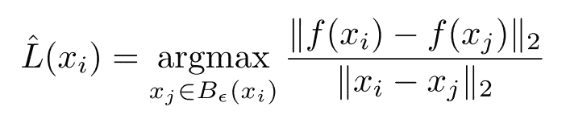
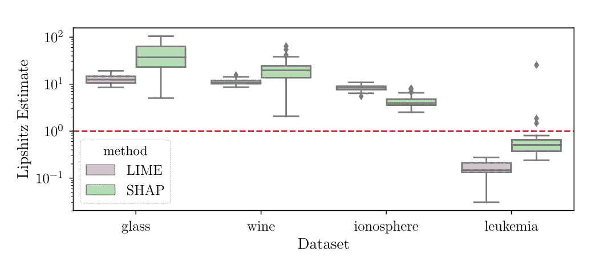
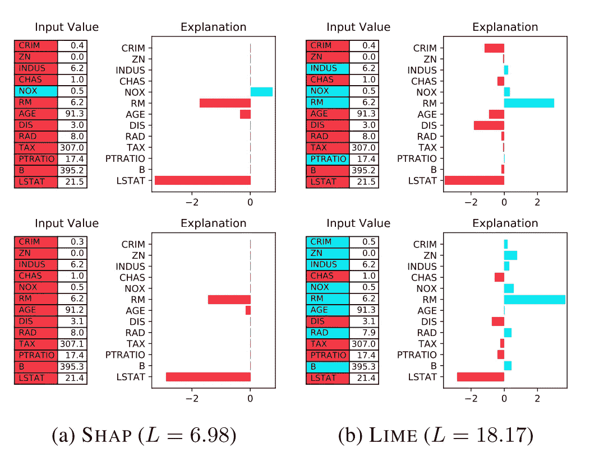
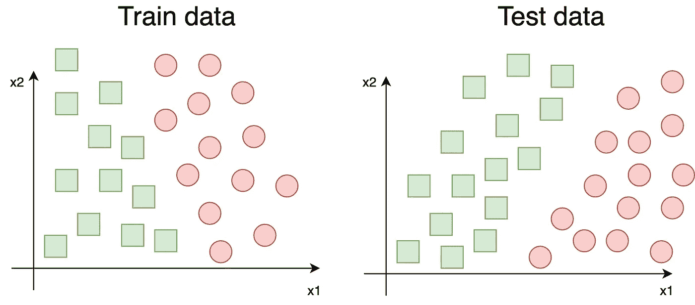
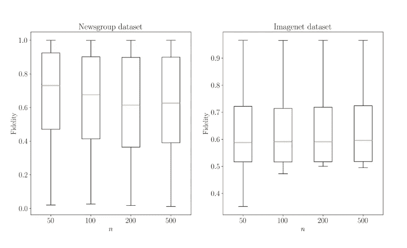
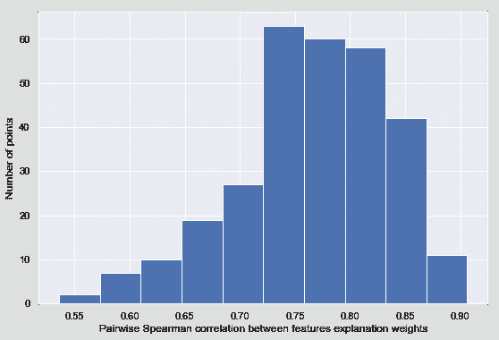
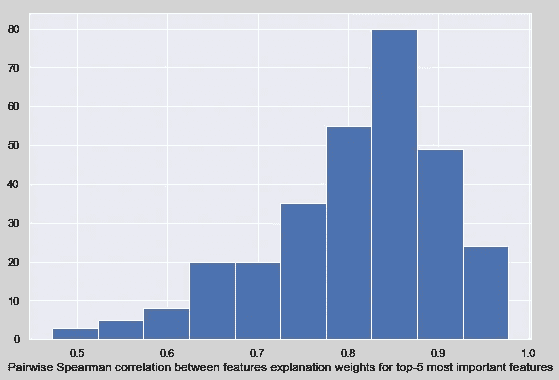
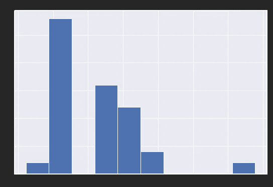

# 酸橙有什么不好

> 原文：<https://towardsdatascience.com/whats-wrong-with-lime-86b335f34612?source=collection_archive---------16----------------------->

众所周知，荷马·辛普森是一个头脑简单的人，时不时会做出一些愚蠢的事情。在这里，他决定用微波炉烹饪面包、熏肉和鸡蛋。我们发现看起来很有趣，但同时，我们倾向于在数据科学中做类似的事情。不要像荷马那样；使用合适的工具。辛普森一家(《荷马史诗》第七季第 17 集)中的这个镜头被认为是合理使用

本地可解释的模型不可知解释( [LIME](https://github.com/marcotcr/lime) )是一个流行的 Python 包，用于解释单个模型对文本分类器或作用于表格(数字或分类数据的 NumPy 数组)或图像的分类器的预测。莱姆最初是在一篇名为《[我为什么要相信你》的论文中提出来的:解释任何分类器的预测](https://arxiv.org/abs/1602.04938)“在 2016 年，从那以后 LIME project repository 达到了几乎 8k 星的点(作为对比，scikit-learn 有 42k start)。

虽然 LIME 是解释任何分类器预测的最受欢迎的方法之一，但它在研究社区中受到了几次批评:LIME 遭受标签和数据偏移，解释取决于超参数的选择(是的，LIME 有超参数)，甚至类似的点可能有不同的解释。这些问题的组合可能会给出错误的、意想不到的解释。

# 石灰是如何工作的

在机器学习项目中，我们经常使用复杂的模型，如随机森林或深度神经网络。对于一个人来说，理解这些黑盒是如何做出预测的是不可行的。与此同时，如果我们用更简单、更容易解释的模型，如线性回归或浅层决策树，来代替复杂的模型，我们将会在分数上失利。

LIME 背后的想法旨在从两个世界获得权利:让我们训练一个准确的黑盒模型，但该模型的解释将基于简单、易于理解的模型，如线性或逻辑回归。

也就是说，为了解释单个点 *P* ，让我们训练一个局部线性(或逻辑)回归模型。输入数据是通过到点 *P* ( *l1* 、 *l2、*或其他)的距离加权的扰动列车数据( *X* )。目标是黑盒模型对 *X* 的预测。可以通过探索替代模型的系数来获得解释(关于 LIME 如何工作的更多信息可以在[原始论文](https://arxiv.org/abs/1602.04938)或[这本优秀的书](https://christophm.github.io/interpretable-ml-book/lime.html)中找到)。

这种方法可以处理任何数据类型:表格数据、文本和图像。石灰库有一个很好的 API，易于使用。然而，石灰有几个隐藏的问题。

# 问题

石灰法有几个重大问题，本节将对此进行描述。

## 石灰的解释并不可靠

在做预测的同时，我们期望相似的点应该有相似的预测。也就是说，如果信贷申请人的收入从 60k/年变为 61k/年，我们预计信贷评分不会下降或上升(至少经常如此)。同样的逻辑也应该适用于解释:特征输入向量的微小变化不应该显著影响解释。回到信用评分的例子:如果模型的解释表明收入=60k 是一个重要的特征，并且它将信用评分推向一个积极的方向，那么收入=61k 也应该如此。不幸的是，莱姆和 SHAP 并不总是如此。

大卫·阿尔瓦雷斯-梅利斯和汤米·s·雅克拉在他们的论文“[关于可解释性方法的健壮性](https://arxiv.org/abs/1806.08049)”中介绍了一种解释工具的健壮性的度量。局部 Lipschitz 估计的度量被定义为:

[来源](https://arxiv.org/abs/1806.08049)

其中 *x_i* 是输入示例， *x_j* 是 *x_i* ， *f(x)* —特征的重要性， *B(x_i)* —是以 *x_i* 为中心的半径为 *ε* 的球。此测量显示了由于输入要素的微小变化而导致的要素重要性的最大变化。降低测量值——更有力的解释是。

在这篇论文中，作者用 SHAP 和莱姆估计了随机森林模型解释的稳健性。对于几个数据集，他们从每个数据集中采样一百个点，并计算局部李普希茨估计。结果如下图所示:

在各种 UCI 分类数据集的 100 个测试点上计算的局部 Lipschitz 估计。[图片来源](https://arxiv.org/abs/1806.08049)

为了便于理解，这些值是低、平均还是高，我们来看一个解释示例。在这里，作者提出了波士顿数据集中的一个点和一个修改点，它最大化了局部 Lipschitz 估计:

上图:波士顿数据集中的示例 x_i 及其解释(属性)。下图:对 Lipschitz 估计 L(x_i)的最大化的解释。[图来源](https://arxiv.org/abs/1806.08049)

我们可能会看到，输入特征的一个小变化(CRIM: 0.4 → 0.3，AGE: 92.3 → 92.2，DIS: 3.0 → 3.1，TAX: 307 → 307.1，B: 395.2 → 395.3，LSTAT: 21.5 → 21.4)使得解释发生了巨大的变化:对于几乎一半的特征，特征重要性和绝对值的符号都发生了变化！作者在用石灰解释图像时也观察到了类似的行为。

> 对类似例子的解释可能完全不同。

## LIME 遭受标签和数据移位

数据转移是指训练和测试分布不同时。这是至关重要的，但有时也是 ML 管道的一个隐藏问题，它可能会导致验证阶段的分数低估或高估，或者生产中的模型退化。数据偏移是由以下原因造成的:

1.  样本选择偏差。使用不同的规则选择训练和测试部分的数据。例如，一个图像分类模型在使用专业相机拍摄的图像上进行训练，而在使用智能手机拍摄的照片上进行测试。
2.  不稳定的环境。世界不是静止的，底层过程是变化的，所以算法必须更新。这在不断发展的算法交易和欺诈检测领域更为明显，而在情绪分析等更为“保守”的领域则不那么明显。

关于数据转移的更多信息可以在[了解数据集转移](/understanding-dataset-shift-f2a5a262a766)博客文章中找到。

数据移位的例子

阿米尔·侯赛因·阿哈旺·拉赫纳马和亨里克·博斯特罗姆进行的研究——“[石灰框架](https://arxiv.org/abs/1910.14421)中数据和标签转移的研究”——解决了这个问题。他们做了几个实验，并得出结论，由 LIME 的扰动过程生成的实例与从基础分布中提取的训练实例有显著不同。基于所获得的结果，作者认为所解释的例子的特征的随机扰动不能被认为是 LIME 框架中数据生成的可靠方法。

这导致了一个严重的问题。部分由于数据转移，部分由于替代模型预测能力的限制，替代模型不能足够好地近似黑箱模型的预测。这种低保真度的解释几乎毫无用处(近似的良好程度被称为*保真度*)。

> 石灰解释保真度低。

新闻组和 ImageNet 数据集中的保真度和 MMD 散度。[来源](https://arxiv.org/abs/1910.14421)

## 石灰解释取决于超参数的选择

石灰有一组基本的超参数:

1.  训练一个代理模特需要多少分？
2.  我们应该如何权衡这些要点？我们应该使用什么距离度量？
3.  如何选择替代模型的超参数(即正则化的类型和强度)？

希望无论我们选择哪一组超参数，解释都或多或少是相同的。我试着检查了一下。

在实验中，我训练了 LightGBM 模型，并使用一组不同的超参数对来自[心脏病 UCI](https://archive.ics.uci.edu/ml/datasets/Heart+Disease) 数据集的样本点进行了合理的解释。对于每个点，我计算了使用不同超参数集获得的特征权重之间的成对 Spearman 等级相关性。在最好的情况下，当解释不依赖于超参数时，成对相关性应该等于 1。不幸的是，酸橙的情况并非如此。

成对相关的分布如下所示:

前五个最重要特征的成对相关性分布(使用 LightGBM“增益”重要性获得):

我们看到相关性很高，但远非完美。这意味着，对于不动点，我们可能期望不同的本质特征和它们的贡献，取决于超参数的选择。在某些情况下，基于使用什么超参数进行解释，相同的特征可以将预测“推向”积极或消极的方向。

使用不同的石灰超参数的特征权重。我们可以看到，根据超参数的选择，该特征可能对最终预测产生积极或消极的影响。

> 解释取决于石灰超参数的选择。

我的 GitHub 中提供了再现性代码:

 [## DenisVorotyntsev/lime _ experiments

### 这个库包含关于超参数的选择如何影响石灰解释的实验代码。的…

github.com](https://github.com/DenisVorotyntsev/lime_experiments) 

# 摘要

石灰框架现在被广泛使用。正如我在这篇博文中所展示的，它有几个显著的问题，这使得 LIME 成为模型解释的一个糟糕的选择:

1.  相似例子的解释可能完全不同；
2.  石灰解释保真度低；
3.  解释取决于石灰超参数的选择。

有可能克服那些问题吗？我认为，可以通过使用一组不同的超参数和稍微改变的特征输入向量来计算实际的特征重要性，作为获得的时间重要性的平均值。但对我来说，它反而像一根拐杖，是一个可靠的解决方案。我想听听你对此的评论和想法。

相反，我建议使用完全可解释的模型，如线性回归或加法模型(例如，[解释](https://github.com/interpretml/interpret)显示与基于树的模型相当的结果，同时是完全可解释的)或使用 [SHAP](https://github.com/slundberg/shap) 解释 ML 模型。

# 附加链接

如果你喜欢这个，你可能会有兴趣阅读我的另一篇关于排列重要性问题的文章:

 [## 停止置换功能

### 排列重要性可能会给你错误的、误导的结果。但是为什么呢？

走向数据科学](/stop-permuting-features-c1412e31b63f)