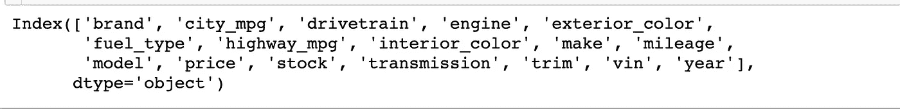

# 你的车值多少钱？

> 原文：<https://towardsdatascience.com/whats-your-car-worth-a-simple-tour-of-used-car-prices-using-linear-regression-eda-section-e98f89804dd6?source=collection_archive---------21----------------------->

## 一个简单的旅游二手车价格使用线性回归，EDA 部分。

今天，我们将从我的熨斗体验中稍作休息，投入到我在熨斗工作时参与的一个项目中。线性回归是当今数据分析领域最常用的工具之一。结果是清晰的，易于编译(通常)，并且易于翻译。它所做的是绘制数据点，并尝试确定可能会或可能不会影响每个数据点沿着某个基线下降的能力的因素。它还可以用来确定几乎任何事物的趋势和预测。这绝不是一个突破性的项目，但更多的是在日常车主面临的实际问题上使用线性回归的有趣练习。我的二手车值多少钱？

那么让我们来谈谈二手车吧？我承认，这不会是一个长时间的讨论，因为我对汽车知之甚少。所以这将是一个对汽车知之甚少的人对汽车及其特征的分析。让我们开始吧！

第一步是收集数据。我和我的搭档奥玛尔去 Cars.com 凑钱买车。为了避免被屏蔽和破坏我们的项目，我们从他们的网站上搜集了 3055 个二手车列表。所有的房源都位于距离邮政编码 10004 不到 10 英里的地方，我们对所有品牌和型号都开放。车型年份限定为 2014 年至 2018 年。我们假设比那更老的车会进入真正的竞争领域，或者那些列表会进入独特或古董列表，所以我们想避免污染我们的数据。我们收集的信息分为以下几类:

现在，这似乎是很多信息。我们立即放弃了内饰颜色、库存、VIN 和装饰，因为我们觉得前三个与汽车的转售价值基本无关，最后一个有太多的 nan。很容易想象有人可能会有购买红色汽车的动机，但只要内饰不太过分，没有人真的在乎内饰是米色还是黑色。库存由一个字母数字代码组成，我们认为这是特定于品牌的，我们认为与品牌相关，但与其他汽车没有太大关系，除非特定库存有一些明显的问题。请记住，我对汽车几乎一无所知，所以如果你们中的任何人认为我错了，请尽一切办法让我知道。

现在我们有了新整理的数据，下一步是对它进行一些清理。我们从排除任何主要的数据问题开始。例如，有人列出了一辆特斯拉，其城市英里数为 102，公路英里数为 105。我们不准备评估他们每加仑汽油的具体指标，也不认为这是与我们 3000 辆其他汽油车的适当比较。接下来，我们删除了没有列出年份的条目，将年份转换为 2019 年之后的年数，并确保我们所有的数字都是整数，以便正确建模。最后，我们留下了 2677 个条目，包括 13 个特征、4 个连续特征和 9 个分类特征。

# EDA

让我们看一看我们得到了什么，好吗？首先，我们检查了我们挑选的品牌，看看哪些汽车在二手市场上最常见:

对我来说，这个饼图很有意义。出于某种原因，我们看到许多以日产为首的中档汽车，但也包括其他日本制造商。有趣的是，在福特或现代之前，梅赛德斯占我们二手车市场的 6.0%。有趣的是，这是否与这些汽车的整体市场占有率有关，或者梅赛德斯或其所有者是否有什么东西鼓励在前 4 年内转售。例如，也许购买奔驰的人痴迷于形象，总是想要一辆更新更闪亮的车。或者，也许梅赛德斯经常生产升级版汽车，足以吸引人们购买最新款。其他有趣的可视化包括检查 city_mpg、highway_mpg 和 price 的分布，如下所示:

我很肯定，尽管我们的样本量很小，但这是当前行业趋势的一个非常准确的快照，当谈到 mpg 时。如果你想知道什么车是最出彩的，那些在城市和公路上都超过 40 英里的车都是混合动力车。那些在城市中低于 20 英里/加仑的主要是 SUV 和现代 Genesis。那些在公路上低于 20 英里/加仑的是 SUV，但不包括现代 Genesis。我认为这值得大笑一场。

从这个初步分析中可以挖掘出一些精华。数据的可视化有助于我们从一些谷壳中分离出小麦。我不需要滚动数据来寻找奇怪的数字，图表告诉我很多我需要关注的地方。我也知道，也许现代 Genesis 并不适合像我这样想要超值而不是奢华的人。

以下是一些更有趣的图表，显示了我们正在合作的几个品牌的价格分布:

哇，这真的给你的车的未来价值带来了有趣的启示。本田轿车的平均价格在 16-30k 左右，而当你看他们的 SUV 和卡车时，价格会接近 40k。这个分布看起来很有希望。尼桑也是如此。当我们进入豪华车的范畴时，分布开始看起来绝对热闹。以玛莎拉蒂为例。所有 5 款车型均为 2016–2017 款玛莎拉蒂 Ghibli:

现在谷歌告诉我，这些汽车在 2020 年的零售价约为 10.1 万美元。三年后，你可以用本田雅阁的价格买到这些车。在最好的转售情况下，降幅为 59%。现在让我们来看看保时捷。

保时捷卡宴 S 今天的零售价为 11.6 万美元满载。在同一时间段内，2016 款 Cayenne S 的零售价为 48，594 美元，仍超出本田的范围，降幅为 58%。让我们看看那辆奔驰！

梅赛德斯 S550 显然不再生产了，所以我们来对比一下更贵的 2020 S560 4matic。这款车的零售价约为 12 万美元。以 72，901 美元出售的条目 2031 显示在 4 年中价值仅损失了 39%!我的意思是，这不完全是苹果对苹果，但也不完全是苹果对橘子。

好了，我想我就此打住。EDA 非常有趣，我可以花几个小时来观察可视化效果和处理数据，寻找新的关系。我知道我承诺了线性回归，但我想我今天已经吸引了你们足够的注意力。此外，我们希望使用回归来预测二手车的价格，而不是计算具有最佳转售潜力的汽车。下周我们将进入线性回归和我们发现的一些有趣的系数！此外，如果了解汽车的人可以加入他们的观察，我很乐意了解更多关于这一切是如何工作的！

续在[你的车值多少钱第二部分！](/whats-your-car-worth-part-2-ee0500d5c997)