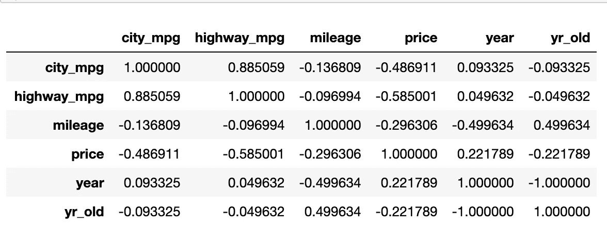
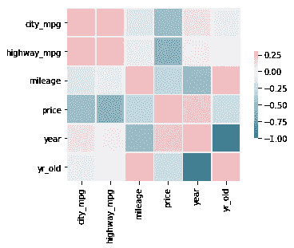
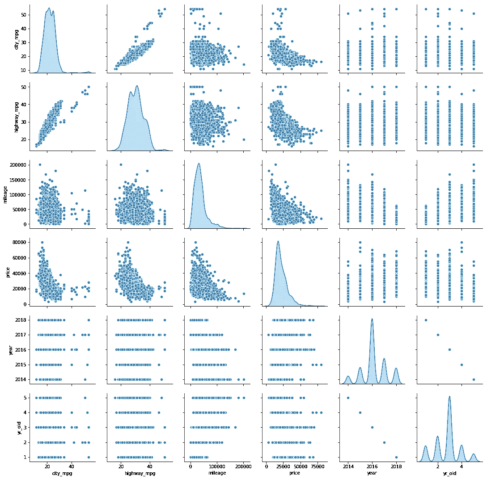
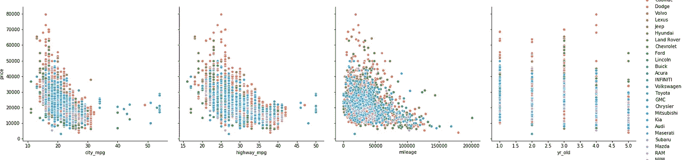
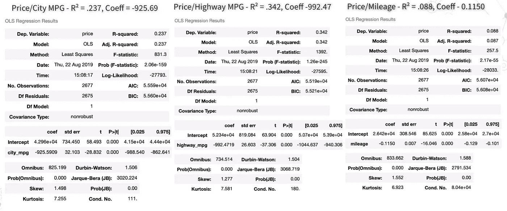
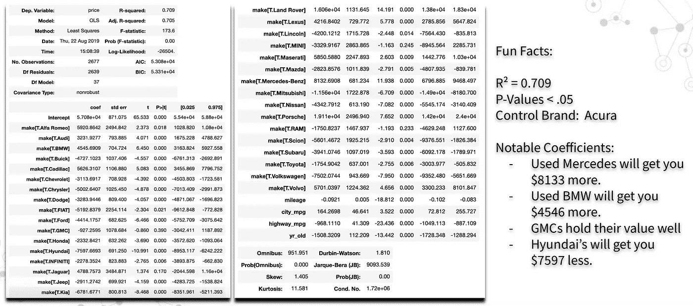
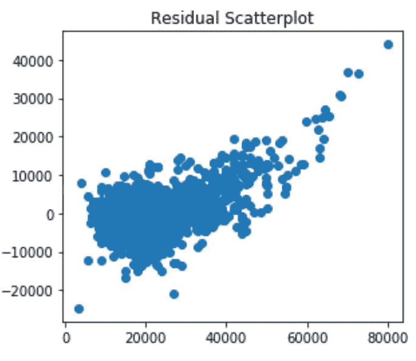
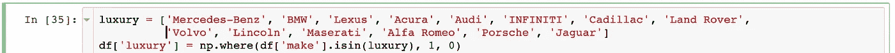
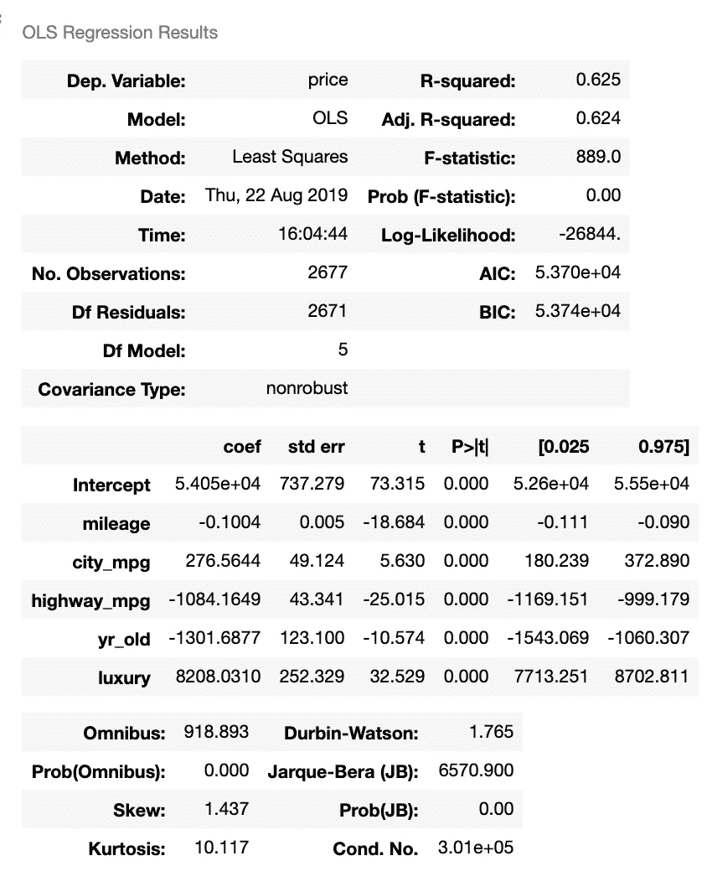
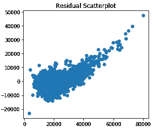

# 你的车值多少钱？—现在有了线性回归和相关！

> 原文：<https://towardsdatascience.com/whats-your-car-worth-part-2-ee0500d5c997?source=collection_archive---------23----------------------->

埃里克·麦克林在 [Unsplash](https://unsplash.com/collections/10468659/car-dealership?utm_source=unsplash&utm_medium=referral&utm_content=creditCopyText) 上的照片

## 你的车值多少钱？

## 相关和线性回归时间！

你好你好，欢迎回到我的线性回归价格预测。[上周](/whats-your-car-worth-a-simple-tour-of-used-car-prices-using-linear-regression-eda-section-e98f89804dd6?source=friends_link&sk=29ca1dc16949f0bde30f258f50459ae6)我们检查了一些汽车的 EDA，发现玛莎拉蒂的转售价值非常糟糕。简单回顾一下，我们从 Cars.com 搜集了数据，将我们的车型年份限制在 2014 年至 2018 年，清理了我们的数据，去掉了我们认为对我们的车型没有用的东西，并拍了一些品牌及其转售价值的快照。

下一步，建立我们的线性回归！对于那些想跳到最后看看模型运行的人，我已经把它上传到 heroku，点击[这里](https://usedcarpricepredictor.herokuapp.com/)。

# 初始步骤

因此，在进行线性回归时，你需要做的第一件事就是确定是否有任何显而易见的关系可以用来确定你的最终结果。我们这个模型的目标变量是价格，幸好它是一个连续变量，所以我们不必转换它或做任何疯狂的事情。那么什么可能和价格有很好的关系呢？马上，我可以说我们的 years_old 列可能有很好的相关性，mileage 也是一个很好的相关性。

所以我们有一些理论，但是当然熊猫和 matplotlib 帮助我们简化了这个过程。一个简单的 df.corr()为我们提供了以下内容:

对于那些更倾向于视觉的人来说，sns.heatmap()也会给我们带来一些不错的结果:

鉴于我们正在与二手车价值市场合作，看到负相关性是有意义的。例如，汽车行驶的里程越多，价格就越低。这是有道理的。有趣的是，城市英里数和公路英里数之间有很强的负相关性。人们会认为一辆 mpg 更大的车会有更好的转售价值，但事实显然不是这样。我对此的理论是，那个时期的汽车是在人们仍受经济衰退影响的时候生产的，而且汽油更贵。但现在汽油价格下降了，人们更关心其他汽车功能，高 mpg 对 2019 年的买家来说没有那么有价值了。我想对话是这样的“哦，看，这是一辆很酷的车，低里程，而且不太旧。哦，它有一个高城市英里？我想这很酷。”请注意，city_mpg 中的相关性比 highway_mpg 中的稍弱。或许这与优步在纽约为优步出租车融资的浪潮有关？

热图很酷，但我发现 sns.pairplot 在确定相关性方面更有帮助，如下所示:

现在这绝对酷多了。我们实际上可以看到相关性的强度……它们并没有那么大。但是！他们肯定给了我们一个开始寻找的地方！让我们仔细看看。

我们最初的相关性属于茄子、辣椒和花的标准模式。开玩笑，那些并不是真正的标准模式，事实上，它们并不擅长帮助我们建立模型。有趣的是，我们看到了一些异常值，一些价格最高的汽车，例如 city_mpg 和 highway_mpg，分别在 20 和 30 mpg 线之后。里程(或花)到处都是，但你可以看到 50，000 英里线后面的高度集中。

对这些数据进行线性回归并不能真正帮助我们开发模型。看看我们用 OLS 得到了什么:

不是很有希望，我们的 R 值，或者解释数据差异的统计数据，非常低，我想看到更高的数据。更能说明问题的是，欧

# 肖恩·阿布·威尔逊方法

那么，当我们的数据对我们不利时，我们该怎么办呢？数据科学家、统计学家等使用各种方法来转换他们的数据，以找到隐藏的关系。但是我们肯定要做的第一件事是我的教练肖恩·阿布·威尔逊说的“让我们把他们放在一起，看看会发生什么！”

下面是我们的 OLS 总结的假人汽车品牌，以及城市 _ 英里，公路 _ 英里，里程和年龄 _ 旧:

不错吧？我们将 R 值提高到了 0.709，这意味着我们数据中几乎 71%的差异可以在我们的模型中得到解释。这很酷，但如果我们检查我们的残差，我们得到的不是超级棒。r 是一个很大的数字，但它不是决定我们的模型是否合适的全部。查看我们的残差散点图:

你可以为我们的模型画一条线，但它不会很漂亮。我们能从这些数据中学到什么呢？

值得注意的是，一旦我们纳入品牌，我们的模型有多少是可以解释的。这很有道理，宝马很可能会先获得更高的转售价格，因为车主花了这么多钱购买新车。此外，它们在市场上很受欢迎，很容易就有很强的需求，因此有一个强大而现成的转售市场。

同样有趣的是，现代汽车在转售市场上表现很差。我爸爸会说他们也是蹩脚的车，但我从来没有真正开过，所以我不能在这个小事实上权衡。

大众汽车在转售市场上也非常糟糕，但有趣的是，在我们的数据集中，它们的数量要少得多。在我们的数据集中，与现代的 144 个条目相比，只有 41 个大众。也许我们没有看到他们价值的恰当体现，也许大众是守护者。我很想知道他们在汽车市场上占据了多大的份额，以及我的数据是否真实地反映了这一点。通过这种方式，我可以对某个特定品牌的真正价值得出更多结论。

# 奢侈品的价格是多少？

我和我的搭档注意到的一件事是，在转售市场上，豪华车似乎拥有特殊的溢价。如前所述，这似乎是显而易见的，但我们很好奇奢侈品类别对我们的模型和转售市场有多大影响，所以我们将我们的奢侈品品牌包装成自己的类别。该奢侈品类别由以下品牌组成:

这产生了一些有趣的结果。看看下面的 OLS:

这里系数是我特别感兴趣的数字。对于豪华车类别，我们查看特定的汽车是否在我们的豪华车类别中，价格向上移动$8208.03。对于奢侈品来说，这是一个显著的提升，有趣的是，我在心里把这个数字贴上了“奢侈品价格”的标签。

让我们看看这个新模型的残差，好吗？

有趣的是，我们已经设法平滑了我们的散点图，这有一点意义，因为我们没有太多的噪音，多个类别将我们的点拉向各处。

现在，我们小小的转移似乎已经获得了一些有希望的结果，以及我们在追求适当的预测模型时可以采取的新方向。

# 直到下一次…

我就此打住。我想我还有 5 分钟的材料要读，这将使这个博客被阅读 15 分钟，我知道这要求很多我亲爱的读者。

在这次会议中，我们学到了很多很酷很有趣的东西，识别相关性，混合和匹配类别来构建我们的模型。我们还学习了奢侈品的价格，我认为这是俏皮的，但你可能认为是显而易见的。最重要的是，我们的系数使我们能够准确量化汽车的每个部件在总价中所占的比重。下周我会把事情分解得更多，所以期待看到更多的 OLS 和更多的残差图！

续在[你的车值多少钱第三部分！](/building-a-linear-regression-model-for-predicting-the-price-of-a-used-car-now-with-logs-54a478438d1)