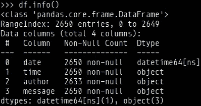
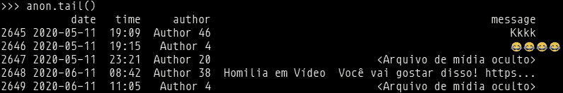
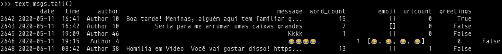
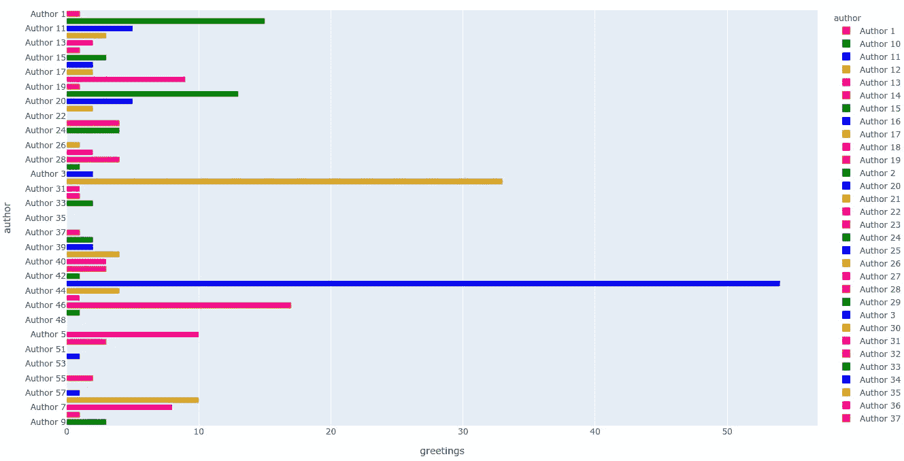

# Python 中的数据分析:在 WhatsApp 消息上使用正则表达式

> 原文：<https://towardsdatascience.com/whatsapp-messages-visualizing-interjections-sent-by-users-and-other-perks-ea97bbd7f7c5?source=collection_archive---------37----------------------->

## 在识别消息中的感叹词的上下文中，使用 Python 和 Pandas 中的正则表达式进行数据分析的面向示例的教程


照片由[AARN·GIRI](https://unsplash.com/@_giri_?utm_source=medium&utm_medium=referral)在 [Unsplash](https://unsplash.com?utm_source=medium&utm_medium=referral) 上拍摄

大概以前也发生过:你打开你的 WhatsApp，通过很多群看了很多“早上好”、“晚上好”、“下午好”的消息。现在，假设您想要可视化该群组的消息，以便获得更多的洞察力，例如，来自某人的消息数量，或者哪一天的消息数量最多，或者在这种情况下，发现每个人在特定的 WhatsApp 群组中发送了多少个“早上好”式的感叹词。如何做到这一点？

在本帖中，我们将研究 Python 和 Pandas 的正则表达式的使用，以达到我们的目的。

# 数据

这些数据是从 WhatsApp 的群聊中获取的，并通过该应用程序导出。就该职位而言，该小组有 57 名成员，其语言为葡萄牙语。

对于消息，数据遵循以下格式:

```
DAY/MONTH/YEAR HOUR:MINUTE — USER: MESSAGE
```

# 该项目

这个项目是基于[kurasaiteja/WhatsApp-Analysis](https://github.com/kurasaiteja/Whatsapp-Analysis)。虽然这个项目遵循类似的路径，但一些核心设计选择和其他改进将被讨论。它是用 Python 写的。

## 进口

本项目使用[熊猫](https://pandas.pydata.org/)、 [NumPy](https://numpy.org/) 、 [Matplotlib](https://matplotlib.org/) 、[表情符号](https://pypi.org/project/emoji/)、 [regex](https://pypi.org/project/regex/) 和 [Plotly](https://plotly.com/) 。

```
import re
import regex
import pandas as pd
import numpy as np
import emoji
import plotly
import plotly.express as px
import matplotlib.pyplot as plt
from os import path
```

## 助手功能

为了确定输入中的行是否以日期时间符号开始，starts_with_date_time 函数被定义为:

```
def starts_with_date_time(s):
    pattern = '^([0-9]+)(\/)([0-9]+)(\/)([0-9]+)[ ]([0-9]+):([0-9]+)[ ]-'
    result = re.match(pattern, s)
    if result:
        return True
    return False
```

既然我们已经完成了开始日期的验证，我们继续寻找是否有一个 author 字段(即 USER: MESSAGE 是否存在)。为此，我们要查看该行中出现的字符':'的数量。在这一步中，Whatsapp-Analysis 项目不考虑消息正文中是否有字符。如果存在，则消息没有作者，因为“:”的数量不等于 2。为了防止这种情况，需要验证“:”字符的数量是否大于 1。

```
def find_author(s):
  s=s.split(":")
  if len(s) > 1:
    return True
  else:
    return False
```

split_count 函数被定义为列出每条消息中出现的表情符号。

```
def split_count(text):
    emoji_list = []
    data = regex.findall(r'\X', text)
    for word in data:
        if any(char in emoji.UNICODE_EMOJI for char in word):
            emoji_list.append(word)
    return emoji_list
```

既然我们的助手函数已经定义好了，现在是时候把数据解析成一个数组了，这样就可以把它转换成 Pandas DataFrame。函数 get_data_point 是一个使用 has_author 的函数，它将该行拆分为日期、时间、作者和消息字段。一旦消息被解析成大小为 4 的数组，它就被追加到解析后的变量中。

```
def get_data_point(line):
    split_l = line.split(' - ')
    date_time = split_l[0]
    date, time = date_time.split(' ')
    message = ' '.join(split_l[1:])
    if has_author(message):
        split_msg = message.split(': ')
        author = split_msg[0]
        message = ' '.join(split_msg[1:])
    else:
        author = None
    return date, time, author, messageparsed = []
path = './input/wpp_input.txt'
with open(path, encoding="utf-8") as fp:
    fp.readline()
    msg_buffer = []
    date, time, author = None, None, None
    while True:
        line = fp.readline()
        if not line:
            break
        line = line.strip()
        if starts_with_date_time(line):
            if len(msg_buffer) > 0:
                parsed.append([date, time, author, ' '.join(msg_buffer)])
            msg_buffer.clear()
            date, time, author, message = get_data_point(line)
            msg_buffer.append(message)
        else:
            msg_buffer.append(line)
```

## 创建数据帧

既然信息被解析成一个二维数组，我们可以把它转换成熊猫数据帧。

```
df = pd.DataFrame(parsed, columns=['date', 'time', 'author', 'message'])
df["date"] = pd.to_datetime(df["date"])
df.info()
```



## 作者匿名

但现在我们有一个问题:我们不想使用组中那些人的名字或电话号码，但我们更希望他们被匿名识别。为了做到这一点，我们可以使用 author 列的 unique()函数，然后根据作者在 unique()数组中的位置对其姓名进行更新，再加上 1 以获得更好的可读性。

```
anon = df.copy()
anon = anon.dropna() # This drops any null author messages
authors = anon.author.unique()anon.author = anon.author.apply(lambda author: 'Author ' + str(np.where(authors == author)[0][0] + 1))
authors = anon.author.unique()anon.tail()
```



## 数据过滤

既然作者的身份已经保留，我们就可以过滤数据了。在这个项目中，我们将过滤字数，表情列表，网址计数和问候的数据，但是，由于目标是找出用户发送了多少感叹词，只有问候将被使用。

为了发现消息中是否有感叹词，使用了正则表达式匹配。

```
media_msgs = anon[anon['message'] == '<Arquivo de mídia oculto>']
text_msgs = anon.drop(media_msgs.index)
text_msgs['word_count'] = text_msgs['message'].apply(lambda s : len(s.split(' ')))
text_msgs["emoji"] = anon["message"].apply(split_count)
text_msgs['urlcount'] = text_msgs.message.apply(lambda x: re.findall(r'(https?://\S+)', x)).str.len()
text_msgs['greetings'] = anon.message.apply(lambda msg: True if re.match('([B|b]om dia)|([B|b]oa tarde)|([B|b]oa noite)', msg) else False)text_msgs.tail()
```



## 测绘

现在我们有了 greetings 值，我们只需要绘制它。在这种情况下，条形图提供了很好的可视化效果。

```
author_group = text_msgs.groupby("author").sum()
author_group.reset_index(inplace=True)
fig = px.bar(author_group, y="author", x="greetings", color="author", color_discrete_sequence=["red", "green", "blue", "goldenrod", "magenta"])plotly.offline.plot(fig, filename='output/wpp_analysis.html')
```



# 结论

可以看出，作者 43 使用定义感叹词最多，作者 30 次之。他们是使用公告的最频繁的用户。通过这个可以收集更多的信息，例如用户平均说了多少感叹词，或者一周中的哪一天显示了最多的感叹词。但是，因为这篇文章的目标是正则表达式和消息解析，所以这将是以后的工作。这里有很多可能性，这确实显示了正则表达式的强大功能。

在我的 GitHub 上可以找到这个项目，以及运行它的说明。

# 参考

[](https://pandas.pydata.org) [## 熊猫

### pandas 是一个快速、强大、灵活且易于使用的开源数据分析和操作工具，构建于…

pandas.pydata.org](https://pandas.pydata.org) [](https://numpy.org) [## NumPy

### 为什么是 NumPy？强大的 n 维数组。数值计算工具。可互操作。表演。开源。

numpy.org](https://numpy.org) [](https://matplotlib.org) [## Matplotlib: Python 绘图- Matplotlib 3.3.2 文档

### Matplotlib 是一个全面的库，用于在 Python 中创建静态、动画和交互式可视化…

matplotlib.org](https://matplotlib.org) [](https://pypi.org/project/emoji/) [## 绘文字

### Python 的表情符号。这个项目的灵感来自 kyokomi。unicode 定义的整套表情代码…

pypi.org](https://pypi.org/project/emoji/) [](https://pypi.org/project/regex/) [## 正则表达式

### 问题编号与 Python bug tracker 相关，除了列为“Hg 问题”的地方。一个条件的测试…

pypi.org](https://pypi.org/project/regex/) [](https://plotly.com/) [## plot ly:ML 和数据科学模型的前端

### Plotly 为 ML、数据科学、工程和科学创造和管理领先的数据界面工具。语言…

plotly.com](https://plotly.com/) [](https://github.com/murilobnt/whatsapp-interjections) [## murilobnt/whatsapp-感叹词

### 此时您不能执行该操作。您已使用另一个标签页或窗口登录。您已在另一个选项卡中注销，或者…

github.com](https://github.com/murilobnt/whatsapp-interjections)