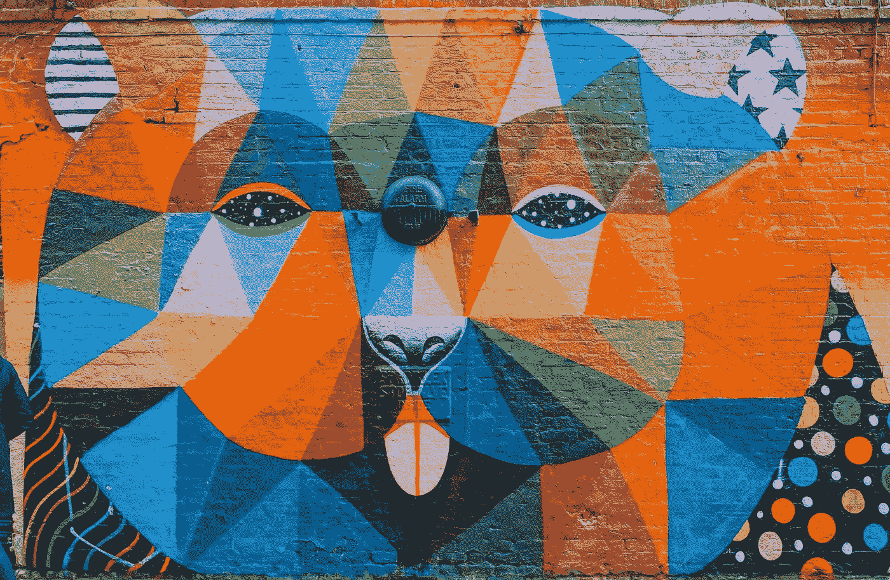
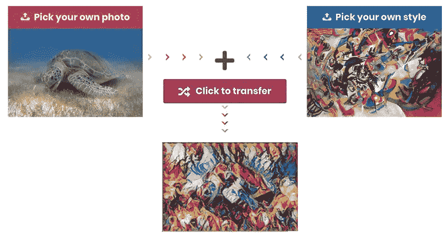
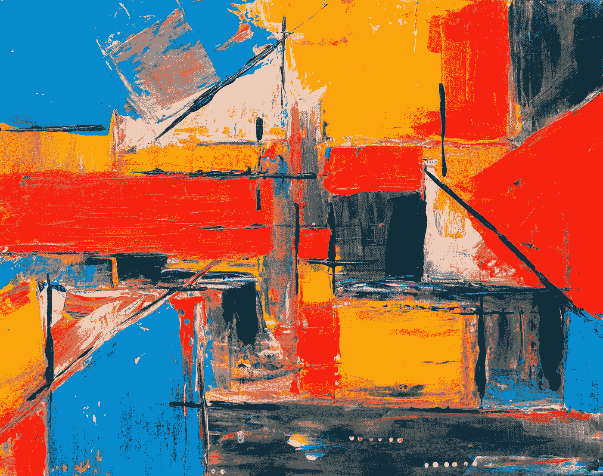

# 当 AI 遇上艺术——用 magenta.js 进行神经风格转移

> 原文：<https://towardsdatascience.com/when-ai-meets-art-neural-style-transfer-with-magenta-js-ceb50e702730?source=collection_archive---------30----------------------->

## 将杰作与现代科技相结合，AI 能制作出多么惊艳的艺术品？



在 [Unsplash](https://unsplash.com?utm_source=medium&utm_medium=referral) 上 [Toa Heftiba](https://unsplash.com/@heftiba?utm_source=medium&utm_medium=referral) 拍摄的照片

当人类和机器合作时，我们可以生产出超乎想象的东西。艺术和人工智能的交叉是我觉得非常令人兴奋的一个领域。神经风格转移是人工智能在创造性背景下最令人惊叹的应用之一。

深度学习使得捕捉一幅图像的内容并将其与另一幅图像的风格相结合成为可能。这种技术被称为神经风格转移。

下面是我如何使用神经风格转换技术来生成人工艺术作品的演示。



来源:[bensonruan.com](https://bensonruan.com/when-ai-meets-art-neural-style-transfer-with-magenta-js)

点击下面的链接亲自尝试一下:

[](https://bensonruan.com/when-ai-meets-art-neural-style-transfer-with-magenta-js) [## 当 AI 遇上艺术——用 magenta.js 进行神经风格转移

### 当人类和机器合作时，我们可以生产出超乎想象的东西。艺术与人工智能的交集…

bensonruan.com](https://bensonruan.com/when-ai-meets-art-neural-style-transfer-with-magenta-js) 

# 履行

你喜欢人工智能生成的新艺术品吗？你很好奇它在幕后是怎么运作的吗？好吧，让我们在这篇文章中探索更多。

它使用了一种叫做神经类型转移的技术。它是一种优化技术，用于获取两个图像，一个*内容*图像和一个*样式参考*图像(如著名画家的作品)，并将它们混合在一起，使输出图像看起来像内容图像，但“绘制”为样式参考图像的样式。

这是通过优化输出图像以匹配内容图像的内容统计和样式参考图像的样式统计来实现的。这些统计数据是使用 CNN(卷积神经网络)从图像中提取的。

如果你想进一步挖掘，你可能会发现吴恩达教授的教程很有用

如果你觉得太难理解，没关系。感谢 [Magenta](https://magenta.tensorflow.org/) (机器学习的开源研究项目)，即使你是机器学习和 AI 的新手，你仍然可以制作由 AI 驱动的音乐和艺术。让我们一步步来看我是如何利用 Magenta.js 来实现风格转换的。

## #步骤 1:包含 magentaimage.js

首先，简单的在 html 文件的<头>部分包含脚本`magentaimage.js`或者缩小版`magentaimage.min.js`。

```
<html>
  <head>
    <script src="[https://cdn.jsdelivr.net/npm/@magenta/image@0.2.1/dist/magentaimage.min.js](https://cdn.jsdelivr.net/npm/@magenta/image@0.2.1/dist/magentaimage.min.js)"></script>
  </head>
```

如果您使用的是 npm，也可以通过运行下面的命令来安装它

```
npm i @magenta/image
```

## #步骤 2:设置 html 元素

接下来我们需要做的是添加下面的 html 元素

*   内容图像
*   风格图像
*   转移按钮
*   组合图像的画布

```


<button  class="btn btn-transfer">
  <i class="fas fa-random"></i><span>Click to transfer</span>
</button>
<canvas id="stylized"></canvas>
```

## #步骤 3:初始化 javascript 变量

```
const model = new mi.ArbitraryStyleTransferNetwork();
const canvas = document.getElementById('stylized');
const ctx = canvas.getContext('2d');
const contentImg = document.getElementById('contentImg');
const styleImg = document.getElementById('styleImg');
```

## #步骤 4:运行风格化功能

当点击传送按钮时，调用库的`initialize()`和`stylize()` API

差不多就是这样！只需 4 个简单的步骤，您就可以构建自己的风格转换应用程序。选择您自己的照片和风格，观看神奇的艺术作品像魔法一样降临！

# GitHub 知识库

您可以通过下面的链接下载上述演示的完整代码:

[](https://github.com/bensonruan/Neural-Style-Transfer) [## 本森阮/神经类型转移

### 艺术神经风格转移与品红色。js 艺术神经风格转移是一种优化技术，用于采取…

github.com](https://github.com/bensonruan/Neural-Style-Transfer) 

[斯蒂夫·约翰森](https://unsplash.com/@steve_j?utm_source=medium&utm_medium=referral)在 [Unsplash](https://unsplash.com?utm_source=medium&utm_medium=referral) 上拍照

# 结论

Magenta 是一个探索机器学习在艺术和音乐创作过程中的作用的研究项目，它建立在 [TensorFlow](https://www.tensorflow.org/) 之上。如果你对人工智能遇见艺术感到兴奋，我强烈推荐你去看看他们的网站[magenta.tensorflow.org](https://magenta.tensorflow.org/)，那里有更多你可以尝试的例子。

感谢您的阅读。如果你喜欢这篇文章，请在脸书或推特上分享。如果你有任何问题，请在评论中告诉我。在 [GitHub](https://github.com/bensonruan/) 和 [Linkedin](https://www.linkedin.com/in/benson-ruan/) 上关注我。