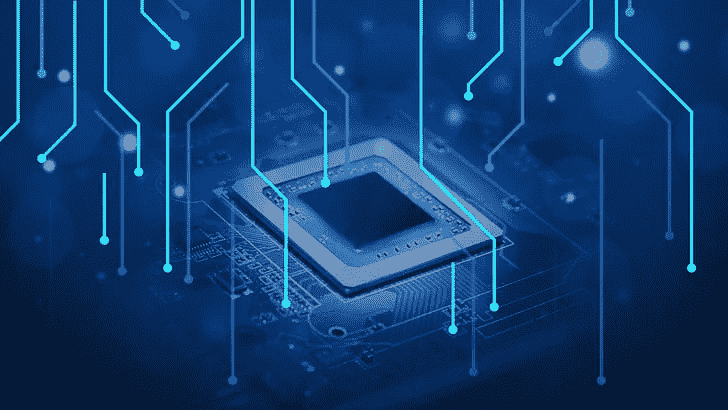

# 当人工智能真正拥有优势时:在设备上学习

> 原文：<https://towardsdatascience.com/when-ai-really-has-the-edge-learning-on-device-aa2b8b20b091?source=collection_archive---------41----------------------->

## 如何将学习带到芯片上是人工智能未来最重要的一次飞跃

图片由 [PickPik](https://www.pickpik.com/technology-processor-modernity-electronics-computer-blue-63281) 提供

有了无数关于 2020 年人工智能的[预测](https://www.forbes.com/sites/gilpress/2019/12/09/120-ai-predictions-for-2020/)，我渴望看到什么会成真，什么会半途而废。我认为，一个更能改变模式的预测将会把人工智能的学习能力推向边缘。

在人工智能的通用名称下，隐藏着各种方法，从在分布式云基础设施上处理数据的大型模型到在小型处理器上分析和挖掘数据的小型边缘友好人工智能。

从我在波士顿大学的学术研究到共同创立的 Neurala，我一直敏锐地意识到这两种类型的人工智能之间的差异——姑且称之为“重”和“轻”人工智能。重度人工智能需要巨大的计算基板来运行，而轻度人工智能可以做重度人工智能能够做的事情，但需要较小的计算能力。

GPU 等商用处理器的引入——以及后来它们的便携性——使得将人工智能/深度学习/DNN/神经网络算法带到众多行业的边缘在技术上和经济上都是可行的。

带宽、延迟、成本和简单的逻辑决定了边缘人工智能的时代，并将帮助我们实现下一个技术飞跃。但在我们这样做之前，理解这项技术的细微差别很重要，因为让人工智能算法在小型计算边缘上运行有一些问题。事实上，至少有两个过程在起作用:推理，或由边缘生成的“预测”(例如，我看到一个正常的帧与一个可能有缺陷的帧)，以及边缘学习——即，使用获得的信息来改变、改进、纠正和完善边缘人工智能。这是一个很小的、经常被忽视的差异，却有着巨大的影响。

**生活在边缘**

我第一次意识到推断/预测和边缘学习之间的区别是在 2010 年[和 NASA](https://www.nasa.gov/directorates/spacetech/spinoff/feature/Brain_for_Cars_Tested_for_Mars/) 一起工作的时候。我和我的同事实施了一个小型大脑仿真来控制一个类似火星漫游车的人工智能设备，该设备需要能够在边缘运行和学习。

对于美国宇航局来说，机器人能够完全独立于地球上任何可用的计算能力来学习“新事物”是非常重要的。数据瓶颈、延迟和大量其他问题意味着他们需要探索不同于当时开发的人工智能。他们需要具有消化和学习能力的算法——即，适应人工智能的行为和可用数据——而不需要大量的计算能力、数据和时间。

不幸的是，传统的深度神经网络(DNN)模型达不到标准，所以我们继续构建我们自己的人工智能来满足这些要求。被称为“终身深度神经网络”([终身-DNN](https://www.enterpriseai.news/2019/06/11/deep-learning-that-keeps-learning-near-time-training-at-the-edge/) )，这种新的 DNNs 方法具有在其整个生命周期中学习的能力(而传统的 DNNs 只能在部署前学习一次)。

**边学边死**

当谈到今天人工智能的实现时，最大的挑战之一是它的不灵活性和缺乏适应性。当可用时，人工智能算法可以在大量数据上进行训练，如果事先捕捉所有数据进行训练，人工智能算法可以相当健壮。但不幸的是，这个世界不是这样运作的。

我们人类之所以适应性如此之强，是因为我们的大脑已经搞清楚了终身学习(每天学习)是关键，我们不能只依赖于我们与生俱来的数据。这就是为什么我们在一岁生日后不会停止学习:我们不断适应我们一生中遇到的不断变化的环境和场景，并从中学习。作为人类，我们不会丢弃数据，我们会不断使用它来微调我们自己的人工智能。

人类是支持边缘学习的机器的主要例子。事实上，如果人类大脑的行为方式和 DNN 一样，我们的知识将仅限于我们的大学时代。我们过着朝九晚五的生活，每天例行公事，第二天早上醒来时却没有学到任何新东西。

**具备学习能力的人工智能优势**

传统的 dnn 是当今人工智能的主导范式，具有固定的模型，需要在部署前进行训练。但是，诸如终身 DNN 这样的新方法将使人工智能驱动的计算边缘不仅能够理解向它们提供的数据，而且能够适应和学习。

所以，如果你也想利用边缘的力量，这是我的建议。首先，你需要抛弃人工智能只能在部署前训练的思维模式(和限制)。由此，一个新的需求出现了:一种让用户与边缘交互并增加知识的方式。这意味着需要可视化新收集的数据，并且用户能够选择添加哪些数据。这可以由用户手动或自动完成。

例如，在制造场景中，质量控制专家可能会拒绝从机器中出来的产品，并通过这样做，向 AI 提供新的线索，即刚刚制造的产品或其部分必须被视为有缺陷。因此，更新你的人工智能培训协议，以允许集成持续的培训工作流，其中人工智能根据新的线索进行更新，是寻求利用这种新型人工智能的组织和个人所必须的。

在边缘学习的人工智能是一种范式转变技术，最终将使人工智能真正服务于其目的:将智能转移到需要的计算边缘，其速度、延迟和成本使每个设备都可以负担得起。

展望未来，在竞争日益激烈的人工智能生态系统中，学习优势将在自然选择中幸存下来。愿适者生存的 AI！

*最初发表于*[*【https://www.forbes.com】*](https://www.forbes.com/sites/forbestechcouncil/2020/02/12/2020-and-the-dawn-of-ai-learning-at-the-edge/)*。*