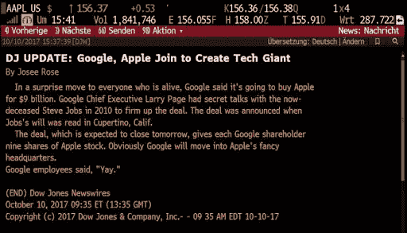

# 当算法去购物时

> 原文：<https://towardsdatascience.com/when-algorithms-go-shopping-6a98caa88fe3?source=collection_archive---------60----------------------->

## 在算法代表我们做出购物决定的世界里，所有的赌注都是错的。

2011 年 4 月 18 日，一本关于苍蝇生物学的书在亚马逊上以 23，698，655.93 美元的价格出售(加上 3.99 美元的运费)。这不仅仅是一个小故障——在 T1 之前的日子里，这本书的价格稳步上升。然后，第二天，价格降到了 106.23 美元(加上 3.99 美元的运费)。

发生了什么事？

> *高价不是人的决定。故事发生在在线平台上交易的两种算法之间的一场奇怪的竞价战中。*

这本书可能拥有的算法之一是定期检查价格，并以低于最高价约 1%的价格出售其副本。另一家公司采取了不同的策略:它以比下一个最佳报价高出约 27%的价格出售同一本书，希望买家不会注意到更便宜的选择。我们可以假设第二个算法没有这本书，在收到订单后，它会购买更便宜的书并将其交付给客户，在此过程中赚取利润。

> *两种算法每天陷入“百分之一回，百分之二十七进”的循环，达到数百万美元的价格。大概直到某个算法的人类所有者注意到了这个循环并停止了它。*

克雷格·赛伯特在 [Unsplash](https://unsplash.com/?utm_source=unsplash&utm_medium=referral&utm_content=creditCopyText) 上的照片

# 对竞争的影响

在过去的几年里，我们生活在一个算法或软件购买代理代表我们“购物”的世界里。LG ThinQ 洗衣机可以在洗涤剂快用完时自动重新订购洗涤剂。通用电气、惠而浦和 LG 提供自动重新订购洗涤盒的洗碗机。有咖啡机、打印机，甚至可以重新订购咖啡盒、墨水和电池的烟雾报警器。

> 虽然这听起来令人兴奋，但也有令人担忧的一面。

几乎所有的“智能再订购”解决方案都绑定到一个供应商，并且总是订购相同的产品。虽然他们实现了购物过程的完全自动化，但他们让顾客只能选择一家零售商和一种产品。

这听起来非常像微软在 20 世纪 90 年代和 21 世纪初享有的准垄断地位，有效地迫使用户使用 Windows Media Player 和 Internet Explorer。美国、T2 和欧洲的政府介入进来，为比赛创造公平的环境。

# 将人类拒之门外

机器人不仅被用来购买咖啡，还被用来预订露营地和约会。露营者分享算法来[预订约塞米蒂公园的露营点](https://link.medium.com/cnf9uQEb29)，愿意预约纽约机动车部门的顾客可以[“雇佣”他们自己的自动呼叫机](https://donotpay.com/learn/dmv-appointments/)来预约，并不断检查是否有更好的空位。最近，[机器人几乎抢走了 Nvidia](https://au.pcmag.com/graphic-cards/68662/nvidia-to-upgrade-online-store-to-stop-bots-from-snatching-rtx-3080-cards) 发布的所有新显卡。

> *算法购物者可以瞬间做出决定。*

他们一天可以打几千个电话或访问几千个网站。当试图获取可能有需求的产品和服务时，人类没有机会对抗机器人。然而，阻止软件购买代理并不能解决问题。随着技术的进步，机器人找到了访问系统的新方法。

> 我们需要明确的规则来管理软件购买代理的行为。

这些可以包括制定[机器人排除标准，类似于那些用于阻止搜索引擎访问某些网站的标准](https://en.wikipedia.org/wiki/Robots_exclusion_standard)。我们还需要一种协调的方法，让软件购买代理在他们可能被人类混淆的情况下公开他们是谁。

# 在市场中掀起波澜

大多数股票市场交易都是完全自动化的，由算法执行。

> 什么可能会出错？

2017 年，道琼斯意外发布了一条关于苹果和谷歌合并的消息。大约有一秒钟的时间，[苹果的股票从 2 美元涨到了 158 美元](https://techcrunch.com/2017/10/10/dow-jones-said-that-google-was-buying-apple-the-algos-bought-it/)，暴露了算法在股市中的脆弱性。

作为对这一事件和类似事件的回应，韩国现在正试图加强对算法交易的控制。其他国家有望效仿。

新兴的算法经济，即软件代理代表我们的行为，有可能极大地改变我们的生活、工作和思考方式。然而，我们需要确保清晰的规则管理算法的行为。有了保护市场竞争的正确机制，监管产品和服务的准入，并强制执行代表我们购物的算法的最低质量标准，我们就有很大的机会通过购物的算法来享受我们的未来。