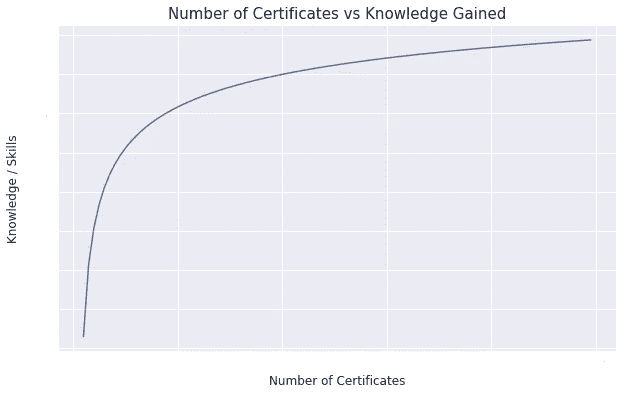
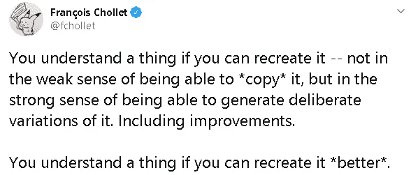
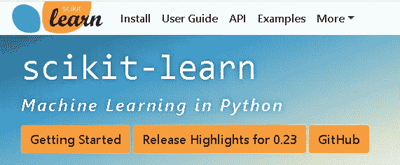
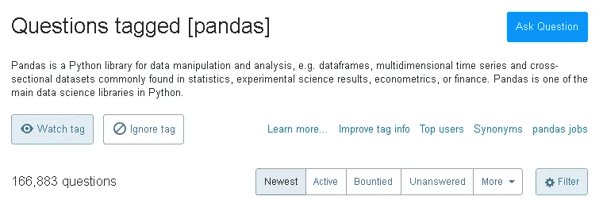

# 我何时以及为何停止收集数据科学证书

> 原文：<https://towardsdatascience.com/when-and-why-i-stopped-collecting-data-science-certificates-cca44e99701d?source=collection_archive---------49----------------------->

## 而我开始做的是。

【GIPHY 的 GIF

数据科学证书无处不在。对它们的需求很高，而且还在不断增加，所以一款新的很快就推出了。有几个原因可以解释为什么在许多不同的平台上存在丰富的证书选择。

*   数据科学领域尚未成熟，仍在不断发展。因此，它在传统教育系统中仍然没有得到很好的确立。提供数据科学本科学位的大学数量远少于任何其他 STEM 专业。
*   高等教育是昂贵的。人们倾向于花几百美元(最多)去考证书，而不是花几万美元去获得一个学士或硕士学位。
*   容易接近！证书适合你的时间表，而且大多是在线的，这使得它们对那些抽不出时间接受传统教育的人很有吸引力。

这种介绍似乎是收集证书的一种动力。事实上，是的，但在一定程度上。

我也从证书开始了我的数据科学之旅。我考的第一个是 IBM 数据科学专业证书。它奠定了基本原则，并提供了一个领域的一般，结构良好的概述。我又收了几个证，然后就停了。

在这篇文章中，我将写下我什么时候和为什么停止收集数据科学证书，以及我开始做什么。

# 下降趋势

根据我的观点，让我们从花费大量时间收集大量证书的缺点开始。

证书有助于教授基础知识，让你熟悉这个领域。由于数据科学是一个跨学科的领域，范围很广，因此从一开始就要有一个结构良好的概述。

但是，获得其中几个之后，证书就开始重复了。你从不同的角度回顾相同的原则和实践。你每次花费所学到的东西开始大幅减少。

我的证书学习曲线与知识和技能

证书通常过于笼统，不够深入。他们所覆盖的是表面的。让你与众不同的技能就在这些深层领域。

为了真正“学习”一些东西，你需要接受挑战。浏览简单的视频记录和完成相当简单的任务对你来说绝对不够有挑战性。

挑战自己的一个方法是做项目。例如，你可以尝试重新创建一个正在使用的机器学习微服务。它不必完美无缺。即使你接近了，你也会学到很多有价值的信息。另一个选择是改进一个简单的用例或项目。

我想用 Keras 创始人 Francois Chollet 的一条推文来强调我的观点，他是数据科学领域的先驱之一。

他提到了重新创造变化的重要性，我认为通过获得许多证书无法实现这一点。相反，完成项目会帮助你“学习”得更深更好。

# 建议

在我看来，你应该在你覆盖了基础之后停止收集证书。你可能会问，那我们该怎么办？

以下是我的建议:

很明显，第一条就是做项目。我已经提到了项目的重要性。如果你想获得更详细的概述，我写了一篇单独的文章，列出了我做项目的 5 个理由。

文档是您的财富！所有著名的库都有很好的文档记录，它们还提供了用户指南。花时间阅读这些非常有帮助。即使你在寻找一个特定的任务或操作，你学到的东西也比你寻找的要多。

[Scikit-learn](https://scikit-learn.org/stable/) ，一个广泛使用的机器学习库，提供了一个有启发性的文档

阅读其他人面临的问题和困难，以及他们如何解决这些问题。 [Stackoverflow](https://stackoverflow.com/) 和 [Quora](https://www.quora.com/) 是两个常用的平台。当出现您无法解决的问题时，很可能是其他人以前遇到过同样的问题。你可以在这样的平台上寻找问题和解决方案。

此外，你可以浏览热门问题，并尝试提供答案，这肯定会提高你的技能。我刚刚在 stackoverflow 上快速搜索了一下关于熊猫的内容，这是一个著名的 python 数据分析库。结果如下:

截至目前，stack overflow[上有超过 166，000 个关于熊猫的问题](https://stackoverflow.com/questions/tagged/pandas)

数据科学是一个不断发展的领域。它也是一个由数学、统计学和软件组成的跨学科领域。新的技术和工具不断发布。因此，保持更新是很重要的。我有两个建议:

1.  关注每周或每月的时事通讯。我密切关注来自 deeplearning.ai 的批处理。但是，还有其他选项。
2.  Twitter 是名副其实的最新平台。跟随先行者，业内有经验的人，学者，科学家。他们首先在推特上发布公告。他们还分享了他们对主题和一些用例的想法。

# 最后的想法

我分享过我在数据科学领域关于“学习”的经验和看法。当然，你的学习路径和风格可能不同。例如，有些人更喜欢在 youtube 上阅读或观看视频。

无论你走哪条路，一定要挑战自己。

尝试创造。从简单的开始，逐渐增加复杂性。

感谢您的阅读。如果您有任何反馈，请告诉我。