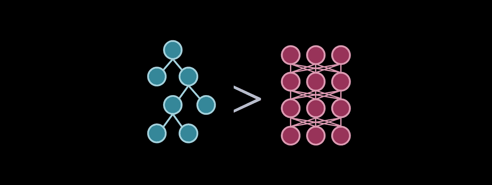
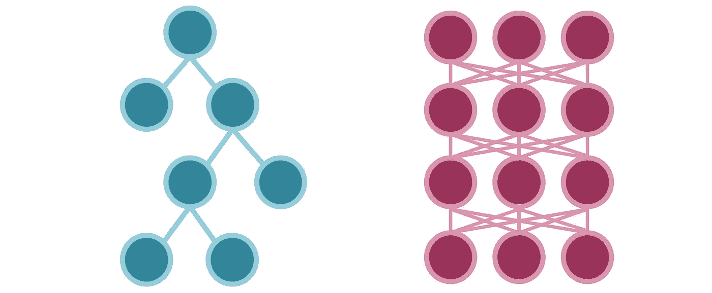

# 基于树的模型何时以及为什么(通常)优于神经网络

> 原文：<https://towardsdatascience.com/when-and-why-tree-based-models-often-outperform-neural-networks-ceba9ecd0fd8?source=collection_archive---------2----------------------->

作者图片

## 以及为什么它们没有那么大的不同

神经网络通常被视为机器学习的圣杯，无所不知，解决一切问题，主要是因为它们很复杂。另一方面，基于树的方法没有受到同样的敬畏和宣传，主要是因为它们看起来简单。虽然它们看起来如此不同，但它们只是一枚硬币的两面。

基于树的方法通常优于神经网络。任何 Kaggler 都知道，XGBoost 是迄今为止最受欢迎的顶级竞赛提交选择。本质上，将基于树的方法和神经网络放在同一类别的是，它们通过逐个解构来处理问题，而不是像 SVM 或逻辑回归那样，找到一个复杂的边界来分隔整个数据集。

非常明显，基于树的方法沿着各种特征逐步分割特征空间，以优化信息增益。不太明显的是，神经网络以类似的方式完成这项任务。每个神经元监视特征空间的特定部分(具有各种重叠)。如果一个输入进入那个空间，某些神经元就会被激活。

神经网络对这种分段模型拟合采取概率观点，而树则采取确定性观点。无论如何，它们的性能都依赖于模型的深度，因为它们的组件与特征空间的部分相关。

一个有太多组件的模型——在树的情况下是节点，在网络的情况下是神经元——会过度拟合，而一个组件太少的模型根本不能给出有意义的预测。(两者都是开始记忆数据点而不是实际学习归纳。)

为了更直观地了解神经网络如何分解特征空间，请查看[通用逼近定理](https://medium.com/analytics-vidhya/you-dont-understand-neural-networks-until-you-understand-the-universal-approximation-theorem-85b3e7677126)。

尽管决策树有许多强大的变体，如随机森林、梯度提升、自适应提升和深度森林，但一般来说，基于树的方法本质上是神经网络的简化版本。

*   基于树的方法通过垂直和水平线一点一点地解决问题，以最小化[熵](https://medium.com/analytics-vidhya/understanding-entropy-the-golden-measurement-of-machine-learning-4ea97c663dc3)(优化器&损失)。神经网络通过操纵激活函数的形状来一点一点地解决问题(参见【relu 如何工作得这么好？).
*   基于树的方法是确定性的，而不是概率性的。这导致了一些很好的简化，比如自动特征选择。
*   决策树中被激活的条件节点类似于被激活的神经元(信息流)。
*   神经网络拟合参数以转换输入，并间接指导后续神经元的激活。决策树明确地拟合参数来引导信息流。(这是确定性相对于概率性的结果。)

信息在两种模型中的流动是相似的，只是在树中的方式更简单。图片作者。

当然，这是一个抽象的，甚至可能是有争议的说法。诚然，建立这种联系存在许多心理障碍。无论如何，这是理解基于树的方法何时以及为什么优于神经网络的重要部分。

表格，或以表格形式出现的结构化数据，对于决策树来说是很自然的。大多数人都认为神经网络对于表格数据回归和预测来说是多余的，所以我们做了一些简化。我们选择 1 和 0，而不是概率，这是两种算法之间差异的主要根源。因此，在概率的细微差别没有必要的情况下，比如结构化数据，树是成功的。

例如，基于树的方法在 MNIST 数据集上表现得足够好，因为每个数字都有几个定义特征。概率根本不是必要的计算。这根本不是一个非常复杂的问题，这就是为什么设计良好的树集成的性能与现代卷积神经网络相同甚至更好。

通常，人们会倾向于说‘树只是简单地记忆规则’，这是真的。神经网络也是一样，它记忆更复杂的、基于概率的规则。神经网络不会对类似于*x*3 的条件显式地产生真/假，而是将输入放大到一个高值，以产生一个 sigmoid 值 1 或产生一些连续的表达式。

另一方面，因为神经网络非常复杂，所以可以用它做很多事情。卷积和递归层都是神经网络的出色改编，因为它们对经常需要概率计算细微差别的数据进行操作，所以工作得很好。

很少有图像可以用 1 和 0 来建模。决策树值不能处理具有许多中间值(例如 0.5)的数据集，这就是它在 MNIST 上工作良好的原因，其中像素值几乎都是黑色或白色，而不是其他值(例如 ImageNet)。同样，文本有太多的信息和太多的例外，无法用确定性的术语来表达。

这也是为什么神经网络主要用于这些领域，以及为什么神经网络研究在没有大量图像和文本数据时停滞不前(< 2000 年代)。神经网络的其他常见用例仅限于大规模预测，如 YouTube 的视频推荐算法，其中规模如此之大，以至于必须涉及概率。

去一家公司的任何数据科学团队，他们可能会使用基于树的模型，而不是神经网络。除非他们正在构建一个重型设备，如在 Zoom 中模糊视频的背景，否则树的确定性使日常业务分类任务变得轻量级，与神经网络的一般方法相同。

在许多现实世界中，确定性建模比概率性建模更自然，这也是有争议的。例如，树将是预测用户是否从电子商务网站购买商品的好选择，因为用户自然会遵循基于规则的决策过程。它可能看起来像这样:

1.  我以前在这个平台上有过愉快的经历吗？如果是，请继续。
2.  我现在需要这个项目吗？例如:我应该在冬天买太阳镜和泳裤吗？如果是，请继续。
3.  根据我的人口统计，这是我有兴趣购买的产品吗？如果是，请继续。
4.  这个东西太贵了吗？如果没有，请继续。
5.  是否有其他顾客对该商品的评价达到了一定的标准，让我觉得可以放心购买？如果是，请继续。

总的来说，人类遵循非常基于规则和结构化的决策过程。在这些情况下，概率建模是不必要的。

总而言之，

*   基于树的方法最好被认为是神经网络的缩小版本，接近特征分类、优化、信息流等。简单来说。
*   基于树的方法和神经网络在使用上的主要区别在于数据的确定性(0/1)和概率性结构。使用确定性模型对结构化(表格)数据进行建模总是更好。
*   不要低估基于树的方法的力量。