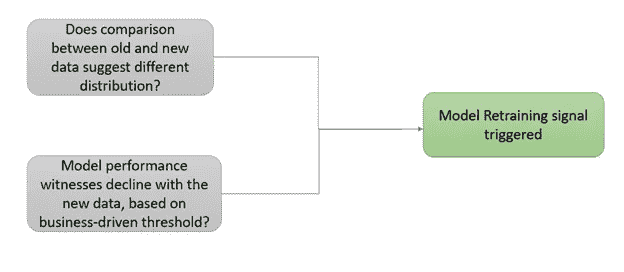

# 关于何时重新训练机器学习模型的指南

> 原文：<https://towardsdatascience.com/when-are-you-planning-to-retrain-your-machine-learning-model-5349eb0c4706?source=collection_archive---------15----------------------->

## **了解更多关于再培训策略的信息**

照片由 [Aron 视觉效果](https://unsplash.com/@aronvisuals?utm_source=unsplash&utm_medium=referral&utm_content=creditCopyText)在 [Unsplash](https://unsplash.com/s/photos/hourglass?utm_source=unsplash&utm_medium=referral&utm_content=creditCopyText) 上拍摄

你可能会发现很多教程可以帮助你建立端到端的机器学习管道。但是一般来说，这些教程并没有太多地提到如何保持从 ML 系统生成的预测的质量。

保持已部署模型的预测能力被认为比从头构建 ML 模型更困难，因此这是我们今天讨论的主题。

但是在开始讲述**“模特再培训”**的细节之前，让我们先快速了解一下**“模特培训”**:

*   假设有足够的可用历史数据，模型构建从学习一组独立特征和目标变量之间的依赖关系开始。
*   基于一些评估度量来计算最佳学习相关性，以最小化验证数据集上的预测误差
*   该最佳学习模型随后被部署到生产中，期望尽可能长时间地对**的未知数据进行准确预测**

现在，让我们更加强调我们所说的“尽可能长”是什么意思？

从来不会出现最终部署一次的 ML 模型就永远带走了担忧，并一直给出准确的预测。

这是为什么呢？让我们弄清楚下面的问题:

1.  **模型漂移:**

为了理解这一点，让我们回忆一下 ML 建模中最关键的假设之一——训练和测试数据集应该属于相似分布。并且，如果新数据与过去观察到的数据相似，模型将是好的，其中模型是基于过去观察到的数据进行训练的。

因此，我们知道，如果测试数据的分布偏离了训练数据的分布，那么这个模型就不成立。但是这种偏离的可能原因是什么呢？根据商业案例，这可以归因于许多原因，例如，消费者偏好的变化、快速变化的竞争空间、地理位置的变化、经济状况等。

因此，漂移数据分布需要一个持续的过程来定期检查旧模型的有效性。简而言之，让你的机器学习模型保持更新是很关键的；但关键是什么时候？我们将继续讨论这一点以及更多内容，敬请关注。

**2。鲁棒性**

受 ML 模型结果影响的人/实体可能故意改变他们的响应，以便向模型发送虚假输入，从而逃避模型预测的影响。例如，欺诈检测、网络安全等模型接收被操纵和扭曲的输入，导致模型输出错误分类的预测。这种类型的对手也降低了模型性能。

**3。当模型训练时地面实况不可用时**

在大多数机器学习模型中，基础事实标签不可用于训练模型。例如，捕获最终用户响应的目标变量是未知的。在这种情况下，您的最佳选择可能是基于来自业务理解的特定规则集来模拟用户操作，或者利用开源数据集来启动模型训练。但是，该模型可能不一定代表实际数据，因此在开始挑选(也称为学习)最终用户的真实行为之前，不会表现良好。

**什么都属于模特再培训的范围？**

*   更新模型参数？
*   在超参数搜索空间上重复
*   在候选算法池中重新运行模型选择管道
*   如果这也不能提升模型的性能，那么我们是否需要在模型中引入新的特性，也许重新进行特性工程和选择流程？

理想情况下，再培训包括用新数据运行整个现有管道，就是这样。它不涉及任何代码更改或重新构建管道。

然而，如果您最终探索了在先前模型训练时可能不可用的新算法或特征，那么在部署重新训练的模型时合并这些将进一步提高模型准确性。

**如何衡量模型性能的下降？**

假设预测值与地面真实值一起存储和映射，则在连续的基础上计算下降(或不下降)以评估漂移。

但是，如果预测的地平线在更远的未来，我们不能等到地面真实标签被观察到，以评估模型的良好性。那么，在这种情况下，我们可以通过回溯测试来粗略估计再培训窗口。这包括使用历史数据中的基本事实标签和预测来估计准确性开始下降的时间范围。

> 实际上，寻找模型漂移的整个过程可以归结为推断两个数据集(训练和测试)是否来自同一个分布，或者性能是否低于可接受的范围。

**让我们看看评估分布漂移的一些方法:**

*   **直方图:**可视化比较的一个快速方法是绘制直方图——两个直方图之间的重叠程度给出了相似性的度量。
*   **K-S 统计:**检查即将出现的新数据是否与训练数据属于同一分布。
*   **目标分布:**检查 ML 模型一致性预测能力的一个快速方法是检查目标变量的分布。例如，如果您的训练数据集不平衡，99%的数据属于类 1，剩余的 1%属于类 0。并且，预测反映这种分布在 90%-10%左右，那么它应该被视为进一步调查的警报。
*   相关性:监测单个预测因子之间的成对相关性将有助于揭示潜在的漂移

## **再培训策略:**

## **固定周期间隔**

1.  动态周期性—如果传入的数据经常变化，模型重新训练甚至可以每天进行。
2.  与上面的方法相比，自动监控性能指标以决定再训练触发点更加有效。您需要确定指定可接受的绩效差异水平的阈值，以启动再培训。在决定阈值时，需要考虑以下因素:

*   过低的阈值将导致频繁的重新训练，这将导致计算成本方面的开销增加
*   过高的阈值将输出“偏离预测”

**再培训前应该收集多少新数据？**

应该是“n 行进，n 行出”吗？或者，我们应该继续添加新数据而不删除旧数据。什么是好的搭配？对此，没有“一个解决方案适合所有人”的答案，但很大程度上取决于以下因素:

*   如果业务经验表明新数据是高度动态的，那么通过替换旧数据来包含新数据。
*   但是，如果数据漂移不经常发生，那么就等待收集足够的新训练数据样本。

再训练信号触发，来源:作者

**参考文献:**

*   [https://www . oreilly . com/radar/lessons-learned-turning-machine-learning-models-into-real-products-and-services/](https://www.oreilly.com/radar/lessons-learned-turning-machine-learning-models-into-real-products-and-services/)
*   [https://mlinproduction.com/model-retraining/](https://mlinproduction.com/model-retraining/)