# 当数据遇到汉堡——探索性数据分析

> 原文：<https://towardsdatascience.com/when-data-meets-burgers-exploratory-data-analysis-bd1f10f3b168?source=collection_archive---------49----------------------->

## 麦当劳菜单的探索性数据分析。

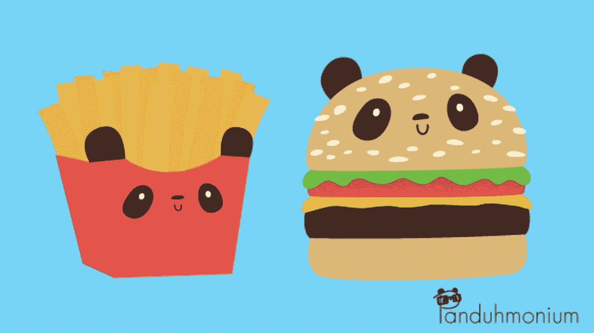

我们将使用熊猫图书馆对麦当劳菜单进行分析。(来源— [越轨艺术中的潘杜莫尼姆](https://www.deviantart.com/panduhmonium/art/Panda-Burger-Burger-and-Fries-314698076)

你好。你将如何完成爬山的任务？你会直接走到顶端吗？或者你会探索基地并找到到达顶端的最佳路线吗？第二个想法似乎是更好的选择。为什么我要说山？你很快就会找到答案。在此之前，请观察堆积如山的数据科学。

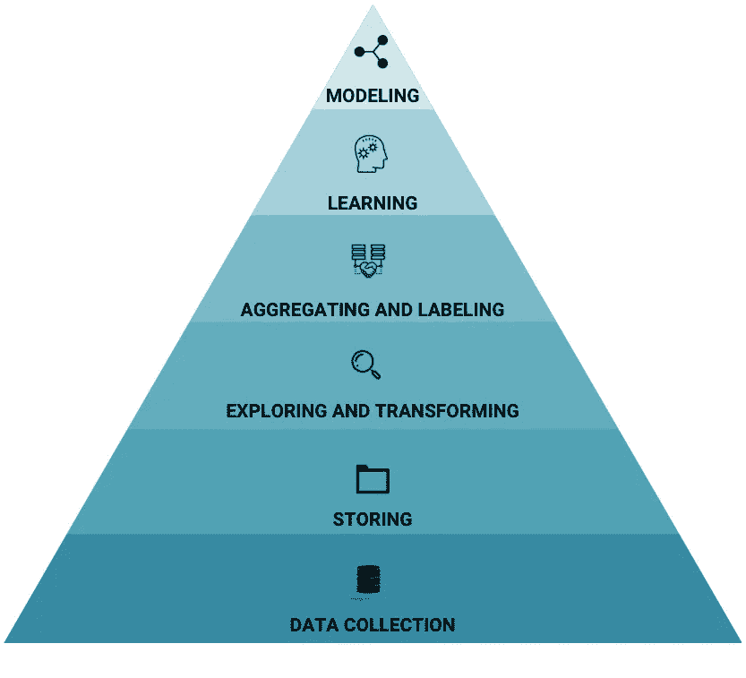

使用 Canva 创建

导入数据集，选择合适的算法，应用`.fit()` 函数，调整超参数以减少损失函数，以及 BAMM！！！！！！您将获得您的准确性指标！上述过程只是大部分 MOOCs 和在线课程上教授的机器学习范式的概述。
等待..！！！！！

如果你认为你会一直处理干净的数据，那么你就错了。现实生活中的数据是杂乱的。它包括缺失值、错误的数据类型、大量不必要的列等等。那你怎么处理这个？

这就是**探索性数据分析(EDA)** 的用武之地。它是清理数据并使用适当的可视化工具来提取见解和总结数据的过程。例如，假设我们正在使用线性回归模型，我们的数据集包含一些与目标变量完全不相关的特征。不移除这些功能并运行模型不会产生最佳结果。因此，在对数据应用伟大的深度学习模型之前，EDA 是必须的。(这就是为什么我一开始就用了山这个比喻！)

在现实世界中，EDA 没有固定的流程。这取决于我们正在处理的数据。我们将使用[麦当劳菜单](https://drive.google.com/file/d/1veq-DPMUTY27LlXNuDWeflJWD19pGIqv/view?usp=sharing)数据集执行 EDA 和 Pandas 库，以及 Matplotlib 和 Seaborn 进行数据清理和数据可视化。

```
import pandas as pd
import matplotlib.pyplot as plt
import seaborn as sns
```

# 理解数据


我们可以看到数据集总共有 260 行和 24 列。类别栏表示某个项目是否属于早餐、冰沙、沙拉等。我们还可以注意到一些栏目，如总脂肪、胆固醇等。有两栏，其中一栏表示以克为单位的数量，而“每日价值百分比”可以告诉你一份食物中的营养成分是高还是低，以及一份食物对你每日饮食中每种营养成分的贡献是多还是少。(引自 fda.gov)


**例如:**看看一份鸡蛋松饼中的钠含量(最后一栏)。31%的%DV(%每日价值)对你的饮食贡献大还是小？该产品含有 31%的钠 DV，这表明这是一种高钠产品(如果一个项目的 DV 超过 20%，则被视为高！).如果你吃了 2 份鸡蛋松饼，那就能提供 62%的钠摄入量——接近一整天钠摄入量的 60%。因此%DV 大于 20 的物品被认为是不健康的。

# 数据清理

观察上面的鸡蛋松饼排。你可以注意到总脂肪是 13，饱和脂肪是 5，胆固醇是 260，钠是 750。如果我们绘制这些值的条形图，看起来钠在该项目中占主导地位，但事实并非如此，因为这些值不在同一范围内(因此我们可以删除这些列)。


使用 Canva 创建

此外，像服务大小的列可以被删除，因为缺乏他们的贡献。

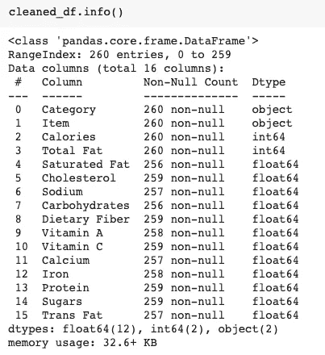

为了方便起见，在删除列并重命名所有列之后，我们可以注意到我们有 260 行和 16 列。我们还可以注意到，所有的列类型都是合适的。

## 处理缺失值

当给定行中的某一列没有数据值时，我们称之为缺失值。处理缺失值是很重要的，因为它们可能导致弱的/有偏见的分析。让我们使用热图来直观显示每列中缺失值的数量。`df.isnull()`方法返回一个布尔值，说明每个单元格是否有值。通常，热图会根据数据值为每个数据单元格分配一种颜色。

```
sns.heatmap(df.isnull())
plt.show()
```

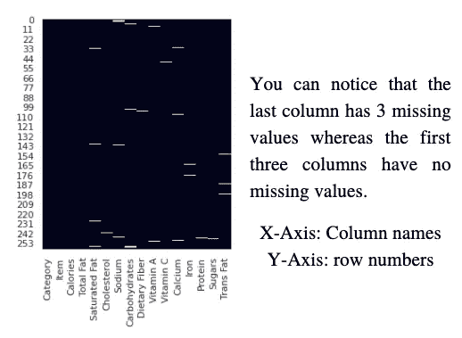

我们可以用两种方法替换缺失值:
**1。删除—** 处理缺失值的最简单方法。可以使用`dropna()`方法完成。但由于数据丢失，这不是最佳解决方案。
**2。到处都遵循的标准方法。使用`fillna()`方法，用该列的平均值/中值替换缺失值。
**3。插值—** 使用线性插值来猜测缺失值并填充数据。**

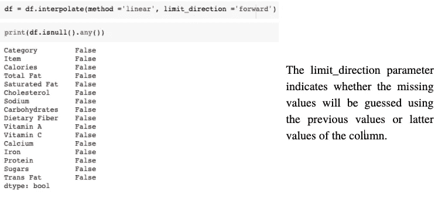

我们现在可以观察到所有的列都没有缺失值。

# 比较类别

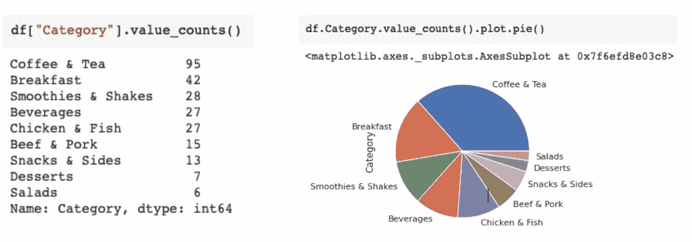

我们可以注意到，有 9 个独特的项目类别，这意味着总共 260 个项目分为 9 个类别。饼图显示，咖啡和茶类在菜单中占主导地位，而沙拉类最少。

## 根据营养成分比较类别

让我们试着分析哪一类蛋白质、胆固醇、脂肪等含量更多。在可视化数据之前，理解 pivot_table()的概念很重要。让我们看一个例子。

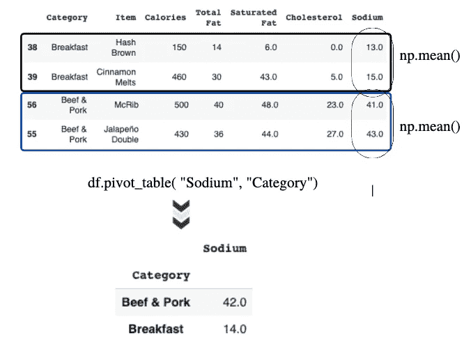

除了钠值的`np.mean()`，我们还可以执行其他聚合函数，如`np.max()`、`np.sum()`等。因为我们是按类别比较营养值，所以最好取平均值。

类似于上面的例子，让我们为类别和蛋白质创建一个 pivot_table，并尝试理解其分布。让我们绘制所有平均蛋白质值 wrt 的柱状图。到类别。

我们可以使用熊猫内置的`plot()`方法来创建情节。因为我们要创建一个柱状图，所以我们将**柱状图**作为参数传递给**种类**参数。

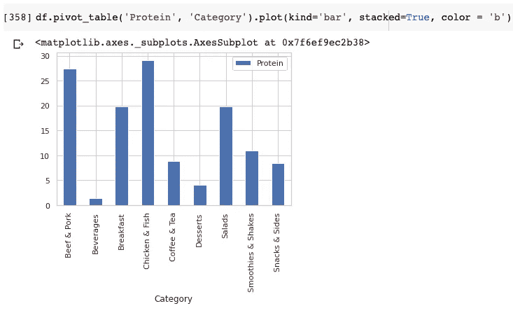

我们可以注意到，鸡肉和鱼肉的蛋白质含量最高。同样，让我们按类别分析所有的营养分布。

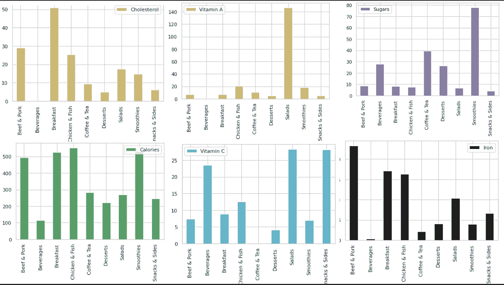

不出所料，我们可以注意到思慕雪中有更多的糖，沙拉中有更多的维生素 A 和维生素 C。鸡肉和鱼肉中的卡路里含量较高，而牛肉和猪肉中的铁含量较高。正如第一个柱状图所示，由于胆固醇含量高，最好在家吃早餐。

您认为条形图在描述离散类别之间的比较时是否正确？这里我们计算了所有项目类别的平均值，并创建了一个条形图。但是我们也知道均值对异常值非常敏感。
*异常值在上面的柱状图中起作用吗？*为了了解每个项目的分布，我们可以创建**群体图。** 在群体图中，每一列中的每一项都用一个点来表示，而不是像条形图那样取该特定类别中所有项的平均值。

让我们为维生素 C 和类别列创建一个群集图，并将其与条形图进行比较。

我们可以使用 Seaborn 的`swarmplot()`方法创建一个群体图。为了便于阅读，X 轴标签旋转了 90 度。

```
sns.set(style="whitegrid", color_codes=True)ax1= sns.swarmplot(x="Category", y="Vitamin C", data=df)
ax1.set_xticklabels(ax1.get_xticklabels(),rotation=90)
```

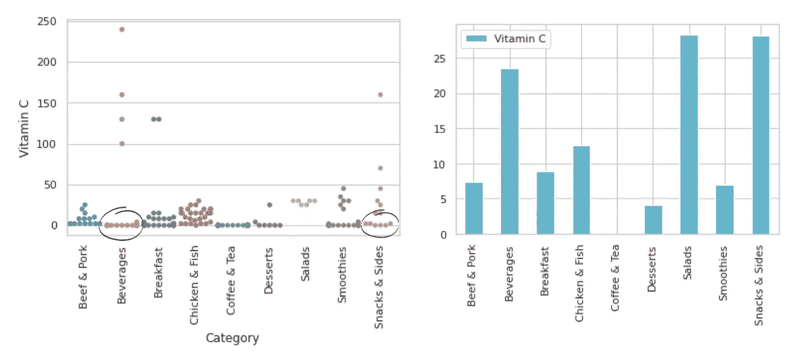

这里我们可以看到蜂群图由所有项目的维生素 C 值组成。类别。在查看群集图时，我们可能假设饮料或小吃和配菜类别的维生素 C 含量最高，但是经过仔细观察，我们可以注意到这两列中零值项目(在群集图中圈出)的数量远远多于沙拉列，后者的所有值都在 20-30 左右。与其他两列相比，这导致沙拉类别的平均值更高。同样，我们可以为其他类别创建群体图，并对其进行分析。

> 选择合适的情节是洞察力产生的关键部分。

# 相互关系

这是一种用于描述数据集的特性(不同列)之间的相互依赖性的度量。两个变量之间的强正相关(接近 1)意味着一个变量的增加会导致另一个变量的增加。负相关(更接近-1)意味着一个变量的增加导致另一个变量的减少。如果该值更接近 0，则意味着它是弱相关/无相关。

**注意:相关性仅在线性关系的情况下有用。在非线性关系的情况下，相关性往往会低估相互依赖性。**

```
correlation_matrix = df.corr()
ax = sns.heatmap(correlation_matrix, square=True, annot = True, mask=mask, fmt = ".1")
ax.set_xticklabels(ax.get_xticklabels(),rotation=90)
```

我们可以使用 Seaborn 的`heatmap()`方法创建一个热图。如果`annot`参数为真，则相关值显示在每个单元格中，并且`fmt`参数限制小数点。为了便于阅读，X 轴标签旋转了 90 度。

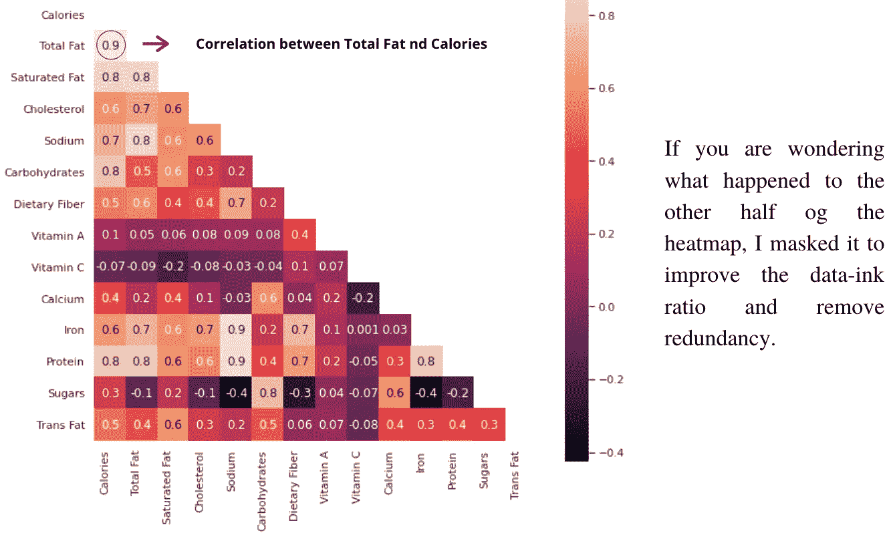

好吧，没有令人震惊的事实被发现！相关矩阵证实了卡路里数随总脂肪量增加的观点(0.9 表示强正相关)。糖和铁之间存在微弱的负相关性，表明这两个特征彼此成反比。我们还可以注意到，铁和维生素 C 没有相关性(几乎为零表示没有相关性！).现在让我们试着回答一个有趣的问题！

# 烤的还是脆的？哪个是健康的？

在浏览数据集时，我发现 13 种食物有两种不同的口味，一种是烤的，另一种是脆的。我用柱状图来了解这些食物中卡路里和脂肪的分布，从而得出结论。

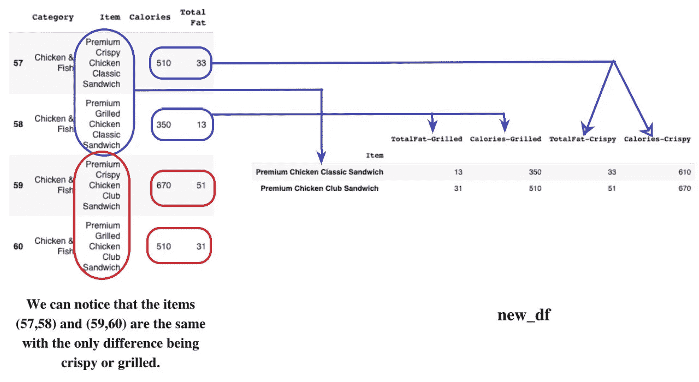

我将数据按项目分类，并根据烧烤或酥脆储存热量和脂肪。现在我们可以生成水平条形图来获得更好的图片。

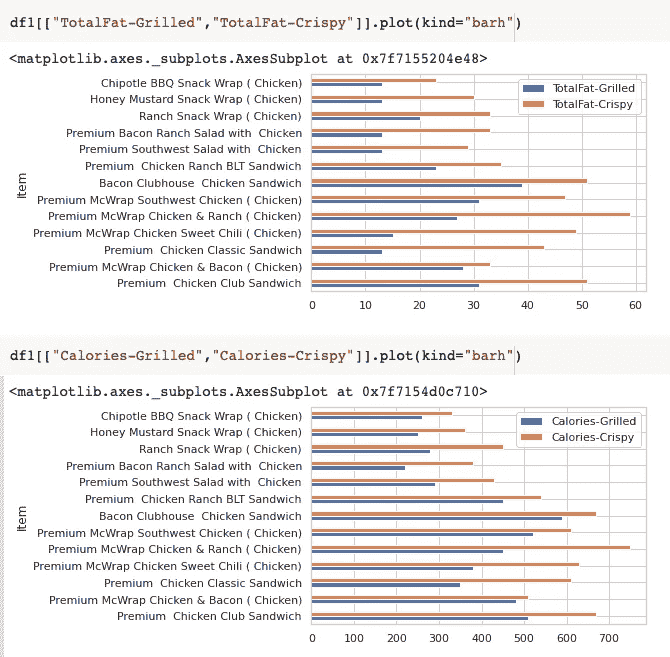

嗯，图说故事。如果你在节食，最好有烧烤食物！

完整代码可从 Github [这里](https://github.com/kurasaiteja/McDonalds-Nutrition-Analysis)获得。

# 结论

在应用机器学习和深度学习之前，我试图解释探索性数据分析的重要性。希望您已经掌握了一些概念，这些概念将有助于您实时执行 EDA。没有特定的方法，不同的数据集有不同的方法。请随时分享您的反馈和回应。如果你今天学到了新东西，请举手。