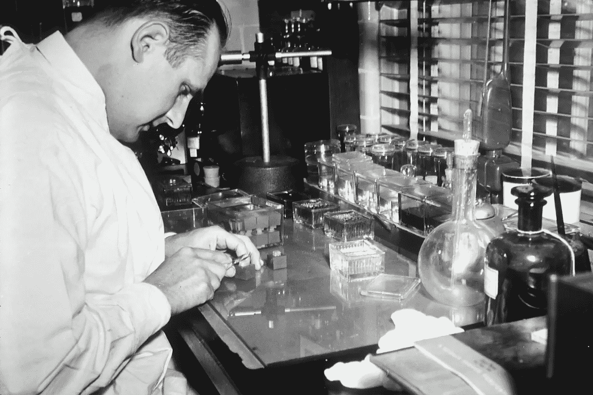
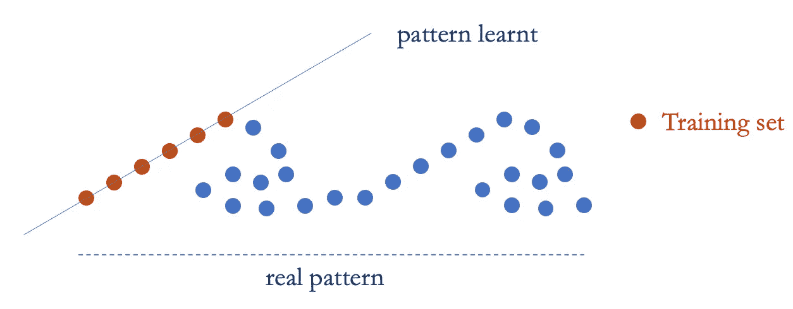
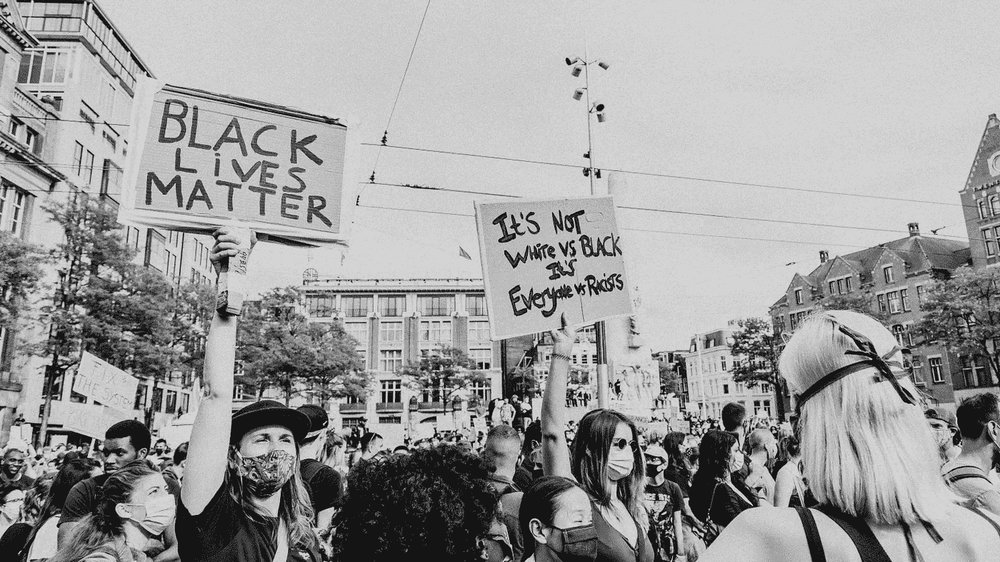
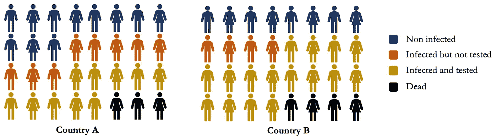

# 当数据科学让我们失望时

> 原文：<https://towardsdatascience.com/when-data-science-fails-us-78599de6423c?source=collection_archive---------36----------------------->

## 过去的趋势与预测未来的趋势有多相关？

马修·巴黎水在 [Unsplash](https://unsplash.com/) 上的照片

2020 年是非常特殊的一年，covid 在年初风靡全球，**改变了所有行业的计划**。时间表已经改变，客户互动已经转变，内部沟通也不再物质化。因此，我们所有基于前几年和历史智慧的模型都受到了质疑和挑战。它们在今天的环境中有什么相关性？

> “我们如何协调利用过去作为指导的需要和我们对未来可能不同的认识？”信号和噪音

# 史料什么时候能忽悠你？

数据科学中的一个常见做法是检查可用的历史数据，以便得出有用的结论来进行更好的规划。

> 研究 90 年代的欧洲市场肯定会对历史学家有很大帮助；但是，既然机构和市场的结构已经发生了如此大的变化，我们还能做出什么样的推论呢？纳西姆·塔勒布

数据集是过去发生的事情的表格表示。但是这种表示也伴随着不确定性、偏差和误差。此外，它仅代表您正在研究的现象的一个子集，可能无法反映与您的问题相关的子集(数据可用性)。

回顾历史数据时，应注意以下几点:

*   **分配**可能不是**固定的**
*   今天的**初始条件**不同
*   **行动者**(贡献者)已经进化
*   外部互动**已经进化**
*   如何兼顾**随机性**？
*   **未知的未知**(你甚至没有意识到并且没有包括在内的事情)

在这种情况下，相似的输入可以导致不同的结果。

## 你的药真的有效吗？:数据选择步骤

在设计临床试验时，一个重要的步骤是选择患者群体。应该选择哪个人口类别？哪个年龄组，他们的状况如何，他们的起源，他们的生物标记？我们如何确保这个样本尽可能接近我们想要提供药物的目标客户，而不遗漏任何一个人？

相反，如果您的样本不能准确代表总体，**您的药物可能不如您的试验显示的有效**。例如，如果你为乳腺癌患者开发一种药物，但你的样本中不包括肥胖的糖尿病患者，你可能会发现这些人对治疗反应不佳，不能使用它。

[国立癌症研究所](https://unsplash.com/@nci)在 [Unsplash](https://unsplash.com/) 上拍摄的照片

这同样适用于使用历史数据来建立推论，但其局限性更难以把握。如果你看看所有过去的金融贷款数据，你可能会认为它们反映了总的趋势，未来很可能也是如此。然而，这些金融贷款可能只发放给了拥有足够财富的人，并没有考虑到其他人，因为**他们甚至没有包括在数据集**中。

## 真的有因果关系吗？:协变量移位

当模式主要是方差和随机性的反映时，确定的因果关系将误导对现象的实际行为的理解。正如纳西姆·塔勒布在他的书《被随机性愚弄》中指出的，这就是一些从交易结果的差异中受益的非常成功的交易者的遭遇。[1]

> “许多人是如此缺乏独创性，他们研究历史以寻找重复的错误”纳西姆·塔勒布

挑战可能更加微妙，因为最近的一项研究发现，一些经过训练可以在胸部 x 射线上检测肺炎的模型在训练集中看不到的实际数据上的结果较差。这部分是由于图像采集和处理的差异。[2]

协变量偏移是指输入的训练集不同于真实世界的数据(作者的*图片)*

这就是我们所说的协变量转移。与训练集相比，生产模型(真实设置)中输入变量的分布不同。

## 在美国黑人更容易成为警察的目标吗？:分母偏差

模型不仅是从数据中构建的，更重要的是从我们决定关注的可用(相对于不可用)数据的子集构建的。这个决定会影响模型学习的方向，并导致更多的歧视。

劳拉·布朗纳在她的文章中揭露了针对黑人社区暴力的误导性统计数据。[3]许多公布的统计数字与每次遭遇警察时的死亡人数有关。然而，这些统计数据掩盖了以前发生的歧视，当时警察有权决定在街上与谁打交道。这些措施的分母不应是遭遇，而是人口。

妮可·巴斯特在 [Unsplash](https://unsplash.com/) 上的照片

同样，唐纳德·特朗普(Donald Trump)在接受 HBO 采访时表示，以每名感染者的死亡人数衡量，美国与其他国家相比表现良好。

在采访的 14'-15 '左右，川普试图利用这一统计缺陷为美国在打击疫情方面的糟糕表现辩护。下图突出了他推理中的统计缺陷。

(*图片作者*)

在这个例子中，B 国在相同的人口中有更多的感染病例和更多的死亡。对于两个人口相当的相似国家，理性的思考会表明，A 国对疫情的管理比 b 国好

然而，如果你看看每个感染者的死亡比例，如测试结果所示，情况就不同了。特朗普在视频中就是这么做的。在上面的例子中，A 国的死亡率为 0.23，而 B 国的死亡率仅为 0.2。

这一指标将突出更好的检测能力或全球人口的更高感染率。这使得人们很难理解一个国家如何能够更好地控制病毒的传播及其死亡率。

## 少数人的智慧:网络偏见

网络偏见的发生是因为**网络活动的扭曲本质**。里卡多·巴埃萨-耶茨[4]的一项研究表明:

*   亚马逊 50%的评论来自前 4%的活跃用户
*   50%的脸书帖子来自前 7%的活跃用户

这表明，我们看到的大部分信息来自少数来源，这种模式也被称为少数人的智慧:一小群精心挑选的用户是预测活动的良好代理。然而，进一步的分析表明，许多顶级用户来自软件或发布低质量的内容。很明显，原始用户数据不能用来做出这样的推论。

# 当数据和机器学习不足以预测时

> “在现在与过去最不相似的时刻，回顾过去寻找未来的线索是没有意义的”j·彼得·斯考布里克

如果未来看起来与过去截然不同，那么把你对未来的所有决定建立在你目前所经历的基础上就不再有效了。你正在错过机会，因为你没有看到世界是如何变化的。

在一个未来似乎与过去截然不同的世界里，**这种识别模式的能力甚至可能是一种劣势**，因为你会假设你知道接下来会发生什么，但你会错。你会对未来做出不正确的假设。

> “历史告诉我们，以前从未发生过的事情会发生。[……]历史教导我们避免天真的经验主义，这种经验主义是从偶然的历史事实中学习而来的。”纳西姆·塔勒布

即使我以前见过类似的东西，**这次可能会有所不同**。因此，与其对将要发生的事情做出假设，我怎么才能快速**了解新趋势**，我怎么才能知道我对将要发生的事情的想法是好是坏？

根据您的需求，有些工具可能很有价值:

*   **情景思维**有助于应对多变的商业环境。
*   蒙特卡洛模拟可以揭示可能的未来及其影响。
*   **敏捷建模**有助于理解可变性。

> 场景是一个对未来有重大影响的“如果…会怎样”的大问题

# 结论

大多数模型都基于我们可以预测未来的假设，但在当今复杂多变的环境中，有时我们做不到。

由 [Sean](https://unsplash.com/@iilikoi) 在 [Unsplash](https://unsplash.com/) 上拍照

# 参考

[1] *纳西姆·塔勒布*，被随机性愚弄:机会在市场和生活中的隐藏角色。纽约:Texere，2001 年。

[2] *Zech JR，Badgeley MA，Liu M，Costa AB，Titano，Oermann EK* (2018)深度学习模型检测胸片肺炎的可变泛化性能:一项横断面研究。PLoS Med 15(11): e1002683。[https://doi.org/10.1371/journal.pmed.1002683](https://doi.org/10.1371/journal.pmed.1002683)

fivethirtyeight.com，劳拉·布朗纳，为什么统计数据没有反映出警察系统偏见的全部程度

[4] *里卡多·巴埃萨-耶茨。2018.*卷筒纸上的偏差*。Commun。ACM 61，6(2018 年 6 月)，54–61。土井:*[*https://doi.org/10.1145/3209581*](https://doi.org/10.1145/3209581)