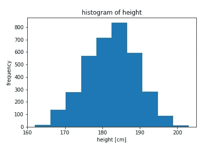
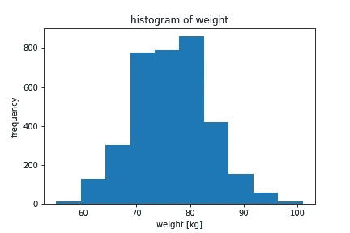
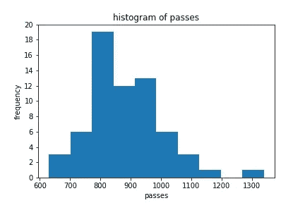
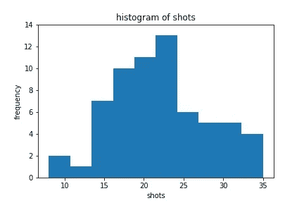
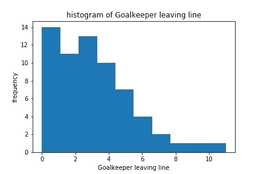
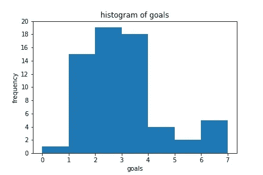

# 当数据科学遇上足球(第 1 部分):简介

> 原文：<https://towardsdatascience.com/when-data-science-meet-football-part-1-introduction-4cf9d0207ebd?source=collection_archive---------32----------------------->

## 足球数据科学导论


照片由[本斯·巴拉-肖特纳](https://unsplash.com/@ballaschottner?utm_source=medium&utm_medium=referral)在 [Unsplash](https://unsplash.com?utm_source=medium&utm_medium=referral) 拍摄

在足球比赛中利用数据对于发展球员技能或比赛分析已经变得非常重要。今天，我们可以比以前更深入和详细地讨论足球世界。对于刚开始在足球领域探索数据分析的你，有 [**Wyscout**](https://wyscout.com) 和 [**Opta**](https://www.optasportspro.com) 等第三方提供的公开数据集。

数据集包含足球比赛事件(例如，球员和比赛统计)。我们可以探索这些数据，努力更深入地理解足球数据。在这一节中，我们将检查进行足球分析的变量。

让我们开始吧，如果你想看这篇文章的完整代码，请访问我的 [**github**](https://github.com/fahmisalman/football-analytics) 。在本文中，我们将使用 Jupyter 笔记本作为代码编辑器。如果你不熟悉 Jupyter 笔记本，可以看看下面这篇文章。你可以自由使用另一个代码编辑器，不必遵循我所使用的。

 [## 1.Jupyter 笔记本是什么？- Jupyter/IPython 笔记本快速入门指南 0.1 文档

### 在这一页中，简要介绍 Jupyter 笔记本环境的主要组件。有关更完整的概述…

jupyter-笔记本-初学者指南. readthedocs.io](https://jupyter-notebook-beginner-guide.readthedocs.io/en/latest/what_is_jupyter.html) 

首先，我们必须下载所需的数据。本文将使用 [**Pappalardo 等人**、 **(2019)**](https://www.nature.com/articles/s41597-019-0247-7) 研究中使用的数据集。你可以在这里 下载数据集 [**。**](https://figshare.com/collections/Soccer_match_event_dataset/4415000/5)

## 导入包

如果您已经下载了所需的数据集，下一步就是导入将要使用的包。这里我们将使用`collections`和`json`包，它们是 python 和`matplotlib`和`numpy`的内置函数。

如果您还没有安装我最后提到的一个或两个软件包，请首先使用下面的命令安装它们。

```
$ pip install numpy
$ pip install matplotlib
```

安装完包之后，进入前面提到的包。

```
%matplotlib inline

**from** **collections** **import** defaultdict
**import** **matplotlib.pyplot** **as** **plt**
**import** **numpy** **as** **np**
**import** **json**
```

## 加载公共数据集

我们可以通过编写下面的代码来加载数据集。数据集从 [figshare](https://figshare.com/collections/Soccer_match_event_dataset/4415000/5) 存储库中导入，并以 JSON 格式存储。在这个会话中，我们导入比赛、球员、比赛和球队数据。也可以看看[这个 Github](https://github.com/Friends-of-Tracking-Data-FoTD/mapping-match-events-in-Python) 作为参考，作为我做这篇文章的灵感。

```
def load_dataset(tournament):
    matches, events = {}, {}
    matches = json.load(open('./data/matches/matches_{}.json'.format(tournament)))
    events = json.load(open('./data/events/events_{}.json'.format(tournament)))
    players = json.load(open('./data/players.json'))
    competitions = json.load(open('./data/competitions.json'))
    teams = json.load(open('./data/teams.json'))
    return matches, events, players, competitions, teams
```

之后，我们定义函数来获取我们需要的每一个数据。从比赛和事件开始。

```
def get_match(matches, events):
    match_id2events = defaultdict(list)
    match_id2match = defaultdict(dict)
    for event in events:
        match_id = event['matchId']
        match_id2events[match_id].append(event)

    for match in matches:
        match_id = match['wyId']
        match_id2match[match_id] = match
```

玩家。

```
def get_player(players):
    player_id2player = defaultdict(dict)
    for player in players:
        player_id = player['wyId']
        player_id2player[player_id] = player
    return player_id2player
```

竞赛。

```
def get_competitions(competitions):
    competition_id2competition = defaultdict(dict)
    for competition in competitions:
        competition_id = competition['wyId']
        competition_id2competition[competition_id] = competition
    return competition_id2competition
```

团队。

```
def get_teams(teams):
    team_id2team = defaultdict(dict)
    for team in teams:
        team_id = team['wyId']
        team_id2team[team_id] = team
    return team_id2team
```

现在，一切都准备好了。让我们加载数据。这里我们只使用 2018 年世界杯数据，所以输入`World_Cup`参数。

```
matches, events, players, competitions, teams = load_dataset('World_Cup')
```

之后，我们将数据转换成字典形式。

```
match_id2events, match_id2match = get_match(matches, events)
player_id2player = get_player(players)
competition_id2competition = get_competitions(competitions)
team_id2team = get_teams(teams)
```

## 探索数据结构

在这里，我们将尝试查看每个数据的结构。例如，我们可以在字典中显示索引为 32777 ( `player_id2player[32777]`)的球员相关信息。如你所见，我们可能有很多关于球员的信息，从护照区域信息到球员在 [Wyscout](https://wyscout.com) 系统中的标识符。

```
{'passportArea': {'name': 'Turkey',
  'id': '792',
  'alpha3code': 'TUR',
  'alpha2code': 'TR'},
 'weight': 78,
 'firstName': 'Harun',
 'middleName': '',
 'lastName': 'Tekin',
 'currentTeamId': 4502,
 'birthDate': '1989-06-17',
 'height': 187,
 'role': {'code2': 'GK', 'code3': 'GKP', 'name': 'Goalkeeper'},
 'birthArea': {'name': 'Turkey',
  'id': '792',
  'alpha3code': 'TUR',
  'alpha2code': 'TR'},
 'wyId': 32777,
 'foot': 'right',
 'shortName': 'H. Tekin',
 'currentNationalTeamId': 4687}
```

我们还可以使用下面的代码探索其他数据的结构。

```
match_id2events[2058017]
```

这就是结果。

```
{'status': 'Played',
 'roundId': 4165368,
 'gameweek': 0,
 'teamsData': {'9598': {'scoreET': 0,
   'coachId': 122788,
   'side': 'away',
   'teamId': 9598,
   'score': 2,
   'scoreP': 0,
   'hasFormation': 1,
   'formation': {'bench': [{'playerId': 69964,
      'assists': '0',
      'goals': 'null',
      'ownGoals': '0',
      'redCards': '0',
      'yellowCards': '0'},
...
 'seasonId': 10078,
 'dateutc': '2018-07-15 15:00:00',
 'winner': 4418,
 'venue': 'Olimpiyskiy stadion Luzhniki',
 'wyId': 2058017,
 'label': 'France - Croatia, 4 - 2',
 'date': 'July 15, 2018 at 5:00:00 PM GMT+2',
 'groupName': '',
 'referees': [{'refereeId': 378051, 'role': 'referee'},
  {'refereeId': 378038, 'role': 'firstAssistant'},
  {'refereeId': 378060, 'role': 'secondAssistant'},
  {'refereeId': 377215, 'role': 'fourthOfficial'}],
 'duration': 'Regular',
 'competitionId': 28}
```

其他数据可以自己试试。如果你需要例子，我已经在 [Github](https://github.com/fahmisalman/football-analytics) 上提供了。

## 可视化数据

我们可以通过将数据绘制成更具交互性的视图来进行有趣的数据分析。例如，我们可以将所有球员的身高绘制成直方图。

```
heights = [player['height'] **for** player **in** player_id2player.values()   **if** player['height'] > 0]fig,ax = plt.subplots(1,1)
ax.hist(heights)
ax.set_title('histogram of height')
ax.set_xlabel('height [cm]')
ax.set_ylabel('frequency')
plt.show()
```

这就是结果。



高度直方图

或者你可以做这个。



重量直方图

除了分析球员统计数据，我们还可以通过在比赛数据中发现事件来进行其他有趣的分析。编写下面的代码，创建一个函数来标识匹配事件的数据结构。

```
event_key = []
sub_event_key = []

for events **in** match_id2events.values():
    for event **in** events:
        event_key.append(event['eventName'])
        sub_event_key.append(event['subEventName'])

event_key = list(set(event_key))
sub_event_key = list(set(sub_event_key))event_stats = []
sub_event_stats = []**for** events in match_id2events.values():
    event_stat = {key: 0 for key in event_key}
    sub_event_stat = {key: 0 for key in sub_event_key}

    for event in events:
        event_stat[event['eventName']] += 1
        sub_event_stat[event['subEventName']] += 1 event_stats.append(event_stat)
    sub_event_stats.append(sub_event_stat)
```

这是`event_key`变量的结果。

```
{'Duel',
 'Foul',
 'Free Kick',
 'Goalkeeper leaving line',
 'Offside',
 'Others on the ball',
 'Pass',
 'Save attempt',
 'Shot'}
```

而这是`sub_event_key`变量的结果。

```
{'',
 'Acceleration',
 'Air duel',
 'Clearance',
 'Corner',
 'Cross',
 'Foul',
 'Free Kick',
 'Free kick cross',
 'Free kick shot',
 'Goal kick',
 'Goalkeeper leaving line',
 'Ground attacking duel',
 'Ground defending duel',
 'Ground loose ball duel',
 'Hand foul',
 'Hand pass',
 'Head pass',
 'High pass',
 'Late card foul',
 'Launch',
 'Out of game foul',
 'Penalty',
 'Protest',
 'Reflexes',
 'Save attempt',
 'Shot',
 'Simple pass',
 'Simulation',
 'Smart pass',
 'Throw in',
 'Time lost foul',
 'Touch',
 'Violent Foul'}
```

我们可以看到比赛事件有一些有趣的变量。我们可以分析每个变量，以获得更有意义的匹配分析。例如，我们可以在我们的字典(`event_stats[0]`)的第一场比赛中打印一些事件统计数据。

```
{'Goalkeeper leaving line': 0,
 'Duel': 468,
 'Free Kick': 105,
 'Offside': 4,
 'Others on the ball': 128,
 'Foul': 32,
 'Shot': 18,
 'Pass': 827,
 'Save attempt': 7}
```

就像前面一样，我们还可以为匹配事件中的每个变量创建一个直方图，以简化分析过程。我们来做一个直方图。

```
pass_stat = [event['Pass'] for event in event_stats if 'Pass' in event]
fig,ax = plt.subplots(1,1)
ax.hist(pass_stat)
ax.set_title("histogram of passes")
ax.set_xlabel('passes')
ax.set_yticks([0, 2, 4, 6, 8, 10, 12, 14, 16, 18, 20])
ax.set_ylabel('frequency')
plt.show()
```

这就是结果。



通道直方图

你也可以做这个。



镜头直方图



守门员离场线直方图

最后，你也可以创建目标统计。

```
scores = []
for match in match_id2match.values():
    score = 0
    for team in match['teamsData'].values():
        score += team['score']
    scores.append(score)
```

然后使用这段代码查看统计数据。

```
scores = np.array(scores)
fig,ax = plt.subplots(1,1)
ax.hist(scores, bins = [0, 1, 2, 3, 4, 5, 6, 7])
ax.set_title("histogram of goals")
ax.set_xticks([0, 1, 2, 3, 4, 5, 6, 7])
ax.set_xlabel('goals')
ax.set_yticks([0, 2, 4, 6, 8, 10, 12, 14, 16, 18, 20])
ax.set_ylabel('frequency')
plt.show()
```

这就是结果。



目标直方图

上面的教程是对足球分析如何工作的介绍。在下一篇文章中，我们将探索更复杂的数据。

## 参考

*   卢卡·帕帕拉多；伊曼纽马苏科(2019 年):足球比赛事件数据集。figshare。收藏。[https://doi.org/10.6084/m9.figshare.c.4415000.v5](https://doi.org/10.6084/m9.figshare.c.4415000.v5)
*   Pappalardo 等，(2019) **足球比赛时空比赛事件公开数据集**，《自然科学数据》6:236，[https://www.nature.com/articles/s41597-019-0247-7](https://www.nature.com/articles/s41597-019-0247-7)
*   Pappalardo 等人(2019) **PlayeRank:通过机器学习方法在足球比赛中进行数据驱动的表现评估和球员排名**。ACM 智能系统与技术汇刊(TIST) 10，5，第 59 条(2019 年 9 月)，27 页。https://doi.org/10.1145/3343172