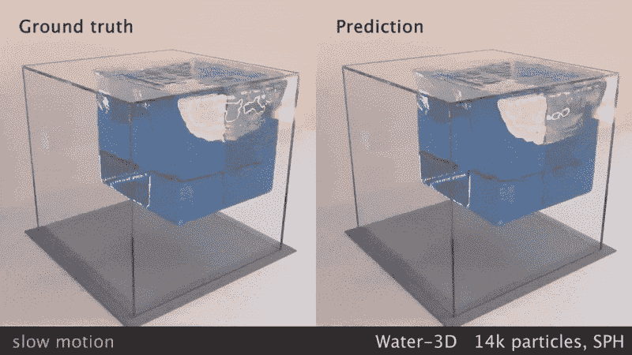
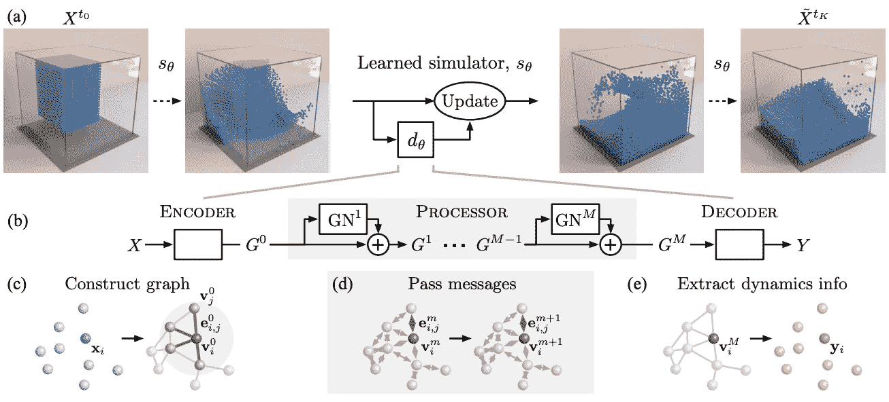
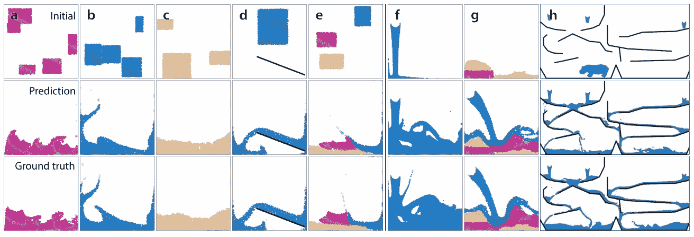

# 当机器学习和物理学发生碰撞时

> 原文：<https://towardsdatascience.com/when-machine-learning-and-physics-collide-96d983f4a567?source=collection_archive---------55----------------------->

## 学习机

## 用基于图形网络的模拟器模拟真实世界的物理

彼得·巴塔格利亚的模型演示([来源](https://twitter.com/PeterWBattaglia/status/1237425685766995974))

前阵子在浏览 arXiv 最近在机器学习方面的论文投稿，偶然发现一个有趣的标题。

> [学习用图形网络模拟复杂物理](https://arxiv.org/abs/2002.09405)

我决定更深入地研究它，并发现作者成功地结合并使用了几个机器学习模型来创建一个名为“基于图形网络的模拟器”(GNS)的框架。

正如你在上面的图像中看到的，预测的水粒子运动设法表现得与地面真实情况相似。对于不同的起始条件和其他颗粒，如粘性物质和沙子，它也产生了可比较的结果。

与现有的需要对起始条件的任何变化进行重新渲染的模拟相反，该模型只需要训练一次，并且可以成功地预测粒子在不同条件下的行为。

下面是我对他们如何做的一个非常简单的解释。

GNS 框架的架构([来源](https://arxiv.org/pdf/2002.09405.pdf))

GNS 框架由三个主要模块组成:编码器、处理器和解码器。

## 编码器

编码器将基于每个粒子的当前位置构建初始图。粒子将作为图中的节点。同时，将在某个*连接半径内的相邻节点之间构建边。*

在下一个和每个时间步，将使用最近邻算法重构图的边。

输入向量由以下内容组成:

*   粒子的位置
*   粒子以前的速度(5 倍步)
*   材料属性(水、沙、粘性物质等。)

## 处理器

处理器通过边在节点之间传递“消息”。这是模型学习的部分。有 M 个图形网络(GN)用于学习(并最终预测)粒子之间的相互作用。

在物理学中，这些相互作用应该是粒子之间能量和动量的交换。在该论文中，对这些相互作用建模的任务被交给 M GNs 栈。

## 解码器

解码器的任务是从图中提取信息，特别是每个节点的位置。然而，解码器并不输出每个粒子的坐标。

输出是该时间步中每个粒子的平均加速度。

一旦你有了每个粒子的平均加速度的信息，你就可以计算每个粒子的速度和最终位置。

如果我们回头看看编码器的输入，当前位置和速度以及 5 个先前的速度将用于计算下一个时间步长的平均加速度。

就像普通的神经网络一样，这个过程重复 *t* 时间步长。

为了可视化模拟结果，关于每个粒子位置的信息用于在每个时间步长上绘制粒子。

显然，对于所有三个模块(编码器、处理器和解码器)，作者简单地使用了多层感知器(MLP ),具有 2 个隐藏层(ReLU)和 1 个输出层(无激活功能),每个都有 128 个节点。

最让我惊讶的是，看似简单的神经网络结构，由两层 MLP 和 ReLU 以及最近邻算法组成，却能捕捉看似复杂的交互。

不同材料和约束条件下 GNS 的模拟结果([来源](https://arxiv.org/pdf/2002.09405.pdf)

上图描绘了不同的起始条件(a-h)以及几个时间步后预测和地面实况的结果。

*   (a)显示了粘性颗粒的相互作用
*   (b)显示了水粒子的相互作用
*   (c)显示了沙粒的相互作用
*   (d)显示粒子与刚性障碍物的相互作用
*   (e)显示不同粒子之间的相互作用
*   (f)显示模型如何处理比训练中多得多的粒子
*   (g)显示与看不见的物体的相互作用
*   (h)显示对较大领域的概括

> 我们的主要发现是，我们的 GNS 模型可以学习不同流体、可变形和刚性固体的精确、高分辨率、长期模拟，它可以超越训练，推广到更长、更大和更具挑战性的环境([来源](https://arxiv.org/pdf/2002.09405.pdf))

作者还表示，GNS 模型可以很好地处理一般化。在图(f)中，该模型可以处理多达 28k 个粒子的相互作用，这是他们在训练中使用的 2.5k 个粒子的 10 倍以上。

图(g)显示了该模型还可以处理各种材料的相互作用，同时在每个时间步中有连续的水流入。

最后但同样重要的是，图(h)显示了 5000 步后的模拟状态，比用于训练的步数多 8 倍，其中 85k 个粒子位于比模型训练区域大 32 倍的区域中。

你可以在这里看到更多由模型[生成的例子。](https://medium.com/r?url=https%3A%2F%2Fsites.google.com%2Fview%2Flearning-to-simulate)

他们还包括一些[失败案例](https://sites.google.com/view/learning-to-simulate#h.p_GYmSoIisBUUX)，在这些案例中，实体可能会在更长的模拟时间内变形，粘性颗粒有时会粘在墙上而不是落下。

在当前状态下，该模型可能无法 100%准确地完全取代粒子模拟的手动渲染。然而，它已经成功地正确模拟了大部分物理现象。一个可以实现近乎完美模拟的模型可能就在不远的将来。

物理模拟领域可能不像自然语言处理或计算机视觉等机器学习领域那样受欢迎。然而，想象一下如果这个模型可以取代现有的粒子模拟，它将带来的影响。

当前的粒子模拟需要很长时间来创建，因为它手动计算每个时间步长上每个粒子的状态。如果你仅仅移动了一个粒子，你就需要重新计算所有的东西。

另一方面，机器学习模型只会在训练阶段花费大量时间进行处理。一旦模型被训练，通过简单地在模型中传递信息就可以创建模拟。这个过程需要更少的计算能力，因为它比当前的粒子模拟简单得多。

这可能节省了未来粒子模拟所需的大量能量，因为该模型只需要训练一次，并且可以重新使用运行非机器学习驱动的物理模拟所需的一小部分能量。

## 参考

[1] Sanchez-Gonzalez 等，[学习用图网络模拟复杂物理](https://arxiv.org/abs/2002.09405) (2020)，[arXiv:2002.09405](https://arxiv.org/abs/2002.09405)**【cs .LG]**

学习机是一系列关于机器学习世界中发生的事情的故事，我觉得很有趣，可以分享一下。哦，有时也是关于机器学习的基础。关注我，定期获取新故事的更新。

 [## 里奥纳尔迪·钱德拉塞塔—培养基

### 数据科学家。我写的是 DS & ML。有时候。

chandraseta.medium.com](http://chandraseta.medium.com/membership)