# 当混合效应(分层)模型失败时:汇集和不确定性

> 原文：<https://towardsdatascience.com/when-mixed-effects-hierarchical-models-fail-pooling-and-uncertainty-77e667823ae8?source=collection_archive---------13----------------------->

## 一个直观和可视化的指南，介绍部分池化变得麻烦的情况，贝叶斯方法可以帮助量化不确定性

[国家癌症研究所](https://unsplash.com/@nci?utm_source=medium&utm_medium=referral)在 [Unsplash](https://unsplash.com?utm_source=medium&utm_medium=referral) 上拍摄的照片

*在这篇文章中，我提供了一个直观的，可视化的混合效果(层次)模型的基础，以及“池”的概念和应用实例。如果您对在****R/Python****中实现贝叶斯层次模型感兴趣，我已经在后续文章* *中发布了* [***分步指南。***](/a-bayesian-approach-to-linear-mixed-models-lmm-in-r-python-b2f1378c3ac8)

这个世界充满了嵌套(分组)结构，我们经常强加这种结构来简化我们对世界的理解。你从小就接触过这些嵌套结构(不管你有没有意识到)。例如，在地理类中，国家嵌套在大陆或地区内，州嵌套在国家内。同样，你可以想到团队中的玩家，区域中的客户，甚至大学中的部门。

鉴于我们倾向于构建世界的本质，我们通常会在分析中遇到具有嵌套结构的数据集(即作为组成员的观察)。

> **混合效应模型是回归模型的简单扩展，它考虑了群体成员对感兴趣结果的影响。**

就像任何广泛使用的跨学科方法一样，人们无法就一个通用名称达成一致。这些模型被称为“混合模型”、“分级模型”、“多级模型”、“随机效应模型”等。(为什么人们不能在一个名字上达成一致对我来说是个谜。🤷‍♂)

在你想“哦，太好了，另一篇关于线性模型的文章…😒“让我告诉你:是的，这涵盖了线性模型**,但不要忽视一个通常被忽视的点——当模型不起作用时，以及这可能产生的后果。**

> 为简单起见，我将重点讨论线性模型，并将在后续出版物中讨论广义混合模型。

# 一眼

以下是我将介绍的内容

1.  快速直观、直观地进入线性混合效果建模( ***强烈推荐，如果你在*** *之前没有见过混合模型，否则跳过这一部分，但确保你熟悉它们的分布形式*
2.  **“池化”**的概念以及它如何驱动这种方法的底层机制( ***以及动画和营销中的应用示例*** )
3.  一个不希望“汇集”的案例，以及对频繁主义(即非贝叶斯)方法的一些限制的讨论

# 什么是线性混合模型(LMM)？

> 以下部分基于`[sleepstudy](https://rdrr.io/cran/lme4/man/sleepstudy.html)` [数据集](https://rdrr.io/cran/lme4/man/sleepstudy.html)的子集。这些数据来自睡眠剥夺研究，其中的观察值是对多个受试者进行的一系列测试中每天睡眠剥夺的平均反应时间。

## 简单线性回归

想象一下，我们正试图评估睡眠剥夺天数对受试者平均反应时间的影响。我们可以从一个简单的线性模型开始理解这种关系，如下所示

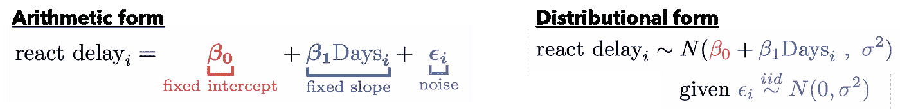

其中对于每次观察`i`，睡眠剥夺的天数(`Days`，即独立变量)影响基于β变量的平均反应时间/延迟(`react delay`，即因变量)。**这些** β **参数被称为*固定效应*，因为它们对于所有观测值(即总体)都是恒定的**。

请注意，给定的线性回归假设数据是正态分布的，我们也可以将其定义为分布形式。**上式可以读作****观测值正态分布，均值β0+β1 *天，总体方差σ** (因为我们假设所有观测值`i`方差相同)**。**

现在，如下所示，睡眠剥夺对每个受试者的影响不同，因此**使用一个将所有观察结果分组在一起的模型(称为*完全汇集*)是没有意义的。**

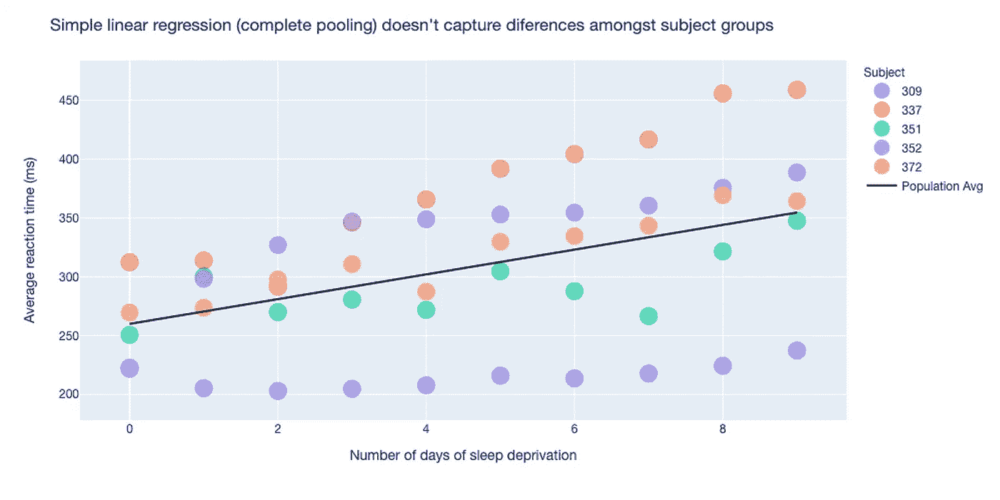

那么，我们怎样才能模拟主体间的差异呢？嗯，我们可以使用各种风格的线性混合效果模型。

## 1.变截距

我们可能首先要考虑这样一种情况，即受试者有不同的基线，但他们的反应时间增加的速率(斜率)是相同的。在这种情况下，我们扩展了之前的模型，允许截距随主题`subj`而变化，如下所示

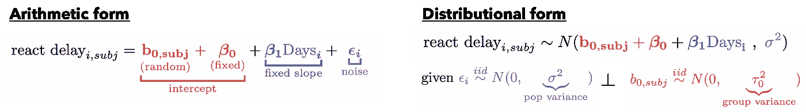

其中，β0 和β1 为 ***固定/群体效应*** (在所有观察中保持不变)，而`b0,subj`为 ***随机效应*** ，允许截距因受试者而异(即偏离群体截距β0)。这就引出了我们的第一个混合效果模型**变截距模型。**在分布方面，每个受试者的平均值根据正态分布的`b0,subj`和**受试者特定方差** τ _0 而变化。(这就是为什么这个术语被认为是“随机的”)

下图提供了一个这种型号的例子。我们可以看到，它给出了一个确定的拟合，但没有考虑到跨对象的斜率变化。

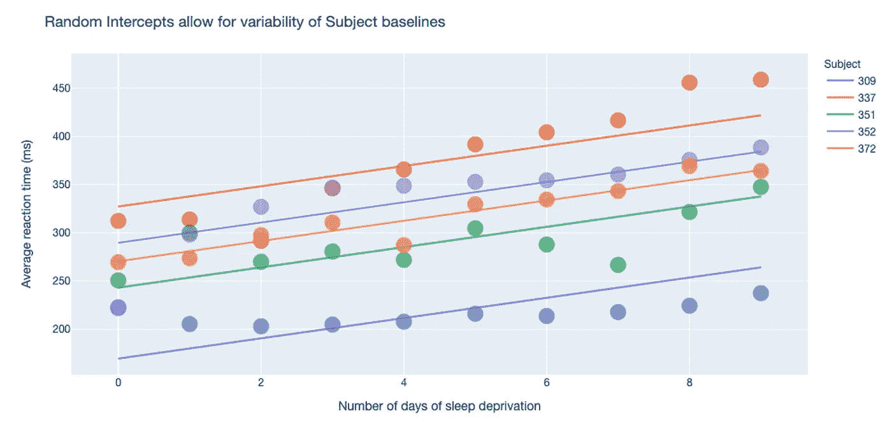

## 2.变斜率

现在，如果我们认为每个受试者的反应时间增加不同，那么我们可能想让斜率变化(通过`subj`)并保持截距固定如下

其中β0 为固定( ***群体*** )截距，斜率根据β1 ( ***固定斜率*** ) + `b1,subj` ( ***随机斜率*** )变化。这就引出了我们的第二种混合效应模型，一个**变斜率模型。**在分布方面，根据正态分布的`b1,subj*Days`和**受试者特定方差** τ _1，每个受试者的均值不同。

下图提供了该模型的一个示例，我们可以看到它实际上比之前的模型更符合数据。我们能结合这两种方法吗？是的，我们可以。🙂

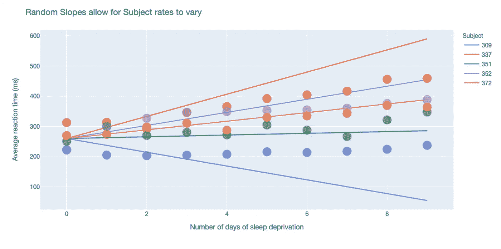

## 3.变截距、变斜率

观察上面的图，可以合理地考虑每个受试者的基线反应时间*和*增加率与其他受试者不同的情况。

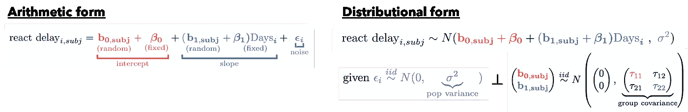

我们既有斜率和截距固定效应(β0 和β1)，也有随机效应(`b0,subj`和`b1,subj`)。这就引出了我们最后一种混合效应模型，一种**变截距、变斜率模型。**就分布而言，基于`b0,subj`和`b1,subj*Days`，每个受试者的平均值不同，但现在这两个**受试者特定的随机效应是相关的。**因此，方差分量现在是包括斜率和截距方差(τ_22 和截距τ_11)以及它们的协方差(τ_21 和τ_12)的矩阵。

与前两个图相比，我们可以看到，该模型倾向于更紧密地拟合数据，因为它改进了如何解释受试者特定的差异。

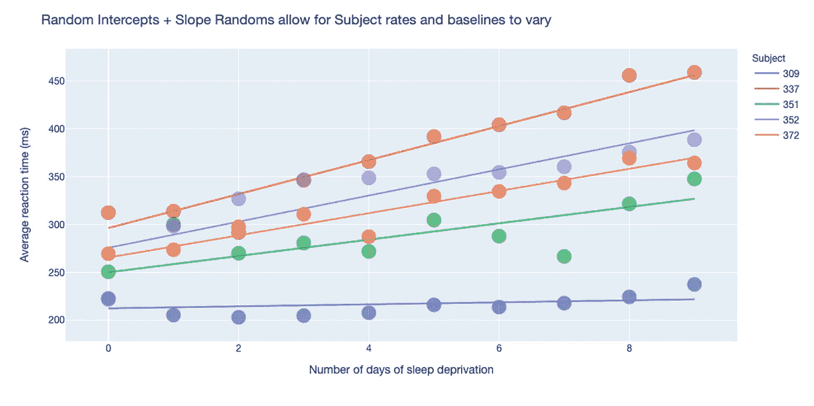

> 请注意，这只是一种混合模型(线性)的直观指南。为了实现这些，您需要理解您正在回答的问题、您的数据，并能够用其他方法仔细评估模型性能/拟合，其中一些方法我将在下一节中介绍。

# 什么是“联营”？(一个应用实例)

> 本节是对 Github 中更全面的分析的总结。它使用基于以下 [Kaggle 数据集](https://www.kaggle.com/ojwatson/website-bounce-rates/data)的[模拟数据](https://github.com/ecoronado92/towards_data_science/blob/master/hierarchical_models/foundations/create_new_bounce_data.R)。为了简单起见，这个例子是用 R 编写的，但是你也可以在 Github 中找到 Python 的例子。

假设您的公司最近更新了网站，营销部门想知道网站的运行情况。具体来说，他们想知道年轻顾客比老顾客在网站上花多长时间。

为了回答这个问题，你收集了 8 个不同地点(`county`)的客户“跳出率”(`bounce_time`，秒)和`age`，跳出率衡量客户在网站上花费的时间。**但是，正如您在下面看到的，您无法在所有位置获得相同数量的观察值**(例如，一个位置有 150 个观察值，而另一个位置只有 7 个)。

## 完全汇集(或简单线性回归)

首先，假设你试图理解`bounce_time`对`age`的依赖性，你拟合一个线性模型。但是，在这样做之前，您需要对您的`age`变量(均值=0，方差=1)进行中心缩放，以提高模型稳定性并简化以后的解释(即截距现在是平均值`age`)。

该模型被视为**完全汇集模型**，因为它忽略了县与县之间的差异，并且**将所有观察结果视为同一组或池**的一部分。因此，它为所有数据估计*单一斜率和截距* (β0=200，β1=4.69)。然而，考虑到模型显示缺乏拟合(评估未显示)，您想看看在县一级建模差异是否会提高性能。

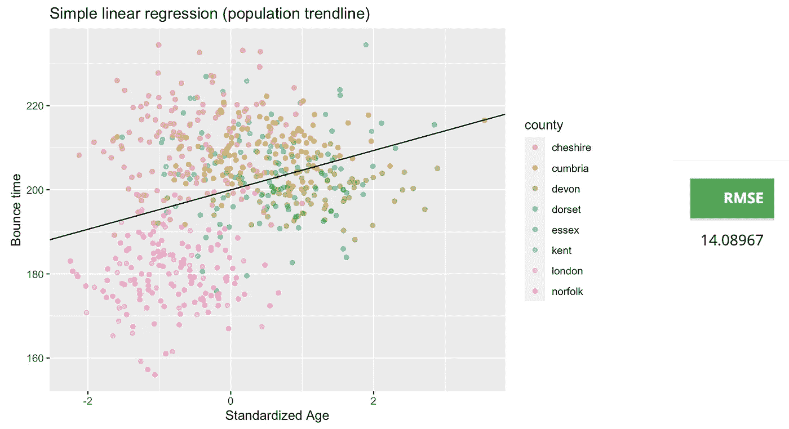

快速的 EDA 收益使您可以观察到平均`bounce_time`似乎在不同地点(`county`)之间有所不同，并且县内的可变性并不是所有地点都相同。因此，简单线性回归的独立性假设不成立。

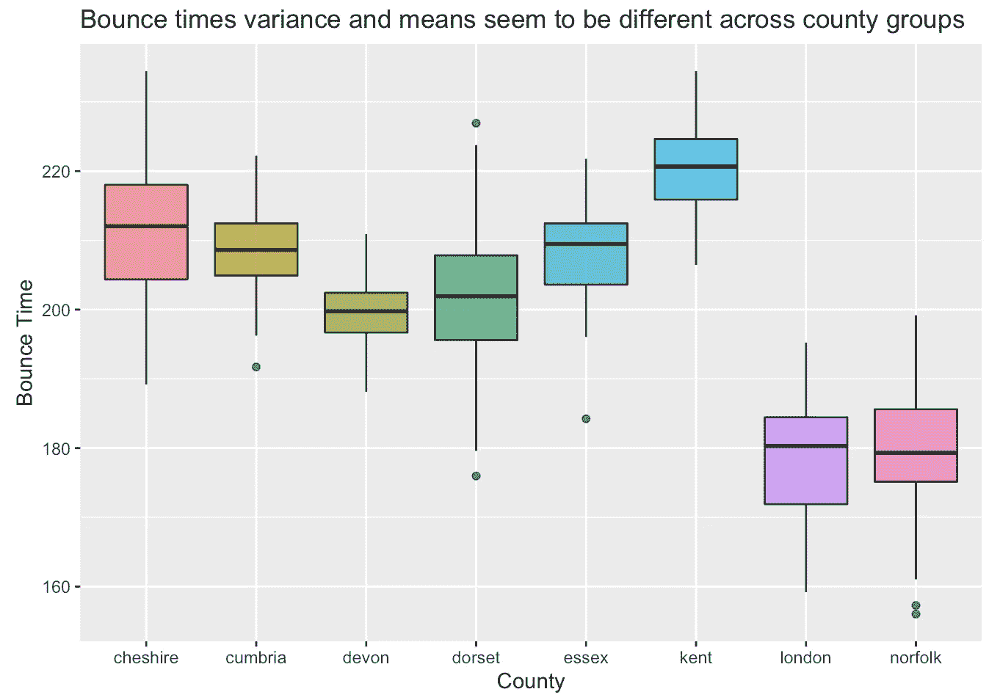

## 无池模型(或单独的线性回归)

相反，你可以使用`lme4` R 包来拟合每个县的回归线。由此产生的**无池模型**假设各县之间的客户没有相似之处，并独立考虑每个县。因此，我们估计了 8 个不同的截距和斜率(即每个县一个)，如下所示。

这个新模型似乎更适合(未显示)，比前一个模型表现更好，并且在视觉上似乎捕捉到了每个群体的趋势。

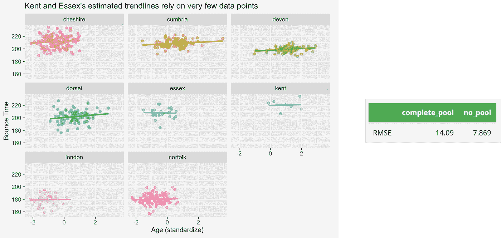

此外，斜率估计值比以前小得多，这一现象可以通过[辛普森悖论](https://en.wikipedia.org/wiki/Simpson%27s_paradox)来解释(即，在县或组级别估计的趋势可能与全球估计的趋势完全不同)*。*下面的动画展示了完全池化和无池化模型估算之间的变化。

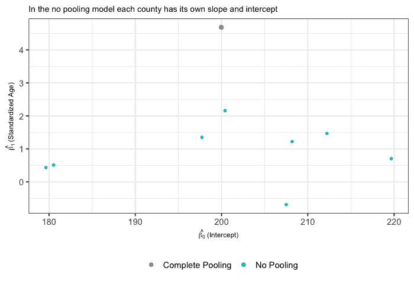

> 然而，基于一个看似更紧密的匹配就得出无池模式是最好的结论还为时过早。

正如 [Gelman 所描述的](http://www.stat.columbia.edu/~gelman/arm/)“完全汇集忽略了[组]之间的差异，而非汇集分析夸大了它[并且]…过度拟合了每个[组]内的数据”。换句话说，这个模型夸大了各县之间的差异，使它们看起来更加不同，而事实上，各县之间的客户似乎(甚至预期)有一些相似之处。

## 部分汇集模型(或线性混合效应)

为了捕捉各县之间的相似性，您拟合了一个介于两个极端之间的模型(即**完全模型和**无池模型)。使用 R 的`lmer`函数，你拟合一个线性混合效应模型，再次估计 8 个不同的斜率和截距。

**然而，这些是通过部分汇集**估算的，简单来说，*结合了*来自完全汇集模型的人口(固定)效应和非汇集模型的县特定(随机)效应的信息。

查看摘要输出，您会看到一些有希望的指标。随机截距似乎解释了县与县之间的大部分差异(≈195)，但仍有一些总体水平的差异(即残差)。(两者都有表明固定和随机效应都在起作用，如果剩余方差≈0，那么拟合无池模型也是一样好的。)

**然而，您注意到来自函数的警告消息，指出模型拟合可能是“奇异的”**(上面输出的底部)。您可能会忽略此消息，因为该模型具有良好的拟合性(未显示)并且与无池设置的性能相当。

那么，为什么不用这个模型来回答市场部关于反弹时间的问题呢？

我会告诉你为什么，但首先让我们快速绕道进入**部分池**。

## 对部分池化的直观探究

部分统筹是混合效应模型强大的本质，我发现人们往往倾向于描述部分统筹的作用，而不是解释它。部分池化代表了完全模式和无池化模式之间的一种折衷。让我们探索一下这意味着什么。

首先，左边*的动画*(下图)提供了一个实时例子**为什么部分池是一种“妥协”**我们可以看到斜率和截距估计值在我们刚刚讨论的三个模型中是如何变化的。采用部分混合法时，具体县(无混合法)的估计值将用于人口(完全混合法)的估计值。**但是，为什么有些估计值比其他的变化大？**

我们可以用右边*、*的一组方程式来回答这个问题，这组方程式的颜色编码与左边*的动画相匹配。*简单地说，部分合并估计值(蓝色)是完全合并模型(红色)和非合并模型(绿色)的加权平均值，其中权重由方差和组样本大小定义。*(注意:这些等式取自一个稍微简单的例子，并不是在上述模型中计算出的精确等式。)*

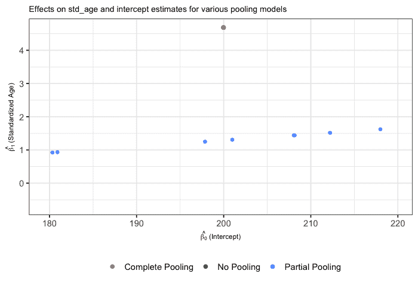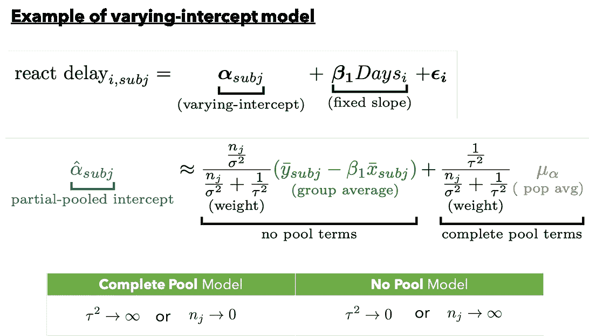

人们称群体为“携带”或多或少信息的群体，是基于群体样本大小和/或这个等式中方差的影响。例如，在样本量较小的县`n_j`(即`n_j -> 0`)中，我们看到左边的项权重变小。因此，估计值被拉至或*【缩小】*更接近总体平均值，这是有益的，因为我们通常不希望用很少的数据点来估计参数。对于样本量较大的群体来说，这种效应是相反的——我们对这些数据中群体水平效应的估计更有信心。

> 从本质上说，我们看到的是较小的群体从较大的群体“借用信息”,并使他们的估计值向总体值缩小。

# 当部分集中出现问题时

让我们回到网站跳出率的例子。

鉴于您对手头问题的深刻(或新开发的)理解，以及在这种情况下部分池化如何能够导致更好的估计，您选择混合效应模型来回答年龄如何影响跨县的跳出率。部分合并似乎已经“缩小”了预期的估计值和置信区间(见下文)。请注意斜率估计的一些有趣之处——置信区间几乎消失了！这怎么可能呢？发生了什么事？

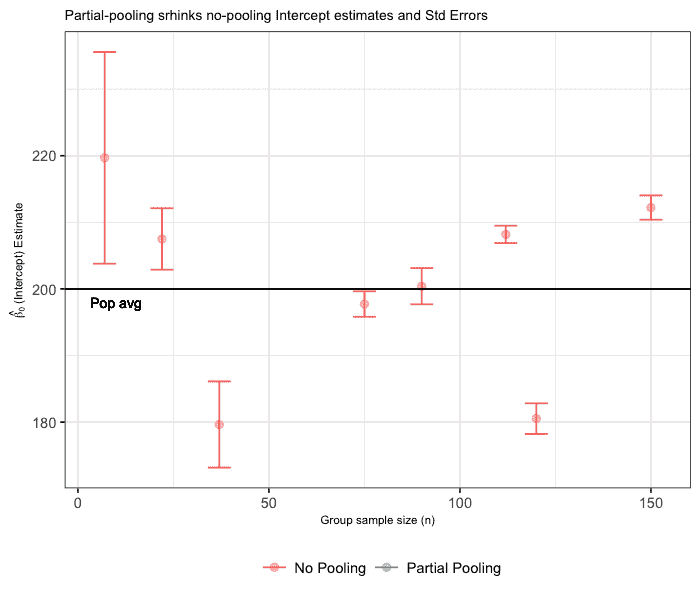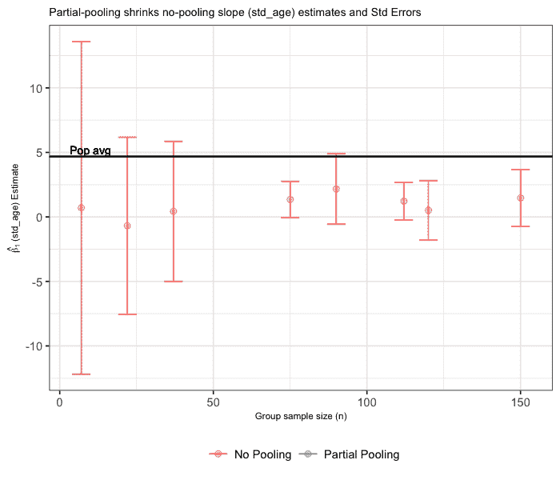

## 1.消失置信区间

还记得我之前提到的“奇异适合”警告吗？好吧，那已经发生了。简单地说，这个警告告诉我们，模型太复杂，数据无法支持。在我们的案例中，在样本规模较小的县中，随机截距是大部分可变性的原因，因此当我们尝试拟合特定于县的斜率时，没有足够的信息来完成这项工作。

我们可以简化我们的模型，去掉随机斜率，但是如果我们认为特定于县的斜率可能有一些优点呢？我们可以使用贝叶斯方法包括这两个组件(见下一节)。

## 2.意外收缩(警示故事)

在继续之前，重要的是要记住一个重要的教训，即部分集中/收缩可能会导致意想不到的后果。[2016 年 George et al.](https://arxiv.org/pdf/1510.00842v2.pdf) 研究表明，部分统筹会导致较小医院的预测死亡率被人为压低。如下图所示，对于床位较少的医院(x 轴),预测死亡率(y 轴)被“人为缩小”。也就是说，该模型系统地降低了小医院中观察到的(较高的)死亡率。在这种情况下，从一个标准的混合效应模型的部分汇集有潜在的噩梦般的公共卫生和法律后果。这种对观察到的死亡率的低估可能会影响以后的病人。😱

改编自乔治等人(美国统计局，2016 年)

*在他们的论文中，乔治等人提供了混合效应模型的扩展，有助于限制部分统筹的不良影响。*

# 贝氏拯救

> 如果你不太熟悉贝叶斯推理，我推荐 [Aerin Kim](https://medium.com/u/1d8994ad0efc?source=post_page-----77e667823ae8--------------------------------) 的[惊人文章](/bayesian-inference-intuition-and-example-148fd8fb95d6?source=---------8------------------)。
> 
> 此外，假设拟合贝叶斯模型本身就是一个对话(例如，选择先验、诊断等。)本节将只关注结果。未来的文章将更详细地讨论贝叶斯拟合。

贝叶斯混合效应方法是更常用的频率主义方法(如上)的有力替代。特别是，他们能够在估计群体水平的影响时考虑不确定性，并在*弱信息*先验的帮助下，为样本量较小的群体提供稳定的估计。

让我们想象一下，你最近了解到贝叶斯方法可以帮助你处理模型中的“奇异拟合”问题。另外，你从一个同事那里听说有一个很棒的 R 包(`brms`)包，它提供了一个易于使用的公式构建器来拟合带有`stan`的贝叶斯混合模型。在选择了你的先验后(在以后的文章中会涉及到*)，你可以像以前一样使用相同的混合效果模型。*

*这个新模型似乎有一个很好的拟合(未显示)和后验预测检查给你的估计和相关误差的信心。更重要的是，您会注意到埃塞克斯、肯特、伦敦和诺福克斜率的 [95%可信区间](https://easystats.github.io/bayestestR/articles/credible_interval.html)包含 0(即这些斜率实际上有可能为零)。*

*从视觉上，你可以看到每个县的趋势线的后验图(*左*)似乎符合数据，这种新方法在 RMSE 方面对模型的性能(*右*)有微小的改进。*

**

*最重要的是，您的估计仍然利用部分池，但这次没有我们前面看到的消失误差界限。这是因为你通过你的*弱信息*前科引入了“信息”。这是贝叶斯推理的核心思想，它将观察到的数据中的信息与指定的先验分布(我们通常可以认为是基线估计)中的信息相结合。后验估计在理论上总是可能的(不像我们的“奇异拟合”例子)，但是在数据不足的情况下，这些估计默认与我们的先验相似。*

*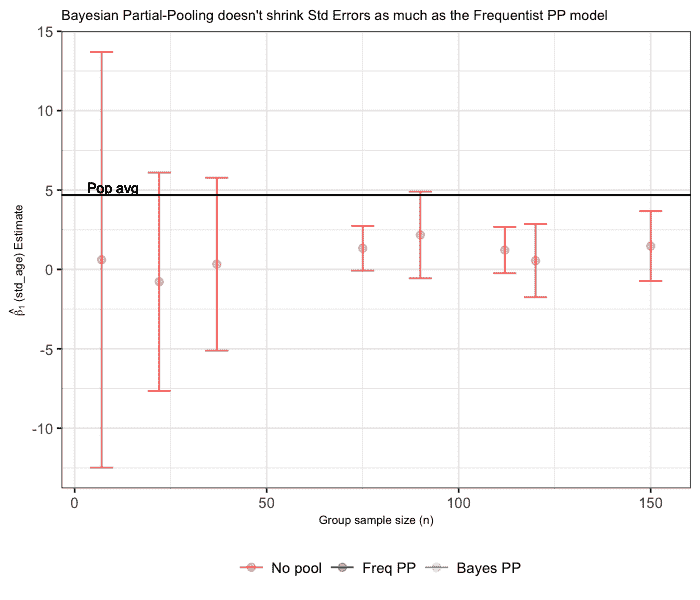*

*最后，我不是说贝叶斯主义者>常客，或者你应该放下一切，成为贝叶斯主义者。在任何情况下，你选择的方法都应该反映出你对手头问题的理解。在这里，我拟合了一个贝叶斯模型来帮助说明它是如何帮助处理消失误差界限的。然而，我可以简化这个模型(见上面的`rintercept_only` RMSE 表格)。这完全取决于你想回答什么问题。*

# *结论*

*以下是一些需要考虑的最终想法*

1.  *混合效应模型是帮助我们解释数据中复杂的嵌套结构的强大方法*
2.  ***请记住，*根据具体情况/问题*，**部分共用可能会伤害你而不是帮助你*****
3.  ***在适当的时候考虑使用贝叶斯框架 ( *我将在下一篇文章*中详细介绍这一点)***

# ***参考***

1.  ***吉尔曼，安德鲁和珍妮弗·希尔。*使用回归和多级/分层模型的数据分析*。剑桥:剑桥大学出版社，2007。打印。***
2.  ***安德鲁·吉尔曼。"多级(层次)建模:它能做什么和不能做什么."48.3(2006):432–435。***
3.  ***盖布里、乔纳等人，《贝叶斯工作流程中的可视化》*英国皇家统计学会杂志:A 辑(社会中的统计)*182.2(2019):389–402。***
4.  ***BRMS。[https://paul-buerkner.github.io/brms/](https://paul-buerkner.github.io/brms/)***

***如果你喜欢这篇文章，请随意分享！如果您有任何问题或看到任何不正确/有问题的内容，请发表评论或发表推文( [@ecoronado92](https://twitter.com/ecoronado92) )。***

***我要特别感谢[金·罗奇](https://www.linkedin.com/in/kimberly-roche-6284b11a5/)不辞辛苦地帮我校对这篇文章。***

*****本文中使用的所有代码和笔记都可以在这里找到*****

*** [## ecoronado 92/走向 _ 数据 _ 科学

### Repo 包含实现贝叶斯和频率分层模型的基础材料和例子…

github.com](https://github.com/ecoronado92/towards_data_science/tree/master/hierarchical_models/foundations)  [## R/Python 中线性混合模型(LMM)的贝叶斯方法

### 实现这些比你想象的要简单

towardsdatascience.com](/a-bayesian-approach-to-linear-mixed-models-lmm-in-r-python-b2f1378c3ac8)  [## 在 R/Python 中评估贝叶斯混合模型

### 了解“后验预测检查”的含义以及如何直观地评估模型性能

towardsdatascience.com](/evaluating-bayesian-mixed-models-in-r-python-27d344a03016)***